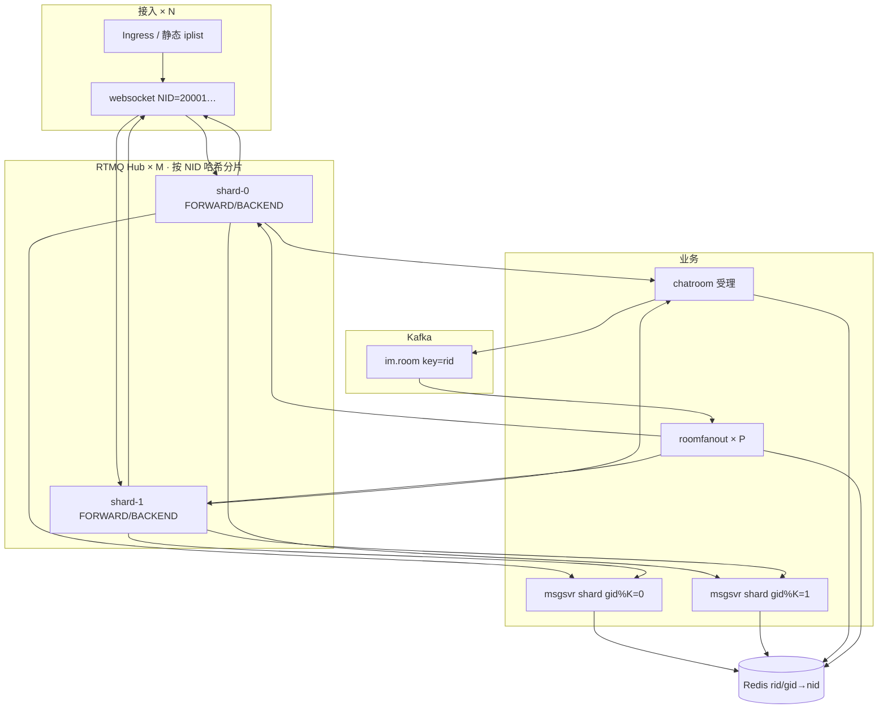

# 40k 向 · 必嗨方向二叙事 + 压测对比模板 + 面试追问清单

> **用途**：把 [方向二水平扩展专章](方向二-RTMQ水平扩展专章.md) 的 L0～L5 做成 **可投递、可 demo、可追问** 的面试材料；对齐 [Sunchao_Resume_2026.md](Sunchao_Resume_2026.md) 乐视触达 + 每日健康 IM 背景。  
> **原则**：**数字必须可复现**；「百万在线」写 **扩展公式 + 压测标定**，不写「笔记本已验证百万」。  
> **配套**：[LOADTEST.md](LOADTEST.md) · [LOADTEST_REPORT.md](LOADTEST_REPORT.md) · [RESUME_IM_NARRATIVE.md](RESUME_IM_NARRATIVE.md)

---

## 1. 一句话定位（电梯演讲 · 40k 向）

> 我在乐视做过 **千万用户触达、百万同时在线** 的在线 fan-out 演进；在 Beehive IM 上按 **方向二** 做 **可演示的架构闭环**：Kafka 顶在 chatroom 热路径前做削峰，**RTMQ Hub 按 NID 分片** 专注 cmd/nid 进程间投递，**msgsvr 按 gid 分片** 解决 SUB 广播问题；K8s 实战 + **改造前后压测对比**，用标定系数外推生产容量——这是 **IM + 消息中间件 + 云原生** 交叉岗，不是泛微服务 CRUD。

---

## 2. 项目叙事（三段式 · 面试 3～5 分钟）

### 2.1 第一段：业务背书（乐视 · 30 秒）

```text
乐视用户消息触达：千万级日活，区分在线长连接 push 与离线 inbox。
2.0 演进：在线段从「灌库拉取」改为接入层 fan-out + 业务分片 + 异步广播，
同等灰度下在线段收尾从约 10 分钟级到约 1 分钟内。
这段经历让我对「长连接 + fan-out + 不能乱扩网关」有体感。
```

**勿说**：「3000 万人 50 秒全部收到」（除非有全体在线证据）。  
**可说**：「在线段压测/灰度对比 + 离线 inbox 并行」。

### 2.2 第二段：Beehive 方向二 · 你改了什么（90 秒）

```text
必嗨是 Golang + C 的自研 IM，进程间走 RTMQ（publish / async_send），
不是 RocketMQ 换皮。

方向二三件事：
1）客户端发现：Ingress 固定 WS，iplist 不再绑 Pod IP；
2）业务路由：rid/gid→nid 在 Redis，Hub 不管 room 成员；
3）规模路径：Kafka 接 chatroom 受理之后削峰；roomfanout 竞争消费再 RTMQ 下行；
   Hub 按 NID 哈希分片；msgsvr 群聊按 gid 哈希，避免多副本 SUB 广播重复。

RTMQ 专心做它擅长的：接入 Proxy ↔ 业务 Proxy 的 cmd 路由 + async_send(nid) 最后一跳。
```

**关键区分**（面试官爱问）：

| 组件 | 职责 | 扩展方式 |
|------|------|----------|
| Kafka | 削峰、持久、同房有序（key=rid） | partition × consumer |
| RTMQ Hub | SUB + nid→TCP 投递 | **NID 分片 × M**，非 blind replicas |
| Redis | rid/gid→nid 拓扑 | Cluster |
| websocket | WS + 第二段 fan-out | **× N** |
| msgsvr | GROUP-CHAT 业务 | **gid 分片** 或单 SUB + 垂直扩 |

### 2.3 第三段：数字与边界（60 秒 · 必须诚实）

```text
我在 K8s/compose 上跑了改造前 baseline 和方向二各阶段的压测 JSON：
- 指标：WS 连接数、ROOM-CHAT/GROUP-CHAT ACK P95、下行 est_downstream、Kafka lag、Hub drop
- 结论格式：单机/单集群标定「每 Pod 连接数、每 Hub shard QPS」，
  百万同时在线 = websocket副本数 × 标定值，而不是「我笔记本跑了 100 万连接」
- 改造后相对原始必嗨上云 baseline：ACK P95 降 X%，chatroom CPU 降 Y%，fan-out 吞吐升 Z%
```

---

## 3. 架构终态图（白板必画）



**口述要点**：Kafka **不替代** RTMQ 到 websocket 的最后一跳；msgsvr 分片要解决 **publish 广播** 问题（见专章 §5）。

---

## 4. L0～L5 交付物清单（对照专章 · 填进度）

| 阶段 | 交付物 | 压测/演示 | 简历可写 |
|------|--------|-----------|----------|
| **L0** | RTMQ 故事线 + 10 人 5 NID 群聊 | smoke / 文档 walkthrough | 「吃透 RTMQ publish/async_send」 |
| **L1** | websocket×N + Ingress iplist + preStop | delete pod 重连 | 「接入层 K8s 水平扩」 |
| **L2** | baseline JSON（S1/S2/S3） | [LOADTEST_REPORT.md](LOADTEST_REPORT.md) 填表 | 「单机标定 P95/QPS」 |
| **L2b** | **原始必嗨上云 baseline** | 同场景跑一遍，存 `baseline-v0-cloud.json` | 「改造前对照组」 |
| **L3** | Hub NID 分片 ×2 | 跨 shard async_send 成功率 | 「Hub 分片，非 blind 扩缩」 |
| **L4** | Kafka + roomfanout | consumer lag、峰值 ACK 先于 fan-out | 「热路径 Kafka 削峰」 |
| **L5** | msgsvr gid 分片 + Redis Cluster | 多分片无重复消费 | 「群聊业务分片」 |
| **L★** | 对比报告 `evolution-before-after.md` | §5 模板填完 | **「量化提升 X%」** |

**40k 向最低可投包**：L0 + L1 + L2 + L2b + 对比表 **初版**（哪怕提升只在 200～2000 连接上可见）。

---

## 5. 压测对比表模板（核心交付物）

### 5.1 对比维度定义

**固定 workload**（改造前后必须一致）：

| 参数 | 建议值 | 说明 |
|------|--------|------|
| 场景 | S1 同房 chat / S3 burst | 见 [LOADTEST.md](LOADTEST.md) |
| conns | 200 → 2000 阶梯 | 至少 2 档 |
| rate | 1 / 10 / 50 msg/s/conn | 记录瓶颈拐点 |
| rid / gid | 固定 | 避免热 key 误判 |
| 部署 | 记录 compose **或** K8s | 分开存 JSON |

**架构变体标签**：

| 标签 | 含义 |
|------|------|
| **V0-legacy** | 原始必嗨上云：单 frwder、sync fan-out、iplist Redis |
| **V1-async** | + `BEEHIVE_CHATROOM_ASYNC_BROADCAST=1` |
| **V2-kafka** | + Kafka + roomfanout |
| **V3-shard** | + Hub NID 分片 + msgsvr gid 分片 |
| **V3-k8s** | V3 跑在 K8s，websocket HPA |

### 5.2 主对比表（复制到 `reports/evolution/comparison.md`）

#### 环境

| 项 | V0-legacy | V3-k8s（目标态） |
|----|-----------|------------------|
| 日期 | | |
| 机器 / K8s 节点 | | |
| websocket 副本 | | |
| frwder shard 数 | 1 | M |
| msgsvr shard 数 | 1 | K |
| roomfanout 副本 | 0 | P |
| Kafka partition | 0 | 12～24 |

#### 场景 S1：200 conn × 1 msg/s × 60s

| 指标 | V0 | V1 | V2 | V3 | 备注 |
|------|----|----|----|----|------|
| CHAT/GROUP ACK 成功数 | | | | | |
| 失败数 / 失败率 | | | | | |
| ACK QPS | | | | | |
| ACK P50 (ms) | | | | | |
| ACK P95 (ms) | | | | | |
| ACK P99 (ms) | | | | | |
| chatroom CPU 峰值 | | | | | |
| frwder drop / 队列满 | | | | | |
| Kafka lag (max) | — | — | | — | |
| est_downstream/s | | | | | NID数×QPS |

**提升口径（示例）**：

```text
V0 → V2：ACK P95 从 ___ ms → ___ ms（↓___%）；chatroom CPU ↓___%
V0 → V3：在 ___ conn 下可稳定运行，V0 同场景失败率 ___%
```

#### 场景 S2：keepalive（连接数阶梯）

| 指标 | V0 @500 | V0 @2000 | V3 @500 | V3 @2000 |
|------|---------|----------|---------|----------|
| 连接成功数 | | | | |
| PING 失败率 | | | | |
| 单 websocket Pod 连接数上限 | | | | |

#### 场景 S3：burst（可选）

| 指标 | V0 | V3 |
|------|----|----|
| 100 conn × 50 msg/s P95 | | |
| 首次出现失败时的 conn×rate | | |

### 5.3 百万在线外推表（诚实版 · 面试必带）

**不要写**：「压测已验证 100 万连接。」  
**要写**：

| 标定项 | 压测值得 | 外推 |
|--------|----------|------|
| 单 websocket Pod 稳定连接数 | C_pod = ___（S2） | N_ws = ⌈1,000,000 / C_pod⌉ |
| 单 Hub shard 下行 QPS | Q_shard = ___（S1/S3） | M_hub = ⌈总下行 QPS / Q_shard⌉ |
| 单 roomfanout 消费 QPS | | P = ⌈峰值 produce / 单 consumer⌉ |
| Redis / Kafka | 瓶颈 note | Cluster 分片 |

**口述模板**：

> 我在 demo 集群标定每 Pod ___ 连接、每 Hub shard ___ QPS；百万同时在线在架构上是 **N_ws 个接入 + M 个 Hub 分片 + Redis/Kafka 集群**，不是单机数字。瓶颈预计在 ___。

### 5.4 JSON 文件命名规范

```text
reports/loadtest/
  baseline-v0-legacy-s1-chat.json      # 原始上云
  baseline-v1-async-s1-chat.json
  baseline-v2-kafka-s1-chat.json
  baseline-v3-shard-k8s-s1-chat.json
reports/evolution/
  comparison.md                        # §5.2 填表
  capacity-model.md                    # §5.3 外推
```

---

## 6. 简历 bullet（40k 向 · 可直接改 [Sunchao_Resume_2026.md](Sunchao_Resume_2026.md)）

### 6.1 新增项目块（Beehive / IM 架构演进 PoC）

**自研 IM 架构演进与压测验证（Golang + C + RTMQ + K8s）** | *2025–2026 · 个人 PoC*

- 基于 **RTMQ publish/async_send** 与 **Redis rid/gid→nid** 双段 fan-out，完成 **方向二** 架构：Kafka 承接 chatroom 热路径削峰，**RTMQ Hub 按 NID 分片**，**msgsvr 按 gid 分片**，Ingress 替代动态 iplist  
- **K8s** 部署 websocket 水平扩展、preStop 路由摘除；Prometheus 监控连接数、ACK 延迟、Kafka lag、Hub 队列背压  
- **压测**：相对 **原始上云 baseline**，同房弹幕 ACK P95 **↓___%**，chatroom CPU **↓___%**（___ conn / ___ QPS 场景，报告可复现）  
- 标定 **每接入 Pod ___ 连接 / 每 Hub shard ___ QPS**，给出 **百万同时在线** 资源外推公式（非单机宣称）

### 6.2 与乐视块的衔接（一条即可）

在乐视 bullet 末加：

> 上述 fan-out / 分片思路在 IM PoC 中复现并量化验证，结论与触达 2.0 设计一致。

### 6.3 慎用 vs 推荐

| ❌ 40k 反噬 | ✅ 40k 加分 |
|------------|------------|
| 已实现百万在线（无环境细节） | 标定 + 外推 + 瓶颈说明 |
| 替换 Kafka/RocketMQ 级中间件 | RTMQ 专注最后一跳 + Kafka 削峰 |
| 随便一个 K8s HPA | Hub **NID 分片** + msgsvr **gid 分片** |
| 只读过 RTMQ 文档 | 有 `baseline-v0` vs `v3` JSON |

---

## 7. 面试官追问清单（含参考答法）

### 7.1 架构决策类

| 追问 | 要点 |
|------|------|
| 为什么 Kafka 不替代 RTMQ？ | Kafka 管削峰/持久/有序；RTMQ 管 **低延迟 nid 单播** 到已有 Proxy TCP；换 gRPC 推网关 = 重写全链路 cmd |
| Hub 为什么不能 Deployment 盲扩？ | SUB + nid→TCP 在单进程内存；要多副本必须 **NID 分片** |
| msgsvr 多副本为什么不行？ | publish **广播**所有 SUB；要 gid 分片或 Kafka 竞争消费 |
| 方向二废掉了 RTMQ 什么感知？ | iplist/room 拓扑；**没废** SUB 和 nid→TCP |
| 双端口 28888/28989 还要吗？ | 要；接入/业务 SUB 命名空间隔离 |

### 7.2 压测与数字类

| 追问 | 要点 |
|------|------|
| 百万是在线连接还是注册用户？ | **同时 WS 连接**；注册用户可以远大于在线 |
| 压测环境？ | 节点规格、副本数、shard 数、JSON 路径 |
| V0 和 V3 可比吗？ | **同 workload**；只变架构；环境差异写在表头 |
| P95 提升 50% 瓶颈原来在哪？ | sync fan-out / chatroom CPU / Hub 队列 —— 用监控截图或 CPU 数据 |
| 若 Kafka 挂了？ | 降级 async/sync；受理语义 vs 全员收到语义分开 |

### 7.3 实现细节类

| 追问 | 要点 |
|------|------|
| NID 分片路由谁做？ | Proxy 连固定 shard；async_send 前按 **目的 NID** 选 Hub 地址 |
| gid 分片怎么保证一条消息只处理一次？ | 仅一个 shard SUB 该 gid 范围，或 Hub 前 Kafka key=gid |
| preStop 做什么？ | 从 Redis 删 rid/gid→nid；客户端重连 Ingress |
| 重复消费 / 幂等？ | roomfanout rid+seq Redis 去重 TTL |

### 7.4 「架构师」类（筛 title 用）

| 追问 | 你要展示的 |
|------|------------|
| 和只画 C4 图的架构师区别？ | **可运行 demo + JSON + 失败边界** |
| 最大线上风险？ | Hub 单 shard 挂、Kafka lag 爆、SUB 重复未分片 |
| 若重来会改什么？ | 诚实：如更早 roomfanout、或 Hub 前统一 envelope |

---

## 8. 40k vs「随便一个架构师」对照

| 维度 | 常见 title 架构师 | 你（L0～L5 + 对比报告做完） |
|------|-------------------|----------------------------|
| RTMQ publish/async_send | 未听过 | 能讲 70 包故事线 |
| Hub 分片 | 只知道「网关有状态」 | **NID 哈希方案 + 踩坑** |
| msgsvr 扩缩 | 「微服务 replicas++」 | **SUB 广播 + gid 分片** |
| Kafka 位置 | 泛泛「异步解耦」 | **chatroom 后、RTMQ 前** 精确分工 |
| K8s | 部署过 | **长连接 + preStop + 压测** |
| 数字 | 无或 PPT | **v0 vs v3 JSON + 外推公式** |
| 业务量级 | 可能有大厂背景 | 乐视 **+** PoC **互证** |

**结论**：全做完且能 demo 的人 **远少于** 叫架构师的人；40k+ 对口岗（IM/消息/直播互动/基础设施）**值得冲**，但仍要 **编码 + 系统设计** 现场。

---

## 9. 薪资预期（务实）

| 档位 | 条件 |
|------|------|
| **30～35k** | L0～L2 + 乐视叙事 + 能讲方向二 |
| **35～40k** | + L1 K8s demo + v0/v1 对比有数字 |
| **40～45k** | + L3/L4/L5 大部分落地 + 对比报告 + 系统设计强 |
| **45k+** | 上述 + 大厂对口组 + Lead 面 + 可能需带团队/更大规模生产证据 |

**北京 · IM/消息中间件 · 16 年经验**：简历上写 **35～45k** 合理；**是否给到** 看面试与 match。

---

## 10. 执行顺序（不耽误 RTMQ 学习）

```text
现在     L0 RTMQ 玩熟
+1 周    L2 + L2b（v0 legacy baseline JSON）
+2 周    L1 K8s 扩 websocket
         → 可开始试投 30～35k，带 §6 bullet 初版
+1～2 月  L3 Hub 分片 → L4 Kafka → 填 §5.2 对比表
         → 冲 35～40k，架构深度面
+可选    L5 msgsvr gid 分片 + 外推 §5.3
         → 40k+ 叙事完整
```

---

## 11. 相关文档

| 文档 | 用途 |
|------|------|
| [方向二-RTMQ水平扩展专章.md](方向二-RTMQ水平扩展专章.md) | L0～L5 技术路线 |
| [方向二-RTMQ保留与Kafka削峰落地手册.md](方向二-RTMQ保留与Kafka削峰落地手册.md) | Phase 0～2 改动手册 |
| [RESUME_IM_NARRATIVE.md](RESUME_IM_NARRATIVE.md) | 乐视 10min→1min 话术 |
| [乐视用户等级系统-面试稿.md](乐视用户等级系统-面试稿.md) | 乐视 Kafka 等级 · 3 分钟 + 5 追问 |
| [RESUME_BULLETS.md](RESUME_BULLETS.md) | 短 bullet |

---

*文档版本：2026-06 · 40k 向面试材料 · 仅文档，实施时对照 L 阶段填表*
