# 项目流程图与术语手册

> **用途**：一文档看清 beehive-im 全貌——整体拓扑、各子系统流程、端到端业务、术语解释。  
> **读者**：开发、压测、面试准备。  
> **相关**：[ARCHITECTURE.md](ARCHITECTURE.md) · [assets/ARCHITECTURE_DIAGRAM.md](assets/ARCHITECTURE_DIAGRAM.md) · [assets/ROOM_CHAT_SEQUENCE.md](assets/ROOM_CHAT_SEQUENCE.md) · [REDIS.md](REDIS.md) · [PROTOCOL.md](PROTOCOL.md) · **[弹幕核心接口.md](弹幕核心接口.md)** · **[弹幕系统的名词解释.md](弹幕系统的名词解释.md)**（**分层 Fan-out 寻址** §5）

**图例**（与 [弹幕核心接口 §0](弹幕核心接口.md#0-图例方向--服务全文统一) 一致）：

| 标记 | 含义 |
|------|------|
| **↑ 上行** | Client → 接入 → frwder **FORWARD** → 业务 |
| **↓ 下行** | 业务 → frwder **BACKEND** → 接入 → Client（含 fan-out、ACK） |
| **⇄ HTTP** | REST 短连接（register、iplist、`/room/push`） |
| **⚙ 内部** | Redis / Mongo / monitor，不直达客户端 |

**弹幕主服务**：**usrsvr**（注册）→ **websocket**（接入）→ **frwder**（路由）→ **chatroom**（业务/fan-out）→ **frwder** → **websocket**（推面板）。

---

## 目录

1. [项目全景](#1-项目全景)
2. [端到端业务流程](#2-端到端业务流程)
3. [各子系统流程图](#3-各子系统流程图)
4. [术语表](#4-术语表)
5. [命令与服务对照](#5-命令与服务对照)
6. [相关文档索引](#6-相关文档索引)

---

## 1. 项目全景

### 1.1 分层架构（总览）

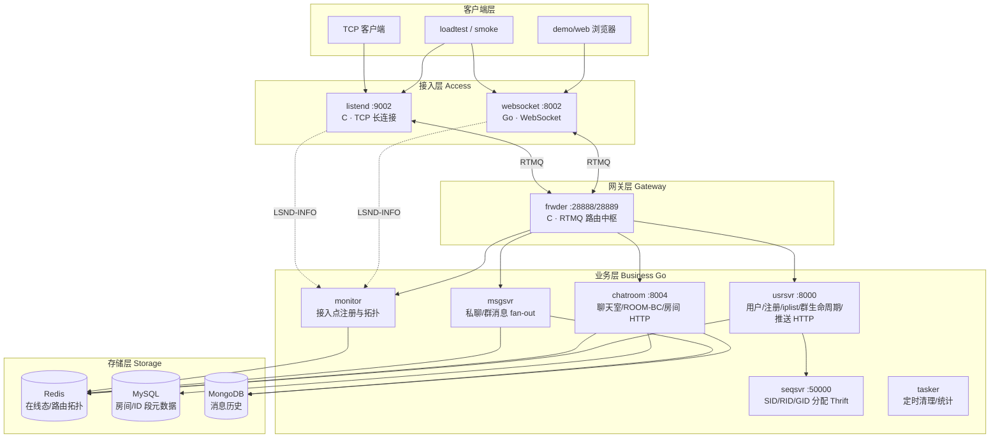

### 1.2 一条消息的通用路径

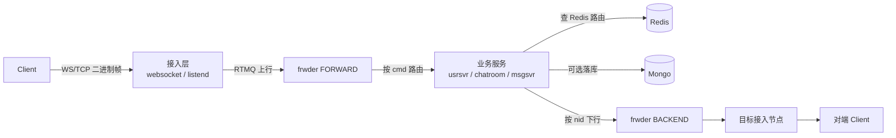

**要点**：

- 客户端 **只连接入层**（WS 或 TCP），不直连 chatroom。
- 业务层通过 **NID（节点 ID）** 找接入点，**不是** K8s Service DNS。
- **fan-out**：一条上行 → 业务层查「谁在线、在哪个 NID」→ 多条下行。
- **聊天室 / 弹幕** 下行采用 **分层 Fan-out 寻址**（① RID→NID 拓扑路由 → ② (RID,GID)→(SID,CID) 会话展开 → ③ CID→fd 连接投递）。详见 [弹幕系统的名词解释.md](弹幕系统的名词解释.md) §5。

### 1.2.1 分层 Fan-out 寻址（速览）

```text
chatroom:  RID → [NID₁, NID₂, …]     每 NID 一条 RTMQ（cid=0）
websocket: (RID,GID) → TravRoomSession → 每个 (SID,CID) → lws.AsyncSend
```

| 误区 | 正解 |
|------|------|
| 「按 NID 广播 = 整节点所有连接都收」 | 只把包送到 **websocket 进程**；**RID 过滤在 ChatTab** |
| 「chatroom 持有所有 CID」 | chatroom 只到 **NID**；**CID 仅在接入内存** |

### 1.3 进程启动顺序（Docker demo）

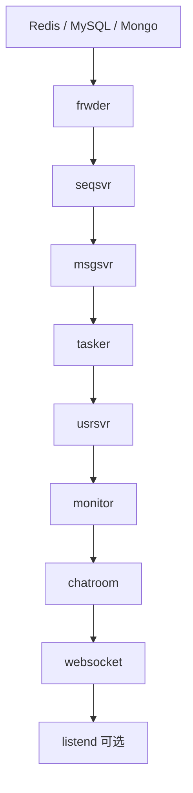

脚本：`scripts/run-in-linux.sh` / `scripts/up-demo.sh`

---

## 2. 端到端业务流程

### 2.1 连接与会话（所有能力的前置）

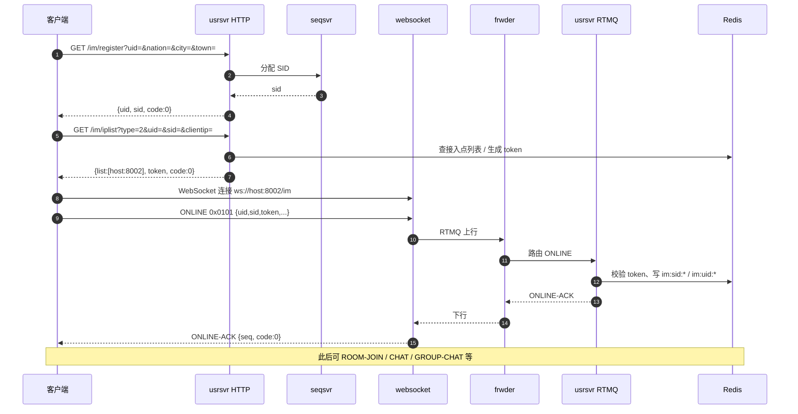

| 步骤 | 协议/HTTP | 说明 |
|------|-----------|------|
| 注册 | `GET /im/register` | 分配 **UID** 已有；分配 **SID**（每设备一会话） |
| 接入调度 | `GET /im/iplist?type=1\|2` | type=1 TCP(listend)；type=2 WebSocket |
| 上线 | `ONLINE 0x0101` | 携带 iplist 返回的 **token** |
| 保活 | `PING/PONG 0x0105/06` | 接入层处理，维持长连接 |

---

### 2.2 聊天室：进房 + 弹幕（ROOM-CHAT）

```mermaid
sequenceDiagram
    autonumber
    participant A as 发送方 A
    participant WS as websocket
    participant FWD as frwder
    participant CR as chatroom
    participant R as Redis
    participant B as 旁观 B

    A->>WS: ROOM-JOIN 0x0405 {rid}
    WS->>FWD->>CR: 上行
    CR->>R: 写 rid↔sid↔nid 拓扑
    CR-->>A: ROOM-JOIN-ACK {gid, code:0}

    A->>WS: ROOM-CHAT 0x040B {rid,gid,text}
    WS->>FWD->>CR: 上行
    CR->>CR: 校验 + 入队 room_mesg_chan 🟢
    alt 同步 ACK（默认）
        CR->>CR: roomBroadcastFanOut 🔴
        CR->>FWD: 按 rid→nid 列表 sendData
        FWD->>WS: 各节点下行
        WS->>B: TravRoomSession 推送
        CR-->>A: ROOM-CHAT-ACK
    else 异步 ACK BEEHIVE_CHATROOM_ASYNC_BROADCAST=1
        CR->>CR: room_broadcast_chan 入队 🟢
        CR-->>A: ROOM-CHAT-ACK 立即
        CR->>FWD: 后台 worker fan-out
        FWD->>WS->>B: 推送
    end
```

| 阶段 | 命令 | 服务 |
|------|------|------|
| 进房 | ROOM-JOIN / ACK | chatroom |
| 用户弹幕 | ROOM-CHAT / ACK | chatroom → **分层 Fan-out 寻址**（§1.2.1） |
| 运营弹幕 | ROOM-BC / HTTP POST /room/push | chatroom |
| 退房 | ROOM-QUIT | chatroom |

**详细逐步标注**（同步/异步/非阻塞）：[assets/ROOM_CHAT_SEQUENCE.md](assets/ROOM_CHAT_SEQUENCE.md)

---

### 2.3 运营推送：ROOM-BC（系统公告 / 触达）

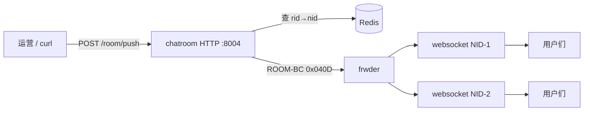

**与 ROOM-CHAT 区别**：

| 项 | ROOM-CHAT | ROOM-BC |
|----|-----------|---------|
| 触发 | 用户 WS 上行 | HTTP / 服务端 |
| 典型用途 | 公屏互刷 | **公告、系统消息、触达** |
| 面试映射 | 互动弹幕 | **乐视在线 push 秒级触达** |

---

### 2.4 私聊（P2P CHAT）

```mermaid
sequenceDiagram
    participant A as 用户 A
    participant WS as websocket
    participant FWD as frwder
    participant MSG as msgsvr
    participant R as Redis
    participant MG as Mongo
    participant B as 用户 B

    A->>WS: CHAT 0x0201 {to_uid, text}
    WS->>FWD->>MSG: 上行
    MSG->>MG: 异步写历史
    MSG->>R: 查 im:uid:{to_uid}:to:sid:set
    MSG->>FWD: 发给 B 的所有在线 SID（各 nid）
    FWD->>B: 下行 CHAT
    MSG-->>A: CHAT-ACK
```

服务：**msgsvr**（不是 chatroom）。

---

### 2.5 群聊（GROUP）

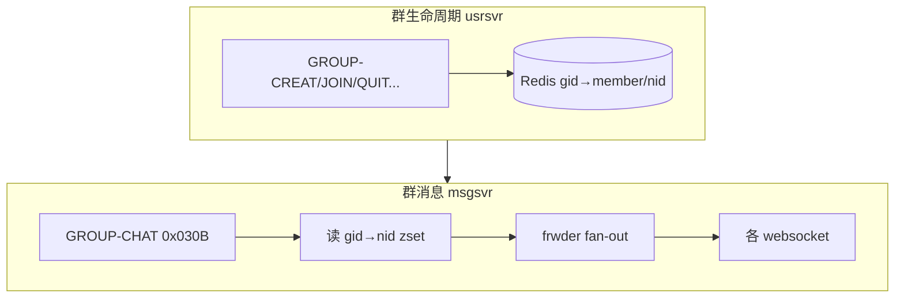

详见：[GROUP_DESIGN.md](GROUP_DESIGN.md)

---

### 2.6 HTTP 推送（全站 / 按人）

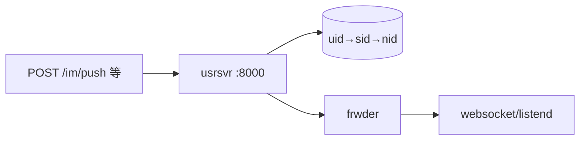

接口列表：[HTTPSVR.md](HTTPSVR.md)

---

### 2.7 能力对照总表

| 产品能力 | 入口 | fan-out 依据 | 存储 |
|----------|------|--------------|------|
| 聊天室弹幕 | chatroom | `room:rid:*:to:nid:zset` | Mongo 房间历史 |
| 群聊 | msgsvr | `chat:gid:{gid}:to:nid:zset` | Mongo group-mesg |
| 私聊 | msgsvr | `im:uid:{uid}:to:sid:set` | Mongo |
| 系统公告 | chatroom HTTP | rid→nid | 可选 Mongo |
| 注册/上线 | usrsvr | — | Redis 会话 |

---

## 3. 各子系统流程图

### 3.1 websocket（WebSocket 接入层）

| 项 | 说明 |
|----|------|
| **语言** | Go |
| **端口** | 8002（demo）；多副本时 NID=20001/20002… |
| **职责** | 维护 WS 长连接；SID↔CID 会话表；上行转 RTMQ；下行 TravRoomSession 推送 |
| **配置** | `conf/websocket.xml` — SENDQ、WORKER-NUM、NID |

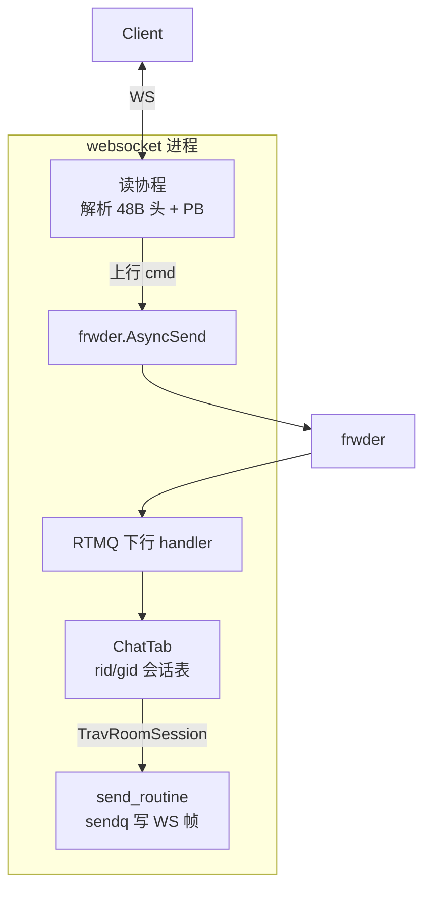

**关键文件**：`exec/websocket/controllers/mesg.go`、`upmesg.go`；`lib/lws/`、`lib/chat_tab/`

**面试点**：SENDQ 队列、AsyncSend 非阻塞、fan-out 在 TravRoomSession 顺序执行。

---

### 3.2 listend（TCP 接入层）

| 项 | 说明 |
|----|------|
| **语言** | C |
| **端口** | 9002 |
| **职责** | 与 websocket 功能重叠；供原生客户端、压测、非浏览器场景 |
| **配置** | `conf/listend.xml` — GID、NID |

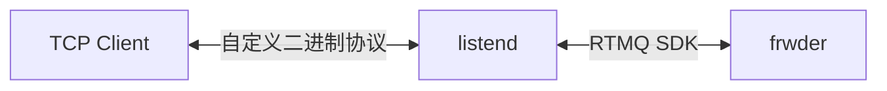

**与 websocket 关系**：双栈接入；iplist `type=1` 返回 TCP 地址，`type=2` 返回 WS。

---

### 3.3 frwder + RTMQ（消息网关）

| 项 | 说明 |
|----|------|
| **语言** | C（frwder）+ Go/C（RTMQ 库） |
| **端口** | FORWARD 28888（接接入层）；BACKEND 28889（接业务层） |
| **职责** | 鉴权、保活、**按 cmd/nid 路由**；连接接入与业务 |

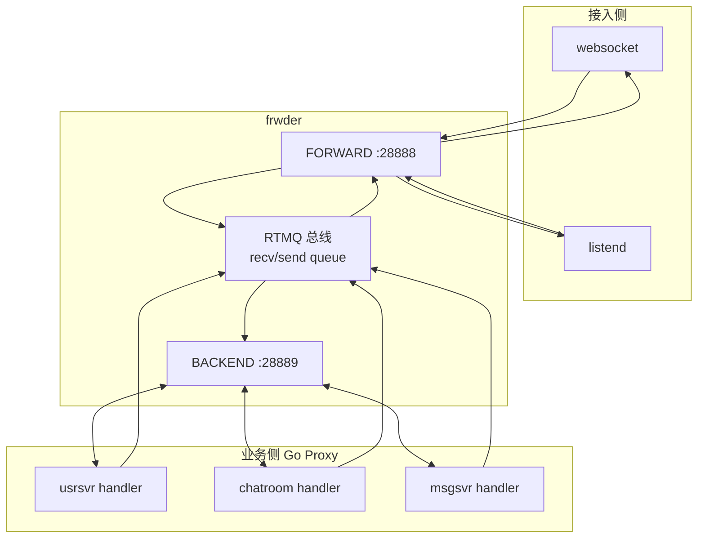

**上行**：Client → 接入 → FORWARD → 业务 handler  
**下行**：业务 `sendData(nid, ...)` → BACKEND → 按 **nid** 找到接入进程 → Client

**不能删**：K8s 扩 websocket 时，路由仍走 **NID + Redis**，不是 Service 广播。

详见：[doc/ctrl/rtmq.md](ctrl/rtmq.md)

---

### 3.4 usrsvr（用户中心）

| 项 | 说明 |
|----|------|
| **端口** | HTTP 8000；RTMQ 业务 handler |
| **职责** | 注册、iplist、ONLINE/OFFLINE、群生命周期、HTTP 推送、KICK |

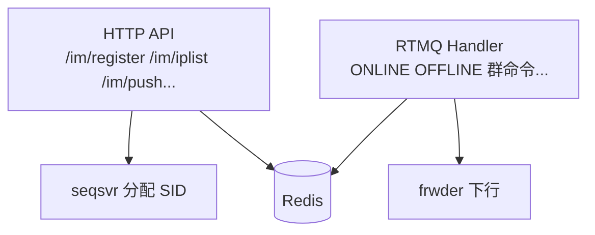

**关键 Redis**：`im:uid:{uid}:to:sid:set`、`im:sid:{sid}:attr`

---

### 3.5 chatroom（聊天室）

| 项 | 说明 |
|----|------|
| **端口** | HTTP 8004；RTMQ |
| **职责** | 房间 CRUD、JOIN/QUIT、ROOM-CHAT fan-out、ROOM-BC、落库 |

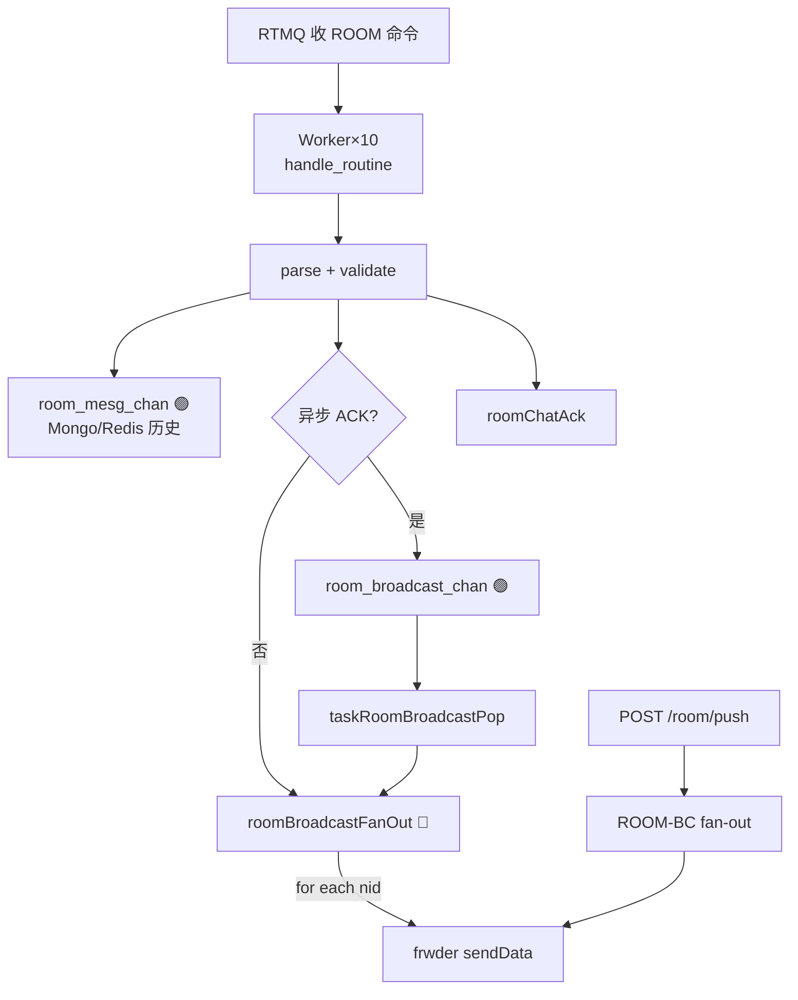

**大房分片**：每组最多约 10000 人（GID）；Redis 管理 rid→gid→nid。

---

### 3.6 msgsvr（消息中心）

| 项 | 说明 |
|----|------|
| **职责** | 私聊 CHAT、群聊 GROUP-CHAT、SYNC 等 |
| **fan-out** | 查 uid 或 gid 对应的 sid/nid 集合 |

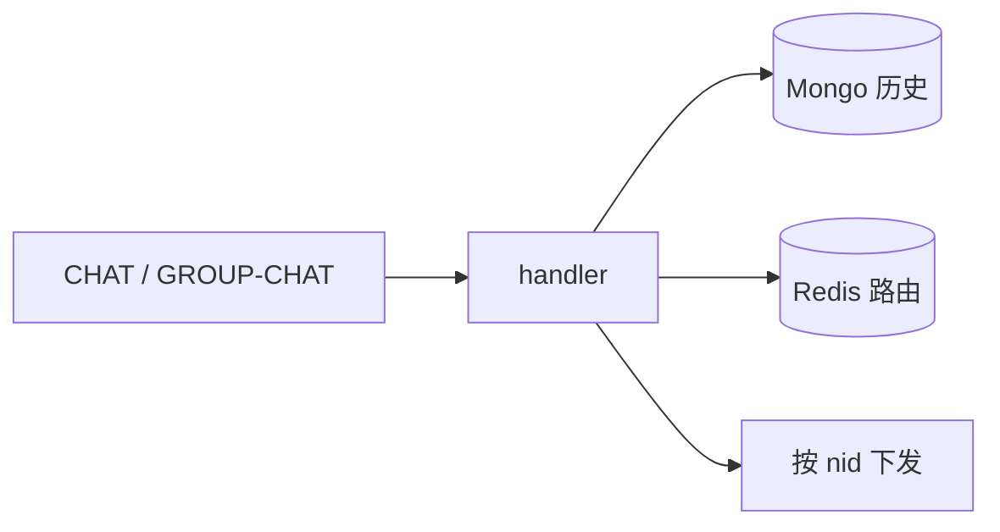

---

### 3.7 monitor（监控 / 拓扑注册）

| 项 | 说明 |
|----|------|
| **职责** | 接收接入层 **LSND-INFO**；把 NID↔地址写入 Redis |

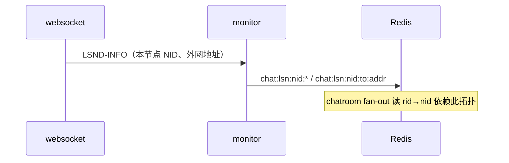

**K8s 扩缩容**：scale websocket 后必须等 monitor 注册 **新 NID**，chatroom 才能把下行打到新 Pod。

---

### 3.8 seqsvr（ID 分配）

| 项 | 说明 |
|----|------|
| **端口** | Thrift 50000 |
| **职责** | 分配 SID、RID、GID 等全局 ID 段 |

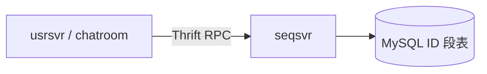

---

### 3.9 tasker（定时任务）

| 项 | 说明 |
|----|------|
| **职责** | Redis TTL 清理、在线人数统计、过期会话回收 |

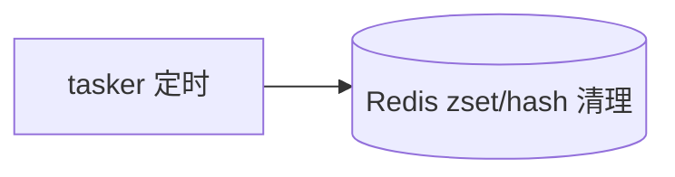

---

### 3.10 存储层

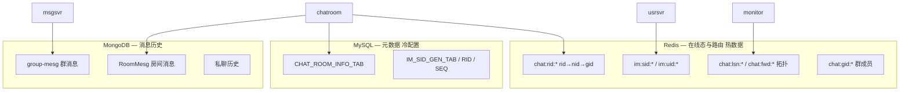

键定义全文：[REDIS.md](REDIS.md)

---

## 4. 术语表

### 4.1 身份与连接

| 术语 | 英文/缩写 | 解释 |
|------|-----------|------|
| **UID** | User ID | 用户唯一 ID，业务主键 |
| **SID** | Session ID | **每个设备/终端** 一个会话 ID；同一 UID 可多 SID（多端） |
| **CID** | Connection ID | **单个接入进程内** 连接唯一 ID；断线重连会变 |
| **NID** | Node ID | **接入/转发进程** 在集群内的节点编号；fan-out 路由用 |
| **GID** | Group ID | 聊天室内 **分组 ID**（大房分片，非群聊的 group） |
| **RID** | Room ID | 聊天室 ID |
| **SEQ** | Sequence | 消息流水号；ONLINE-ACK 等返回 |
| **Token** | — | iplist 下发的鉴权串；ONLINE 时必须携带 |

### 4.2 架构组件

| 术语 | 解释 |
|------|------|
| **接入层 / 侦听层** | listend、websocket；对外长连接，对内连 frwder |
| **frwder / 转发层** | C 语言消息网关；RTMQ 路由中枢 |
| **RTMQ** | 自研 TCP 消息中间件；队列、worker、按 nid 投递 |
| **业务层** | usrsvr、chatroom、msgsvr 等 Go 服务 |
| **fan-out** | 一条上行广播给多个在线用户；下行条数 ≈ 人数 × ingress |
| **分层 Fan-out 寻址** | 聊天室下行核心：**① 拓扑路由** RID→NID（chatroom）→ **② 会话展开** (RID,GID)→(SID,CID)（websocket ChatTab）→ **③ 连接投递** CID→fd；详 [弹幕系统的名词解释.md](弹幕系统的名词解释.md) §5 |
| **ingress QPS** | 上行成功 ACK 的 QPS（如 ROOM-CHAT-ACK） |
| **est_downstream** | 估算总下行 QPS ≈ chat_qps × 同房人数 |

### 4.3 协议

| 术语 | 解释 |
|------|------|
| **报头** | 固定 48 字节；含 type/length/sid/cid/nid/seq… |
| **报体** | Protobuf；见 PROTOCOL.md |
| **CMD / type** | 命令 ID，如 0x0101=ONLINE，0x040B=ROOM-CHAT |
| **ONLINE** | 长连接鉴权上线 |
| **ROOM-CHAT** | 用户聊天室文本（弹幕） |
| **ROOM-BC** | 服务端广播（系统消息/公告） |
| **ROOM-CHAT-ACK** | 发送方收到的「受理/投递阶段」应答；**不等于**全员已读 |

### 4.4 同步 / 异步（面试必辨）

| 术语 | 标记 | 含义 |
|------|------|------|
| **同步** | 🔴 | 当前 goroutine 等步骤完成才继续；占 worker |
| **异步** | 🟢 | 入队即返回；后台 goroutine 消费（如 room_mesg_chan） |
| **非阻塞入队** | ⚪ | AsyncSend 写入 channel；满则 fail/drop；**不等对端处理完** |
| **异步 ACK** | 配置项 | `BEEHIVE_CHATROOM_ASYNC_BROADCAST=1`：fan-out 与 ACK 解耦 |
| **同步 ACK** | 默认 | fan-out 完成后再 ROOM-CHAT-ACK |

### 4.5 Redis / 拓扑

| 术语 | 键/概念 | 解释 |
|------|---------|------|
| **iplist** | HTTP API | 返回客户端应连接的 WS/TCP 地址列表 |
| **rid→nid zset** | `chat:rid:{rid}:to:nid:zset` 等 | 某房间在线用户分布在哪些接入 NID |
| **LSND-INFO** | 协议 | websocket 向 monitor 上报本节点信息 |
| **ipdict** | conf/ipdict.txt | 按运营商/地理选接入点的静态配置 |

### 4.6 部署与压测

| 术语 | 解释 |
|------|------|
| **runner** | Docker 单容器跑 9 进程的 demo 形态 |
| **C_pod** | 每个 websocket Pod **稳定长连接数**（L1 标定） |
| **D_pod** | 每个 Pod **可持续 fan-out 条/秒**（L2 标定） |
| **SENDQ** | websocket 每连接发送队列长度；过小会阻塞或 drop |
| **loadtest** | `tools/loadtest`；chat/keepalive 压测与 JSON 报告 |

### 4.7 与「乐视触达」映射（面试）

| 本系统概念 | 触达业务说法 |
|------------|--------------|
| ROOM-BC / /room/push | **在线系统消息 / 公告 push** |
| 离线 inbox + 拉取 | **离线灌库、分表触达**（demo 未完整实现） |
| fan-out + 异步 ACK | **在线段秒级触达**（相对灌库 10 分钟级） |
| iplist + 多 NID | **接入调度、水平扩展** |
| est_downstream | **总 push 条数/秒**，容量规划核心 |

---

## 5. 命令与服务对照

### 5.1 命令域（节选）

| 范围 | 域 | 主要服务 |
|------|-----|----------|
| 0x01xx | 连接/会话 | usrsvr + 接入层 |
| 0x02xx | 私聊/关系 | msgsvr / usrsvr |
| 0x03xx | 群聊 | usrsvr（生命周期）+ msgsvr（消息） |
| 0x04xx | 聊天室 | chatroom |

完整列表：[COMMAND.md](COMMAND.md)

### 5.2 端口一览（demo 默认）

| 组件 | 端口 | 协议 |
|------|------|------|
| usrsvr | 8000 | HTTP |
| websocket | 8002 | WebSocket |
| websocket-2 | 8003 | WebSocket（多节点 demo） |
| chatroom | 8004 | HTTP |
| listend | 9002 | TCP |
| seqsvr | 50000 | Thrift |
| frwder FORWARD | 28888 | RTMQ |
| frwder BACKEND | 28889 | RTMQ |
| Redis | 6379 | — |
| MySQL | 3306 | — |
| MongoDB | 27017 | — |

---

## 6. 相关文档索引

| 文档 | 内容 |
|------|------|
| **[弹幕系统的名词解释.md](弹幕系统的名词解释.md)** | **NID/RID/SID/CID/GID** + **分层 Fan-out 寻址**（§5 详述） |
| **[弹幕核心接口.md](弹幕核心接口.md)** | 弹幕接口手册（**↑↓ 方向 + 服务链路** + handler 对照） |
| [assets/PUSH_TO_PANEL_FLOW.md](assets/PUSH_TO_PANEL_FLOW.md) | 上行→面板详细时序（两条 push 路径） |
| [ARCHITECTURE.md](ARCHITECTURE.md) | 技术架构长文；**§3.3 分层 Fan-out 寻址** |
| [assets/ARCHITECTURE_DIAGRAM.md](assets/ARCHITECTURE_DIAGRAM.md) | 一页架构图 |
| [assets/ROOM_CHAT_SEQUENCE.md](assets/ROOM_CHAT_SEQUENCE.md) | ROOM-CHAT 逐步时序（同步/异步） |
| [PROTOCOL.md](PROTOCOL.md) | 协议头与 PB 定义 |
| [COMMAND.md](COMMAND.md) | 命令 ID 全表 |
| [REDIS.md](REDIS.md) | Redis 键定义 |
| [HTTPSVR.md](HTTPSVR.md) | HTTP 接口 |
| [GROUP_DESIGN.md](GROUP_DESIGN.md) | 群聊设计 |
| [产品功能全览地图.md](产品功能全览地图.md) | 产品功能矩阵 |
| [DEMO.md](DEMO.md) | 本地演示步骤 |
| [TROUBLESHOOT.md](TROUBLESHOOT.md) | 常见问题 |
| [SCALE.md](SCALE.md) | 扩展与外推 |
| [LOADTEST.md](LOADTEST.md) | 压测用法 |

---

*阅读建议：先看 §1 全景 → §2 你关心的业务流 → §3 对应子系统 → §4 查术语。*
