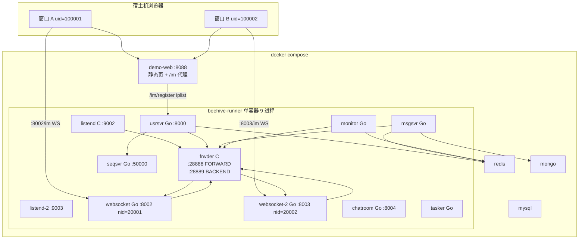
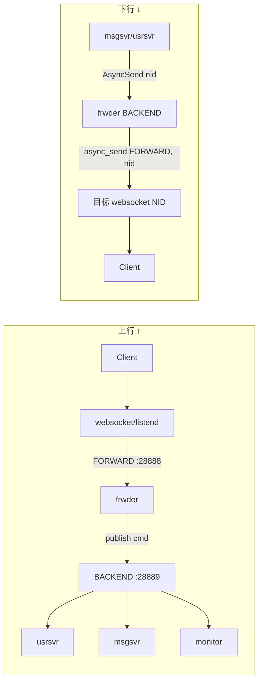
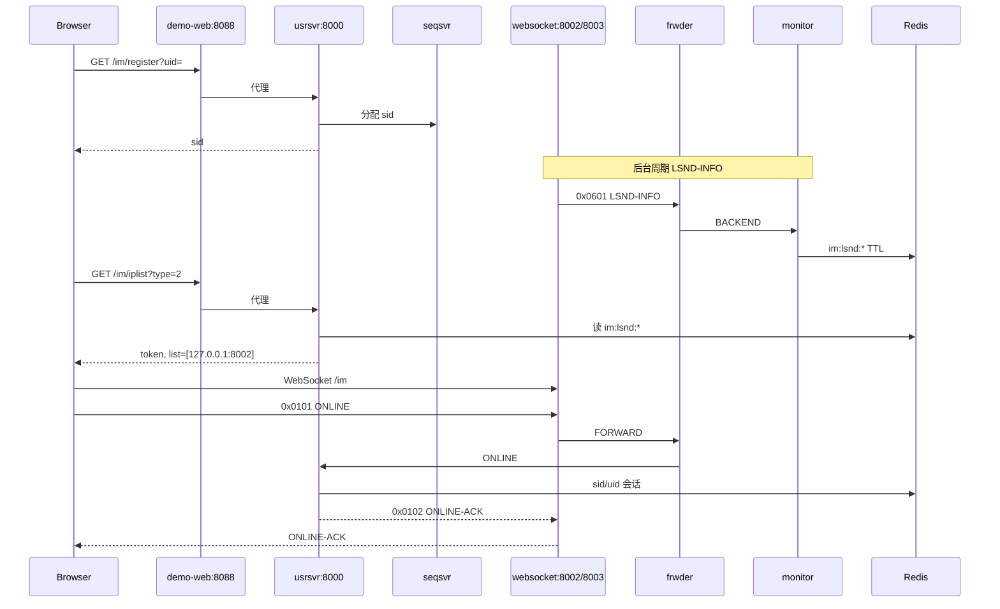
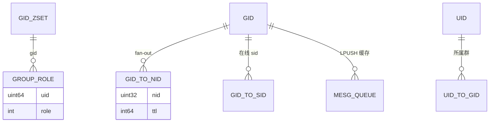

# 群聊 Demo 架构与流程

> **范围**：`demo/web/group.html` 双窗口群聊所经的分层、进程、数据流与时序。  
> **配套（面试向中文导读）**：[群聊Demo源码导读.md](群聊Demo源码导读.md) · [GROUP_DEMO_INTERFACES.md](GROUP_DEMO_INTERFACES.md) · [GROUP_DESIGN.md](GROUP_DESIGN.md) · [assets/ARCHITECTURE_DIAGRAM.md](assets/ARCHITECTURE_DIAGRAM.md)

---

## 1. 一句话架构

群聊 Demo 走 **完整 IM 主链路**：浏览器 → HTTP 注册/调度 → WebSocket 长连接 → **C frwder RTMQ** → **Go 业务**（usrsvr 管成员、msgsvr 管消息）→ **Redis 拓扑** → 按 **NID 多接入 fan-out** 推回各 websocket 节点上的群成员。

与聊天室（rid→nid→cid）的区别：群聊用 **gid→nid→cid**，生命周期在 **usrsvr**，消息 fan-out 在 **msgsvr**。

---

## 2. Docker 进程拓扑（Demo 栈）



**启动命令**：

```bash
docker compose --profile build run --rm --build builder   # 首次或改代码后
docker compose --profile run --profile demo up -d
```

**群聊页**：http://127.0.0.1:8088/group.html

---

## 3. 分层职责

| 层 | 组件 | 群 Demo 职责 |
|----|------|--------------|
| 客户端 | `group.html` | 注册、建群/加群、发消息 |
| HTTP | usrsvr | `/im/register`、`/im/iplist` |
| 接入 | websocket (Go) | WS 连接、本节点 **ImGroup 会话表**、二次 fan-out |
| 接入 | listend (C) | TCP 对称能力，demo 未用 |
| 转发 | frwder (C) | **cmd + nid** 路由，不理解群 |
| 业务 | usrsvr | ONLINE、群生命周期 0x0301–0x031D、NTF 广播 |
| 业务 | msgsvr | GROUP-CHAT 校验 + **gid→nid** fan-out + 落库 |
| 运维 | monitor | 接收 LSND-INFO，写 Redis 供 iplist |
| 存储 | Redis | 成员、在线路由、消息队列 |
| 存储 | Mongo | `group-mesg` 历史 |

---

## 4. frwder 双向路由



**C 代码入口**：

- 上行：`src/clang/exec/frwder/frwd_mesg.c` → `frwd_mesg_from_fw_def_hdl`
- 下行：同文件 → `frwd_mesg_from_bc_def_hdl`（按包头 `nid` 选接入节点）

---

## 5. 连接建立流程（两窗口共用）



**要点**：iplist 失败 = Redis 里 `im:lsnd:*` 过期或 frwder/monitor 异常 → `docker compose --profile run restart runner`。

---

## 6. 建群 + 加群流程

```mermaid
sequenceDiagram
  participant A as 窗口A 100001
  participant WSA as websocket:8002
  participant Fr as frwder
  participant Usr as usrsvr
  participant Redis
  participant B as 窗口B 100002
  participant WSB as websocket:8003

  A->>WSA: 0x0301 GROUP-CREAT
  WSA->>Fr: FORWARD
  Fr->>Usr: GROUP-CREAT
  Usr->>Redis: INCR gid, GroupRegister, GroupJoinOnline
  Note over Usr,Redis: 写 role/info/gid→nid/sid/uid
  Usr-->>WSA: 0x0302 ACK Ok:gid
  WSA->>WSA: ImGroupJoin(gid) 本地会话表
  WSA-->>A: CREAT-ACK

  B->>WSB: 0x0305 GROUP-JOIN
  WSB->>Fr->>Usr: GROUP-JOIN
  Usr->>Redis: GroupJoinOnline (追加 nid=20002)
  Usr-->>WSB: 0x0306 JOIN-ACK Ok:gid
  WSB->>WSB: ImGroupJoin(gid)
  WSB-->>B: JOIN-ACK
  Usr->>Fr: 0x0350 JOIN-NTF 广播各 nid
  Fr->>WSA: JOIN-NTF
  WSA-->>A: 系统通知
```

**服务分工**（见 [GROUP_DESIGN.md](GROUP_DESIGN.md)）：

- **usrsvr**：0x0301–0x031D 群生命周期 + 0x0350+ 通知
- **msgsvr**：仅 0x030B GROUP-CHAT

---

## 7. 群消息 fan-out（核心）

群消息有 **两段 fan-out**，与聊天室 rid→nid→cid 同套路：

```mermaid
sequenceDiagram
  participant A as 发送方
  participant WSA as websocket nid=20001
  participant Fr as frwder
  participant Msg as msgsvr
  participant Redis
  participant WSB as websocket nid=20002
  participant B as 接收方

  A->>WSA: 0x030B GROUP-CHAT
  WSA->>Fr->>Msg: 上行
  Msg->>Redis: 校验成员/禁言
  Msg->>Redis: ZRANGEBYSCORE chat:gid:{gid}:to:nid:zset
  loop 每个在线接入 NID
    Msg->>Fr: GROUP-CHAT head.nid=20001/20002
    Fr->>WSA: 推到 nid=20001
    Fr->>WSB: 推到 nid=20002
  end
  Note over WSA,WSB: 第二段：本节点 ImGroup 会话表
  WSA->>WSA: TravImGroupSession(gid)
  WSB->>WSB: TravImGroupSession(gid)
  WSA-->>A: GROUP-CHAT（本节点所有群成员连接）
  WSB-->>B: GROUP-CHAT
  Msg-->>WSA: 0x030C ACK → A
```

| 阶段 | 决策依据 | 数据结构 | 代码 |
|------|----------|----------|------|
| ① 跨接入点 | gid → 哪些 NID 有在线成员 | Redis `chat:gid:{gid}:to:nid:zset` | `msgsvr/gmesg.go` `GroupGetGidToNidSet` |
| ② 接入点内 | gid → 哪些 sid/cid | 内存 `chat_tab.ImGroup` | `websocket/upmesg.go` `LsndUpMesgGroupChatHandler` |
| 路由 | NID → 哪个 websocket 进程 | frwder `head.nid` | `frwder/frwd_mesg.c` |

**对比聊天室**：

| 维度 | 聊天室 0x04xx | 群聊 0x03xx |
|------|---------------|-------------|
| 业务服务 | chatroom | usrsvr + msgsvr |
| 拓扑键 | `room:rid:*` | `chat:gid:*` |
| 接入层索引 | `RoomJoin` / `TravRoomSession` | `ImGroupJoin` / `TravImGroupSession` |
| 消息 fan-out 决策 | chatroom | msgsvr |

---

## 8. 数据模型（Redis 群相关）



---

## 9. Demo 覆盖 vs 全系统

### 9.1 架构链路（「会不会整条 IM 链路」）

| 能力 | 群 Demo | 说明 |
|------|---------|------|
| HTTP + WS 双通道 | ✅ | register + iplist + ONLINE |
| C frwder RTMQ | ✅ | 所有 WS 帧必经 |
| Go 多业务分流 | ✅ | usrsvr / msgsvr 分 cmd |
| 多接入 NID | ✅ | 8002 + 8003 两窗口典型场景 |
| 两段 fan-out | ✅ | gid→nid→cid |
| Redis 会话拓扑 | ✅ | |
| Mongo 落库 | ✅ | 异步，demo 不查历史 |
| C listend TCP | 🟡 | 进程在跑，UI 未连 |
| chatroom 弹幕 | ❌ | 独立 0x04xx |
| 推送 0x05xx | ❌ | HTTP `/im/push` |

**结论（架构）**：群 Demo 串起了 **主链路 ~75%**——缺聊天室 fan-out 路径、TCP 接入演示、推送 HTTP，但 **接入→转发→业务→存储→多节点下行** 闭环完整。

### 9.2 产品功能（「功能清单里多少项」）

依据 [产品功能全览地图.md](产品功能全览地图.md) 四类会话 + 底座：

| 域 | 全系统功能量级 | Demo 覆盖 |
|----|----------------|-----------|
| 连接与会话 S-xx | ~12 项 | **4 项**（register、iplist、ONLINE、token） |
| 群聊 G-xx | ~20+ 项 | **~8 项**（建/加/邀/聊/退/散 + 2 种 NTF） |
| 聊天室 R-xx | ~15+ 项 | 0 |
| 私聊 P-xx | ~10+ 项 | 0 |
| 推送 N-xx | ~5 项 | 0 |

**结论（产品）**：群 Demo 约占 **可演示产品功能的 25%～35%**，远不到 80%。

### 9.3 综合回答「是不是 80%」

| 视角 | 占比 | 说明 |
|------|------|------|
| **架构 / 链路** | **~70–75%** | 一条标准 IM 请求怎么进来、怎么路由、怎么 fan-out、怎么落库——群 Demo 全走通了 |
| **产品功能** | **~25–35%** | 还有弹幕、私聊、推送、群管全套、好友、离线 SYNC 等 |
| **runner 9 进程** | **~6/9  актив参与** | usrsvr、msgsvr、websocket×2、frwder、monitor、seqsvr；chatroom/tasker/listend 陪跑 |

所以：**群聊 Demo ≠ 必嗨 80% 功能，但 ≈ 70%+ 的核心架构套路。** 面试/demo 讲「分层 fan-out、NID 多接入、RTMQ、Redis 拓扑」足够；要讲「全产品」还需加 `demo/web` 弹幕 + `smoke-push` + 私聊。

---

## 10. 推荐演示顺序（15 分钟）

1. **docker compose up** → `status.sh` 全绿  
2. 打开 **group.html** 双窗口，讲 **register → iplist → ONLINE**（底座）  
3. A 建群、B 加群，讲 **usrsvr + Redis 成员表**  
4. 互发消息，讲 **msgsvr gid→nid + websocket ImGroup fan-out**（可强调 A/B 不同端口 = 不同 NID）  
5. 对比 [assets/ARCHITECTURE_DIAGRAM.md](assets/ARCHITECTURE_DIAGRAM.md) 聊天室 vs 群聊  
6. 可选：`./scripts/smoke-group.sh` 终端验收  

---

## 11. 相关文档

| 文档 | 内容 |
|------|------|
| [GROUP_DEMO_INTERFACES.md](GROUP_DEMO_INTERFACES.md) | 全部接口/handler/Redis 清单 |
| [GROUP_DESIGN.md](GROUP_DESIGN.md) | 群模块设计选型 |
| [COMMAND.md](COMMAND.md) | 0x03xx 命令表 |
| [TROUBLESHOOT.md](TROUBLESHOOT.md) | iplist 空、fan-out 失败排查 |
| [demo/web/README.md](../demo/web/README.md) | 启动与双窗口步骤 |

---

*文档版本：与群聊 web demo、websocket ImGroup fan-out、docker-compose demo-web 服务对齐。*
