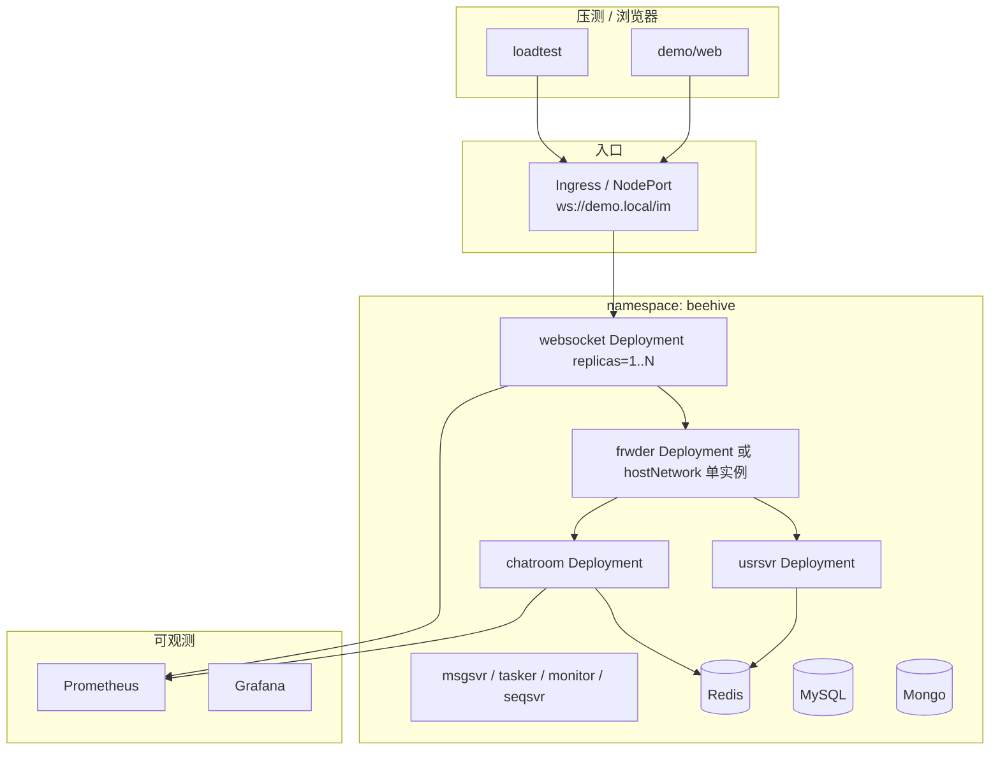

# K8s 本机演示路线图（64G VM · 面试用）

> **目标**：在单机 K8s（k3d / minikube / kind）上完成 **websocket 水平扩展 + Ingress 统一入口 + Prometheus 可见性 + 压测对比**，用于现场演示「扩缩容有效」，**不声称**本机支撑千万连接。  
> **前置**：Docker demo 已跑通（`./scripts/up-demo.sh`）、[LOADTEST baseline](LOADTEST.md) 已有数字。

---

## 1. 环境建议

| 项 | 建议 |
|----|------|
| 宿主机 | 64G RAM 虚拟机（Linux），CPU ≥ 8C |
| K8s | **k3d** 或 **kind**（轻量）；避免生产级集群 |
| 节点资源 | 给 K8s 分配 **48～56G**；留宿主机余量 |
| 镜像 | 沿用 `beehive-im-builder` 编译 Linux 二进制，业务镜像 `FROM debian/bookworm-slim` + `bin/*.v.1.1` |
| 压测机 | 在 **集群外** 跑 `tools/loadtest`（与 VM 同网段），避免与 Pod 抢 CPU |

**本机 realistic 上限（口述用）**：

- websocket 副本 **3～5**，每副本 **500～2000** WS 连接（以压测不 OOM 为准）
- 用 **ingress QPS + fan-out 估算** 外推，不仿真 1 亿连接

---

## 2. 架构原则（必遵守）

### 2.1 客户端永远不能拿 Pod IP

| 错误 | 正确 |
|------|------|
| iplist / 配置返回 `10.42.x.x` Pod IP | 返回 **Ingress / NodePort / LB** 地址 |
| 每 Pod 一个对外 IP | **统一 WS 入口** → Service → 多 Pod |

`usrsvr` iplist、`BEEHIVE_WS_IP`、demo/web 的 WS 地址必须指向 **Ingress 主机名:端口**。

### 2.2 多 websocket 必须保留的路由链

```text
websocket Pod → frwder (RTMQ) → chatroom / usrsvr
websocket → monitor (LSND-INFO) → Redis (im:lsnd:*, room:rid:*:to:nid:zset)
chatroom fan-out 读 rid→nid，不是 K8s Service DNS
```

**不能**用 Nacos 替代 frwder；**不能**删掉 monitor 注册。

**扩缩容与分层 Fan-out 寻址**：scale websocket 后新 Pod 获得新 **NID** → monitor 注册 → JOIN 写入 `room:rid:*:to:nid` → chatroom **① 拓扑路由** 自动覆盖新节点；fan-out **② 会话展开** 仍在本 Pod ChatTab 完成。详见 [弹幕系统的名词解释.md](弹幕系统的名词解释.md) §5。

### 2.3 建议 K8s 拓扑（Phase 2 最小集）



**frwder 首版**：单副本 Deployment（或 VM 上单独跑 C 进程），websocket 扩副本 **不扩 frwder** 即可演示接入分摊。

---

## 3. 分阶段执行清单

### Phase 0 — 基线（1 周，与 Docker 等价）

- [ ] `./scripts/build-linux.sh` 产物进镜像
- [ ] `docker compose` baseline 压测写入 [LOADTEST_REPORT.md](LOADTEST_REPORT.md)
- [ ] 能讲 [ROOM_CHAT_SEQUENCE.md](assets/ROOM_CHAT_SEQUENCE.md) 同步/异步

### Phase 1 — 容器化拆分（1～2 周）

- [ ] 目录 `deploy/k8s/`：`namespace`、`configmap`（由 `docker/gen-conf.sh` 渲染）
- [ ] **中间件**：Redis / MySQL / Mongo 各 1 Deployment + PVC（或 Helm bitnami）
- [ ] **Go 业务**：usrsvr、chatroom、msgsvr、monitor、seqsvr、tasker 各 1 Deployment
- [ ] **C 网关**：frwder 1 Deployment（`LD_LIBRARY_PATH`、挂载 `3rd/install/lib`）
- [ ] **websocket** 1 Deployment，Service `ClusterIP` + **Ingress**（或 NodePort 8002）
- [ ] 健康检查：`readiness` 探针 TCP `:8002` / HTTP usrsvr `:8000/im/register` 探活
- [ ] `./scripts/smoke-test.sh` 改 WS 地址后通过

### Phase 2 — 水平扩展演示（1～2 周）

- [ ] websocket `replicas: 1` 跑 loadtest：`LOADTEST_CONNS=200` `LOADTEST_RATE=1`
- [ ] `kubectl scale deployment websocket --replicas=3`
- [ ] 确认 **monitor** 注册 **3 个 NID** 到 Redis
- [ ] 确认 iplist / Ingress **仍是一个 WS 入口**（或两个固定 NID 端口，面试讲清即可）
- [ ] 再跑同场景压测，记录 **P99、失败率、chat QPS**
- [ ] 填写对比表（见 §5）

### Phase 3 — Prometheus + Grafana（1 周）

- [ ] kube-prometheus-stack 或 prometheus-operator（本机 lightweight 版）
- [ ] 业务指标（见 §4）从 websocket / chatroom **/metrics** 或 sidecar 暴露
- [ ] Grafana 单页：**连接数、chat QPS、fan-out 耗时、sendq drop**
- [ ] 演示脚本：打开 Grafana → scale → 再压测 → 指指标变化

### Phase 4 — HPA（可选，+1 周）

- [ ] 安装 prometheus-adapter 或 KEDA
- [ ] HPA 指标：`im_ws_connections` 或自定义 `im_fanout_p99`
- [ ] 压测加压 → 自动 scale → 指 lag/P99 回落（demo 级即可）

### Phase 5 — 性能改造（见 [PHASE3_PERFORMANCE_EVOLUTION.md](PHASE3_PERFORMANCE_EVOLUTION.md)）

- [ ] 改造前后 **同一 loadtest 场景** 出报告
- [ ] 面试：**before/after 数字 + 架构图 diff**

---

## 4. Prometheus 指标最小集

| 指标名 | 类型 | 来源 | 面试用途 |
|--------|------|------|----------|
| `im_ws_connections` | Gauge | websocket | 连接分摊、HPA |
| `im_room_chat_ack_total` | Counter | chatroom 或 loadtest 聚合 | ingress QPS |
| `im_fanout_duration_seconds` | Histogram | websocket TravRoomSession | 扩容是否降低 P99 |
| `im_sendq_drop_total` | Counter | lws AsyncSend default 分支 | 背压 |
| `im_rtmq_handler_inflight` | Gauge | chatroom（可选） | worker 堆积 |
| `im_kafka_consumer_lag` | Gauge | 若 Phase3 上 Kafka | 削峰故事 |

**实现提示**：Go 服务可先用 `prometheus/client_golang` 在现有 `controllers` 包埋点；不必一次接全链路 tracing。

---

## 5. 扩缩容对比表（面试填数）

| 场景 | ws replicas | conns | rate | chat QPS | P50 | P99 | fail | est_downstream/s |
|------|-------------|-------|------|----------|-----|-----|------|------------------|
| baseline-k8s-r1 | 1 | 200 | 1 | | | | | QPS×同房人数 |
| scale-k8s-r3 | 3 | 200 | 1 | | | | | |

`est_downstream ≈ chat_qps × join_ok`（同房互刷时 join_ok≈conns）。

**话术**：「副本从 1→3，连接通过 Ingress/LB 分摊；P99 / drop 下降说明瓶颈在接入 fan-out，不是 chatroom 单点。」

---

## 6. 目录结构建议（待实现）

```text
deploy/k8s/
  namespace.yaml
  config/                 # gen-conf 输出挂载为 ConfigMap
  middleware/             # redis mysql mongo
  frwder/
  websocket/
  chatroom/
  usrsvr/
  ingress.yaml
  kustomization.yaml      # 可选：overlay dev / scale-demo
deploy/prometheus/
  servicemonitor-websocket.yaml
  grafana-dashboard.json
scripts/k8s-up.sh           # 一键 apply + wait
scripts/k8s-loadtest.sh     # 固定场景 + 写 reports/
```

---

## 7. 现场 10 分钟演示脚本（K8s 段）

1. `kubectl get pods -n beehive` — 展示 websocket **1 副本**
2. Grafana — 当前 **连接数 / P99**
3. 终端跑 `scripts/k8s-loadtest.sh`（或手动 loadtest）30s
4. `kubectl scale deployment websocket --replicas=3`
5. 等 Pod Ready + monitor 注册 3 NID
6. **再跑同命令** — 对比 P99 / QPS
7. 回到架构图 — 指 **Ingress、NID、rid→nid fan-out**

---

## 8. 风险与诚实边界

| 风险 | 缓解 |
|------|------|
| Pod IP 进 iplist | 模板固定 `BEEHIVE_WS_IP` / Ingress DNS |
| 多 websocket 会话漂移 | demo 用 **同一 rid**、短压测；生产要 sticky 或统一入口 + 正确 NID |
| 64G OOM | 限制 conns、websocket memory limit、先 3 副本再加压 |
| frwder 单点 | 面试承认；Phase2+ 可多 frwder |

---

## 9. 相关文档

- [SCALE.md](SCALE.md) — 单机 vs 生产
- [PHASE3_PERFORMANCE_EVOLUTION.md](PHASE3_PERFORMANCE_EVOLUTION.md) — 异步 ACK / Kafka 改造选型
- [LOADTEST.md](LOADTEST.md) — 压测命令
- [INTERVIEW_DEMO.md](INTERVIEW_DEMO.md) — 15 分钟总脚本
- [assets/ARCHITECTURE_DIAGRAM.md](assets/ARCHITECTURE_DIAGRAM.md)
- [assets/ROOM_CHAT_SEQUENCE.md](assets/ROOM_CHAT_SEQUENCE.md)

---

*状态：路线图；`deploy/k8s/` 随实现逐步补齐。完成 Phase 2 后在 LOADTEST_REPORT 增加 `k8s-scale` 小节。*
