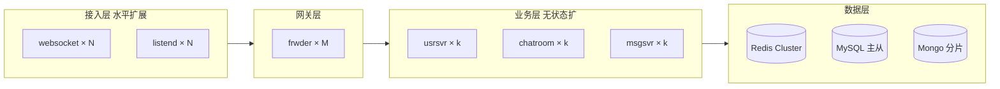

# 规模说明：单机 Demo vs 百万在线

> **面试原则**：本仓库 Docker demo 证明 **架构可跑、协议可通**；**不声称**笔记本单机支撑百万在线。

---

## 1. 当前 Demo 边界

| 维度 | 单机 Docker demo | 说明 |
|------|------------------|------|
| 部署 | 1 容器内 9 进程 + 3 中间件容器 | `docker-compose.yml` runner profile |
| 接入 | 1～2 个 websocket + 1 listend | `BEEHIVE_MULTINODE=1` |
| 网关 | 1× frwder | 无多实例分片 |
| Redis | 单节点 | 无 Cluster |
| seqsvr | 单点 Thrift | rid/gid 单点分配 |
| 压测 | task_04 待填 baseline | 预期 **数百～数千 WS** 量级 |

**适合讲**：分层、RTMQ、rid→nid 路由、群聊 fan-out、错误路径。  
**不适合讲**：「本机已验证百万 QPS/百万连接」。

---

## 2. 生产「百万在线」拓扑（目标态）

---

## 3. Demo → 生产的演进路径

| 步骤 | 动作 | 对应能力 |
|------|------|----------|
| 1 | 多 websocket/listend + 共享 frwder | 已 demo：`smoke-multinode.sh` |
| 2 | 多 frwder + 一致性哈希 / 订阅路由 | task_01 F11，代码待压测验证 |
| 3 | Redis Cluster（会话、房间、群拓扑分片） | ARCHITECTURE §11 |
| 4 | chatroom fan-out 批量化 / 专用弹幕通道 | 热路径优化 |
| 5 | 先广播后异步写 Mongo | 降低写阻塞 |
| 6 | 限流、背压、敏感词 | 上线前必做 |
| 7 | seqsvr HA 或分布式 ID | 消除单点 |
| 8 | K8s + HPA（连接数/QPS 指标） | task_04 压测出 baseline 后 |

---

## 4. 弹幕场景的特殊性

| 话题 | Demo | 生产 |
|------|------|------|
| 同房 fan-out | chatroom 遍历 rid→nid | 同思路，需 batch、优先级队列 |
| 超大房间 | 全量推送 | 采样、合并、客户端节流 |
| 运营广播 | HTTP `/room/push` → ROOM-BC | 与 0x05xx BC 职责分离（见 DEMO_SCOPE） |
| 延迟目标 | 本机 &lt;1s 肉眼 | P99 SLA + 监控 |

---

## 5. 面试话术模板

> 「这套 demo 在单机上跑通 IM 全链路：接入、RTMQ、聊天室、群聊、推送。架构上预留了 NID 多接入和 Redis 拓扑，和当年大规模弹幕系统是同一套路。  
> 百万在线需要接入层和 frwder 水平扩、Redis 分片、以及热路径与存储解耦——这些在文档里有演进表，压测数据会在 loadtest baseline 里补充，但 **不会把单机数字说成线上容量**。」

---

## 6. 相关文档

- [ARCHITECTURE.md](ARCHITECTURE.md) §11 缺口清单
- [DEMO_SCOPE.md](DEMO_SCOPE.md) 实现边界
- [INTERVIEW_DEMO.md](INTERVIEW_DEMO.md) Q&A
- task_04：`doc/LOADTEST.md`（待 task_04 完成后补充实测数字）
