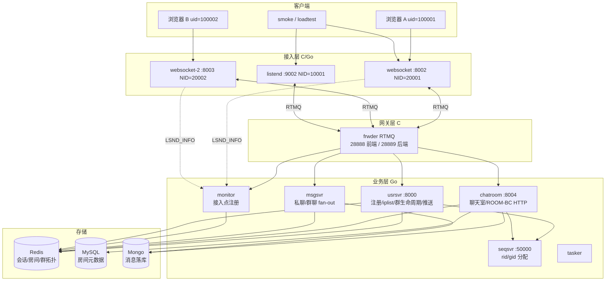

# beehive-im 演示架构图（一页）

> 面试/演示用单页视图。单机 Docker demo 拓扑；生产扩展见 [SCALE.md](../SCALE.md)。

## 数据流（聊天室弹幕）

1. 客户端 `ONLINE` → websocket → frwder → **usrsvr**（写 Redis 会话）
2. `ROOM-JOIN rid` → frwder → **chatroom**（写 rid↔sid↔nid 拓扑）
3. `ROOM-CHAT` → chatroom 按 **rid→nid 列表** fan-out → 各 websocket → 对端客户端
4. 可选：`POST /room/push` → **ROOM-BC** 系统弹幕

## 与群聊/推送的区别

| 能力 | 入口服务 | 广播依据 |
|------|----------|----------|
| 聊天室 | chatroom | Redis `room:rid:{rid}:to:nid:zset` |
| 群聊 | usrsvr + msgsvr | Redis 群成员 + gid→nid |
| 推送 BC/P2P | usrsvr HTTP | uid→sid→nid 或全站 lsnd |
