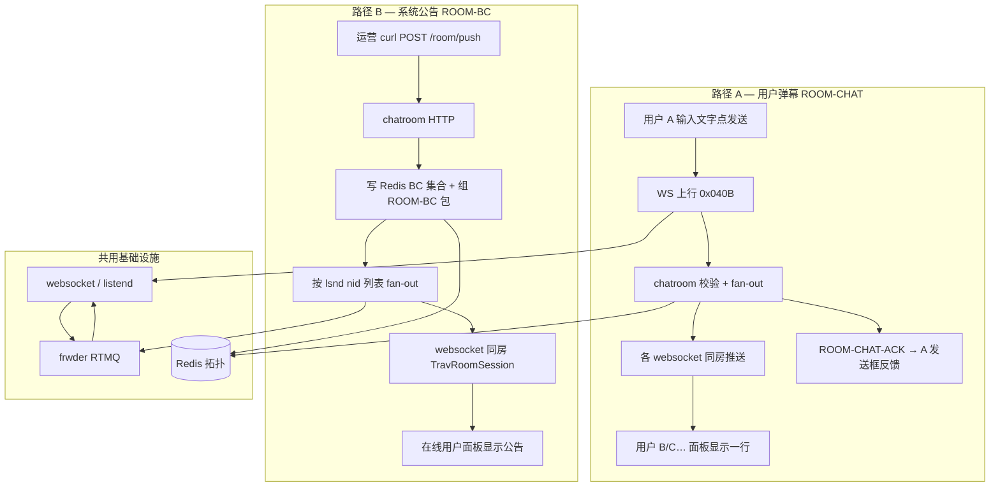
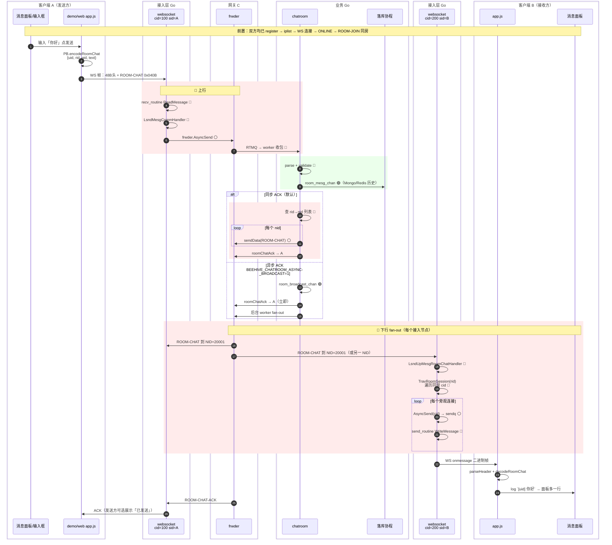
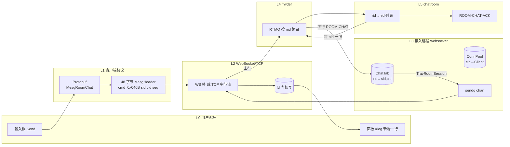
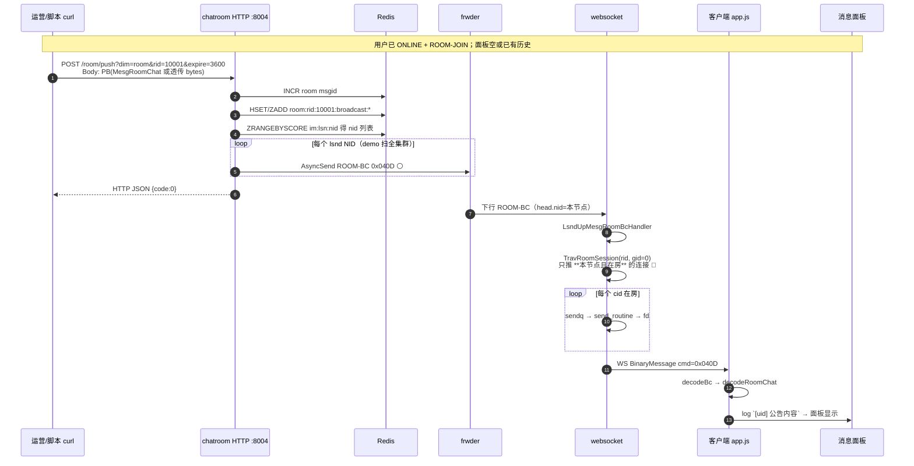
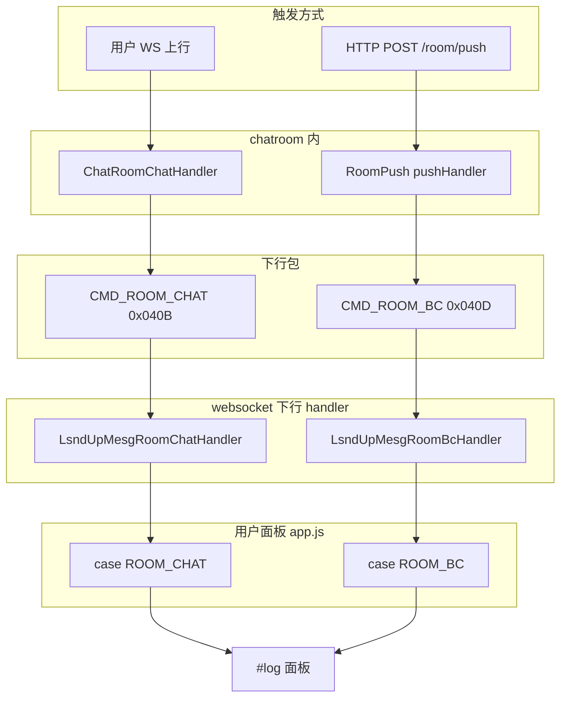
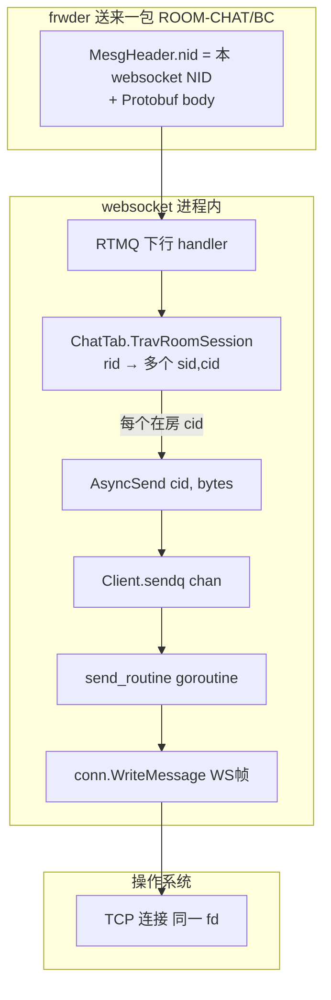
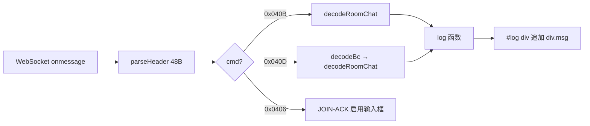
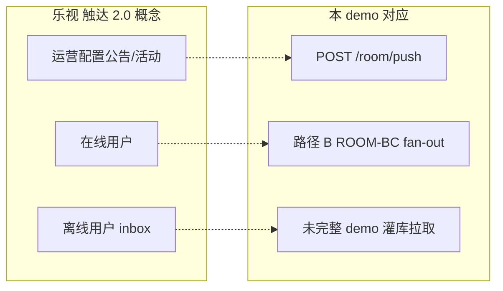

# 上行 → 下行：消息推到用户面板全流程

> **「用户消息面板」** = 客户端 UI（如 `demo/web` 的 `#log` 区域）：收到 `ROOM-CHAT` / `ROOM-BC` 后解析 Protobuf，渲染一行文字。  
> **本文两条主路径**：① 用户发弹幕（ROOM-CHAT） ② 运营/系统 push（HTTP `/room/push` → ROOM-BC）。  
> **图例**：**↑ 上行** Client→服务端　**↓ 下行** 服务端→Client　**服务** usrsvr / websocket / frwder / chatroom　**分层 Fan-out 寻址** ① RID→NID ② (RID,GID)→(SID,CID) ③ CID→fd（详 [弹幕系统的名词解释.md §5](../弹幕系统的名词解释.md#5-分层-fan-out-寻址从-rid-到-cid)）　🔴 同步阻塞　🟢 异步后台　⚪ 非阻塞入队

---

## 目录

1. [总览：两条 push 路径](#1-总览两条-push-路径)
2. [路径 A：用户发弹幕 → 别人面板显示](#2-路径-a用户发弹幕--别人面板显示)
3. [路径 B：运营 HTTP push → 在线用户面板](#3-路径-b运营-http-push--在线用户面板)
4. [接入层：从包到 fd 的最后一百米](#4-接入层从包到-fd-的最后一百米)
5. [客户端：面板如何收消息](#5-客户端面板如何收消息)
6. [与乐视「触达 push」对照](#6-与乐视触达-push对照)

---

## 1. 总览：两条 push 路径



| 对比 | 路径 A ROOM-CHAT | 路径 B ROOM-BC |
|------|------------------|----------------|
| 触发 | 客户端 WS 上行 | HTTP `POST :8004/room/push?dim=room&rid=` |
| 业务入口 | chatroom RTMQ handler | chatroom HTTP `push.go` |
| 下行 cmd | `0x040B` ROOM-CHAT | `0x040D` ROOM-BC |
| fan-out 依据 | **rid → nid**（在房用户所在接入节点） | 当前实现：**全集群 lsnd nid**（已知可优化为仅本 rid 相关 nid） |
| 面板渲染 | `decodeRoomChat` → `[uid] text` | `decodeBc` → 内嵌 chat → 同上 |
| 面试说法 | 互动弹幕 / 同房 fan-out | **系统消息触达 / 公告 push** |

---

## 2. 路径 A：用户发弹幕 → 别人面板显示

### 2.1 端到端泳道图（详细）



### 2.2 分层数据流（同一条弹幕）



### 2.3 关键步骤对照表

| 步骤 | 位置 | 输入 | 输出 | 类型 |
|------|------|------|------|------|
| 组包 | app.js | text | WS BinaryMessage | 🔴 客户端 |
| 上行转发 | websocket | ROOM-CHAT | frwder 队列 | ⚪ |
| 业务处理 | chatroom | rid, text | nid 列表 + ACK | 🔴/🟢 |
| 跨节点投递 | frwder | nid=20001 | websocket 进程 | 🔴 路由 |
| 节点内广播 | websocket | rid | 每个 cid 的 sendq | 🔴+⚪ |
| 写 socket | send_routine | sendq | fd → 内核 | 🔴 |
| 渲染面板 | app.js | ROOM-CHAT body | DOM 一行 | 🔴 客户端 |

---

## 3. 路径 B：运营 HTTP push → 在线用户面板

### 3.1 端到端时序图（触达 / 公告）



### 3.2 HTTP push 与 ROOM-CHAT 下行差异



**代码位置**：

- HTTP push：`src/golang/exec/chatroom/controllers/push.go` → `pushHandler`
- 客户端渲染：`demo/web/app.js` → `case CMD.ROOM_CHAT` / `ROOM_BC`

---

## 4. 接入层：从包到 fd 的最后一百米



| 对象 | 谁维护 | 作用 |
|------|--------|------|
| **fd** | OS；Go runtime 封装 | 一条 TCP 连接的内核句柄 |
| **websocket.Conn** | `lib/lws` Client | 封装 fd + WS 协议 |
| **cid** | websocket 进程内自增 | 找 `ConnPool[cid]` |
| **ChatTab (sid,cid)** | websocket | 知道该连接 join 了哪些 **rid** |
| **sendq** | 每 Client 一个 chan | 背压；满则 drop（SENDQ=8192） |

**listend（TCP）路径**：结构相同，只是没有 WS 帧，直接 `writev` 到 fd；handler 为 `lsnd_upmesg_room_chat_handler`。

---

## 5. 客户端：面板如何收消息

### 5.1 demo/web 消息流



### 5.2 用户视角时间线

```text
时间 ──────────────────────────────────────────────────────────────►

[连接阶段]
  注册 → iplist → WS.connect → ONLINE-ACK → ROOM-JOIN-ACK → 输入框可用

[发弹幕 — 路径 A]
  A 输入「你好」→ Send
  … 100～500ms（视 fan-out 负载）…
  B 面板出现：[100001] 你好
  A 可选收到 ROOM-CHAT-ACK（demo 未单独展示）

[收公告 — 路径 B]
  运营 curl push
  … 秒级内 …
  所有 **在线且已 join 该 rid** 的用户面板出现公告行
```

### 5.3 面板收不到消息的常见断点

| 断点 | 现象 | 查什么 |
|------|------|--------|
| 未 JOIN | 连接正常但无 ROOM-CHAT | JOIN-ACK code |
| rid 不在 ChatTab | 下行被 TravRoomSession 跳过 | 是否同房 |
| room status=0 | JOIN 失败 Room closed | MySQL CHAT_ROOM_INFO_TAB |
| frwder 挂 | iplist 失败 | runner 进程 |
| sendq 满 | 部分用户收不到 | SENDQ drop 日志 |
| 未解析 ROOM-BC | 公告乱码 | app.js decodeBc |

---

## 6. 与乐视「触达 push」对照



| 乐视说法 | 本系统步骤 |
|----------|------------|
| 在线 push 秒级触达 | 路径 B：HTTP → ROOM-BC → websocket → 面板 |
| 用户互动弹幕 | 路径 A：ROOM-CHAT |
| 离线 eventual | Mongo/Redis 历史 + 未来 SYNC（demo 弱） |
| 接入水平扩展 | 多 NID websocket + frwder 路由 |

---

## 7. 相关文档

| 文档 | 内容 |
|------|------|
| [ROOM_CHAT_SEQUENCE.md](ROOM_CHAT_SEQUENCE.md) | ROOM-CHAT 逐步 🔴🟢⚪ 标注 |
| [FLOWS_AND_GLOSSARY.md](../FLOWS_AND_GLOSSARY.md) | 全景 + 术语 |
| [ARCHITECTURE_DIAGRAM.md](ARCHITECTURE_DIAGRAM.md) | 一页拓扑 |
| [demo/web/app.js](../../demo/web/app.js) | 面板渲染代码 |

---

*建议：面试演示时 **路径 B curl 一条** + **路径 A 双浏览器互发** 各走一遍，指 `#log` 面板变化对应上表步骤。*
