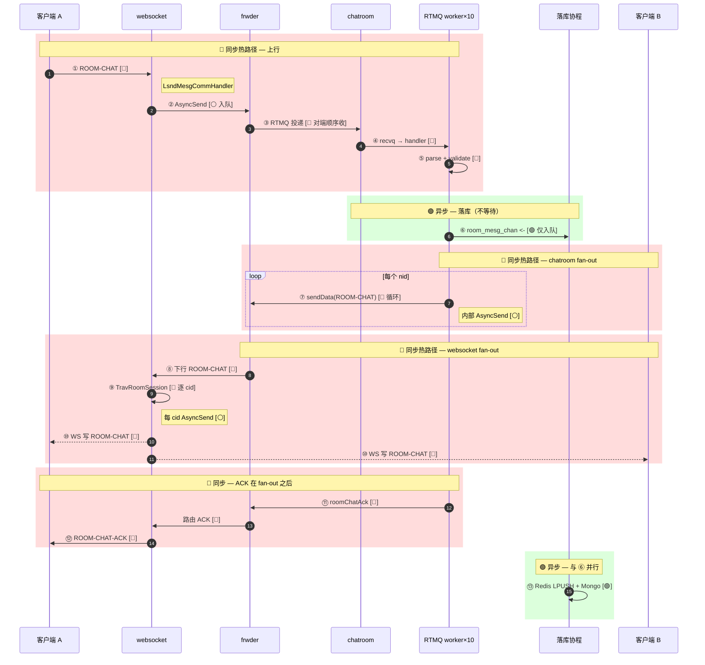

# ROOM-CHAT 时序图（逐步标注 同步 / 异步）

> 面试用：每一跳都标明 **🔴 同步**、**🟢 异步**、**⚪ 非阻塞入队**。  
> 代码：`chatroom/controllers/mesg.go`、`websocket/controllers/mesg.go` / `upmesg.go`。  
> **寻址模型**：[弹幕系统的名词解释.md §5 分层 Fan-out 寻址](../弹幕系统的名词解释.md#5-分层-fan-out-寻址从-rid-到-cid)（步骤 9～14 对应 ① 拓扑路由 + ② 会话展开 + ③ 连接投递）。

---

## 图例（三种，不要混为一谈）

| 标记 | 名称 | 含义 | 典型 API |
|------|------|------|----------|
| 🔴 | **同步** | 当前 goroutine **等这一步做完** 才继续；占 worker 时间 | `parseRoomChatReq`、`TravRoomSession` 循环体 |
| 🟢 | **异步** | **入队即返回**；真正干活在别的 goroutine | `room_mesg_chan <-`、`taskRoomMesgChanPop` |
| ⚪ | **非阻塞入队** | 往 channel 塞数据，**不等待对端处理完**；满则 fail/drop | `frwder.AsyncSend`、`lws.AsyncSend` |

> 「AsyncSend」名字带 Async，但在本架构里多数是 **⚪ 非阻塞入队**，不是 🟢 后台任务异步。

---

## 逐步清单（按时间顺序）

| # | 步骤 | 组件 | 类型 | 说明 |
|---|------|------|------|------|
| 1 | 客户端发 WS 帧 | Client → websocket | 🔴 | 等 TCP/WS 写完成 |
| 2 | 读协程解析 ROOM-CHAT | websocket | 🔴 | `LsndMesgCommHandler` 在 read 回调里执行 |
| 3 | 上行转 frwder | websocket → frwder | ⚪ | `frwder.AsyncSend` 进发送队列即返回 |
| 4 | frwder 路由到 chatroom | frwder → RTMQ | 🔴 | C 层转发；对 chatroom 表现为 **TCP 上逐条到达** |
| 5 | RTMQ 读包入 recvq | chatroom Proxy | 🔴 | 单 `recv_routine` 顺序读 |
| 6 | worker 取出消息 | chatroom Proxy | 🔴 | `handle_routine`（可 **10 并发**，但 **单条消息** 仍同步跑完 handler） |
| 7 | 解析 + 校验 | chatroom | 🔴 | `parseRoomChatReq` / `validateRoomChat` |
| 8 | 历史消息入队 | chatroom → chan | 🟢 | `room_mesg_chan <- item` **仅入队** |
| 9 | 查 rid→nid 列表 | chatroom | 🔴 | 内存 `room.node` + `RLock`（**① 拓扑路由**） |
| 10 | 按 nid fan-out | chatroom → frwder | 🔴 | **顺序** `for nid := range nid_list { sendData(cid=0) }` |
| 11 | 每条 sendData | chatroom | ⚪ | 内部 `frwder.AsyncSend`，不等待 websocket 播完 |
| 12 | frwder 按 nid 下行 | frwder → websocket | 🔴 | 路由到各接入节点 |
| 13 | 下行 ROOM-CHAT handler | websocket | 🔴 | `LsndUpMesgRoomChatHandler` |
| 14 | 同房逐连接推送 | websocket | 🔴 | **② 会话展开** `TravRoomSession(rid,gid)` → 每 cid **③** `AsyncSend` |
| 15 | 每连接入 sendq | websocket | ⚪ | `lws.AsyncSend`；send_routine 稍后写 WS |
| 16 | WS 写到客户端 | websocket → Client | 🔴 | 在 **send_routine** 里；与 14 解耦但仍在同进程 |
| 17 | roomChatAck | chatroom | 🔴 | **10～16 全部完成后** 才 ACK |
| 18 | ACK 经 frwder 回发送方 | chatroom → Client A | ⚪ + 🔴 | sendData ⚪；到 A 的 WS 写 🔴 |
| 19 | Redis LPUSH 历史 | storage 协程 | 🟢 | 与 8 并行，**不挡 17** |
| 20 | Mongo Insert | storage 协程 | 🟢 | 同上 |

**热路径（决定 ACK 延迟）**：🔴 步骤 **2 → 7 → 9 → 10 → 12 → 13 → 14 → 17**（中间夹杂 ⚪ 入队，但 **fan-out 循环本身同步**）。

**已异步（不挡 ACK）**：🟢 步骤 **8 → 19 → 20**。

---

## 主时序图（颜色区分同步块 / 异步块）



---

## 分泳道：谁阻塞、谁不阻塞

```
┌─────────────┬──────────────────────────────────────────────────────────┐
│  泳道        │  ROOM-CHAT 一次请求                                       │
├─────────────┼──────────────────────────────────────────────────────────┤
│ 客户端 A     │ 🔴 发 ──────────────────────────────── 🔴 收 ACK          │
│              │                    🔴 收广播（与 B 同时）                    │
├─────────────┼──────────────────────────────────────────────────────────┤
│ websocket    │ 🔴 读回调 → ⚪ 上行队列 → 🔴 下行 handler                  │
│              │ 🔴 TravRoomSession 循环 → ⚪ 每连接 sendq → 🔴 send_routine │
├─────────────┼──────────────────────────────────────────────────────────┤
│ frwder       │ 🔴 路由（C 层，业务视为黑盒）                              │
├─────────────┼──────────────────────────────────────────────────────────┤
│ chatroom     │ 🔴 worker: 校验 → 🟢 chan入队 → 🔴 nid循环 → 🔴 ACK       │
│ 落库协程     │ 🟢 storage（独立 goroutine，与 ACK 无关）                  │
├─────────────┼──────────────────────────────────────────────────────────┤
│ 客户端 B     │                         🔴 收广播（被动）                  │
└─────────────┴──────────────────────────────────────────────────────────┘
```

---

## 易混淆点

| 名字 / 现象 | 实际类型 | 原因 |
|-------------|----------|------|
| `frwder.AsyncSend` | ⚪ 非阻塞入队 | 不等 frwder 把包送到对端业务 |
| `lws.AsyncSend` | ⚪ 非阻塞入队 | 不等 WS 帧写到客户端 |
| `room_mesg_chan <-` | 🟢 异步 |  dedicated `taskRoomMesgChanPop` 消费 |
| RTMQ `WorkerNum=10` | 多条消息可并行 | **单条** ROOM-CHAT 仍 🔴 跑满 7→17 |
| ROOM-CHAT-ACK 含义 | 🔴 同步语义 | 「已推到各 **nid**」，非「B 已收到」 |

---

## 压测对照（哪类步骤拖慢）

| 类型 | 步骤 | demo 现象 |
|------|------|-----------|
| 🔴 | chatroom worker 7→17 | 1 连接 10 msg/s → 成功 ~3 QPS |
| 🔴 | websocket TravRoomSession | 50 人同房 P99 升高 |
| ⚪ | sendq 满 + 旧版 1s 阻塞 | 曾把 🔴 循环放大到秒级（已改 drop） |
| 🟢 | Mongo 落库 | 压测中 **不是** ACK 瓶颈 |

---

## ACK 语义

- **ROOM-CHAT-ACK** = 步骤 ⑦ nid fan-out 已执行 + 步骤 ⑪ 发出，**不是** 步骤 ⑩ 全员收齐。
- `ChatRoomChatAckHandler`：**「暂不处理」** — 无客户端送达回执。

---

## 演进（把 🔴 变 🟢 / ⚪）

| 现状（🔴） | 目标 | 状态 |
|------------|------|------|
| ⑪ ACK 在 ⑦⑨ 之后 | ⑥ 入队成功即 ACK，⑦⑨ 异步 worker | ✅ `BEEHIVE_CHATROOM_ASYNC_BROADCAST=1`（见 `broadcast_async.go`） |
| ⑦ nid 顺序 sendData | batch / 专用弹幕 topic | 待做 |
| ⑨ 逐 cid TravRoomSession | 批量写、慢连接隔离 | 待做 |

**异步 ACK 模式**（`BEEHIVE_CHATROOM_ASYNC_BROADCAST=1`）：

```
⑥ room_mesg_chan + room_broadcast_chan 入队 → ⑪ roomChatAck（立即）
                    ↓ 后台 goroutine
              ⑦⑧⑨ roomBroadcastFanOut → websocket 下行
```

对比压测：`./scripts/loadtest-sync-vs-async.sh` → `reports/loadtest/compare-sync-ack.json` / `compare-async-ack.json`

---

*关联：[ARCHITECTURE.md](../ARCHITECTURE.md) §4.3 · [LOADTEST_REPORT.md](../LOADTEST_REPORT.md) · [SCALE.md](../SCALE.md)*
