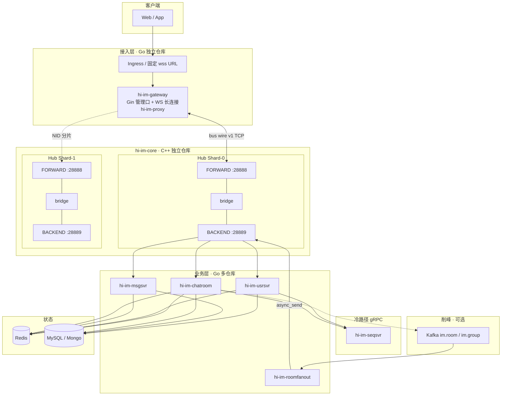

# hi-im 档 C 技术方案设计

> **定位**：必嗨 IM 原栈作者不再维护；以 **hi-im** 为新项目名，**hi-im-core**（C++17/20）重写 RTMQ Hub 并做架构升级，Go 业务层独立仓库迭代，**Gin + gRPC** 替换 beego + Thrift。  
> **档 C 范围**：Hub 分片 + 可观测 + io_uring 可选 + Kafka 削峰（方向二）+ K8s 部署。  
> **版本**：v0.2-draft · 2026-06-25  
> **许可证**：[Apache License 2.0](../LICENSE)

---

## 1. 背景与目标

### 1.1 为什么要另起项目

| 问题 | 现状 | hi-im 目标 |
|------|------|------------|
| 维护主体 | 必嗨原 C 栈（2014～2017）无人续维护 | 你主导的开源/产品化迭代 |
| 语言与工程 | C + 手动内存、无单测、Hub 单点 | C++17/20、RAII、单测、Prometheus |
| Go 业务栈 | beego + GOPATH + mgo + Thrift | **Go module + Gin + gRPC + mongo-driver** |
| 扩展 | frwder 盲 replicas 会丢包 | **Hub 按 NID 分片**、Ingress 固定入口 |
| 削峰 | chatroom 同步 fan-out | **Kafka + roomfanout**（可选热路径旁路） |

### 1.2 设计目标（档 C）

| 维度 | 指标 |
|------|------|
| **兼容** | hi-im bus wire v1 与必嗨 RTMQ **二进制兼容**（20 字节头 + payload）；现有 Go Demo 可渐进迁移 |
| **性能** | 不低于现网 bench：**publish ≥ 14 万 msg/s**（256B、单机、无持久化）；P99 转发延迟可控 |
| **扩展** | Hub **M 分片**；websocket **无脑水平扩**；msgsvr/chatroom SUB 策略可配置 |
| **可观测** | Prometheus metrics + 结构化日志；Hub 队列深度、SUB 数、nid 连接数可告警 |
| **RPC** | 业务 **冷路径** 统一 **gRPC**；**热路径 IM 帧** 仍走 hi-im 总线（不用 gRPC 替代每一包聊天） |

### 1.3 非目标（Non-Goals）

- hi-im-core **不**理解群/好友/会话语义；只认 `cmd/type` + `nid`。
- hi-im-core **不**持久化、不替代 Kafka 做日志型 MQ。
- 第一期 **不**重写 listend（C TCP 接入可后续单独 C++ 或弃用，以 Go websocket 为主）。

---

## 2. 必嗨原栈澄清：什么不是 gRPC

很多人会把「进程间通信」统称 RPC；必嗨里实际是 **三套通道**：

| 通道 | 技术 | 用途 | 是否 gRPC |
|------|------|------|-----------|
| **IM 热路径** | 自研 **RTMQ**（TCP + 20B 头） | 客户端上行/下行在进程间转发：`publish` / `async_send(nid)` | **否** |
| **ID 发号** | **Apache Thrift** | seqsvr：`AllocSid` / `AllocRid` / `AllocSeq` | **否**（新栈改 **gRPC**） |
| **对外 HTTP** | **beego** Router | 注册、iplist、管理接口 | **否**（新栈改 **Gin**） |

```text
浏览器 ──WS──► websocket ──hi-im-proxy──► Hub FORWARD
                              │
                              ▼ publish(cmd)
                         msgsvr / chatroom / usrsvr
                              │
                              ▼ async_send(nid)
                         Hub FORWARD ──► websocket ──► 浏览器

usrsvr ──gRPC──► seqsvr          （冷路径，毫秒级，QPS 低）
客户端 ──HTTP──► usrsvr / Gin    （注册、配置）
```

**结论**：

- **hi-im-core** 替代的是 **RTMQ + frwder Hub**，不是 gRPC。
- **gRPC** 用于 **seqsvr、服务间管理/查询、可选 Hub 控制面**；**不**用于每条群聊/弹幕转发（延迟与开销不合适）。

---

## 3. 总体架构

### 3.1 逻辑分层



### 3.2 与必嗨组件映射

| 必嗨 | 新栈（hi-im） | 仓库 |
|------|---------------|------|
| RTMQ Server + frwder | **hi-im-core Hub + bridge** | `hi-im-core` |
| RTMQ C Proxy | hi-im-core C++ Proxy（listend 如需） | `hi-im-core` |
| RTMQ Go Proxy | **hi-im-proxy** | 独立 Go module |
| websocket | **hi-im-gateway** | 独立 |
| usrsvr / msgsvr / chatroom | 各独立仓库 | `hi-im-*` |
| seqsvr (Thrift) | **hi-im-seqsvr (gRPC)** | 独立 |
| tasker / monitor | hi-im-tasker / hi-im-monitor | 独立 |
| roomfanout（方向二新增） | **hi-im-roomfanout** | 独立 |

---

## 4. 仓库与项目划分

建议 **1 个 C++ 核心 + 1 个 Go 公共库 + N 个 Go 微服务仓库**（便于单独发版、面试叙事清晰）。

### 4.1 仓库清单

| 仓库 | 语言 | 职责 |
|------|------|------|
| **`hi-im-core`** | C++17/20 | Hub Server、bridge、C++ Proxy SDK、bench、Prometheus exporter |
| **`hi-im-proxy`** | Go | 嵌入各 Go 进程的 Proxy；优先 **纯 Go 实现 bus wire v1** |
| **`hi-im-api`** | Go + protobuf | 公共：`comm` 48B 头、IM cmd 常量、gRPC `.proto`、Gin 中间件、Redis 键规范 |
| **`hi-im-gateway`** | Go + Gin | WebSocket 接入、ChatTab、hi-im-proxy、健康检查 |
| **`hi-im-usrsvr`** | Go + Gin | 注册、鉴权、Redis 在线；gRPC 调 seqsvr |
| **`hi-im-msgsvr`** | Go + Gin | 私聊、群聊 fan-out 第一段 |
| **`hi-im-chatroom`** | Go + Gin | 聊天室、rid→nid；可选写 Kafka |
| **`hi-im-roomfanout`** | Go | Kafka consumer → Redis rid→nid → hi-im async_send |
| **`hi-im-seqsvr`** | Go + gRPC | 替代 Thrift 的 SID/RID/SEQ |
| **`hi-im-tasker`** | Go | TTL、统计 |
| **`hi-im-deploy`** | YAML / Helm | K8s、Compose、Ingress |

> Go module 路径建议：`github.com/<org>/hi-im-api`、`github.com/<org>/hi-im-proxy` 等，与仓库名一致。

### 4.2 依赖关系

```text
hi-im-api      ◄────  所有 Go 服务
hi-im-proxy    ◄──  gateway / usrsvr / msgsvr / chatroom / roomfanout
hi-im-core     ◄──  deploy 编排；Go 服务只连 Hub 地址，不链 C++ 编译
```

**原则**：Go 服务 **不 CGO 依赖 hi-im-core**（除非后续性能优化）；`hi-im-proxy` **纯 Go 实现 bus wire v1**，与 C++ Hub 对接。

---

## 5. hi-im-core 设计（C++）

### 5.1 命名与版本

| 项 | 说明 |
|----|------|
| 项目名 | **hi-im**（生态名）；C++ Hub 仓库 **hi-im-core** |
| 线协议 | **hi-im bus wire v1** = 与 RTMQ 二进制兼容 |
| 扩展 | **hi-im bus wire v2**（可选）：增加 shard_id、trace_id 字段，通过 flag 协商 |

### 5.2 进程模型（单 Shard）

每个 **Hub 进程** 内仍保持双平面（与必嗨一致）：

| 平面 | 默认端口 | 连接方 |
|------|----------|--------|
| **FORWARD** | 28888 | gateway、listend（Proxy） |
| **BACKEND** | 28889 | usrsvr、msgsvr、chatroom、roomfanout |

**bridge** 模块（替代 `frwd_mesg.c`）：

```text
FORWARD 收到业务帧  →  Hub.publish(BACKEND, cmd, payload)
BACKEND 收到下行帧  →  Hub.async_send(FORWARD, cmd, dest_nid, payload)
```

### 5.3 线程 / IO 模型（档 C 升级）

| 模块 | v1 对齐 | 档 C 升级 |
|------|---------|-----------|
| listen | accept → connq | 同左 + SO_REUSEPORT 多 listen（可选） |
| rsvr × N | epoll 收发包、snap 拼帧 | epoll 或 **io_uring**（编译开关 `HIIM_USE_URING`） |
| dist × 1 | nid → rsvr 投递 | 同左 + 分片路由表 |
| worker × M | 业务回调 / bridge | 同左 |
| 队列 | pipe + 有锁队列 | **SPSC 无锁环** + 内存池（`std::vector` 预分配） |
| 发送 | writev 批量 | 同左 + 发送 coalesce |

### 5.4 Hub 分片（档 C 核心）

**问题**：多 Pod frwder + Service LB → nid 注册与 async_send 跨 Pod 丢包。

**方案：按接入 NID 范围分片**

```text
Shard-0: NID ∈ [20001, 20100]  →  hi-im-hub-0:28888/28889
Shard-1: NID ∈ [20101, 20200]  →  hi-im-hub-1:28888/28889
```

| 角色 | 规则 |
|------|------|
| **gateway** | 启动时 `--shard-id=0 --nid=20001`；只连 **本 shard** Hub |
| **msgsvr / chatroom** | 可连 **任意 shard BACKEND**（全 shard 相同 BACKEND 路由表同步，或 proxy 配置 multi-backend） |
| **async_send(nid)** | Hub 若 nid 不属于本 shard，**转发至 owner shard**（Hub 间 gRPC 或 TCP 内部链路，Phase 2） |

**Phase 1（简化）**：单 Shard 跑通 + bench 对齐；**Phase 2** 多 Shard + 跨 shard 转发。

### 5.5 对外 API（C++ Proxy SDK）

与 RTMQ 对齐，命名空间 `hiim::`：

```cpp
// 业务线程调用（线程安全，内部入队）
Status Proxy::AsyncSend(uint32_t cmd, uint32_t dest_nid,
                        const uint8_t* data, size_t len);
Status Proxy::Publish(uint32_t cmd, const uint8_t* data, size_t len); // Server 侧 bridge 用

// 注册下行 handler
void Proxy::RegisterHandler(uint32_t cmd, MessageHandler handler);
```

Go 侧 `hi-im-proxy` 提供等价 API：

```go
func (p *Proxy) AsyncSend(cmd, destNid uint32, payload []byte) error
func (p *Proxy) RegisterHandler(cmd uint32, h Handler)
```

### 5.6 可观测

| 指标 | 说明 |
|------|------|
| `hiim_connections` | 按平面、shard 的连接数 |
| `hiim_subscriptions` | 按 cmd 的 SUB 数 |
| `hiim_publish_total` | publish QPS |
| `hiim_async_send_total` | async_send QPS |
| `hiim_queue_depth` | sendq/recvq 深度 |
| `hiim_drop_total` | 背压丢弃 |
| `hiim_forward_latency_us` | 转发耗时 histogram |

暴露：`/metrics` HTTP（Prometheus）+ 结构化 JSON 日志（spdlog）。

### 5.7 目录结构（`hi-im-core` 仓库）

```text
hi-im-core/
├── CMakeLists.txt
├── include/hiim/
│   ├── wire/header.hpp      # 20B 头，v1 兼容
│   ├── hub/context.hpp
│   └── proxy/proxy.hpp
├── src/
│   ├── wire/
│   ├── hub/
│   │   ├── listener.cpp
│   │   ├── reactor.cpp      # epoll / uring
│   │   ├── router.cpp       # sub + nid map
│   │   ├── distributor.cpp
│   │   └── bridge.cpp
│   └── proxy/
├── cmd/
│   ├── hi-im-hub/           # Hub 主程序
│   └── hi-im-bench/         # 对齐 rtmq-bench
├── test/                    # 协议单测、路由单测
└── docs/
```

---

## 6. gRPC 设计边界

### 6.1 必须用 gRPC 的场景

| 服务 | API 示例 | 替代 |
|------|----------|------|
| **hi-im-seqsvr** | `AllocSid`, `AllocRid`, `AllocGid`, `AllocSeq` | Thrift |
| **hi-im-usrsvr → seqsvr** | 注册时取 sid | Thrift client |
| **Hub 控制面（Phase 2）** | `RegisterShard`, `HealthCheck`, `DumpRoute` | 原无 |
| **roomfanout 配置** | 动态 rid 黑名单 | 可选 |

### 6.2 不用 gRPC 的场景

| 场景 | 原因 | 方案 |
|------|------|------|
| 群聊/弹幕/私聊每一包 | 延迟、吞吐、长连接无关 | **hi-im async_send / publish** |
| websocket → msgsvr 上行 | 已是 IM 二进制帧 | hi-im bus |
| Kafka → 客户端最后一跳 | 需 nid 精确投递 | hi-im async_send |

### 6.3 proto 示例（seqsvr）

```protobuf
syntax = "proto3";
package hi.im.seq.v1;

service SeqService {
  rpc AllocSid(AllocSidRequest) returns (AllocSidResponse);
  rpc AllocRid(AllocRidRequest) returns (AllocRidResponse);
  rpc AllocSeq(AllocSeqRequest) returns (AllocSeqResponse);
}
```

---

## 7. Go 业务服务（Gin + hi-im-proxy）

### 7.1 框架迁移

| 项 | 必嗨 | 新栈 |
|----|------|------|
| HTTP | beego | **Gin** |
| 日志 | beego/logs | **zap** 或 slog |
| Mongo | mgo | **mongo-driver** |
| Redis | redigo | redigo 或 go-redis |
| 模块 | GOPATH + vendor | **Go 1.22+ module** |

### 7.2 单服务结构（以 gateway 为例）

```text
hi-im-gateway/
├── cmd/gateway/main.go
├── internal/
│   ├── ws/              # WebSocket 读写的协程
│   ├── chattab/         # rid/gid → cid（从 beehive 迁移）
│   ├── bus/             # 封装 hi-im-proxy
│   └── http/            # Gin：/health, /metrics, /debug
├── config/
└── go.mod               # require hi-im-api, hi-im-proxy
```

### 7.3 连接配置（环境变量）

```bash
HIIM_FORWARD_ADDR=hi-im-hub-0:28888
HIIM_BACKEND_ADDR=hi-im-hub-0:28889   # 业务进程用
HIIM_NID=20001                         # 本进程唯一
HIIM_SHARD_ID=0
HIIM_AUTH_USER=websocket
HIIM_AUTH_PASS=***
```

### 7.4 SUB 策略（msgsvr / chatroom）

| cmd | 建议 SUB 数 | 说明 |
|-----|-------------|------|
| GROUP-CHAT | **1**（或 Kafka 分片后 0 SUB） | 避免 publish 广播重复消费 |
| ROOM-CHAT | **1** | 同上 |
| ONLINE / 生命周期 | 1 或按 shard | usrsvr 可单活 |

配置化：`HIIM_SUB_MODE=single|broadcast` + `HIIM_SUB_OWNER=pod-name`。

---

## 8. 协议与迁移策略

### 8.1 保持不变

| 协议 | 说明 |
|------|------|
| **IM 48 字节头 + Protobuf 体** | 客户端协议不变 |
| **hi-im bus wire v1（20 字节头）** | 与 RTMQ 兼容，便于对照必嗨文档 |

### 8.2 迁移路径

```text
Stage 0  文档 + hi-im-bench 对齐 14 万/s
Stage 1  hi-im-hub 单 Shard 替换 compose 里 frwder（Hub 层）
Stage 2  hi-im-proxy 连 Hub：publish / unicast 集成测试（测试桩，非群聊）
Stage 3  hi-im-seqsvr + usrsvr：注册 / ONLINE
Stage 4  hi-im-gateway：WS 接入 + 连 usrsvr
Stage 5  hi-im-msgsvr：群聊 gid→nid 第一段 fan-out → 双窗口群聊冒烟
Stage 6  hi-im-chatroom + hi-im-tasker
Stage 7  Hub 分片 + hi-im-deploy K8s
Stage 8  hi-im-roomfanout + Kafka
```

> **注意**：「双窗口群聊互通」至少依赖 **core + proxy + api + deploy + gateway + usrsvr + msgsvr + seqsvr + Redis**，不可能在仅有 gateway 的 Stage 4 之前完成。

### 8.3 兼容期双跑（可选）

Compose 内 **`frwder` + `hi-im-hub`** 不同端口；部分 Go 进程切到 hi-im Hub 地址，逐步切流。

---

## 9. Kafka 与 roomfanout（方向二）

| 项 | 设计 |
|----|------|
| Topic | `im.room`（key=rid）、`im.group`（key=gid） |
| 生产者 | chatroom 峰值时异步写 Kafka |
| 消费者 | **hi-im-roomfanout**：按 partition 扩展；读 Redis rid→nid；**hi-im async_send** |
| 热路径 | 低峰仍 chatroom 直发 hi-im |

**原则**：Kafka 管削峰与持久；**最后一跳仍是 hi-im 总线**，不是 gRPC 推 gateway。

---

## 10. 部署（K8s 概要）

```text
Ingress (wss://im.example.com)
  └── hi-im-gateway Deployment (HPA on CPU/conn)
        └── HIIM_FORWARD → hi-im-hub-{shard}

hi-im-hub-0 StatefulSet  (固定 NID 范围)
hi-im-hub-1 StatefulSet

hi-im-msgsvr / chatroom / usrsvr Deployment
hi-im-seqsvr Deployment
hi-im-roomfanout Deployment (replicas ≈ Kafka partitions)
```

| 组件 | 扩缩容 |
|------|--------|
| gateway | ✅ HPA |
| hi-im-hub | ⚠️ 按 shard 增删，非 blind replicas |
| msgsvr SUB=single | ⚠️ 垂直扩或 Kafka 分片 |
| roomfanout | ✅ 跟 partition |

---

## 11. 实施路线图与工期

假设 **你全职**，已有必嗨 RTMQ 文档基础。

> **hi-im-core 内部里程碑**（core-M1～M4）见独立仓库 `hi-im-core/doc/技术设计文档.md` §13；与下表 **生态 M1～M9** 勿混用。

### 11.1 群聊为什么不能在 M3 做？

必嗨群聊是 **双段 fan-out**，缺任何一段都无法「双窗口互通」：

```text
窗口 A ──WS──► gateway(NID=20001)
                  │ AsyncSend GROUP-CHAT
                  ▼ publish
              msgsvr  ──查 Redis gid→{20001,20002,...}──► 对每个 nid AsyncSend（第一段 fan-out）
                  │
                  ▼ async_send(nid=20002)
              gateway(NID=20002) ──ChatTab ImGroup──► 窗口 B（第二段 fan-out）
```

| 组件 | 群聊中的角色 | M3 时是否存在 |
|------|--------------|---------------|
| hi-im-core | Hub 路由 publish / async_send | M1 后有 |
| hi-im-proxy | 嵌入 gateway / msgsvr | M2 后有 |
| hi-im-gateway | WS + 第二段 fan-out | M3 可开始写，但 **不能单独验收群聊** |
| **hi-im-msgsvr** | **第一段 gid→nid fan-out** | **M6 才有** |
| hi-im-usrsvr | 建群、加群、ONLINE | M4 后有 |
| hi-im-seqsvr | 注册分配 sid | M4 后有 |
| Redis | gid→nid、成员表 | deploy 提供 |

因此：**M3 只能验收 WS 接入 + Hub 单播/回声**；**群聊双窗口冒烟放在 M6**（msgsvr 就绪后）。

### 11.2 仓库 × 里程碑对照（11 个全覆盖）

| 仓库 | 首次纳入 | 说明 |
|------|----------|------|
| **hi-im-core** | M1 | Hub + bench |
| **hi-im-api** | M2 | 48B 头、cmd 常量、proto |
| **hi-im-proxy** | M2 | 纯 Go bus wire v1 |
| **hi-im-deploy** | M3 | 最小 Compose；M8 扩展 K8s/Helm |
| **hi-im-seqsvr** | M4 | gRPC 发号 |
| **hi-im-usrsvr** | M4 | 注册、ONLINE、群成员 HTTP/gRPC |
| **hi-im-gateway** | M5 | WS 长连接；M5 末可双窗口 **单播/回声**，非群聊 |
| **hi-im-msgsvr** | M6 | 群聊 / 私聊第一段 fan-out |
| **hi-im-chatroom** | M7 | 聊天室、rid→nid |
| **hi-im-tasker** | M7 | TTL、在线统计（可与 chatroom 并行） |
| **hi-im-roomfanout** | M9 | Kafka Consumer（档 C 削峰） |

### 11.3 里程碑明细

| 阶段 | 涉及仓库 | 内容 | 工期 | 验收（可执行） |
|------|----------|------|------|----------------|
| **M1** | hi-im-core | bus wire v1 + Hub 单 Shard + bench | 3 周 | `hi-im-bench` publish **≥ 14 万/s** |
| **M2** | hi-im-api, hi-im-proxy | Proxy AUTH/SUB/AsyncSend + 单测 | 2 周 | Proxy 连 Hub，unicast 端到端 |
| **M3** | hi-im-deploy | Compose：hub + proxy 测试桩 + Redis | 1 周 | **Hub 集成冒烟**（publish/unicast）；**不含群聊** |
| **M4** | hi-im-seqsvr, hi-im-usrsvr | gRPC 发号 + Gin 注册/ONLINE | 2 周 | HTTP 注册拿 sid，ONLINE 写 Redis |
| **M5** | hi-im-gateway | WS 接入 + 调 usrsvr | 2 周 | 浏览器连 WS、注册上线；可选 **双窗口 echo/单播** |
| **M6** | hi-im-msgsvr | 群聊：建群/加群/GROUP-CHAT fan-out | 3 周 | **Demo 双窗口群聊互通** |
| **M7** | hi-im-chatroom, hi-im-tasker | 聊天室 + 定时任务 | 2 周 | 进房发弹幕；tasker 跑通 |
| **M8** | hi-im-core, hi-im-deploy | Hub 分片 + Prometheus + K8s | 3 周 | 2 shard 压测；Ingress 固定 wss |
| **M9** | hi-im-roomfanout | Kafka 削峰 + consumer | 2 周 | 峰值对比数据（v0 vs v3 表） |

**合计约 20 周（~5 个月）**；原 M1～M7 估 17 周偏乐观，主要补了 **M3 deploy**、**M5/M6 拆分** 与 **tasker/chatroom 独立 M7**。

### 11.4 两条并行策略（省时间）

若希望 **尽早看到浏览器 Demo**，可与 M2 并行从 beehive-im **只读对照**迁移，但验收仍按上表：

| 策略 | 做法 | 风险 |
|------|------|------|
| **A. 严格净室** | 按 M1→M9 顺序写 hi-im 仓库 | 最慢，叙事最干净 |
| **B. 混合对照** | M5 前 gateway 临时 **连 beehive 旧 msgsvr** 验证 WS 链 | 仅本地调试，**不算 hi-im 里程碑完成** |
| **C. 推荐** | M5 只做 WS+注册；**M6 再切 hi-im-msgsvr**，一次验收群聊 | 工期清晰，不误导 |

### 11.5 M3 / M5 / M6 验收对照（避免再混淆）

| 里程碑 | 能做什么 | 不能做什么 |
|--------|----------|------------|
| **M3** | Hub + Proxy 压测、unicast 测试桩 | 群聊、WS 浏览器 |
| **M5** | 双窗口 WS 在线、单播/回声 | **群聊 fan-out** |
| **M6** | **双窗口群聊** | 聊天室峰值 Kafka |

---

## 12. 风险与决策记录

| ID | 决策 | 理由 |
|----|------|------|
| D1 | 热路径不用 gRPC | 延迟与吞吐；必嗨原设计正确 |
| D2 | seqsvr Thrift → gRPC | 统一栈、易代码生成、你简历叙事 |
| D3 | Go Proxy 纯 Go 实现 v1 协议 | 避免 CGO 交叉编译与部署复杂度 |
| D4 | hi-im-core 独立 C++ 仓库 | 与 Go 服务解耦、便于 C++ 第二曲线 |
| D5 | 生态统一命名 **hi-im** | 仓库、镜像、K8s 资源前缀一致 |
| D6 | listend 延后 | 浏览器 Demo 以 WS 为主 |
| D7 | 开源协议 **Apache 2.0** | 商业友好、与 gRPC/Protobuf/K8s 生态一致；各 hi-im 独立仓库根目录携带相同 LICENSE |

| 风险 | 缓解 |
|------|------|
| rsvr 拼帧 bug | Wire 层单测 + 必嗨 pcap 对照 |
| Hub 分片跨 shard 复杂 | M1 单 Shard 跑通再 M8 |
| Go 迁移面大 | 先 gateway + usrsvr（M4/M5），msgsvr 群聊 M6 再验收 |
| 里程碑与仓库数不一致 | 见 §11.2 对照表，11 仓库均有归属 |
| 性能回退 | 每 Milestone 跑 hi-im-bench 对比基线 JSON |

---

## 13. 面试 / 开源 README 一句话

> **hi-im** 是必嗨 IM 的现代化重写：C++ **hi-im-core** 保留 **publish / async_send** 双路由与双平面 Hub，补齐 **Hub 分片、Prometheus 与 Kafka 削峰**；Go 业务层以 **Gin + gRPC** 独立演进，热路径 IM 帧仍走 hi-im 内存总线，**gRPC 仅负责 seqsvr 等冷路径 RPC**。

---

## 14. 开源许可证

| 项 | 说明 |
|----|------|
| **协议** | [Apache License 2.0](../LICENSE) |
| **版权** | Copyright 2026 Sun Chao |
| **适用范围** | hi-im 生态新代码（hi-im-core、hi-im-proxy、各 Go 服务等） |
| **NOTICE** | 见仓库根目录 [NOTICE](../NOTICE)；必嗨遗留 C 源码保留原文件头版权，hi-im-core 为净室重写 |
| **拆仓要求** | 每个独立 GitHub 仓库根目录复制 `LICENSE` + `NOTICE`；Go 源文件头可选加 SPDX：`SPDX-License-Identifier: Apache-2.0` |

---

## 15. 下一步建议

1. 推进 **`hi-im-core`** M1：见 `hi-im-core/doc/M1-实施清单.md`。
2. 创建 **`hi-im-api`** + **`hi-im-proxy`**（M2）。
3. **`hi-im-deploy`** 最小 Compose 与 M3 对齐（hub + redis，**不要**把群聊写进 M3 验收）。
4. **M6 之前**不要承诺「双窗口群聊 Demo」；M5 最多验收 WS + 注册 + 单播。

如需，可继续拆 **M2 hi-im-proxy 状态机清单** 或 **`hi-im-api` proto 全量定义**。
