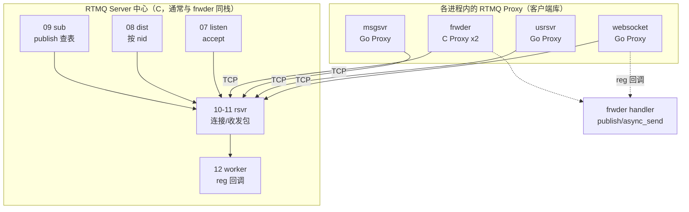
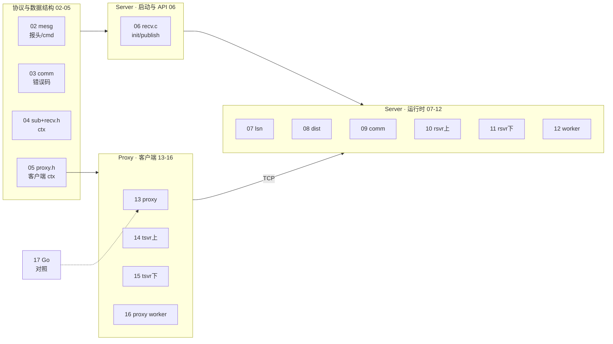
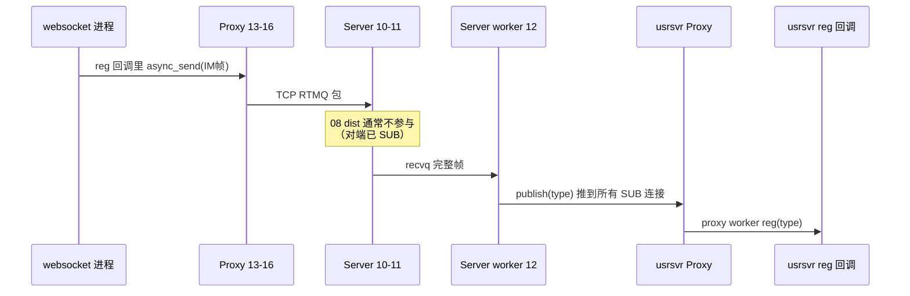
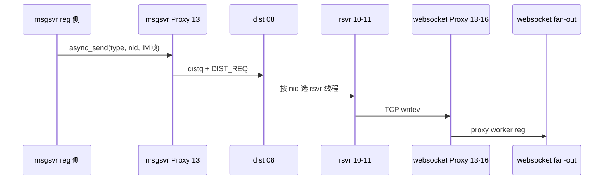
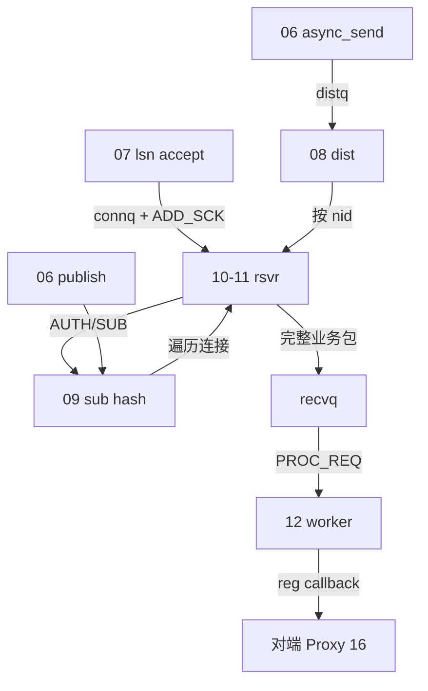
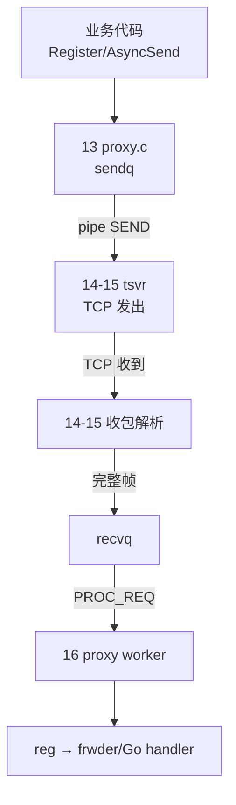

# RTMQ 总地图（读任何一篇前先扫一眼）

> **设计文档（问题与架构）**：[RTMQ-技术设计文档.md](RTMQ-技术设计文档.md)  
> **群聊 Demo 结合解读（推荐）**：[群聊Demo视角解读RTMQ.md](群聊Demo视角解读RTMQ.md)  
> **用法**：打开 02～17 任一文档时，先在本页找到 **同色编号**，再在脑海中对号入座。  
> **配套**：[README.md](README.md) · [01-architecture.md](01-architecture.md)

---

## 1. 必嗨 IM 里 RTMQ 站在哪



**记忆口诀**：每个进程一个 **Proxy**；中心一个 **Server**；**publish 广播 type**，**async_send 单播 nid**。

---

## 2. 十七篇文档在代码里的位置（总组件图）



| 编号 | 文档 | 在 RTMQ 里扮演 | 必读级 |
|------|------|----------------|--------|
| 02 | mesg | **语言**：报文格式 | ★★★ |
| 03 | comm | **工具箱**：snap/worker/回调类型 | ★★ |
| 04 | recv.h | **Server 全局地图**：队列/线程/表 | ★★★ |
| 05 | proxy.h | **Proxy 全局地图** | ★★★ |
| 06 | recv API | **Server 开关**：四条对外 API | ★★★ |
| 07 | lsn | **大门**：accept | ★★★ |
| 08 | dist | **邮局分拣**：async_send 下游 | ★★★ |
| 09 | comm | **电话簿**：SUB + nid→rsvr | ★★★ |
| 10-11 | rsvr | **收发室**：TCP 拼帧/系统命令 | ★★ |
| 12 | worker | **业务员**：reg→你的 handler | ★★★ |
| 13 | proxy | **寄信人**：业务进程发消息 | ★★★ |
| 14-15 | tsvr | **邮递员**：TCP 连 Server | ★★ |
| 16 | proxy worker | **收信人**：下行进 frwder/Go | ★★★ |
| 17 | Go | **你实际调试的层** | ★★★ |

---

## 3. 两条业务主线（整库就这两条路）

### 3.1 上行：接入 → 业务（publish）

以 **websocket 收到 IM 帧 → usrsvr 处理** 为例：



**涉及文档**：13→14/15→10/11→12→09(查 SUB 表)→16→17

---

### 3.2 下行：业务 → 指定接入 NID（async_send）

以 **msgsvr fan-out → websocket:8002** 为例：



**涉及文档**：06(async_send)→13→08→10/11→14/15→16

---

## 4. Server 内部数据流（07～12 怎么串）



---

## 5. Proxy 内部数据流（13～16 怎么串）



---

## 6. 各篇专属流程图索引

| 编号 | 流程图位置 |
|------|------------|
| 02 | [02 文末](02-rtmq_mesg.md#本篇流程图) |
| 04 | [04 文末](04-rtmq_sub_and_recv_h.md#本篇流程图) |
| 06 | [06 文末](06-rtmq_recv_api.md#本篇流程图) |
| 07 | [07 文末](07-rtmq_lsn.md#本篇流程图) |
| 08 | [08 文末](08-rtmq_dist.md#本篇流程图) |
| 09 | [09 文末](09-rtmq_comm_server.md#本篇流程图) |
| 10 | [10 文末](10-rtmq_rsvr_part1.md#本篇流程图) |
| 11 | [11 文末](11-rtmq_rsvr_part2.md#本篇流程图) |
| 12 | [12 文末](12-rtmq_worker.md#本篇流程图) |
| 13 | [13 文末](13-rtmq_proxy.md#本篇流程图) |
| 14-15 | [14 文末](14-rtmq_proxy_tsvr_part1.md#本篇流程图) |
| 16 | [16 文末](16-rtmq_proxy_worker.md#本篇流程图) |
| 17 | [17 文末](17-rtmq_proxy_go.md#本篇流程图) |

---

## 7. 30 秒自测（看完总地图应能答）

1. **publish 和 async_send 区别？** → 广播 type vs 单播 nid  
2. **08 dist 只服务哪条 API？** → async_send  
3. **12 worker 和 16 proxy worker 各干什么？** → Server 调业务 / Proxy 收下行  
4. **07 和 14 的区别？** → Server accept vs Proxy 主动 connect  
5. **09 sub hash 谁在用？** → publish 查订阅；11 SUB 时写入  

---

## 8. 阅读路线（带地图回放）

```
第1遍（建立地图）：00 总地图 → 02 → 04 → 05 → 06
第2遍（走通上行）：13 → 14 → 10 → 12 → 16 → 17
第3遍（走通下行）：06 async_send → 08 → 10/11 → 14/15 → 16
第4遍（补细节）：07 09 11 15
```

每读完一篇，回到 **§2 总组件图**，在心里 **点亮对应编号**。
