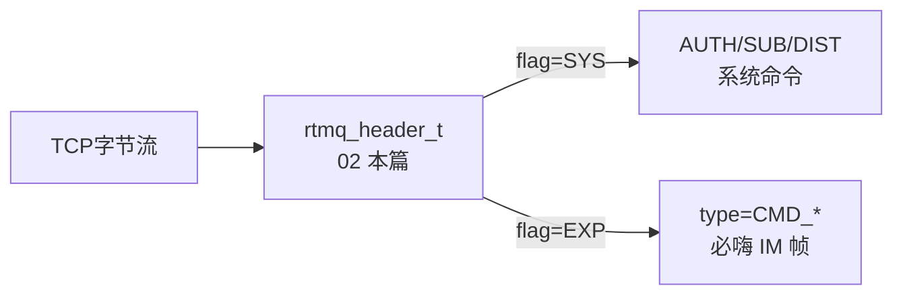

# 02 · 协议层 rtmq_mesg

> **源文件**：`src/clang/incl/rtmq/rtmq_mesg.h`  
> **模块**：协议层 rtmq_mesg  
> **说明**：RTMQ 自有协议：系统命令 vs 业务扩展消息（flag 区分）。必嗨 IM 业务包走 RTMQ_EXP_MESG + type=CMD_*。  
> **阅读建议**：先看文首「函数索引」，再按函数块阅读；`/* ===== 阅读注释 ===== */` 为导读补充。


## 你在这里（总地图定位）

> **层级**：协议层  
> **在 RTMQ 中的位置**：所有 TCP 包的「语法」：报头 + 系统 cmd + 业务 flag  
> **总地图**：[00-总地图.md](00-总地图.md) · 上一篇 `00-总地图` · 下一篇 `03-rtmq_comm`




## 源码（带阅读注释）

```c
// 文件: src/clang/incl/rtmq/rtmq_mesg.h
#if !defined(__RTMQ_MESG_H__)
#define __RTMQ_MESG_H__

#include "comm.h"
#include "mesg.h"

/* 宏定义 */
#define RTMQ_USR_MAX_LEN    (32)        /* 用户名 */
#define RTMQ_PWD_MAX_LEN    (16)        /* 登录密码 */

/* 系统数据类型 */
typedef enum
{
    RTMQ_CMD_UNKNOWN                    = 0x0000  /* 未知命令 */

    , RTMQ_CMD_AUTH_REQ                 = 0x0001  /* 链路鉴权请求 */  // 【系统】Proxy 连 Server 后第一条：鉴权
    , RTMQ_CMD_AUTH_ACK                 = 0x0002  /* 链路鉴权应答 */

    , RTMQ_CMD_KPALIVE_REQ              = 0x0003  /* 链路保活请求 */
    , RTMQ_CMD_KPALIVE_ACK              = 0x0004  /* 链路保活应答 */

    , RTMQ_CMD_SUB_REQ                  = 0x0005  /* 订阅请求: 将消息只发送给一个用户 */  // 【系统】向 Server 声明要收哪些 type（业务 cmd）
    , RTMQ_CMD_SUB_ACK                  = 0x0006  /* 订阅应答 */

    , RTMQ_CMD_ADD_SCK                  = 0x0009  /* 接收客户端数据-请求 */
    , RTMQ_CMD_DIST_REQ                 = 0x000A  /* 分发任务请求 */  // 【系统】dist 线程：distq 有新包
    , RTMQ_CMD_PROC_REQ                 = 0x000B  /* 处理客户端数据-请求 */  // 【系统】通知 worker 从 recvq 取包处理
    , RTMQ_CMD_SEND                     = 0x000C  /* 发送数据-请求 */  // 【系统】通知 rsvr 发送 send 队列
    , RTMQ_CMD_SEND_ALL                 = 0x000D  /* 发送所有数据-请求 */  // 【系统】通知 rsvr 发送 send 队列

    /* 查询命令 */
    , RTMQ_CMD_QUERY_CONF_REQ           = 0x1001  /* 查询配置信息-请求 */
    , RTMQ_CMD_QUERY_CONF_ACK           = 0x1002  /* 查询配置信息-应答 */
    , RTMQ_CMD_QUERY_RECV_STAT_REQ      = 0x1003  /* 查询接收状态-请求 */
    , RTMQ_CMD_QUERY_RECV_STAT_ACK      = 0x1004  /* 查询接收状态-应答 */
    , RTMQ_CMD_QUERY_PROC_STAT_REQ      = 0x1005  /* 查询处理状态-请求 */
    , RTMQ_CMD_QUERY_PROC_STAT_ACK      = 0x1006  /* 查询处理状态-应答 */
} rtmq_mesg_e;

/* 报头结构 */
typedef struct
{
    uint32_t type;                      /* 命令类型 */
    uint32_t nid;                       /* 结点ID(上行消息则为源结点ID, 下行消息则为目的结点ID) */
#define RTMQ_SYS_MESG   (0)             /* 系统类型 */  // 【0】type 为 rtmq_mesg_e 系统命令
#define RTMQ_EXP_MESG   (1)             /* 自定义类型 */  // 【1】业务自定义 type，必嗨 IM 的 CMD_* 走这个
    uint32_t flag;                      /* 消息标志
                                            - 0: 系统消息(type: rtmq_mesg_e)
                                            - 1: 自定义消息(type: 0x0000~0xFFFF) */
    uint32_t length;                    /* 消息体长度 */
#define RTMQ_CHKSUM_VAL  (0x1FE23DC4)
    uint32_t chksum;                    /* 校验值 */
} __attribute__((packed)) rtmq_header_t;  // 【报头】每条 RTMQ 消息前有此头；后跟 length 字节 payload

#define RTMQ_DATA_TOTAL_LEN(head) (head->length + sizeof(rtmq_header_t))  // 【报头】每条 RTMQ 消息前有此头；后跟 length 字节 payload
#define RTMQ_CHKSUM_ISVALID(head) (RTMQ_CHKSUM_VAL == (head)->chksum)

#define RTMQ_HEAD_NTOH(s, d) do {\
    (d)->type = ntohl((s)->type); \
    (d)->nid = ntohl((s)->nid); \
    (d)->flag = ntohl((s)->flag); \
    (d)->length = ntohl((s)->length); \
    (d)->chksum = ntohl((s)->chksum); \
} while(0)

#define RTMQ_HEAD_HTON(s, d) do {\
    (d)->type = htonl((s)->type); \
    (d)->nid = htonl((s)->nid); \
    (d)->flag = htonl((s)->flag); \
    (d)->length = htonl((s)->length); \
    (d)->chksum = htonl((s)->chksum); \
} while(0)

/* 校验数据头 */
#define RTMQ_HEAD_ISVALID(head) (RTMQ_CHKSUM_ISVALID(head))

/* 链路鉴权请求 */
typedef struct
{
    uint32_t gid;                       /* 分组ID */
    char usr[RTMQ_USR_MAX_LEN];         /* 用户名 */
    char passwd[RTMQ_PWD_MAX_LEN];      /* 登录密码 */
} rtmq_link_auth_req_t;

#define RTMQ_AUTH_REQ_HTON(n, h) do {   /* 主机 -> 网络 */\
    (n)->gid = htonl((h)->gid); \
} while(0)

#define RTMQ_AUTH_REQ_NTOH(h, n) do {   /* 网络 -> 主机 */\
    (n)->gid = ntohl((h)->gid); \
} while(0)

/* 链路鉴权应答 */
typedef struct
{
#define RTMQ_LINK_AUTH_FAIL     (0)
#define RTMQ_LINK_AUTH_SUCC     (1)
    int is_succ;                        /* 应答码(0:失败 1:成功) */
} rtmq_link_auth_ack_t;

/* 订阅请求 */
typedef struct
{
    uint32_t type;                      /* 订阅内容: 订阅的消息类型 */
} rtmq_sub_req_t;

#define RTMQ_SUB_REQ_HTON(n, h) do {    /* 主机 -> 网络 */\
    (n)->type = htonl((h)->type); \
} while(0)

#define RTMQ_SUB_REQ_NTOH(h, n) do {    /* 网络 -> 主机 */\
    (h)->type = ntohl((n)->type); \
} while(0)

/* 处理数据请求的相关参数 */
typedef struct
{
    uint32_t ori_svr_id;                /* 接收线程ID */
    uint32_t rqidx;                     /* 接收队列索引 */
    uint32_t num;                       /* 需要处理的数据条数 */
} rtmq_cmd_proc_req_t;

/* 发送数据请求的相关参数 */
typedef struct
{
    /* No member */
} rtmq_cmd_send_req_t;

/* 配置信息 */
typedef struct
{
    int nid;                            /* 结点ID: 不允许重复 */
    char path[FILE_NAME_MAX_LEN];       /* 工作路径 */
    int port;                           /* 侦听端口 */
    int recv_thd_num;                   /* 接收线程数 */
    int work_thd_num;                   /* 工作线程数 */
    int recvq_num;                      /* 接收队列数 */

    int qmax;                           /* 队列长度 */
    int qsize;                          /* 队列大小 */
} rtmq_cmd_conf_t;

/* Recv状态信息 */
typedef struct
{
    uint32_t connections;               /* 总连接数 */
    uint64_t recv_total;                /* 接收数据总数 */
    uint64_t drop_total;                /* 丢弃数据总数 */
    uint64_t err_total;                 /* 异常数据总数 */
} rtmq_cmd_recv_stat_t;

/* Work状态信息 */
typedef struct
{
    uint64_t proc_total;                /* 已处理数据总数 */
    uint64_t drop_total;                /* 放弃处理数据总数 */
    uint64_t err_total;                 /* 处理数据异常总数 */
} rtmq_cmd_proc_stat_t;

/* 各命令所附带的数据 */
typedef union
{
    rtmq_cmd_proc_req_t proc_req;
    rtmq_cmd_send_req_t send_req;
    rtmq_cmd_proc_stat_t proc_stat;
    rtmq_cmd_recv_stat_t recv_stat;
    rtmq_cmd_conf_t conf;
} rtmq_cmd_param_t;

/* 命令数据信息 */
typedef struct
{
    uint32_t type;                      /* 命令类型 Range: rtmq_cmd_e */
    char src_path[FILE_NAME_MAX_LEN];   /* 命令源路径 */
    rtmq_cmd_param_t param;             /* 其他数据信息 */
} rtmq_cmd_t;

#endif /*__RTMQ_MESG_H__*/

```

---

## 本篇流程图

（与文首「你在这里」相同，便于从目录跳转）


**回到总地图**：[00-总地图.md](00-总地图.md#2-十七篇文档在代码里的位置总组件图)
