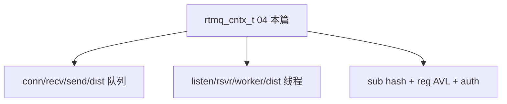

# 04 · 订阅模型 rtmq_sub 与 Server 上下文 rtmq_recv.h

> **源文件**：`src/clang/incl/rtmq/rtmq_sub.h, src/clang/incl/rtmq/rtmq_recv.h`  
> **模块**：订阅模型 rtmq_sub 与 Server 上下文 rtmq_recv.h  
> **说明**：全局 rtmq_cntx_t：队列、线程池、订阅 hash、node→rsvr 映射。对外 API：init/register/publish/async_send。  
> **阅读建议**：先看文首「函数索引」，再按函数块阅读；`/* ===== 阅读注释 ===== */` 为导读补充。


## 你在这里（总地图定位）

> **层级**：Server 数据结构  
> **在 RTMQ 中的位置**：Server 大脑 rtmq_cntx_t：队列、线程池、sub/reg/auth 表  
> **总地图**：[00-总地图.md](00-总地图.md) · 上一篇 `03-rtmq_comm` · 下一篇 `06-rtmq_recv_api`




## 函数索引

| 函数 | 约略位置 |
|------|----------|
| `rtmq_sub_group_find_sid_cb` | 见下方代码块 |
| `rtmq_sub_node_dealloc` | 见下方代码块 |
| `rtmq_sub_list_dealloc` | 见下方代码块 |
| `rtmq_sub_group_dealloc` | 见下方代码块 |

## 源码（带阅读注释）

```c
// 文件: src/clang/incl/rtmq/rtmq_sub.h
#if !defined(__RTMQ_SUB_H__)
#define __RTMQ_SUB_H__

#include "comm.h"
#include "mesg.h"
#include "vector.h"
#include "hash_tab.h"

/* 订阅连接 */
typedef struct
{
    uint64_t sid;               /* 会话ID */
    int nid;                    /* 订阅结点ID */
} rtmq_sub_node_t;

/* 订阅分组信息 */
typedef struct
{
    uint32_t gid;               /* 分组ID */
    vector_t *nodes;             /* 订阅结点列表(按组管理rtmq_sub_node_t) */
} rtmq_sub_group_t;

/* 订阅列表 */
typedef struct
{
    uint32_t type;              /* 订阅类型 */
    avl_tree_t *groups;         /* 订阅结点列表(按组管理rtmq_sub_group_t) */
} rtmq_sub_list_t;

/* 订阅管理 */
typedef struct
{
} rtmq_sub_mgr_t;

/* 查找订阅列表group中是否存在指定连接 */
static bool rtmq_sub_group_find_sid_cb(rtmq_sub_node_t *node, uint64_t *sid)
{
    return (node->sid == *sid)? true : false;
}

/* 释放订阅结点 */
static void rtmq_sub_node_dealloc(rtmq_sub_node_t *node)
{
    free(node);
}

void rtmq_sub_list_dealloc(rtmq_sub_list_t *list);
void rtmq_sub_group_dealloc(rtmq_sub_group_t *group);

#endif /*__RTMQ_SUB_H__*/

```

## 函数索引

| 函数 | 约略位置 |
|------|----------|
| `rtmq_init` | 见下方代码块 |
| `rtmq_register` | 见下方代码块 |
| `rtmq_launch` | 见下方代码块 |
| `rtmq_publish` | 见下方代码块 |
| `rtmq_async_send` | 见下方代码块 |
| `rtmq_conf_isvalid` | 见下方代码块 |
| `rtmq_lsn_init` | 见下方代码块 |
| `rtmq_lsn_routine` | 见下方代码块 |
| `rtmq_dsvr_routine` | 见下方代码块 |
| `rtmq_rsvr_routine` | 见下方代码块 |
| `rtmq_rsvr_init` | 见下方代码块 |
| `rtmq_worker_routine` | 见下方代码块 |
| `rtmq_worker_init` | 见下方代码块 |
| `rtmq_rsvr_del_all_conn_hdl` | 见下方代码块 |
| `rtmq_link_auth_check` | 见下方代码块 |
| `rtmq_node_to_svr_map_init` | 见下方代码块 |
| `rtmq_node_to_svr_map_add` | 见下方代码块 |
| `rtmq_node_to_svr_map_rand` | 见下方代码块 |
| `rtmq_node_to_svr_map_del` | 见下方代码块 |
| `rtmq_sub_init` | 见下方代码块 |
| `rtmq_sub_add` | 见下方代码块 |
| `rtmq_sub_del` | 见下方代码块 |
| `rtmq_auth_add` | 见下方代码块 |
| `rtmq_auth_check` | 见下方代码块 |

## 源码（带阅读注释）

```c
// 文件: src/clang/incl/rtmq/rtmq_recv.h
#if !defined(__RTMQ_RECV_H__)
#define __RTMQ_RECV_H__

#include "log.h"
#include "sck.h"
#include "list.h"
#include "comm.h"
#include "iovec.h"
#include "list2.h"
#include "queue.h"
#include "vector.h"
#include "shm_opt.h"
#include "spinlock.h"
#include "avl_tree.h"
#include "rtmq_sub.h"
#include "rtmq_comm.h"
#include "shm_queue.h"
#include "thread_pool.h"

/* 宏定义 */
#define RTMQ_CTX_POOL_SIZE          (5 * MB)/* 全局内存池空间 */
#define RTMQ_CONNQ_LEN              (8192)  /* 连接队列长度 */

/* 鉴权信息 */
typedef struct
{
    char usr[RTMQ_USR_MAX_LEN];         /* 用户名 */
    char passwd[RTMQ_PWD_MAX_LEN];      /* 登录密码 */
} rtmq_auth_t;

/* 配置信息 */
typedef struct
{
    int nid;                            /* 节点ID(唯一值: 不允许重复) */

    list_t *auth;                       /* 鉴权列表 */

    int port;                           /* 侦听端口 */
    int recv_thd_num;                   /* 接收线程数 */
    int work_thd_num;                   /* 工作线程数 */
    int recvq_num;                      /* 接收队列数 */
    int distq_num;                      /* 分发队列数 */

    queue_conf_t recvq;                 /* 接收队列配置 */
    queue_conf_t sendq;                 /* 发送队列配置 */
    queue_conf_t distq;                 /* 分发队列配置 */
} rtmq_conf_t;

/* 侦听对象 */
typedef struct
{
    pthread_t tid;                      /* 侦听线程ID */
    log_cycle_t *log;                   /* 日志对象 */
    int lsn_sck_id;                     /* 侦听套接字 */

    uint64_t sid;                       /* 会话ID(递增) */
} rtmq_listen_t;

/* 套接字信息 */
typedef struct _rtrd_sck_t
{
    int fd;                             /* 套接字ID */
    uint32_t nid;                       /* 结点ID */
    uint32_t gid;                       /* 分组ID */
    uint64_t sid;                       /* 会话ID */

    time_t ctm;                         /* 创建时间 */
    time_t rdtm;                        /* 最近读取时间 */
    time_t wrtm;                        /* 最近写入时间 */
    char ipaddr[IP_ADDR_MAX_LEN];       /* IP地址 */

    int auth_succ;                      /* 鉴权成功(1:成功 0:失败)  */
    avl_tree_t *sub_list;               /* 订阅列表: 存储订阅了哪些消息(rtmq_sub_req_t) */

    rtmq_snap_t recv;                   /* 接收快照 */
    wiov_t send;                        /* 发送缓存 */

    list2_t *mesg_list;                 /* 发送消息链表 */

    uint64_t recv_total;                /* 接收的数据条数 */
} rtmq_sck_t;

/* DEV->SVR的映射表 */
typedef struct
{
    int nid;                            /* 结点ID */

    int num;                            /* 当前实际长度 */
#define RTRD_NODE_TO_SVR_MAX_LEN    (32)
    int rsvr_id[RTRD_NODE_TO_SVR_MAX_LEN]; /* 结点ID对应的接收服务ID */
} rtmq_node_to_svr_map_t;

/* 接收对象 */
typedef struct
{
    int id;                             /* 对象ID */
    log_cycle_t *log;                   /* 日志对象 */
    void *ctx;                          /* 全局对象(rtmq_cntx_t) */

    int cmd_fd;                         /* 命令套接字 */

    int max;                            /* 最大套接字 */
    time_t ctm;                         /* 当前时间 */
    fd_set rdset;                       /* 可读集合 */
    fd_set wrset;                       /* 可写集合 */
    list2_t *conn_list;                 /* 套接字链表 */

    /* 统计信息 */
    uint32_t connections;               /* TCP连接数 */
    uint64_t recv_total;                /* 获取的数据总条数 */
    uint64_t err_total;                 /* 错误的数据条数 */
    uint64_t drop_total;                /* 丢弃的数据条数 */
} rtmq_rsvr_t;

/* 接收数据项 */
typedef struct
{
    void *base;                         /* 内存块首地址: 用于内存引用计数 */
    void *data;                         /* 数据地址: 真实数据地址 */
} rtmq_recv_item_t;

/* 新增连接项 */
typedef struct
{
    int fd;                             /* 文件描述符 */
    struct timeb ctm;                   /* 创建时间(s) */
    uint64_t sid;                       /* 会话序列号 */
    char ipaddr[IP_ADDR_MAX_LEN];       /* 客户端IP地址 */
} rtmq_conn_item_t;

/* 全局对象 */
typedef struct
{
    rtmq_conf_t conf;                   /* 配置信息 */
    log_cycle_t *log;                   /* 日志对象 */

    avl_tree_t *reg;                    /* 回调注册对象(注: 存储rtmq_reg_t数据) */
    avl_tree_t *auth;                   /* 鉴权信息(注: 存储rtmq_auth_t数据) */

    rtmq_listen_t listen;               /* 侦听对象 */

    pipe_t *recv_cmd_fd;                /* 接收线程通信FD */
    thread_pool_t *recvtp;              /* 接收线程池 */

    pipe_t *work_cmd_fd;                /* 工作线程通信FD */
    thread_pool_t *worktp;              /* 工作线程池 */

    queue_t **connq;                    /* 连接队列(注:其长度与recvtp一致) */
    queue_t **recvq;                    /* 接收队列(内部队列) */
    ring_t **sendq;                     /* 发送队列(内部队列) */

    pipe_t *dist_cmd_fd;                /* 分发线程通信FD(分发线程只有1个) */
    ring_t **distq;                     /* 分发队列(外部队列)
                                           注: 外部接口首先将要发送的数据放入
                                           此队列, 再从此队列分发到不同的线程队列 */

    pthread_rwlock_t node_to_svr_map_lock;  /* 读写锁: NODE->SVR映射表 */
    avl_tree_t *node_to_svr_map;        /* NODE->SVR的映射表(以nid为主键 rtmq_node_to_svr_map_t) */

    hash_tab_t *sub;                   /* 订阅表(注:以type为主键, 存储rtmq_sub_list_t类型) */
} rtmq_cntx_t;

/* 外部接口 */
rtmq_cntx_t *rtmq_init(const rtmq_conf_t *conf, log_cycle_t *log);
/* ===== 阅读注释：rtmq_register =====
 * 【业务订阅 cmd】在 Server 侧 reg AVL 插入 (type, callback)。Go/C 业务进程连上并 SUB 后，publish(type) 会调到这些回调。
 */
int rtmq_register(rtmq_cntx_t *ctx, int type, rtmq_reg_cb_t proc, void *args);
/* ===== 阅读注释：rtmq_launch =====
 * 【真正跑起来】recvtp 跑 rtmq_rsvr_routine，worktp 跑 rtmq_worker_routine，另起 listen 线程 + 单个 dist 线程。
 */
int rtmq_launch(rtmq_cntx_t *ctx);
/* ===== 阅读注释：rtmq_publish =====
 * 【按 type 广播】查 sub hash → 遍历各 gid 组 → 对每个订阅连接复制发送。frwder 上行 publish 走这条。
 */

int rtmq_publish(rtmq_cntx_t *ctx, int type, void *data, size_t len);
/* ===== 阅读注释：rtmq_async_send =====
 * 【按 nid 单播】包头 nid=dest，入 distq，唤醒 dist 线程。frwder 下行 async_send(forward,nid) 走这条。
 */
int rtmq_async_send(rtmq_cntx_t *ctx, int type, int dest, void *data, size_t len);

/* 内部接口 */
bool rtmq_conf_isvalid(const rtmq_conf_t *conf);

int rtmq_lsn_init(rtmq_cntx_t *ctx);
void *rtmq_lsn_routine(void *_ctx);

void *rtmq_dsvr_routine(void *_ctx);

void *rtmq_rsvr_routine(void *_ctx);
int rtmq_rsvr_init(rtmq_cntx_t *ctx, rtmq_rsvr_t *rsvr, int tidx);

void *rtmq_worker_routine(void *_ctx);
int rtmq_worker_init(rtmq_cntx_t *ctx, rtmq_worker_t *worker, int tidx);

void rtmq_rsvr_del_all_conn_hdl(rtmq_cntx_t *ctx, rtmq_rsvr_t *rsvr);

int rtmq_link_auth_check(rtmq_cntx_t *ctx, rtmq_link_auth_req_t *link_auth_req);

shm_queue_t *rtmq_shm_distq_creat(const rtmq_conf_t *conf, int idx);
shm_queue_t *rtmq_shm_distq_attach(const rtmq_conf_t *conf, int idx);

int rtmq_node_to_svr_map_init(rtmq_cntx_t *ctx);
/* ===== 阅读注释：rtmq_node_to_svr_map_add =====
 * 【负载】记录 nid 落在哪个 rsvr 线程，async_send 路由用。
 */
int rtmq_node_to_svr_map_add(rtmq_cntx_t *ctx, int nid, int rsvr_idx);
int rtmq_node_to_svr_map_rand(rtmq_cntx_t *ctx, int nid);
int rtmq_node_to_svr_map_del(rtmq_cntx_t *ctx, int nid, int rsvr_idx);

int rtmq_sub_init(rtmq_cntx_t *ctx);
/* ===== 阅读注释：rtmq_sub_add =====
 * 【客户端 SUB】在全局 sub hash 和 socket 的 sub_list 双向登记 type。
 */
int rtmq_sub_add(rtmq_cntx_t *ctx, rtmq_sck_t *sck, int type);
int rtmq_sub_del(rtmq_cntx_t *ctx, rtmq_sck_t *sck, int type);

int rtmq_auth_add(rtmq_cntx_t *ctx, char *usr, char *passwd);
bool rtmq_auth_check(rtmq_cntx_t *ctx, char *usr, char *passwd);

#endif /*__RTMQ_RECV_H__*/

```

---

## 本篇流程图

（与文首「你在这里」相同，便于从目录跳转）


**回到总地图**：[00-总地图.md](00-总地图.md#2-十七篇文档在代码里的位置总组件图)
