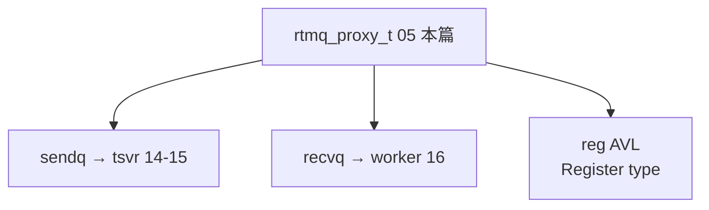

# 05 · Proxy 头文件 rtmq_proxy

> **源文件**：`src/clang/incl/rtmq/rtmq_proxy_tsvr.h, src/clang/incl/rtmq/rtmq_proxy.h`  
> **模块**：Proxy 头文件 rtmq_proxy  
> **说明**：客户端侧 rtmq_proxy_t：send/work 线程池、reg AVL、sendq/recvq。frwder/Go 进程连 Server 时用 Proxy。  
> **阅读建议**：先看文首「函数索引」，再按函数块阅读；`/* ===== 阅读注释 ===== */` 为导读补充。


## 你在这里（总地图定位）

> **层级**：Proxy 数据结构  
> **在 RTMQ 中的位置**：每个业务进程内的 rtmq_proxy_t：sendq/recvq/reg/sendtp/worktp  
> **总地图**：[00-总地图.md](00-总地图.md) · 上一篇 `04-rtmq_sub_and_recv_h` · 下一篇 `13-rtmq_proxy`




## 源码（带阅读注释）

```c
// 文件: src/clang/incl/rtmq/rtmq_proxy_tsvr.h
#if !defined(__RTMQ_PROXY_TSVR_H__)
#define __RTMQ_PROXY_TSVR_H__

#include "log.h"
#include "slab.h"
#include "list.h"
#include "avl_tree.h"
#include "rtmq_comm.h"
#include "thread_pool.h"

typedef struct _rtmq_proxy_sck_t rtmq_proxy_sck_t;
typedef int (*rtmq_proxy_socket_recv_cb_t)(void *ctx, void *obj, rtmq_proxy_sck_t *sck);
typedef int (*rtmq_proxy_socket_send_cb_t)(void *ctx, void *obj, rtmq_proxy_sck_t *sck);

/* 套接字信息 */
struct _rtmq_proxy_sck_t
{
    int fd;                             /* 套接字ID */
    time_t wrtm;                        /* 最近写入操作时间 */
    time_t rdtm;                        /* 最近读取操作时间 */

#define RTMQ_KPALIVE_STAT_UNKNOWN   (0) /* 未知状态 */
#define RTMQ_KPALIVE_STAT_SENT      (1) /* 已发送保活 */
#define RTMQ_KPALIVE_STAT_SUCC      (2) /* 保活成功 */
    int kpalive;                        /* 保活状态
                                            0: 未知状态
                                            1: 已发送保活
                                            2: 保活成功 */
    list_t *mesg_list;                  /* 发送链表 */

    rtmq_snap_t recv;                   /* 接收快照 */
    wiov_t send;                        /* 发送信息 */

    rtmq_proxy_socket_recv_cb_t recv_cb;/* 接收回调 */
    rtmq_proxy_socket_send_cb_t send_cb;/* 发送回调 */
};

#define rtmq_set_kpalive_stat(sck, _stat) (sck)->kpalive = (_stat)

/* SND线程上下文 */
typedef struct
{
    int id;                             /* 对象ID */
    void *ctx;                          /* 存储rtmq_proxy_t对象 */
    ring_t *sendq;                     /* 发送缓存 */
    log_cycle_t *log;                   /* 日志对象 */
    char ipaddr[IP_ADDR_MAX_LEN];       /* IP地址 */
    int port;                           /* 服务端端口 */

    int epid;                           /* Epoll描述符 */
    struct epoll_event *events;         /* Event最大数 */

    int fd[2];                          /* 通信FD */
    int cmd_fd;                         /* 命令通信FD */
    rtmq_proxy_sck_t sck;               /* 数据传输套接字 */
    rtmq_proxy_sck_t cmd_sck;           /* 命令通信套接字 */

    int max;                            /* 套接字最大值 */
    fd_set rset;                        /* 读集合 */
    fd_set wset;                        /* 写集合 */

    /* 统计信息 */
    uint64_t recv_total;                /* 获取的数据总条数 */
    uint64_t err_total;                 /* 错误的数据条数 */
    uint64_t drop_total;                /* 丢弃的数据条数 */
} rtmq_proxy_tsvr_t;

#endif /*__RTMQ_PROXY_TSVR_H__*/

```

## 函数索引

| 函数 | 约略位置 |
|------|----------|
| `rtmq_proxy_tsvr_init` | 见下方代码块 |
| `rtmq_proxy_tsvr_routine` | 见下方代码块 |
| `rtmq_proxy_worker_init` | 见下方代码块 |
| `rtmq_proxy_worker_routine` | 见下方代码块 |
| `rtmq_proxy_worker_get_by_idx` | 见下方代码块 |
| `rtmq_proxy_init` | 见下方代码块 |
| `rtmq_proxy_launch` | 见下方代码块 |
| `rtmq_proxy_reg_add` | 见下方代码块 |
| `rtmq_proxy_async_send` | 见下方代码块 |

## 源码（带阅读注释）

```c
// 文件: src/clang/incl/rtmq/rtmq_proxy.h
#if !defined(__RTMQ_PROXY_H__)
#define __RTMQ_PROXY_H__

#include "pipe.h"
#include "rtmq_comm.h"
#include "rtmq_proxy_tsvr.h"

#define RTMQ_IPADD_MAX_NUM  (30)
#define RTMQ_PROXY_EVENT_MAX_NUM (1024)

/* 配置信息 */
typedef struct
{
    int nid;                            /* 结点ID: 唯一值 */
    int gid;                            /* 分组ID */

    struct {
        char usr[RTMQ_USR_MAX_LEN];     /* 用户名 */
        char passwd[RTMQ_PWD_MAX_LEN];  /* 登录密码 */
    } auth;                             /* 鉴权信息 */

    /* 服务端地址(格式:${IP1}:${PORT1},${IP2}:${PORT2},${IP...x}:${PORT...x}) */
    char ipaddr[RTMQ_IPADD_MAX_NUM*IP_ADDR_MAX_LEN];

    int send_thd_num;                   /* 发送线程数 */
    int work_thd_num;                   /* 工作线程数 */

    size_t recv_buff_size;              /* 接收缓存大小 */

    rtmq_cpu_conf_t cpu;                /* CPU亲和性配置 */

    queue_conf_t sendq;                 /* 发送队列配置 */
    queue_conf_t recvq;                 /* 接收队列配置 */
} rtmq_proxy_conf_t;

/* 全局信息 */
typedef struct
{
    rtmq_proxy_conf_t conf;             /* 配置信息 */
    log_cycle_t *log;                   /* 日志对象 */
    list_t *iplist;                     /* 服务端IP列表(注: 存储iplist_item_t对象) */

    thread_pool_t *sendtp;              /* 发送线程池 */

    thread_pool_t *worktp;              /* 工作线程池 */

    avl_tree_t *reg;                    /* 回调注册对象(注: 存储rtmq_reg_t数据) */

    pipe_t *work_cmd_fd;                /* 工作线程通信FD */
    ring_t **recvq;                     /* 接收队列(数组长度与conf->send_thd_num一致) */

    pipe_t *send_cmd_fd;                /* 发送线程通信FD */
    ring_t **sendq;                     /* 发送缓存(数组长度与conf->send_thd_num一致) */
} rtmq_proxy_t;

/* 内部接口 */
/* ===== 阅读注释：rtmq_proxy_tsvr_init =====
 * 【tsvr 初始化】创建 epoll、连接 Server 的 cmd_sck + data_sck。
 */
int rtmq_proxy_tsvr_init(rtmq_proxy_t *pxy,
        rtmq_proxy_tsvr_t *tsvr, int tidx,
        const char *ipaddr, int port, ring_t *sendq, pipe_t *pipe);
void *rtmq_proxy_tsvr_routine(void *_ctx);

int rtmq_proxy_worker_init(rtmq_proxy_t *pxy, rtmq_worker_t *worker, int tidx);
void *rtmq_proxy_worker_routine(void *_ctx);

rtmq_worker_t *rtmq_proxy_worker_get_by_idx(rtmq_proxy_t *pxy, int idx);

/* 对外接口 */
rtmq_proxy_t *rtmq_proxy_init(const rtmq_proxy_conf_t *conf, log_cycle_t *log);
int rtmq_proxy_launch(rtmq_proxy_t *pxy);
/* ===== 阅读注释：rtmq_proxy_reg_add =====
 * 【Proxy 注册】与 Server rtmq_register 对称；本地 AVL，worker 收包时查。
 */
int rtmq_proxy_reg_add(rtmq_proxy_t *pxy, int type, rtmq_reg_cb_t proc, void *args);
/* ===== 阅读注释：rtmq_proxy_async_send =====
 * 【业务进程发送】组 RTMQ 头+体，ring_push sendq，pipe 唤醒 tsvr 线程 writev 到 Server。
 */
int rtmq_proxy_async_send(rtmq_proxy_t *pxy, int type, const void *data, size_t size);

#endif /*__RTMQ_PROXY_H__*/

```

---

## 本篇流程图

（与文首「你在这里」相同，便于从目录跳转）


**回到总地图**：[00-总地图.md](00-总地图.md#2-十七篇文档在代码里的位置总组件图)
