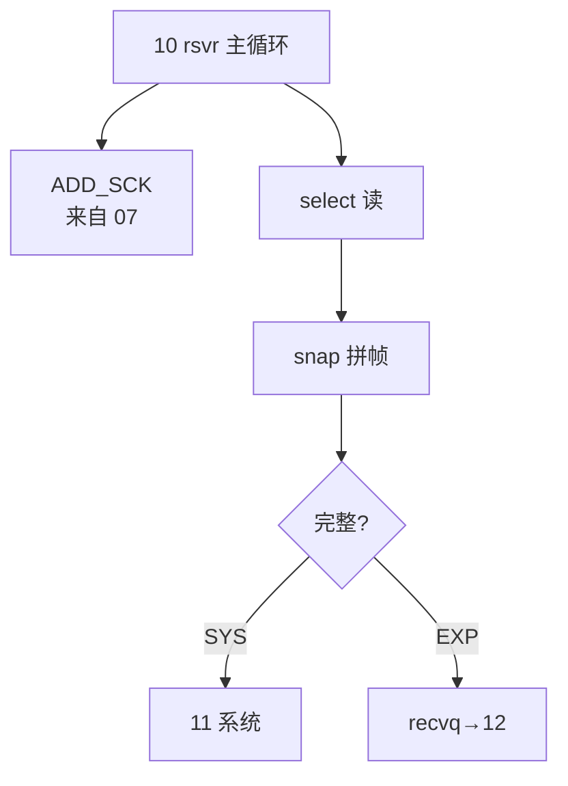

# 10 · Server 接收线程 rtmq_rsvr（上）

> **源文件**：`src/clang/lib/rtmq/server/rtmq_rsvr.c`  
> **模块**：Server 接收线程 rtmq_rsvr（上）  
> **说明**：rsvr 主循环：select 收发包、系统/扩展消息分发、连接管理。  
> **阅读建议**：先看文首「函数索引」，再按函数块阅读；`/* ===== 阅读注释 ===== */` 为导读补充。


## 你在这里（总地图定位）

> **层级**：Server · 收发  
> **在 RTMQ 中的位置**：rsvr 主循环上半：ADD_SCK、select、收包拼帧、入 recvq  
> **总地图**：[00-总地图.md](00-总地图.md) · 上一篇 `07-rtmq_lsn` · 下一篇 `11-rtmq_rsvr_part2`




## 函数索引

| 函数 | 约略位置 |
|------|----------|
| `rtmq_rsvr_get_curr` | 见下方代码块 |
| `rtmq_rsvr_event_core_hdl` | 见下方代码块 |
| `rtmq_rsvr_event_timeout_hdl` | 见下方代码块 |
| `rtmq_rsvr_trav_recv` | 见下方代码块 |
| `rtmq_rsvr_trav_send` | 见下方代码块 |
| `rtmq_rsvr_recv_proc` | 见下方代码块 |
| `rtmq_rsvr_data_proc` | 见下方代码块 |
| `rtmq_rsvr_sys_mesg_proc` | 见下方代码块 |
| `rtmq_rsvr_exp_mesg_proc` | 见下方代码块 |
| `rtmq_rsvr_keepalive_req_hdl` | 见下方代码块 |
| `rtmq_rsvr_link_auth_req_hdl` | 见下方代码块 |
| `rtmq_rsvr_sub_req_hdl` | 见下方代码块 |
| `rtmq_rsvr_cmd_proc_req` | 见下方代码块 |
| `rtmq_rsvr_cmd_proc_all_req` | 见下方代码块 |
| `rtmq_rsvr_sck_creat` | 见下方代码块 |
| `rtmq_rsvr_sck_free` | 见下方代码块 |
| `rtmq_rsvr_add_conn_hdl` | 见下方代码块 |
| `rtmq_rsvr_del_conn_hdl` | 见下方代码块 |
| `rtmq_rsvr_fill_send_buff` | 见下方代码块 |
| `rtmq_rsvr_dist_data` | 见下方代码块 |
| `rtmq_rsvr_alloc_recv_buff` | 见下方代码块 |
| `rtmq_rsvr_switch_recv_buff` | 见下方代码块 |
| `rtmq_rsvr_set_rdset` | 见下方代码块 |
| `rtmq_rsvr_set_wrset` | 见下方代码块 |
| `rtmq_rsvr_routine` | 见下方代码块 |
| `rtmq_rsvr_get_curr` | 见下方代码块 |
| `rtmq_rsvr_init` | 见下方代码块 |
| `rtmq_rsvr_recv_cmd` | 见下方代码块 |
| `rtmq_rsvr_trav_recv` | 见下方代码块 |
| `rtmq_rsvr_wiov_add` | 见下方代码块 |
| `rtmq_rsvr_trav_send` | 见下方代码块 |

## 源码（带阅读注释）

```c
// 文件: src/clang/lib/rtmq/server/rtmq_rsvr.c
// 片段: 行 [(1, 520)]
/******************************************************************************
 ** Copyright(C) 2014-2024 Qiware technology Co., Ltd
 **
 ** 文件名: rtmq_rsvr.c
 ** 版本号: 1.0
 ** 描  述: 实时消息队列(REAL-TIME MESSAGE QUEUE)
 **         1. 主要用于异步系统之间数据消息的传输
 ** 作  者: # Qifeng.zou # 2014.12.29 #
 ******************************************************************************/

#include "redo.h"
#include "mref.h"
#include "queue.h"
#include "rtmq_mesg.h"
#include "rtmq_comm.h"
#include "rtmq_recv.h"
#include "thread_pool.h"

/* 静态函数 */
static rtmq_rsvr_t *rtmq_rsvr_get_curr(rtmq_cntx_t *ctx);
static int rtmq_rsvr_event_core_hdl(rtmq_cntx_t *ctx, rtmq_rsvr_t *rsvr);
static int rtmq_rsvr_event_timeout_hdl(rtmq_cntx_t *ctx, rtmq_rsvr_t *rsvr);

static int rtmq_rsvr_trav_recv(rtmq_cntx_t *ctx, rtmq_rsvr_t *rsvr);
static int rtmq_rsvr_trav_send(rtmq_cntx_t *ctx, rtmq_rsvr_t *rsvr);

static int rtmq_rsvr_recv_proc(rtmq_cntx_t *ctx, rtmq_rsvr_t *rsvr, rtmq_sck_t *sck);
static int rtmq_rsvr_data_proc(rtmq_cntx_t *ctx, rtmq_rsvr_t *rsvr, rtmq_sck_t *sck);

static int rtmq_rsvr_sys_mesg_proc(rtmq_cntx_t *ctx, rtmq_rsvr_t *rsvr, rtmq_sck_t *sck, void *addr);
/* ===== 阅读注释：rtmq_rsvr_exp_mesg_proc =====
 * 【业务包】完整 IM 帧交给 recvq，pipe 通知 worker 处理。
 */
static int rtmq_rsvr_exp_mesg_proc(rtmq_cntx_t *ctx, rtmq_rsvr_t *rsvr, rtmq_sck_t *sck, void *base, void *addr);
/* ===== 阅读注释：rtmq_rsvr_keepalive_req_hdl =====
 * 【心跳】30s 级保活，断线检测。
 */

static int rtmq_rsvr_keepalive_req_hdl(rtmq_cntx_t *ctx, rtmq_rsvr_t *rsvr, rtmq_sck_t *sck, void *addr);
/* ===== 阅读注释：rtmq_rsvr_link_auth_req_hdl =====
 * 【AUTH 服务端】校验 usr/passwd/gid，成功则记录 sck->nid/gid，允许后续 SUB。
 */
static int rtmq_rsvr_link_auth_req_hdl(rtmq_cntx_t *ctx, rtmq_rsvr_t *rsvr, rtmq_sck_t *sck, void *addr);
/* ===== 阅读注释：rtmq_rsvr_sub_req_hdl =====
 * 【SUB 服务端】把 (type,sck) 登记到全局 sub hash + sck->sub_list。
 */
static int rtmq_rsvr_sub_req_hdl(rtmq_cntx_t *ctx, rtmq_rsvr_t *rsvr, rtmq_sck_t *sck, void *addr);

static int rtmq_rsvr_cmd_proc_req(rtmq_cntx_t *ctx, rtmq_rsvr_t *rsvr, int rqid);
static int rtmq_rsvr_cmd_proc_all_req(rtmq_cntx_t *ctx, rtmq_rsvr_t *rsvr);

static rtmq_sck_t *rtmq_rsvr_sck_creat(rtmq_rsvr_t *rsvr, rtmq_conn_item_t *item);
static void rtmq_rsvr_sck_free(rtmq_rsvr_t *rsvr, rtmq_sck_t *sck);

static int rtmq_rsvr_add_conn_hdl(rtmq_cntx_t *ctx, rtmq_rsvr_t *rsvr);
static int rtmq_rsvr_del_conn_hdl(rtmq_cntx_t *ctx, rtmq_rsvr_t *rsvr, list2_node_t *node);

static int rtmq_rsvr_fill_send_buff(rtmq_rsvr_t *rsvr, rtmq_sck_t *sck);

static int rtmq_rsvr_dist_data(rtmq_cntx_t *ctx, rtmq_rsvr_t *rsvr);

static int rtmq_rsvr_alloc_recv_buff(rtmq_sck_t *sck);
static int rtmq_rsvr_switch_recv_buff(rtmq_sck_t *sck);

/* 随机选择接收线程 */
#define rtmq_rand_recv(ctx) ((ctx)->listen.total++ % (ctx->recvtp->num))

/* 随机选择工作线程 */
#define rtmq_rand_work(ctx) (rand() % (ctx->worktp->num))

/******************************************************************************
 **函数名称: rtmq_rsvr_set_rdset
 **功    能: 设置可读集合
 **输入参数:
 **     rsvr: 接收服务
 **输出参数: NONE
 **返    回: 0:成功 !0:失败
 **实现描述:
 **注意事项: 如果超时未接收或发送数据，则关闭连接!
 **作    者: # Qifeng.zou # 2015.01.01 #
 ******************************************************************************/
static void rtmq_rsvr_set_rdset(rtmq_cntx_t *ctx, rtmq_rsvr_t *rsvr)
{
    rtmq_sck_t *curr;
    list2_node_t *node, *next, *tail;

    FD_ZERO(&rsvr->rdset);

    FD_SET(rsvr->cmd_fd, &rsvr->rdset);
    rsvr->max = rsvr->cmd_fd;

    node = rsvr->conn_list->head;
    if (NULL != node) {
        tail = node->prev;
    }
    while (NULL != node) {
        curr = (rtmq_sck_t *)node->data;
        if ((rsvr->ctm - curr->rdtm > 30)
            && (rsvr->ctm - curr->wrtm > 30))
        {
            log_error(rsvr->log, "Didn't active for along time! fd:%d ip:%s",
                    curr->fd, curr->ipaddr);

            if (node == tail) {
                rtmq_rsvr_del_conn_hdl(ctx, rsvr, node);
                break;
            }
            next = node->next;
            rtmq_rsvr_del_conn_hdl(ctx, rsvr, node);
            node = next;
            continue;
        }

        FD_SET(curr->fd, &rsvr->rdset);
        rsvr->max = MAX(rsvr->max, curr->fd);

        if (node == tail) {
            break;
        }
        node = node->next;
    }
}

/******************************************************************************
 **函数名称: rtmq_rsvr_set_wrset
 **功    能: 设置可写集合
 **输入参数:
 **     rsvr: 接收服务
 **输出参数: NONE
 **返    回: 0:成功 !0:失败
 **实现描述: 只有发送链表中存在数据时，才将该套接字加入到可写侦听集合!
 **注意事项:
 **作    者: # Qifeng.zou # 2015.01.01 #
 ******************************************************************************/
static void rtmq_rsvr_set_wrset(rtmq_cntx_t *ctx, rtmq_rsvr_t *rsvr)
{
    rtmq_sck_t *curr;
    list2_node_t *node, *tail;

    FD_ZERO(&rsvr->wrset);

    node = rsvr->conn_list->head;
    if (NULL != node) {
        tail = node->prev;
    }

    while (NULL != node) {
        curr = (rtmq_sck_t *)node->data;

        if (list_empty(curr->mesg_list)
            && wiov_isempty(&curr->send))
        {
            if (node == tail) {
                break;
            }
            node = node->next;
            continue;
        }

        FD_SET(curr->fd, &rsvr->wrset);

        if (node == tail) {
            break;
        }
        node = node->next;
    }
}

/******************************************************************************
 **函数名称: rtmq_rsvr_routine
 **功    能: 运行接收服务线程
 **输入参数:
 **     _ctx: 全局对象
 **输出参数: NONE
 **返    回: 0:成功 !0:失败
 **实现描述:
 **     1. 获取接收服务
 **     2. 等待事件通知
 **     3. 进行事件处理
 **注意事项:
 **作    者: # Qifeng.zou # 2015.01.01 #
 ******************************************************************************/
void *rtmq_rsvr_routine(void *_ctx)
{
    int ret;
    rtmq_rsvr_t *rsvr;
    struct timeval timeout;
    rtmq_cntx_t *ctx = (rtmq_cntx_t *)_ctx;

    nice(-20);

    /* 1. 获取接收服务 */
    rsvr = rtmq_rsvr_get_curr(ctx);
    if (NULL == rsvr) {
        log_fatal(rsvr->log, "Get recv server failed!");
        abort();
        return (void *)RTMQ_ERR;
    }

    for (;;) {
        /* 2. 等待事件通知 */
        rtmq_rsvr_set_rdset(ctx, rsvr);
        rtmq_rsvr_set_wrset(ctx, rsvr);

        timeout.tv_sec = 1;
        timeout.tv_usec = 0;
        ret = select(rsvr->max+1, &rsvr->rdset, &rsvr->wrset, NULL, &timeout);
        if (ret < 0) {
            if (EINTR == errno) { continue; }
            log_fatal(rsvr->log, "errmsg:[%d] %s", errno, strerror(errno));
            abort();
            return (void *)RTMQ_ERR;
        } else if (0 == ret) {
            rtmq_rsvr_event_timeout_hdl(ctx, rsvr);
            continue;
        }

        /* 3. 进行事件处理 */
        rtmq_rsvr_event_core_hdl(ctx, rsvr);
    }

    log_fatal(rsvr->log, "errmsg:[%d] %s", errno, strerror(errno));
    abort();
    return (void *)-1;
}

/******************************************************************************
 **函数名称: rtmq_rsvr_get_curr
 **功    能: 获取当前线程对应的接收服务
 **输入参数:
 **     ctx: 全局对象
 **输出参数: NONE
 **返    回: 当前接收服务
 **实现描述:
 **     1. 获取当前线程的索引
 **     2. 返回当前线程对应的接收服务
 **注意事项:
 **作    者: # Qifeng.zou # 2015.01.01 #
 ******************************************************************************/
static rtmq_rsvr_t *rtmq_rsvr_get_curr(rtmq_cntx_t *ctx)
{
    int id;

    /* 1. 获取当前线程的索引 */
    id = thread_pool_get_tidx(ctx->recvtp);
    if (id < 0) {
        log_error(ctx->log, "Get index of current thread failed!");
        return NULL;
    }

    /* 2. 返回当前线程对应的接收服务 */
    return (rtmq_rsvr_t *)(ctx->recvtp->data + id * sizeof(rtmq_rsvr_t));
}

/******************************************************************************
 **函数名称: rtmq_rsvr_init
 **功    能: 初始化接收服务
 **输入参数:
 **     ctx: 全局对象
 **     id: 接收服务编号
 **输出参数:
 **     rsvr: 接收服务
 **返    回: 0:成功 !0:失败
 **实现描述:
 **     1. 获取当前线程的索引
 **     2. 返回当前线程对应的接收服务
 **注意事项:
 **作    者: # Qifeng.zou # 2015.01.01 #
 ******************************************************************************/
int rtmq_rsvr_init(rtmq_cntx_t *ctx, rtmq_rsvr_t *rsvr, int id)
{
    rsvr->id = id;
    rsvr->log = ctx->log;
    rsvr->ctm = time(NULL);
    rsvr->ctx = (void *)ctx;

    rsvr->cmd_fd = ctx->recv_cmd_fd[id].fd[0];

    /* > 创建套接字链表 */
    rsvr->conn_list = list2_creat(NULL);
    if (NULL == rsvr->conn_list) {
        log_error(rsvr->log, "Create list2 failed!");
        CLOSE(rsvr->cmd_fd);
        return RTMQ_ERR;
    }

    return RTMQ_OK;
}

/******************************************************************************
 **函数名称: rtmq_rsvr_recv_cmd
 **功    能: 接收命令数据
 **输入参数:
 **     ctx: 全局对象
 **     rsvr: 接收服务
 **输出参数:
 **返    回: 0:成功 !0:失败
 **实现描述:
 **     1. 接收命令数据
 **     2. 进行命令处理
 **注意事项:
 **作    者: # Qifeng.zou # 2015.01.01 #
 ******************************************************************************/
static int rtmq_rsvr_recv_cmd(rtmq_cntx_t *ctx, rtmq_rsvr_t *rsvr)
{
    rtmq_cmd_t cmd;

    memset(&cmd, 0, sizeof(cmd));

    /* 1. 接收命令数据 */
    if (read(rsvr->cmd_fd, (void *)&cmd, sizeof(cmd)) < 0) {
        log_error(rsvr->log, "Recv command failed!");
        return RTMQ_ERR_RECV_CMD;
    }

    /* 2. 进行命令处理 */
    switch (cmd.type) {
        case RTMQ_CMD_ADD_SCK:      /* 添加套接字 */
            return rtmq_rsvr_add_conn_hdl(ctx, rsvr);
        case RTMQ_CMD_DIST_REQ:     /* 分发发送数据 */
            return rtmq_rsvr_dist_data(ctx, rsvr);
        default:
            log_error(rsvr->log, "Unknown command! type:%d", cmd.type);
            return RTMQ_ERR_UNKNOWN_CMD;
    }

    return RTMQ_ERR_UNKNOWN_CMD;
}

/******************************************************************************
 **函数名称: rtmq_rsvr_trav_recv
 **功    能: 遍历接收数据
 **输入参数:
 **     ctx: 全局对象
 **     rsvr: 接收服务
 **输出参数: NONE
 **返    回: 0:成功 !0:失败
 **实现描述: 遍历判断套接字是否可读，并接收数据!
 **注意事项:
 **作    者: # Qifeng.zou # 2015.01.01 #
 ******************************************************************************/
static int rtmq_rsvr_trav_recv(rtmq_cntx_t *ctx, rtmq_rsvr_t *rsvr)
{
    rtmq_sck_t *curr;
    list2_node_t *node, *next, *tail;

    rsvr->ctm = time(NULL);

    node = rsvr->conn_list->head;
    if (NULL != node) {
        tail = node->prev;
    }

    while (NULL != node) {
        curr = (rtmq_sck_t *)node->data;

        if (FD_ISSET(curr->fd, &rsvr->rdset)) {
            curr->rdtm = rsvr->ctm;

            /* 进行接收处理 */
            if (rtmq_rsvr_recv_proc(ctx, rsvr, curr)) {
                log_error(rsvr->log, "Recv proc failed! fd:%d ip:%s nid:%d", 
                        curr->fd, curr->ipaddr, curr->nid);
                if (node == tail) {
                    rtmq_rsvr_del_conn_hdl(ctx, rsvr, node);
                    break;
                }
                next = node->next;
                rtmq_rsvr_del_conn_hdl(ctx, rsvr, node);
                node = next;
                continue;
            }
        }

        if (node == tail) {
            break;
        }

        node = node->next;
    }

    return RTMQ_OK;
}

/******************************************************************************
 **函数名称: rtmq_rsvr_wiov_add
 **功    能: 追加发送数据(无数据拷贝)
 **输入参数:
 **     ctx: 全局对象
 **     rsvr: 接收服务
 **输出参数: NONE
 **返    回: 0:成功 !0:失败
 **实现描述: 将发送链表中的数据指针放到iov中.
 **注意事项: 数据发送完毕之后, 必须释放内存空间!
 **作    者: # Qifeng.zou # 2015.12.26 #
 ******************************************************************************/
static int rtmq_rsvr_wiov_add(rtmq_rsvr_t *rsvr, rtmq_sck_t *sck)
{
    int len;
    rtmq_header_t *head;
    wiov_t *send = &sck->send;

    /* > 从消息链表取数据 */
    while (!wiov_isfull(send)) {
        /* 1 是否有数据 */
        head = (rtmq_header_t *)list2_lpop(sck->mesg_list);;
        if (NULL == head) {
            break; /* 无数据 */
        } else if (RTMQ_CHKSUM_VAL != head->chksum) { /* 合法性校验 */
            assert(0);
        }

        mref_check((void *)head);
        len = sizeof(rtmq_header_t) + head->length; /* 当前消息总长度 */

        /* 3 设置头部数据 */
        RTMQ_HEAD_HTON(head, head);

        /* 4 设置发送信息 */
        wiov_item_add(send, (char *)head, len, NULL, mref_dealloc, mref_dealloc);
    }

    return RTMQ_OK;
}

/******************************************************************************
 **函数名称: rtmq_rsvr_trav_send
 **功    能: 遍历发送数据
 **输入参数:
 **     ctx: 全局对象
 **     rsvr: 接收服务
 **输出参数: NONE
 **返    回: 0:成功 !0:失败
 **实现描述: 遍历判断套接字是否可写，并发送数据!
 **注意事项:
 **       ------------------------------------------------
 **      | 已发送 |     待发送     |       剩余空间       |
 **       ------------------------------------------------
 **      |XXXXXXXX|////////////////|                      |
 **      |XXXXXXXX|////////////////|         left         |
 **      |XXXXXXXX|////////////////|                      |
 **       ------------------------------------------------
 **      ^        ^                ^                      ^
 **      |        |                |                      |
 **     addr     optr             iptr                   end
 **作    者: # Qifeng.zou # 2015.01.01 #
 ******************************************************************************/
static int rtmq_rsvr_trav_send(rtmq_cntx_t *ctx, rtmq_rsvr_t *rsvr)
{
    ssize_t n;
    wiov_t *send;
    rtmq_sck_t *curr;
    list2_node_t *node, *tail;

    rsvr->ctm = time(NULL);

    node = rsvr->conn_list->head;
    if (NULL != node) {
        tail = node->prev;
    }

    while (NULL != node) {
        curr = (rtmq_sck_t *)node->data;

        if (FD_ISSET(curr->fd, &rsvr->wrset)) {
            log_trace(ctx->log, "Stream is writable! fd:%d nid:%d sid:%d",
                    curr->fd, curr->nid, curr->sid);
            curr->wrtm = rsvr->ctm;
            send = &curr->send;

            for (;;) {
                /* 1. 追加发送内容 */
                if (!wiov_isfull(send)) {
                    rtmq_rsvr_wiov_add(rsvr, curr);
                } 

                if (wiov_isempty(send)) {
                    break;
                }

                /* 2. 发送缓存数据 */
                n = writev(curr->fd, wiov_item_begin(send), wiov_item_num(send));
                if (n < 0) {
                    log_error(rsvr->log, "errmsg:[%d] %s!", errno, strerror(errno));
                    rtmq_rsvr_del_conn_hdl(ctx, rsvr, node);
                    return RTMQ_ERR;
                } else {
                    log_trace(ctx->log, "Stream is writable! fd:%d nid:%d sid:%d n:%d",
                            curr->fd, curr->nid, curr->sid, n);
                    /* 删除已发送内容 */
                    wiov_item_adjust(send, n);
                    break;
                }
            }
        }

        if (node == tail) {
            break;
        }

        node = node->next;
    }

    return RTMQ_OK;
}

/******************************************************************************
 **函数名称: rtmq_rsvr_recv_proc
 **功    能: 接收数据并做相应处理
 **输入参数:
 **     ctx: 全局对象
 **     rsvr: 接收服务
 **     sck: 被操作的套接字
 **输出参数: NONE
 **返    回: 0:成功 !0:失败
 **实现描述:
 **     1. 初始化接收
 **     2. 接收数据头
 **     3. 接收数据体
 **     4. 进行数据处理
 **注意事项:
 **      | 已处理 |     未处理     |       剩余空间       |
 **       ------------------------------------------------
 **      |XXXXXXXX|////////////////|                      |
 **      |XXXXXXXX|////////////////|         left         |
 **      |XXXXXXXX|////////////////|                      |
 **       ------------------------------------------------
 **      ^        ^                ^                      ^
 **      |        |                |                      |
 **     addr     optr             iptr                   end
 **作    者: # Qifeng.zou # 2015.01.01 #
 ******************************************************************************/

```

---

## 本篇流程图

（与文首「你在这里」相同，便于从目录跳转）


**回到总地图**：[00-总地图.md](00-总地图.md#2-十七篇文档在代码里的位置总组件图)
