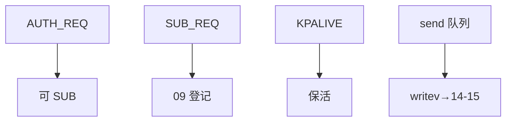

# 11 · Server 接收线程 rtmq_rsvr（下）

> **源文件**：`src/clang/lib/rtmq/server/rtmq_rsvr.c`  
> **模块**：Server 接收线程 rtmq_rsvr（下）  
> **说明**：鉴权、订阅 SUB、keepalive、dist_data 下发。  
> **阅读建议**：先看文首「函数索引」，再按函数块阅读；`/* ===== 阅读注释 ===== */` 为导读补充。


## 你在这里（总地图定位）

> **层级**：Server · 收发  
> **在 RTMQ 中的位置**：rsvr 下半：AUTH、SUB、keepalive、writev 发出、dist 下行  
> **总地图**：[00-总地图.md](00-总地图.md) · 上一篇 `10-rtmq_rsvr_part1` · 下一篇 `12-rtmq_worker`




## 函数索引

| 函数 | 约略位置 |
|------|----------|
| `rtmq_rsvr_recv_proc` | 见下方代码块 |
| `rtmq_rsvr_data_proc` | 见下方代码块 |
| `rtmq_rsvr_sys_mesg_proc` | 见下方代码块 |
| `rtmq_rsvr_exp_mesg_proc` | 见下方代码块 |
| `rtmq_rsvr_event_core_hdl` | 见下方代码块 |
| `rtmq_rsvr_event_timeout_hdl` | 见下方代码块 |
| `rtmq_rsvr_keepalive_req_hdl` | 见下方代码块 |
| `rtmq_rsvr_link_auth_rsp` | 见下方代码块 |
| `rtmq_rsvr_link_auth_req_hdl` | 见下方代码块 |
| `rtmq_rsvr_sck_add_sub` | 见下方代码块 |
| `rtmq_rsvr_sub_req_hdl` | 见下方代码块 |
| `rtmq_rsvr_sck_creat` | 见下方代码块 |
| `rtmq_rsvr_sck_sub_item_free` | 见下方代码块 |
| `rtmq_rsvr_sck_sub_free` | 见下方代码块 |
| `rtmq_rsvr_sck_free` | 见下方代码块 |
| `rtmq_rsvr_add_conn_hdl` | 见下方代码块 |
| `rtmq_rsvr_del_conn_hdl` | 见下方代码块 |
| `rtmq_rsvr_del_all_conn_hdl` | 见下方代码块 |
| `rtmq_rsvr_cmd_proc_req` | 见下方代码块 |
| `rtmq_rsvr_cmd_proc_all_req` | 见下方代码块 |
| `rtmq_rsvr_get_conn_list_by_nodeid` | 见下方代码块 |
| `rtmq_rsvr_dist_data` | 见下方代码块 |
| `rtmq_rsvr_alloc_recv_buff` | 见下方代码块 |
| `rtmq_rsvr_switch_recv_buff` | 见下方代码块 |

## 源码（带阅读注释）

```c
// 文件: src/clang/lib/rtmq/server/rtmq_rsvr.c
// 片段: 行 [(521, 9999)]
static int rtmq_rsvr_recv_proc(rtmq_cntx_t *ctx, rtmq_rsvr_t *rsvr, rtmq_sck_t *sck)
{
    int n, left;
    rtmq_snap_t *recv = &sck->recv;

    while (1) {
        /* 1. 接收网络数据 */
        left = (int)(recv->end - recv->iptr);

        n = read(sck->fd, recv->iptr, left);
        if (n > 0) {
            recv->iptr += n;

            /* 2. 进行数据处理 */
            if (rtmq_rsvr_data_proc(ctx, rsvr, sck)) {
                log_error(rsvr->log, "Proc data failed! nid:%u", sck->nid);
                return RTMQ_ERR;
            }
            continue;
        } else if (0 == n) {
            log_error(rsvr->log, "Client disconnected. errmsg:[%d] %s! nid:%u n:%d/%d",
                    errno, strerror(errno), sck->nid, n, left);
            return RTMQ_SCK_DISCONN;
        } else if ((n < 0) && (EAGAIN == errno)) {
            return RTMQ_OK; /* Again */
        } else if (EINTR == errno) {
            continue;
        }

        log_error(rsvr->log, "errmsg:[%d] %s. nid:%u", errno, strerror(errno), sck->nid);
        return RTMQ_ERR;
    }

    return RTMQ_OK;
}

/******************************************************************************
 **函数名称: rtmq_rsvr_recv_post
 **功    能: 数据接收完成后的处理
 **输入参数:
 **     ctx: 全局对象
 **     rsvr: 接收服务
 **     sck: 套接字对象
 **输出参数: NONE
 **返    回: 0:成功 !0:失败
 **实现描述:
 **     1. 系统数据处理
 **     2. 自定义数据处理
 **注意事项:
 **      | 已处理 |     未处理     |       剩余空间       |
 **       ------------------------------------------------
 **      |XXXXXXXX|////////////////|                      |
 **      |XXXXXXXX|////////////////|         left         |
 **      |XXXXXXXX|////////////////|                      |
 **       ------------------------------------------------
 **      ^        ^                ^                      ^
 **      |        |                |                      |
 **     addr     optr             iptr                   end
 **作    者: # Qifeng.zou # 2015.01.01 #
 ******************************************************************************/
static int rtmq_rsvr_data_proc(rtmq_cntx_t *ctx, rtmq_rsvr_t *rsvr, rtmq_sck_t *sck)
{
    bool flag = false;
    rtmq_header_t *head;
    uint32_t len, one_mesg_len;
    rtmq_snap_t *curr = &sck->recv;

    while (1) {
        flag = false;
        head = (rtmq_header_t *)curr->optr;

        len = (uint32_t)(curr->iptr - curr->optr);
        if (len >= sizeof(rtmq_header_t)) {
            if (RTMQ_CHKSUM_VAL != ntohl(head->chksum)) {
                log_error(rsvr->log, "Header is invalid! nid:%d Mark:%X/%X type:%d len:%d flag:%d",
                        ntohl(head->nid), ntohl(head->chksum), RTMQ_CHKSUM_VAL,
                        ntohl(head->type), ntohl(head->length), head->flag);
                assert(0);
                return RTMQ_ERR;
            }

            one_mesg_len = sizeof(rtmq_header_t) + ntohl(head->length);
            if (len >= one_mesg_len) {
                flag = true;
            }
        }

        /* 1. 不足一条数据时 */
        if (!flag) {
            if (curr->iptr == curr->end) { // 缓存空间已用完
                /* 防止OverWrite的情况发生 */
                if ((curr->optr - curr->base) < (curr->end - curr->iptr)) {
                    log_error(rsvr->log, "Data length is invalid!");
                    return RTMQ_ERR;
                }

                return rtmq_rsvr_switch_recv_buff(sck); // 切换接收缓存
            }
            return RTMQ_OK;
        }


        /* 2. 至少一条数据时 */
        /* 2.1 转化字节序 */
        RTMQ_HEAD_NTOH(head, head);

        /* 2.2 校验合法性 */
        if (!RTMQ_HEAD_ISVALID(head)) {
            ++rsvr->err_total;
            log_error(rsvr->log, "Header is invalid! Mark:%u/%u type:0x%04X len:%d flag:%d",
                    head->chksum, RTMQ_CHKSUM_VAL, head->type, head->length, head->flag);
            return RTMQ_ERR;
        }

        /* 2.3 进行数据处理 */
        if (RTMQ_SYS_MESG == head->flag) {
            if (rtmq_rsvr_sys_mesg_proc(ctx, rsvr, sck, curr->optr)) {
                log_error(rsvr->log, "Proc system message failed! type:0x%04X len:%d flag:%d",
                        head->type, head->length, head->flag);
                return RTMQ_ERR;
            }
        } else {
/* ===== 阅读注释：rtmq_rsvr_exp_mesg_proc =====
 * 【业务包】完整 IM 帧交给 recvq，pipe 通知 worker 处理。
 */
            rtmq_rsvr_exp_mesg_proc(ctx, rsvr, sck, curr->base, curr->optr);
        }
        curr->optr += one_mesg_len;
    }

    return RTMQ_OK;
}

/******************************************************************************
 **函数名称: rtmq_rsvr_sys_mesg_proc
 **功    能: 系统消息处理
 **输入参数:
 **     ctx: 全局对象
 **     rsvr: 接收服务
 **     sck: 套接字对象
 **输出参数: NONE
 **返    回: 0:成功 !0:失败
 **实现描述:
 **注意事项:
 **作    者: # Qifeng.zou # 2015.01.01 #
 ******************************************************************************/
static int rtmq_rsvr_sys_mesg_proc(rtmq_cntx_t *ctx,
        rtmq_rsvr_t *rsvr, rtmq_sck_t *sck, void *addr)
{
    rtmq_header_t *head = (rtmq_header_t *)addr;

    log_debug(rsvr->log, "type:0x%04X nid:%u chksum:0x%X",
            head->type, head->nid, head->chksum);

    switch (head->type) {
        case RTMQ_CMD_AUTH_REQ:
/* ===== 阅读注释：rtmq_rsvr_link_auth_req_hdl =====
 * 【AUTH 服务端】校验 usr/passwd/gid，成功则记录 sck->nid/gid，允许后续 SUB。
 */
            return rtmq_rsvr_link_auth_req_hdl(ctx, rsvr, sck, addr);
        case RTMQ_CMD_SUB_REQ:
/* ===== 阅读注释：rtmq_rsvr_sub_req_hdl =====
 * 【SUB 服务端】把 (type,sck) 登记到全局 sub hash + sck->sub_list。
 */
            return rtmq_rsvr_sub_req_hdl(ctx, rsvr, sck, addr);
        case RTMQ_CMD_KPALIVE_REQ:
/* ===== 阅读注释：rtmq_rsvr_keepalive_req_hdl =====
 * 【心跳】30s 级保活，断线检测。
 */
            return rtmq_rsvr_keepalive_req_hdl(ctx, rsvr, sck, addr);
        default:
            log_error(rsvr->log, "Unknown message type! [%d]", head->type);
            return RTMQ_ERR;
    }

    return RTMQ_OK;
}

/******************************************************************************
 **函数名称: rtmq_rsvr_exp_mesg_proc
 **功    能: 自定义消息处理
 **输入参数:
 **     ctx: 全局对象
 **     rsvr: 接收服务
 **     sck: 套接字对象
 **     base: 内存基地址(用于内存引用计数)
 **     data: 实际数据
 **输出参数: NONE
 **返    回: 0:成功 !0:失败
 **实现描述:
 **     1. 是否在NULL空间: 直接丢弃
 **     2. 放入队列中
 **     3. 发送处理请求
 **注意事项:
 **作    者: # Qifeng.zou # 2015.01.01 #
 ******************************************************************************/
/* ===== 阅读注释：rtmq_rsvr_exp_mesg_proc =====
 * 【业务包】完整 IM 帧交给 recvq，pipe 通知 worker 处理。
 */
static int rtmq_rsvr_exp_mesg_proc(rtmq_cntx_t *ctx,
        rtmq_rsvr_t *rsvr, rtmq_sck_t *sck, void *base, void *data)
{
    queue_t *rq;
    int rqid, len;
    rtmq_recv_item_t *item;
    rtmq_header_t *head = (rtmq_header_t *)data;

    if (!sck->auth_succ) {
        return RTMQ_ERR;
    }

    ++rsvr->recv_total; /* 总数 */
    len = sizeof(rtmq_header_t) + head->length;

    /* > 合法性验证 */
    if (head->nid != sck->nid) {
        ++rsvr->drop_total;
        log_error(rsvr->log, "Devid isn't right! nid:%d/%d", head->nid, sck->nid);
        return RTMQ_ERR;
    }

    /* > 随机放入队列 */
    rqid = rand() % ctx->conf.recvq_num;
    rq = ctx->recvq[rqid];

    item = queue_malloc(rq, sizeof(rtmq_recv_item_t));
    if (NULL == item) {
        ++rsvr->drop_total; /* 丢弃计数 */
        rtmq_rsvr_cmd_proc_all_req(ctx, rsvr);
        log_error(rsvr->log, "Alloc from queue failed! recv:%llu drop:%llu error:%llu len:%d",
                rsvr->recv_total, rsvr->drop_total, rsvr->err_total, len);
        return RTMQ_ERR;
    }

    mref_inc(base); /* 引用计数+1 */

    item->base = base;
    item->data = data;

    queue_push(rq, item);

    rtmq_rsvr_cmd_proc_req(ctx, rsvr, rqid);    /* 发送处理请求 */

    return RTMQ_OK;
}

/******************************************************************************
 **函数名称: rtmq_rsvr_event_core_hdl
 **功    能: 事件核心处理
 **输入参数:
 **     ctx: 全局对象
 **     rsvr: 接收服务
 **输出参数: NONE
 **返    回: 0:成功 !0:失败
 **实现描述:
 **     1. 接收命令数据
 **     2. 遍历接收数据
 **     3. 遍历发送数据
 **注意事项:
 **作    者: # Qifeng.zou # 2015.01.01 #
 ******************************************************************************/
static int rtmq_rsvr_event_core_hdl(rtmq_cntx_t *ctx, rtmq_rsvr_t *rsvr)
{
    /* 1. 接收命令数据 */
    if (FD_ISSET(rsvr->cmd_fd, &rsvr->rdset)) {
        rtmq_rsvr_recv_cmd(ctx, rsvr);
    }

    /* 2. 遍历接收数据 */
    rtmq_rsvr_trav_recv(ctx, rsvr);

    /* 3. 遍历发送数据 */
    rtmq_rsvr_trav_send(ctx, rsvr);

    return RTMQ_OK;
}

/******************************************************************************
 **函数名称: rtmq_rsvr_event_timeout_hdl
 **功    能: 事件超时处理
 **输入参数:
 **     ctx: 全局对象
 **输出参数: NONE
 **返    回: 0:成功 !0:失败
 **实现描述:
 **     1. 检测超时连接
 **     2. 删除超时连接
 **注意事项:
 **作    者: # Qifeng.zou # 2015.01.01 #
 ******************************************************************************/
static int rtmq_rsvr_event_timeout_hdl(rtmq_cntx_t *ctx, rtmq_rsvr_t *rsvr)
{
    bool is_end = false;
    rtmq_sck_t *curr;
    list2_node_t *node, *next, *tail;

    rsvr->ctm = time(NULL);

    /* > 检测超时连接 */
    node = rsvr->conn_list->head;
    if (NULL == node) {
        return RTMQ_OK;
    }

    tail = node->prev;
    while ((NULL != node) && (false == is_end)) {
        if (tail == node) {
            is_end = true;
        }

        curr = (rtmq_sck_t *)node->data;

        if (rsvr->ctm - curr->rdtm >= 60) {
            log_trace(rsvr->log, "Didn't active for along time! fd:%d ip:%s",
                    curr->fd, curr->ipaddr);
            /* 释放数据 */
            mref_dec(curr->recv.base);
            /* 删除连接 */
            if (node == tail) {
                rtmq_rsvr_del_conn_hdl(ctx, rsvr, node);
                break;
            }

            next = node->next;
            rtmq_rsvr_del_conn_hdl(ctx, rsvr, node);
            node = next;
            continue;
        }
        node = node->next;
    }

    /* > 重复发送处理命令 */
    rtmq_rsvr_cmd_proc_all_req(ctx, rsvr);

    return RTMQ_OK;
}

/******************************************************************************
 **函数名称: rtmq_rsvr_keepalive_req_hdl
 **功    能: 保活请求处理
 **输入参数:
 **     ctx: 全局对象
 **     rsvr: 接收服务
 **     sck: 套接字对象
 **     addr: 请求地址
 **输出参数: NONE
 **返    回: 0:成功 !0:失败
 **实现描述:
 **注意事项:
 **作    者: # Qifeng.zou # 2015.01.01 #
 ******************************************************************************/
/* ===== 阅读注释：rtmq_rsvr_keepalive_req_hdl =====
 * 【心跳】30s 级保活，断线检测。
 */
static int rtmq_rsvr_keepalive_req_hdl(rtmq_cntx_t *ctx,
        rtmq_rsvr_t *rsvr, rtmq_sck_t *sck, void *addr)
{
    void *rsp;
    rtmq_header_t *head;

    if (!sck->auth_succ) {
        return RTMQ_ERR;
    }

    /* > 分配消息空间 */
    rsp = (void *)mref_alloc(sizeof(rtmq_header_t), NULL,
            (mem_alloc_cb_t)mem_alloc, (mem_dealloc_cb_t)mem_dealloc);
    if (NULL == rsp) {
        log_error(rsvr->log, "Alloc memory failed!");
        return RTMQ_ERR;
    }

    /* > 回复消息内容 */
    head = (rtmq_header_t *)rsp;

    head->type = RTMQ_CMD_KPALIVE_ACK;
    head->nid = ctx->conf.nid;
    head->length = 0;
    head->flag = RTMQ_SYS_MESG;
    head->chksum = RTMQ_CHKSUM_VAL;

    /* > 加入发送列表 */
    if (list2_rpush(sck->mesg_list, rsp)) {
        mref_dec(rsp);
        log_error(rsvr->log, "Insert into mesg list failed!");
        return RTMQ_ERR;
    }

    log_debug(rsvr->log, "Add respond of keepalive request!");

    return RTMQ_OK;
}

/******************************************************************************
 **函数名称: rtmq_rsvr_link_auth_rsp
 **功    能: 链路鉴权应答
 **输入参数:
 **     ctx: 全局对象
 **     rsvr: 接收服务
 **     sck: 套接字对象
 **输出参数: NONE
 **返    回: 0:成功 !0:失败
 **实现描述: 将链路应答信息放入发送队列中
 **注意事项: 
 **作    者: # Qifeng.zou # 2015.05.22 #
 ******************************************************************************/
static int rtmq_rsvr_link_auth_rsp(rtmq_cntx_t *ctx, rtmq_rsvr_t *rsvr, rtmq_sck_t *sck)
{
    int len;
    void *addr;
    rtmq_header_t *head;
    rtmq_link_auth_ack_t *link_auth_rsp;

    /* > 分配消息空间 */
    len = sizeof(rtmq_header_t) + sizeof(rtmq_link_auth_ack_t);

    addr = (void *)mref_alloc(len, NULL,
            (mem_alloc_cb_t)mem_alloc, (mem_dealloc_cb_t)mem_dealloc);
    if (NULL == addr) {
        log_error(rsvr->log, "Alloc memory failed!");
        return RTMQ_ERR;
    }

    /* > 回复消息内容 */
    head = (rtmq_header_t *)addr;
    link_auth_rsp = (rtmq_link_auth_ack_t *)(head + 1);

    head->type = RTMQ_CMD_AUTH_ACK;
    head->nid = ctx->conf.nid;
    head->length = sizeof(rtmq_link_auth_ack_t);
    head->flag = RTMQ_SYS_MESG;
    head->chksum = RTMQ_CHKSUM_VAL;

    link_auth_rsp->is_succ = htonl(sck->auth_succ);

    /* > 加入发送列表 */
    if (list2_rpush(sck->mesg_list, addr)) {
        mref_dec(addr);
        log_error(rsvr->log, "Insert into list failed!");
        return RTMQ_ERR;
    }

    log_debug(rsvr->log, "Add respond of link-auth request!");

    return RTMQ_OK;
}

/******************************************************************************
 **函数名称: rtmq_rsvr_link_auth_req_hdl
 **功    能: 链路鉴权请求处理
 **输入参数:
 **     ctx: 全局对象
 **     rsvr: 接收对象
 **     sck: 套接字对象
 **     addr: 请求地址
 **输出参数: NONE
 **返    回: 0:成功 !0:失败
 **实现描述: 校验鉴权是否通过, 并应答鉴权请求
 **注意事项: 
 **作    者: # Qifeng.zou # 2015.05.22 #
 ******************************************************************************/
/* ===== 阅读注释：rtmq_rsvr_link_auth_req_hdl =====
 * 【AUTH 服务端】校验 usr/passwd/gid，成功则记录 sck->nid/gid，允许后续 SUB。
 */
static int rtmq_rsvr_link_auth_req_hdl(rtmq_cntx_t *ctx,
        rtmq_rsvr_t *rsvr, rtmq_sck_t *sck, void *addr)
{
    rtmq_header_t *head;
    rtmq_link_auth_req_t *auth;

    head = (rtmq_header_t *)addr;
    auth = (rtmq_link_auth_req_t *)(head + 1);
    if (0 == auth->gid) {
        log_error(rsvr->log, "Auth gid is invalid! nid:%d", head->nid);
        return RTMQ_ERR;
    }

    /* > 字节序转换 */
    RTMQ_AUTH_REQ_NTOH(auth, auth);

    sck->gid = auth->gid;

    /* > 验证鉴权合法性 */
    sck->auth_succ = rtmq_link_auth_check(ctx, auth);
    if (sck->auth_succ) {
        sck->nid = head->nid;
        /* > 插入NID与SCK的映射 */
        if (rtmq_node_to_svr_map_add(ctx, head->nid, rsvr->id)) {
            log_error(rsvr->log, "Insert into sck2dev table failed! fd:%d serial:%ld nid:%d",
                    sck->fd, sck->sid, head->nid);
            return RTMQ_ERR;
        }
        log_debug(rsvr->log, "Auth success! nid:%d usr:%s passwd:%s",
                head->nid, auth->usr, auth->passwd);
    } else {
        log_error(rsvr->log, "Auth failed! nid:%d usr:%s passwd:%s",
                head->nid, auth->usr, auth->passwd);
    }

    /* > 应答鉴权请求 */
    return rtmq_rsvr_link_auth_rsp(ctx, rsvr, sck);
}

/* 添加订阅数据 */
static int rtmq_rsvr_sck_add_sub(rtmq_cntx_t *ctx, rtmq_sck_t *sck, int type)
{
    rtmq_sub_req_t *req, key;

    key.type = type;

    req = (rtmq_sub_req_t *)avl_query(sck->sub_list, &key);
    if (NULL != req) {
        log_warn(ctx->log, "Socket sub [%u] repeat!", type);
        return 0;
    }

    req = (rtmq_sub_req_t *)calloc(1, sizeof(rtmq_sub_req_t));
    if (NULL == req) {
        return -1;
    }

    req->type = type;

    if (avl_insert(sck->sub_list, (void *)req)) {
        free(req);
        return -1;
    }

    return 0;
}

/******************************************************************************
 **函数名称: rtmq_rsvr_sub_req_hdl
 **功    能: 订阅请求处理
 **输入参数:
 **     ctx: 全局对象
 **     rsvr: 接收对象
 **     sck: 套接字对象
 **     addr: 请求地址
 **输出参数: NONE
 **返    回: 0:成功 !0:失败
 **实现描述: 
 **注意事项: 
 **作    者: # Qifeng.zou # 2016.04.13 00:35:15 #
 ******************************************************************************/
/* ===== 阅读注释：rtmq_rsvr_sub_req_hdl =====
 * 【SUB 服务端】把 (type,sck) 登记到全局 sub hash + sck->sub_list。
 */
static int rtmq_rsvr_sub_req_hdl(rtmq_cntx_t *ctx, rtmq_rsvr_t *rsvr, rtmq_sck_t *sck, void *addr)
{
    rtmq_header_t *head = (rtmq_header_t *)addr;
    rtmq_sub_req_t *req = (rtmq_sub_req_t *)(head + 1);

    if (!sck->auth_succ) {
        log_error(ctx->log, "Didn't auth, drop sub request! type:0x%04X nid:%u gid:%u sid:%lu",
                req->type, sck->nid, sck->gid, sck->sid);
        return RTMQ_ERR;
    }

    /* > 字节序转换(网络->主机) */
    RTMQ_SUB_REQ_NTOH(req, req);

    /* > 查找并添加订阅列表 */
    if (rtmq_sub_add(ctx, sck, req->type)) {
        log_debug(ctx->log, "Sub find or add failed! type:0x%04X nid:%u gid:%u sid:%lu",
                req->type, sck->nid, sck->gid, sck->sid);
        return -1;
    }

    /* > 添加订阅列表 */
    if (rtmq_rsvr_sck_add_sub(ctx, sck, req->type)) {
        rtmq_sub_del(ctx, sck, req->type);
        log_error(ctx->log, "Add item into sub list failed! type:0x%04X gid:%u nid:%u sid:%lu",
            req->type, sck->gid, sck->nid, sck->sid);
        return -1;
    }

    log_debug(ctx->log, "Sub req handler success! type:0x%04X gid:%u nid:%u sid:%lu",
            req->type, sck->gid, sck->nid, sck->sid);

    return 0;
}

/******************************************************************************
 **函数名称: rtmq_rsvr_sck_creat
 **功    能: 创建套接字对象
 **输入参数:
 **     rsvr: 接收服务
 **     req: 添加套接字请求
 **输出参数: NONE
 **返    回: 套接字对象
 **实现描述: 创建套接字对象, 并依次初始化其成员变量
 **注意事项: 套接字关闭时, 记得释放空间, 防止内存泄露!
 **作    者: # Qifeng.zou # 2015.06.11 #
 ******************************************************************************/
static int64_t rtmq_sub_list_cmp_cb(const rtmq_sub_req_t *req1, const rtmq_sub_req_t *req2)
{
    return (int64_t)(req1->type - req2->type);
}

static rtmq_sck_t *rtmq_rsvr_sck_creat(rtmq_rsvr_t *rsvr, rtmq_conn_item_t *item)
{
    rtmq_sck_t *sck;

    /* > 分配连接空间 */
    sck = (rtmq_sck_t *)calloc(1, sizeof(rtmq_sck_t));
    if (NULL == sck) {
        log_error(rsvr->log, "Alloc memory failed!");
        CLOSE(item->fd);
        return NULL;
    }

    memset(sck, 0, sizeof(rtmq_sck_t));

    sck->fd = item->fd;
    sck->nid = -1;
    sck->sid = item->sid;
    sck->ctm = time(NULL);
    sck->rdtm = sck->ctm;
    sck->wrtm = sck->ctm;
    snprintf(sck->ipaddr, sizeof(sck->ipaddr), "%s", item->ipaddr);

    do {
        /* > 创建订阅列表 */
        sck->sub_list = avl_creat(NULL, (cmp_cb_t)rtmq_sub_list_cmp_cb);
        if (NULL == sck->sub_list) {
            log_error(rsvr->log, "Create sub list failed!");
            break;
        }

        /* > 创建发送链表 */
        sck->mesg_list = list2_creat(NULL);
        if (NULL == sck->mesg_list) {
            log_error(rsvr->log, "Create list failed!");
            break;
        }

        /* > 申请接收缓存 */
        if (rtmq_rsvr_alloc_recv_buff(sck)) {
            log_error(rsvr->log, "Alloc recv buff failed! errmsg:[%d] %s!",
                    errno, strerror(errno));
            break;
        }

        return sck;
    } while (0);

    /* > 释放套接字对象 */
    rtmq_rsvr_sck_free(rsvr, sck);
    return NULL;
}

typedef struct {
    rtmq_sck_t *sck;
    rtmq_cntx_t *ctx;
} rtmq_rsvr_sck_sub_trav_t;

int rtmq_rsvr_sck_sub_item_free(rtmq_rsvr_sck_sub_trav_t *args, rtmq_sub_req_t *req)
{
    rtmq_sub_node_t *node;
    rtmq_sub_list_t *list, key;
    rtmq_sck_t *sck = args->sck;
    rtmq_cntx_t *ctx = args->ctx;
    rtmq_sub_group_t *group, gkey;

    /* 1. 查找订阅列表 */
    key.type = req->type;

    list = hash_tab_query(ctx->sub, &key, WRLOCK);
    if (NULL == list) {
        return 0;
    }

    /* 2. 查找订阅列表分组 */
    gkey.gid = sck->gid;

    group = avl_query(list->groups, &gkey);
    if (NULL == group) {
        hash_tab_unlock(ctx->sub, &key, WRLOCK);
        return 0;
    }

    /* 3. 从订阅列表分组中删除指定连接 */
    node = vector_find_and_del(group->nodes, (find_cb_t)rtmq_sub_group_find_sid_cb, &sck->sid);
    if (NULL == node) {
        hash_tab_unlock(ctx->sub, &key, WRLOCK);
        return 0;
    }

    /* 4. 回收内存空间 */
    rtmq_sub_node_dealloc(node);

    if (0 == vector_len(group->nodes)) {
        avl_delete(list->groups, &gkey, (void **)&group);
        rtmq_sub_group_dealloc(group);
        if (0 == avl_num(list->groups)) {
            hash_tab_delete(ctx->sub, &key, NONLOCK);
            rtmq_sub_list_dealloc(list);
        }
    }
    hash_tab_unlock(ctx->sub, &key, WRLOCK);

    free(req);
    return 0;
}

static int rtmq_rsvr_sck_sub_free(rtmq_rsvr_t *rsvr, rtmq_sck_t *sck)
{
    rtmq_rsvr_sck_sub_trav_t args;
    rtmq_cntx_t *ctx = (rtmq_cntx_t *)rsvr->ctx;

    args.sck = sck;
    args.ctx = ctx;

    if (sck->sub_list) {
        avl_destroy(sck->sub_list, (mem_dealloc_cb_t)rtmq_rsvr_sck_sub_item_free, &args);
    }

    return 0;
}

/******************************************************************************
 **函数名称: rtmq_rsvr_sck_free
 **功    能: 释放指定套接字对象的空间
 **输入参数:
 **     rsvr: 接收服务
 **     sck: 套接字对象
 **输出参数: NONE
 **返    回: 0:成功 !0:失败
 **实现描述:
 **注意事项: 释放该套接字对象所有相关内存, 防止内存泄露!
 **作    者: # Qifeng.zou # 2015.06.11 23:31:48 #
 ******************************************************************************/
static void rtmq_rsvr_sck_free(rtmq_rsvr_t *rsvr, rtmq_sck_t *sck)
{
    if (NULL == sck) { return; }

    mref_dec(sck->recv.base);

    /* 释放订阅列表空间 */
    rtmq_rsvr_sck_sub_free(rsvr, sck);

    /* 释放发送链表空间 */
    if (sck->mesg_list) {
        list2_destroy(sck->mesg_list, (mem_dealloc_cb_t)mref_dealloc, NULL);
    }

    /* 释放iov的空间 */
    wiov_destroy(&sck->send);

    CLOSE(sck->fd);
    FREE(sck);
}

/******************************************************************************
 **函数名称: rtmq_rsvr_add_conn_hdl
 **功    能: 添加网络连接
 **输入参数:
 **     ctx: 全局对象
 **输出参数: NONE
 **返    回: 0:成功 !0:失败
 **实现描述: 将套接字对象加入到套接字链表中
 **注意事项:
 **作    者: # Qifeng.zou # 2015.01.01, 2017.07.22 00:11:14 #
 ******************************************************************************/
static int rtmq_rsvr_add_conn_hdl(rtmq_cntx_t *ctx, rtmq_rsvr_t *rsvr)
{
    int num, idx;
    queue_t *connq;
    rtmq_sck_t *sck;
    rtmq_conf_t *conf = &ctx->conf;
    rtmq_conn_item_t *item[RTMQ_CONNQ_LEN];

    connq = ctx->connq[rsvr->id];
    while (1) {
        /* > 获取新建连接 */
        num = MIN(queue_used(connq), RTMQ_CONNQ_LEN);
        if (0 == num) {
            return RTMQ_OK;
        }

        num = queue_mpop(connq, (void **)item, num);
        if (0 == num) {
            continue;
        }

        for (idx=0; idx<num; ++idx) {
            /* > 创建套接字对象 */
            sck = rtmq_rsvr_sck_creat(rsvr, item[idx]);
            if (NULL == sck) {
                log_error(rsvr->log, "Create socket object failed!");
                queue_dealloc(connq, item[idx]);
                continue;
            }

            /* > 加入套接字链尾 */
            if (list2_rpush(rsvr->conn_list, (void *)sck)) {
                log_error(rsvr->log, "Insert into list failed!");
                rtmq_rsvr_sck_free(rsvr, sck);
                queue_dealloc(connq, item[idx]);
                continue;
            }

            /* > 初始化发送IOV */
            if (wiov_init(&sck->send, 2 * conf->sendq.max)) {
                log_error(rsvr->log, "Init wiov failed!");
                rtmq_rsvr_sck_free(rsvr, sck);
                queue_dealloc(connq, item[idx]);
                continue;
            }

            ++rsvr->connections; /* 统计TCP连接数 */

            log_trace(rsvr->log, "Add socket success! tid:%d fd:%d ipaddr:%s",
                    rsvr->id, item[idx]->fd, item[idx]->ipaddr);
            queue_dealloc(connq, item[idx]);
        }
    }

    return RTMQ_OK;
}

/******************************************************************************
 **函数名称: rtmq_rsvr_del_conn_hdl
 **功    能: 删除网络连接
 **输入参数:
 **     rsvr: 接收服务
 **     node: 套接字对象
 **输出参数: NONE
 **返    回: 0:成功 !0:失败
 **实现描述:
 **注意事项: 释放接收缓存和发送缓存空间!
 **作    者: # Qifeng.zou # 2015.01.01 #
 ******************************************************************************/
static int rtmq_rsvr_del_conn_hdl(rtmq_cntx_t *ctx, rtmq_rsvr_t *rsvr, list2_node_t *node)
{
    rtmq_sck_t *curr = (rtmq_sck_t *)node->data;

    /* > 从链表剔除结点 */
    list2_delete(rsvr->conn_list, node);

    /* > 从SCK <<=>> DEV映射表中剔除 */
    rtmq_node_to_svr_map_del(ctx, curr->nid, rsvr->id);

    /* > 释放数据空间 */
    rtmq_rsvr_sck_free(rsvr, curr);

    --rsvr->connections; /* 统计TCP连接数 */

    return RTMQ_OK;
}

/******************************************************************************
 **函数名称: rtmq_rsvr_del_all_conn_hdl
 **功    能: 删除接收线程所有的套接字
 **输入参数:
 **     rsvr: 接收服务
 **输出参数: NONE
 **返    回: 0:成功 !0:失败
 **实现描述:
 **注意事项:
 **作    者: # Qifeng.zou # 2015.01.01 #
 ******************************************************************************/
void rtmq_rsvr_del_all_conn_hdl(rtmq_cntx_t *ctx, rtmq_rsvr_t *rsvr)
{
    list2_node_t *node, *next, *tail;

    node = rsvr->conn_list->head;
    if (NULL != node) {
        tail = node->prev;
    }

    while (NULL != node) {
        if (node == tail) {
            rtmq_rsvr_del_conn_hdl(ctx, rsvr, node);
            break;
        }

        next = node->next;
        rtmq_rsvr_del_conn_hdl(ctx, rsvr, node);
        node = next;
    }

    rsvr->connections = 0; /* 统计TCP连接数 */
    return;
}

/******************************************************************************
 **函数名称: rtmq_rsvr_cmd_proc_req
 **功    能: 发送处理请求
 **输入参数:
 **     ctx: 全局对象
 **     rsvr: 接收服务
 **     rqid: 队列ID
 **输出参数: NONE
 **返    回: 0:成功 !0:失败
 **实现描述:
 **注意事项:
 **作    者: # Qifeng.zou # 2015.01.01 #
 ******************************************************************************/
static int rtmq_rsvr_cmd_proc_req(rtmq_cntx_t *ctx, rtmq_rsvr_t *rsvr, int rqid)
{
    int widx;
    rtmq_cmd_t cmd;
    rtmq_cmd_proc_req_t *req = (rtmq_cmd_proc_req_t *)&cmd.param;

    memset(&cmd, 0, sizeof(cmd));

    cmd.type = RTMQ_CMD_PROC_REQ;
    req->ori_svr_id = rsvr->id;
    req->num = -1;
    req->rqidx = rqid;

    /* 1. 随机选择Work线程 */
    /* widx = rtmq_rand_work(ctx); */
    widx = rqid / RTMQ_WORKER_HDL_QNUM;

    /* 2. 发送处理命令 */
    pipe_write(&ctx->work_cmd_fd[widx], &cmd, sizeof(cmd));
    
    return RTMQ_OK;
}

/******************************************************************************
 **函数名称: rtmq_rsvr_cmd_proc_all_req
 **功    能: 重复发送处理请求
 **输入参数:
 **     ctx: 全局对象
 **     rsvr: 接收服务
 **输出参数: NONE
 **返    回: 0:成功 !0:失败
 **实现描述:
 **注意事项:
 **作    者: # Qifeng.zou # 2015.01.01 #
 ******************************************************************************/
static int rtmq_rsvr_cmd_proc_all_req(rtmq_cntx_t *ctx, rtmq_rsvr_t *rsvr)
{
    int idx;

    /* 依次遍历滞留总数 */
    for (idx=0; idx<ctx->conf.recvq_num; ++idx) {
        rtmq_rsvr_cmd_proc_req(ctx, rsvr, idx);
    }

    return RTMQ_OK;
}

/******************************************************************************
 **函数名称: rtmq_rsvr_get_conn_list_by_nodeid
 **功    能: 通过结点ID获取连接链表
 **输入参数:
 **     sck: 套接字数据
 **     c: 连接链表
 **输出参数: NONE
 **返    回: 0:成功 !0:失败
 **实现描述:
 **注意事项:
 **作    者: # Qifeng.zou # 2015.06.02 #
 ******************************************************************************/
typedef struct
{
    uint32_t nid;               /* 结点ID */
    list_t *list;               /* 拥有相同结点ID的套接字链表 */
} _conn_list_t;

static int rtmq_rsvr_get_conn_list_by_nodeid(rtmq_sck_t *sck, _conn_list_t *cl)
{
    if (sck->nid != cl->nid) {
        return -1;
    }

    return list_rpush(cl->list, sck); /* 注意: 销毁cl->list时, 不必释放sck空间 */
}

/******************************************************************************
 **函数名称: rtmq_rsvr_dist_data
 **功    能: 分发连接队列中的数据
 **输入参数:
 **     ctx: 全局对象
 **     rsvr: 接收服务
 **输出参数: NONE
 **返    回: 0:成功 !0:失败
 **实现描述:
 **注意事项:
 **作    者: # Qifeng.zou # 2015.06.02 #
 ******************************************************************************/
static int rtmq_rsvr_dist_data(rtmq_cntx_t *ctx, rtmq_rsvr_t *rsvr)
{
#define RTRD_POP_MAX_NUM (1024)
    int idx, num;
    ring_t *sendq;
    rtmq_sck_t *sck;
    _conn_list_t cl;
    rtmq_header_t *head;
    void *data[RTRD_POP_MAX_NUM];

    sendq = ctx->sendq[rsvr->id];

    while (1) {
        /* > 弹出队列数据 */
        num = MIN(ring_used(sendq), RTRD_POP_MAX_NUM);
        if (0 == num) {
            break;
        }

        num = ring_mpop(sendq, data, num);
        if (0 == num) {
            continue;
        }

        log_trace(ctx->log, "Multi-pop num:%d!", num);

        /* > 逐条处理数据 */
        for (idx=0; idx<num; ++idx) {
            head = (rtmq_header_t *)data[idx];

            mref_check(data[idx]);

            /* > 查找发送连接 */
            cl.nid = head->nid;
            cl.list = list_creat(NULL);
            if (NULL == cl.list) {
                mref_dec(data[idx]);
                log_error(rsvr->log, "Create list failed!");
                continue;
            }

            list2_trav(rsvr->conn_list, (trav_cb_t)rtmq_rsvr_get_conn_list_by_nodeid, &cl);
            if (0 == cl.list->num) {
                mref_dec(data[idx]);
                list_destroy(cl.list, mem_dummy_dealloc, NULL);
                log_error(rsvr->log, "Didn't find connection by nid [%d]!", cl.nid);
                continue;
            }

            sck = (rtmq_sck_t *)list_fetch(cl.list, rand()%cl.list->num);
            
            /* > 回收内存空间[注: 无需释放结点数据空间] */
            list_destroy(cl.list, mem_dummy_dealloc, NULL);

            log_trace(ctx->log, "Select upstream! fd:%d nid:%d sid:%d",
                    sck->fd, sck->nid, sck->sid);


            /* > 放入发送链表 */
            if (list2_rpush(sck->mesg_list, data[idx])) {
                mref_dec(data[idx]);
                log_error(rsvr->log, "Push input mesg list failed!");
                continue;
            }
        }
    }

    return RTMQ_OK;
}

/******************************************************************************
 **函数名称: rtmq_rsvr_alloc_recv_buff
 **功    能: 申请接收缓存
 **输入参数:
 **     sck: 通信套接字
 **输出参数: NONE
 **返    回: 0:成功 !0:失败
 **实现描述:
 **注意事项:
 **作    者: # Qifeng.zou # 2016.07.14 14:19:21 #
 ******************************************************************************/
static int rtmq_rsvr_alloc_recv_buff(rtmq_sck_t *sck)
{
    void *addr;

    addr = (void *)mref_alloc(RTMQ_BUFF_SIZE, NULL,
            (mem_alloc_cb_t)mem_alloc, (mem_dealloc_cb_t)mem_dealloc);
    if (NULL == addr) {
        return RTMQ_ERR;
    }

    rtmq_snap_setup(&sck->recv, addr, RTMQ_BUFF_SIZE);

    return RTMQ_OK;
}

/******************************************************************************
 **函数名称: rtmq_rsvr_switch_recv_buff
 **功    能: 切换接收缓存
 **输入参数:
 **     sck: 通信套接字
 **输出参数: NONE
 **返    回: 0:成功 !0:失败
 **实现描述:
 **注意事项:
 **作    者: # Qifeng.zou # 2016.07.14 14:04:44 #
 ******************************************************************************/
static int rtmq_rsvr_switch_recv_buff(rtmq_sck_t *sck)
{
    size_t len;
    rtmq_snap_t *curr = &sck->recv, old;

    /* > 记录原数据 */
    len = curr->iptr - curr->optr;
    memcpy(&old, curr, sizeof(old));

    /* > 申请新接收缓存 */
    if (rtmq_rsvr_alloc_recv_buff(sck)) {
        return RTMQ_ERR;
    }

    /* > 复制残留数据 */
    curr = &sck->recv;

    memcpy(curr->optr, old.optr, len);
    curr->iptr += len;

    /* > 释放老数据(注: 引用计数减1) */
    mref_dec(old.base);

    return RTMQ_OK;
}

```

---

## 本篇流程图

（与文首「你在这里」相同，便于从目录跳转）


**回到总地图**：[00-总地图.md](00-总地图.md#2-十七篇文档在代码里的位置总组件图)
