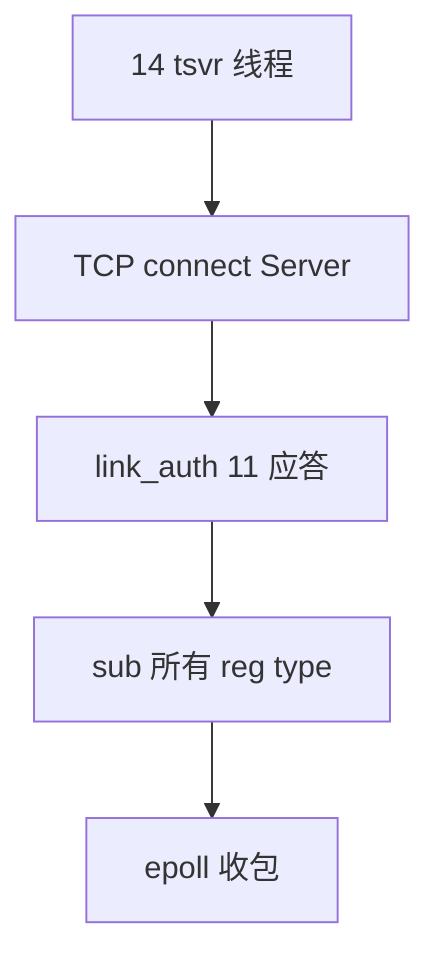

# 14 · Proxy 发送线程 rtmq_proxy_tsvr（上）

> **源文件**：`src/clang/lib/rtmq/proxy/rtmq_proxy_tsvr.c`  
> **模块**：Proxy 发送线程 rtmq_proxy_tsvr（上）  
> **说明**：epoll/select 连 Server、鉴权、订阅、收包。  
> **阅读建议**：先看文首「函数索引」，再按函数块阅读；`/* ===== 阅读注释 ===== */` 为导读补充。


## 你在这里（总地图定位）

> **层级**：Proxy · 网络  
> **在 RTMQ 中的位置**：tsvr 上半：连 Server、鉴权、SUB、epoll 收包  
> **总地图**：[00-总地图.md](00-总地图.md) · 上一篇 `13-rtmq_proxy` · 下一篇 `15-rtmq_proxy_tsvr_part2`




## 函数索引

| 函数 | 约略位置 |
|------|----------|
| `rtmq_proxy_tsvr_get_curr` | 见下方代码块 |
| `rtmq_proxy_tsvr_creat_sendq` | 见下方代码块 |
| `rtmq_proxy_tsvr_recv_cmd` | 见下方代码块 |
| `rtmq_proxy_tsvr_recv_proc` | 见下方代码块 |
| `rtmq_proxy_tsvr_data_proc` | 见下方代码块 |
| `rtmq_proxy_tsvr_sys_mesg_proc` | 见下方代码块 |
| `rtmq_proxy_tsvr_exp_mesg_proc` | 见下方代码块 |
| `rtmq_proxy_tsvr_timeout_hdl` | 见下方代码块 |
| `rtmq_proxy_tsvr_proc_cmd` | 见下方代码块 |
| `rtmq_proxy_tsvr_send_data` | 见下方代码块 |
| `rtmq_proxy_tsvr_clear_mesg` | 见下方代码块 |
| `rtmq_proxy_tsvr_kpalive_req` | 见下方代码块 |
| `rtmq_link_auth_req` | 见下方代码块 |
| `rtmq_link_auth_ack_hdl` | 见下方代码块 |
| `rtmq_sub_req` | 见下方代码块 |
| `rtmq_proxy_tsvr_cmd_proc_req` | 见下方代码块 |
| `rtmq_proxy_tsvr_cmd_proc_all_req` | 见下方代码块 |
| `rtmq_proxy_rsvr_event_handler` | 见下方代码块 |
| `rtmq_proxy_tsvr_reconn` | 见下方代码块 |
| `rtmq_proxy_tsvr_del_conn` | 见下方代码块 |
| `rtmq_proxy_tsvr_init` | 见下方代码块 |
| `rtmq_proxy_tsvr_bind_cpu` | 见下方代码块 |
| `rtmq_proxy_tsvr_routine` | 见下方代码块 |
| `rtmq_proxy_tsvr_kpalive_req` | 见下方代码块 |
| `rtmq_proxy_tsvr_get_curr` | 见下方代码块 |
| `rtmq_proxy_tsvr_timeout_hdl` | 见下方代码块 |
| `rtmq_proxy_tsvr_recv_proc` | 见下方代码块 |
| `rtmq_proxy_tsvr_data_proc` | 见下方代码块 |
| `rtmq_proxy_tsvr_recv_cmd` | 见下方代码块 |
| `rtmq_proxy_tsvr_proc_cmd` | 见下方代码块 |

## 源码（带阅读注释）

```c
// 文件: src/clang/lib/rtmq/proxy/rtmq_proxy_tsvr.c
// 片段: 行 [(1, 580)]
#include "redo.h"
#include "queue.h"
#include "rtmq_mesg.h"
#include "rtmq_comm.h"
#include "rtmq_proxy.h"

/* 静态函数 */
static rtmq_proxy_tsvr_t *rtmq_proxy_tsvr_get_curr(rtmq_proxy_t *pxy);

static int rtmq_proxy_tsvr_creat_sendq(rtmq_proxy_tsvr_t *tsvr, const rtmq_proxy_conf_t *conf);

static int rtmq_proxy_tsvr_recv_cmd(rtmq_proxy_t *pxy, rtmq_proxy_tsvr_t *tsvr, rtmq_proxy_sck_t *sck);
static int rtmq_proxy_tsvr_recv_proc(rtmq_proxy_t *pxy, rtmq_proxy_tsvr_t *tsvr, rtmq_proxy_sck_t *sck);

static int rtmq_proxy_tsvr_data_proc(rtmq_proxy_t *pxy, rtmq_proxy_tsvr_t *tsvr, rtmq_proxy_sck_t *sck);
static int rtmq_proxy_tsvr_sys_mesg_proc(rtmq_proxy_t *pxy, rtmq_proxy_tsvr_t *tsvr, rtmq_proxy_sck_t *sck, void *addr);
static int rtmq_proxy_tsvr_exp_mesg_proc(rtmq_proxy_t *pxy, rtmq_proxy_tsvr_t *tsvr, rtmq_proxy_sck_t *sck, void *addr);

static int rtmq_proxy_tsvr_timeout_hdl(rtmq_proxy_t *pxy, rtmq_proxy_tsvr_t *tsvr);
static int rtmq_proxy_tsvr_proc_cmd(rtmq_proxy_t *pxy, rtmq_proxy_tsvr_t *tsvr, const rtmq_cmd_t *cmd);
static int rtmq_proxy_tsvr_send_data(rtmq_proxy_t *pxy, rtmq_proxy_tsvr_t *tsvr, rtmq_proxy_sck_t *sck);

static int rtmq_proxy_tsvr_clear_mesg(rtmq_proxy_tsvr_t *tsvr);

static int rtmq_proxy_tsvr_kpalive_req(rtmq_proxy_t *pxy, rtmq_proxy_tsvr_t *tsvr);
/* ===== 阅读注释：rtmq_link_auth_req =====
 * 【建链】Proxy 发 AUTH，携带 gid/usr/passwd，Server rtmq_link_auth_req_hdl 校验。
 */

static int rtmq_link_auth_req(rtmq_proxy_t *pxy, rtmq_proxy_tsvr_t *tsvr);
static int rtmq_link_auth_ack_hdl(rtmq_proxy_t *pxy, rtmq_proxy_tsvr_t *tsvr, rtmq_proxy_sck_t *sck, rtmq_link_auth_ack_t *rsp);
static int rtmq_sub_req(rtmq_proxy_t *pxy, rtmq_proxy_tsvr_t *tsvr);

static int rtmq_proxy_tsvr_cmd_proc_req(rtmq_proxy_t *pxy, rtmq_proxy_tsvr_t *tsvr, int rqid);
static int rtmq_proxy_tsvr_cmd_proc_all_req(rtmq_proxy_t *pxy, rtmq_proxy_tsvr_t *tsvr);
static int rtmq_proxy_rsvr_event_handler(rtmq_proxy_t *pxy, rtmq_proxy_tsvr_t *tsvr, int num);

static int rtmq_proxy_tsvr_reconn(rtmq_proxy_t *pxy, rtmq_proxy_tsvr_t *tsvr, rtmq_proxy_sck_t *sck);
static int rtmq_proxy_tsvr_del_conn(rtmq_proxy_t *pxy, rtmq_proxy_tsvr_t *tsvr, rtmq_proxy_sck_t *sck);

/******************************************************************************
 **函数名称: rtmq_proxy_tsvr_init
 **功    能: 初始化发送线程
 **输入参数:
 **     pxy: 全局信息
 **     tsvr: 发送服务对象
 **     idx: 对象序列号
 **     ipaddr: 服务端IP地址
 **     port: 服务端侦听端口
 **     sendq: 发送队列
 **     pipe: 通信管道
 **输出参数: NONE
 **返    回: 0:成功 !0:失败
 **实现描述:
 **注意事项: 存在多个线程侦听同一个发送队列、同一个通信管道的情况.
 **作    者: # Qifeng.zou # 2015.01.14, 2017-07-20 15:31:33 #
 ******************************************************************************/
/* ===== 阅读注释：rtmq_proxy_tsvr_init =====
 * 【tsvr 初始化】创建 epoll、连接 Server 的 cmd_sck + data_sck。
 */
int rtmq_proxy_tsvr_init(rtmq_proxy_t *pxy, rtmq_proxy_tsvr_t *tsvr,
        int idx, const char *ipaddr, int port, ring_t *sendq, pipe_t *pipe)
{
    void *addr;
    struct epoll_event ev;
    rtmq_proxy_conf_t *conf = &pxy->conf;
    rtmq_proxy_sck_t *sck = &tsvr->sck;
    rtmq_snap_t *recv = &sck->recv;

    tsvr->id = idx;
    tsvr->log = pxy->log;
    tsvr->ctx = (void *)pxy;
    tsvr->sck.fd = INVALID_FD;

    tsvr->sendq = sendq; /* 发送队列 */
    tsvr->port = port;   /* 服务端端口 */
    snprintf(tsvr->ipaddr, sizeof(tsvr->ipaddr), "%s", ipaddr); /* 服务端IP地址 */

    /* > 创建发送链表 */
    sck->mesg_list = list_creat(NULL);
    if (NULL == sck->mesg_list) {
        log_error(tsvr->log, "Create list failed!");
        return RTMQ_ERR;
    }

    /* > 初始化发送缓存(注: 程序退出时才可释放此空间，其他任何情况下均不释放) */
    if (wiov_init(&sck->send, 2 * conf->sendq.max)) {
        log_error(tsvr->log, "Initialize send iov failed!");
        return RTMQ_ERR;
    }

    /* 5. 初始化接收缓存(注: 程序退出时才可释放此空间，其他任何情况下均不释放) */
    addr = calloc(1, conf->recv_buff_size);
    if (NULL == addr) {
        log_error(tsvr->log, "errmsg:[%d] %s!", errno, strerror(errno));
        return RTMQ_ERR;
    }

    rtmq_snap_setup(recv, addr, conf->recv_buff_size);

    /* 6. 创建epoll对象 */
    tsvr->epid = epoll_create(RTMQ_PROXY_EVENT_MAX_NUM);
    if (tsvr->epid < 0) {
        log_error(tsvr->log, "Create epoll failed! errmsg:[%d] %s!", errno, strerror(errno));
        return RTMQ_ERR;
    }

    tsvr->events = (struct epoll_event *)calloc(
            RTMQ_PROXY_EVENT_MAX_NUM, sizeof(struct epoll_event));
    if (NULL == tsvr->events) {
        log_error(tsvr->log, "errmsg:[%d] %s!", errno, strerror(errno));
        return RTMQ_ERR;
    }

    /* 7. 命令接收处理 */
    tsvr->cmd_sck.fd = pipe->fd[0]; /* 通信管道描述符 */
    tsvr->cmd_sck.recv_cb = (rtmq_proxy_socket_recv_cb_t)rtmq_proxy_tsvr_recv_cmd;

    memset(&ev, 0, sizeof(ev));

    ev.data.ptr = &tsvr->cmd_sck;
    ev.events = EPOLLIN | EPOLLET;  /* 边缘触发 */

    epoll_ctl(tsvr->epid, EPOLL_CTL_ADD, tsvr->cmd_sck.fd, &ev);

    return RTMQ_OK;
}

/******************************************************************************
 **函数名称: rtmq_proxy_tsvr_bind_cpu
 **功    能: 绑定CPU
 **输入参数:
 **     pxy: 全局信息
 **     tsvr: 线程对象
 **输出参数: NONE
 **返    回: 0:成功 !0:失败
 **实现描述:
 **注意事项:
 **作    者: # Qifeng.zou # 2015.01.16 #
 ******************************************************************************/
static void rtmq_proxy_tsvr_bind_cpu(rtmq_proxy_t *pxy, int id)
{
    int idx, mod;
    cpu_set_t cpuset;
    rtmq_cpu_conf_t *cpu = &pxy->conf.cpu;

    mod = sysconf(_SC_NPROCESSORS_CONF) - cpu->start;
    if (mod <= 0) {
        idx = id % sysconf(_SC_NPROCESSORS_CONF);
    } else {
        idx = cpu->start + (id % mod);
    }

    CPU_ZERO(&cpuset);
    CPU_SET(idx, &cpuset);

    pthread_setaffinity_np(pthread_self(), sizeof(cpuset), &cpuset);
}

/******************************************************************************
 **函数名称: rtmq_proxy_tsvr_routine
 **功    能: 发送线程入口函数
 **输入参数:
 **     _ctx: 全局信息
 **输出参数: NONE
 **返    回: 0:成功 !0:失败
 **实现描述:
 **注意事项:
 **作    者: # Qifeng.zou # 2015.01.16 #
 ******************************************************************************/
void *rtmq_proxy_tsvr_routine(void *_ctx)
{
    int num;
    rtmq_proxy_sck_t *sck;
    rtmq_proxy_tsvr_t *tsvr;
    rtmq_proxy_t *pxy = (rtmq_proxy_t *)_ctx;

    nice(-20);

    /* 1. 获取发送线程 */
    tsvr = rtmq_proxy_tsvr_get_curr(pxy);
    if (NULL == tsvr) {
        log_fatal(tsvr->log, "Get current thread failed!");
        abort();
        return (void *)-1;
    }

    sck = &tsvr->sck;

    /* 2. 绑定指定CPU */
    rtmq_proxy_tsvr_bind_cpu(pxy, tsvr->id);

    /* 3. 进行事件处理 */
    for (;;) {
        /* 3.1 连接合法性判断 */
        if (sck->fd < 0) {
            rtmq_proxy_tsvr_clear_mesg(tsvr);

            Sleep(RTMQ_RECONN_INTV);

            if (rtmq_proxy_tsvr_reconn(pxy, tsvr, sck)) {
                continue;
            }
        }

        /* 3.2 等待事件通知 */
        num = epoll_wait(tsvr->epid, tsvr->events,
                RTMQ_PROXY_EVENT_MAX_NUM, RTMQ_SSVR_TMOUT_SEC);
        if (num < 0) {
            if (EINTR == errno) { continue; }
            log_fatal(tsvr->log, "errmsg:[%d] %s!", errno, strerror(errno));
            abort();
            return (void *)-1;
        } else if (0 == num) {
            rtmq_proxy_tsvr_timeout_hdl(pxy, tsvr);
            continue;
        }

        /* 3.3 处理事件通知 */
        rtmq_proxy_rsvr_event_handler(pxy, tsvr, num);
    }

    abort();
    return (void *)-1;
}

/******************************************************************************
 **函数名称: rtmq_proxy_tsvr_kpalive_req
 **功    能: 发送保活命令
 **输入参数:
 **     pxy: 全局信息
 **     tsvr: Snd线程对象
 **输出参数: NONE
 **返    回: 0:成功 !0:失败
 **实现描述:
 **注意事项:
 **     因发送KeepAlive请求时，说明链路空闲时间较长，
 **     因此发送数据时，不用判断EAGAIN的情况是否存在。
 **作    者: # Qifeng.zou # 2015.01.14 #
 ******************************************************************************/
static int rtmq_proxy_tsvr_kpalive_req(rtmq_proxy_t *pxy, rtmq_proxy_tsvr_t *tsvr)
{
    void *addr;
    rtmq_header_t *head;
    struct epoll_event ev;
    int size = sizeof(rtmq_header_t);
    rtmq_proxy_sck_t *sck = &tsvr->sck;

    memset(&ev, 0, sizeof(ev));

    /* 1. 上次发送保活请求之后 仍未收到应答 */
    if ((sck->fd < 0) || (RTMQ_KPALIVE_STAT_SENT == sck->kpalive)) {
        rtmq_proxy_tsvr_del_conn(pxy, tsvr, sck);
        log_error(tsvr->log, "Didn't get keepalive respond for a long time!");
        return RTMQ_OK;
    }

    addr = (void *)calloc(1, size);
    if (NULL == addr) {
        log_error(tsvr->log, "Alloc memory failed!");
        return RTMQ_ERR;
    }

    /* 2. 设置心跳数据 */
    head = (rtmq_header_t *)addr;

    head->type = RTMQ_CMD_KPALIVE_REQ;
    head->nid = pxy->conf.nid;
    head->length = 0;
    head->flag = RTMQ_SYS_MESG;
    head->chksum = RTMQ_CHKSUM_VAL;

    /* 3. 加入发送列表 */
    if (list_rpush(sck->mesg_list, addr)) {
        free(addr);
        log_error(tsvr->log, "Insert list failed!");
        return RTMQ_ERR;
    }

    log_debug(tsvr->log, "Add keepalive request success! fd:[%d]", sck->fd);

    rtmq_set_kpalive_stat(sck, RTMQ_KPALIVE_STAT_SENT);

    /* 4. 触发可写事件 */
    ev.data.ptr = sck;
    ev.events = EPOLLIN | EPOLLOUT | EPOLLET; /* 边缘触发 */

    epoll_ctl(tsvr->epid, EPOLL_CTL_MOD, sck->fd, &ev);

    return RTMQ_OK;
}

/******************************************************************************
 **函数名称: rtmq_proxy_tsvr_get_curr
 **功    能: 获取当前发送线程的上下文
 **输入参数:
 **     tsvr: 发送服务对象
 **     conf: 配置信息
 **输出参数: NONE
 **返    回: Address of sndsvr
 **实现描述:
 **注意事项:
 **作    者: # Qifeng.zou # 2015.01.14 #
 ******************************************************************************/
static rtmq_proxy_tsvr_t *rtmq_proxy_tsvr_get_curr(rtmq_proxy_t *pxy)
{
    int id;

    /* 1. 获取线程索引 */
    id = thread_pool_get_tidx(pxy->sendtp);
    if (id < 0) {
        log_error(pxy->log, "Get current thread index failed!");
        return NULL;
    }

    /* 2. 返回线程对象 */
    return (rtmq_proxy_tsvr_t *)(pxy->sendtp->data + id * sizeof(rtmq_proxy_tsvr_t));
}

/******************************************************************************
 **函数名称: rtmq_proxy_tsvr_timeout_hdl
 **功    能: 超时处理
 **输入参数:
 **     pxy: 全局信息
 **     tsvr: 发送服务全局信息
 **输出参数: NONE
 **返    回: 0:成功 !0:失败
 **实现描述:
 **     1. 判断是否长时间无数据通信
 **     2. 发送保活数据
 **注意事项:
 **作    者: # Qifeng.zou # 2015.01.14 #
 ******************************************************************************/
static int rtmq_proxy_tsvr_timeout_hdl(rtmq_proxy_t *pxy, rtmq_proxy_tsvr_t *tsvr)
{
    time_t curr_tm = time(NULL);
    rtmq_proxy_sck_t *sck = &tsvr->sck;

    /* 1. 判断是否长时无数据 */
    if ((curr_tm - sck->wrtm) < RTMQ_KPALIVE_INTV) {
        return RTMQ_OK;
    }

    /* 2. 发送保活请求 */
    if (rtmq_proxy_tsvr_kpalive_req(pxy, tsvr)) {
        log_error(tsvr->log, "Connection keepalive failed!");
        return RTMQ_ERR;
    }

    sck->wrtm = curr_tm;

    return RTMQ_OK;
}

/******************************************************************************
 **函数名称: rtmq_proxy_tsvr_recv_proc
 **功    能: 接收网络数据
 **输入参数:
 **     pxy: 全局信息
 **     tsvr: 发送服务
 **输出参数: NONE
 **返    回: 0:成功 !0:失败
 **实现描述:
 **     1. 接收网络数据
 **     2. 进行数据处理
 **注意事项:
 **       ------------------------------------------------
 **      | 已处理 |     未处理     |       剩余空间       |
 **       ------------------------------------------------
 **      |XXXXXXXX|////////////////|                      |
 **      |XXXXXXXX|////////////////|         left         |
 **      |XXXXXXXX|////////////////|                      |
 **       ------------------------------------------------
 **      ^        ^                ^                      ^
 **      |        |                |                      |
 **     addr     optr             iptr                   end
 **作    者: # Qifeng.zou # 2015.01.14 #
 ******************************************************************************/
static int rtmq_proxy_tsvr_recv_proc(
        rtmq_proxy_t *pxy, rtmq_proxy_tsvr_t *tsvr, rtmq_proxy_sck_t *sck)
{
    int n, left;
    rtmq_snap_t *recv = &sck->recv;

    sck->rdtm = time(NULL);

    while (1) {
        /* 1. 接收网络数据 */
        left = (int)(recv->end - recv->iptr);

        n = read(sck->fd, recv->iptr, left);
        if (n > 0) {
            recv->iptr += n;

            /* 2. 进行数据处理 */
            if (rtmq_proxy_tsvr_data_proc(pxy, tsvr, sck)) {
                log_error(tsvr->log, "Proc data failed! fd:%d", sck->fd);
                return RTMQ_ERR;
            }
            continue;
        } else if (0 == n) {
            log_error(tsvr->log, "Server disconnected. errmsg:[%d] %s! fd:%d n:%d/%d",
                    errno, strerror(errno), sck->fd, n, left);
            return RTMQ_SCK_DISCONN;
        } else if ((n < 0) && (EAGAIN == errno)) {
            return RTMQ_AGAIN; /* Again */
        } else if (EINTR == errno) {
            continue;
        }
        log_error(tsvr->log, "errmsg:[%d] %s. fd:%d", errno, strerror(errno), sck->fd);
        return RTMQ_ERR;
    }

    return RTMQ_OK;
}

/******************************************************************************
 **函数名称: rtmq_proxy_tsvr_data_proc
 **功    能: 进行数据处理
 **输入参数:
 **     pxy: 全局信息
 **     tsvr: 发送服务
 **     sck: 连接对象
 **输出参数: NONE
 **返    回: 0:成功 !0:失败
 **实现描述:
 **     1. 是否含有完整数据
 **     2. 校验数据合法性
 **     3. 进行数据处理
 **注意事项:
 **       ------------------------------------------------
 **      | 已处理 |     未处理     |       剩余空间       |
 **       ------------------------------------------------
 **      |XXXXXXXX|////////////////|                      |
 **      |XXXXXXXX|////////////////|         left         |
 **      |XXXXXXXX|////////////////|                      |
 **       ------------------------------------------------
 **      ^        ^                ^                      ^
 **      |        |                |                      |
 **     addr     optr             iptr                   end
 **作    者: # Qifeng.zou # 2015.01.14 #
 ******************************************************************************/
static int rtmq_proxy_tsvr_data_proc(rtmq_proxy_t *pxy, rtmq_proxy_tsvr_t *tsvr, rtmq_proxy_sck_t *sck)
{
    rtmq_header_t *head;
    uint32_t len, mesg_len;
    rtmq_snap_t *recv = &sck->recv;

    while (1) {
        head = (rtmq_header_t *)recv->optr;
        len = (int)(recv->iptr - recv->optr);
        if (len < sizeof(rtmq_header_t)) {
            goto LEN_NOT_ENOUGH; /* 不足一条数据时 */
        }

        /* 1. 是否不足一条数据 */
        mesg_len = sizeof(rtmq_header_t) + ntohl(head->length);
        if (len < mesg_len) {
        LEN_NOT_ENOUGH:
            if (recv->iptr == recv->end) {
                /* 防止OverWrite的情况发生 */
                if ((recv->optr - recv->base) < (recv->end - recv->iptr)) {
                    log_fatal(tsvr->log, "Data length is invalid!");
                    return RTMQ_ERR;
                }

                memcpy(recv->base, recv->optr, len);
                recv->optr = recv->base;
                recv->iptr = recv->optr + len;
                return RTMQ_OK;
            }
            return RTMQ_OK;
        }

        /* 2. 至少一条数据时 */
        /* 2.1 转化字节序 */
        RTMQ_HEAD_NTOH(head, head);

        log_trace(tsvr->log, "type:0x%04X len:%d flag:%d CheckSum:%u/%u",
                head->type, head->length, head->flag, head->chksum, RTMQ_CHKSUM_VAL);

        /* 2.2 校验合法性 */
        if (!RTMQ_HEAD_ISVALID(head)) {
            ++tsvr->err_total;
            log_error(tsvr->log, "Header is invalid! CheckSum:%u/%u type:0x%04X len:%d flag:%d",
                    head->chksum, RTMQ_CHKSUM_VAL, head->type, head->length, head->flag);
            return RTMQ_ERR;
        }

        /* 2.3 进行数据处理 */
        if (RTMQ_SYS_MESG == head->flag) {
            rtmq_proxy_tsvr_sys_mesg_proc(pxy, tsvr, sck, recv->optr);
        } else {
            rtmq_proxy_tsvr_exp_mesg_proc(pxy, tsvr, sck, recv->optr);
        }

        recv->optr += mesg_len;
    }

    return RTMQ_OK;
}

/******************************************************************************
 **函数名称: rtmq_proxy_tsvr_recv_cmd
 **功    能: 接收命令数据
 **输入参数:
 **     pxy: 全局信息
 **     tsvr: 发送服务对象
 **     sck: 套接字对象
 **输出参数:
 **返    回: 0:成功 !0:失败
 **实现描述:
 **     1. 接收命令
 **     2. 处理命令
 **注意事项:
 **作    者: # Qifeng.zou # 2015.01.14 # 2017-11-30 11:46:22 #
 ******************************************************************************/
static int rtmq_proxy_tsvr_recv_cmd(
        rtmq_proxy_t *pxy, rtmq_proxy_tsvr_t *tsvr, rtmq_proxy_sck_t *sck)
{
    rtmq_cmd_t cmd;

    do {
        memset(&cmd, 0, sizeof(cmd));

        /* 1. 接收命令 */
        if (read(sck->fd, &cmd, sizeof(cmd)) < 0) {
            if (EAGAIN == errno) {
                return RTMQ_AGAIN;
            }
            log_error(tsvr->log, "Recv command failed! errmsg:[%d] %s!",
                    errno, strerror(errno));
            return RTMQ_ERR;
        }

        /* 2. 处理命令 */
        rtmq_proxy_tsvr_proc_cmd(pxy, tsvr, &cmd);
    } while(1);

    return RTMQ_OK;
}

/******************************************************************************
 **函数名称: rtmq_proxy_tsvr_proc_cmd
 **功    能: 命令处理
 **输入参数:
 **     tsvr: 发送服务对象
 **     cmd: 接收到的命令信息
 **输出参数:
 **返    回: 0:成功 !0:失败
 **实现描述:
 **注意事项:
 **作    者: # Qifeng.zou # 2015.01.14 #
 ******************************************************************************/
static int rtmq_proxy_tsvr_proc_cmd(
        rtmq_proxy_t *pxy, rtmq_proxy_tsvr_t *tsvr, const rtmq_cmd_t *cmd)
{
    struct epoll_event ev;
    rtmq_proxy_sck_t *sck = &tsvr->sck;

    switch (cmd->type) {
        case RTMQ_CMD_SEND:
        case RTMQ_CMD_SEND_ALL:
        default:
            log_debug(tsvr->log, "Recv command! type:[0x%04X]", cmd->type);

            memset(&ev, 0, sizeof(ev));

            ev.data.ptr = sck;
            ev.events = EPOLLIN | EPOLLOUT | EPOLLET; /* 边缘触发 */

            epoll_ctl(tsvr->epid, EPOLL_CTL_MOD, sck->fd, &ev);

            return RTMQ_OK;
    }
    return RTMQ_OK;
}

/******************************************************************************
 **函数名称: rtmq_proxy_tsvr_wiov_add
 **功    能: 添加发送数据(零拷贝)
 **输入参数:
 **     tsvr: 发送服务
 **     sck: 连接对象
 **输出参数:
 **返    回: 需要发送的数据长度

```

---

## 本篇流程图

（与文首「你在这里」相同，便于从目录跳转）


**回到总地图**：[00-总地图.md](00-总地图.md#2-十七篇文档在代码里的位置总组件图)
