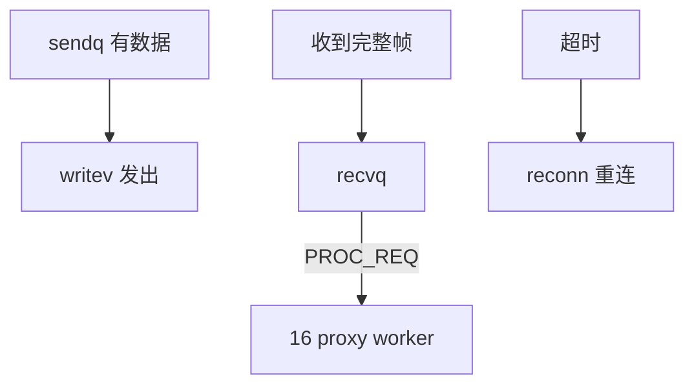

# 15 · Proxy 发送线程 rtmq_proxy_tsvr（下）

> **源文件**：`src/clang/lib/rtmq/proxy/rtmq_proxy_tsvr.c`  
> **模块**：Proxy 发送线程 rtmq_proxy_tsvr（下）  
> **说明**：writev 发送、保活、重连、业务包交给 worker。  
> **阅读建议**：先看文首「函数索引」，再按函数块阅读；`/* ===== 阅读注释 ===== */` 为导读补充。


## 你在这里（总地图定位）

> **层级**：Proxy · 网络  
> **在 RTMQ 中的位置**：tsvr 下半：writev 发送、保活、重连、下行帧交 worker  
> **总地图**：[00-总地图.md](00-总地图.md) · 上一篇 `14-rtmq_proxy_tsvr_part1` · 下一篇 `16-rtmq_proxy_worker`




## 函数索引

| 函数 | 约略位置 |
|------|----------|
| `rtmq_proxy_tsvr_wiov_add` | 见下方代码块 |
| `rtmq_proxy_tsvr_send_data` | 见下方代码块 |
| `rtmq_proxy_tsvr_clear_mesg` | 见下方代码块 |
| `rtmq_proxy_tsvr_sys_mesg_proc` | 见下方代码块 |
| `rtmq_proxy_tsvr_exp_mesg_proc` | 见下方代码块 |
| `rtmq_link_auth_req` | 见下方代码块 |
| `rtmq_link_auth_ack_hdl` | 见下方代码块 |
| `rtmq_add_sub_req` | 见下方代码块 |
| `rtmq_sub_req` | 见下方代码块 |
| `rtmq_proxy_tsvr_cmd_proc_req` | 见下方代码块 |
| `rtmq_proxy_tsvr_cmd_proc_all_req` | 见下方代码块 |
| `rtmq_proxy_rsvr_event_handler` | 见下方代码块 |
| `rtmq_proxy_tsvr_del_conn` | 见下方代码块 |
| `rtmq_proxy_tsvr_reconn` | 见下方代码块 |

## 源码（带阅读注释）

```c
// 文件: src/clang/lib/rtmq/proxy/rtmq_proxy_tsvr.c
// 片段: 行 [(581, 9999)]
 **实现描述:
 **     1. 从消息链表取数据
 **     2. 从发送队列取数据
 **注意事项: WARNNING: 千万勿将共享变量参与MIN()三目运算, 否则可能出现严重错误!!!!且很难找出原因!
 **          原因: MIN()不是原子运算, 使用共享变量可能导致判断成立后, 而返回时共
 **                享变量的值可能被其他进程或线程修改, 导致出现严重错误!
 **作    者: # Qifeng.zou # 2015.12.26 08:23:22 #
 ******************************************************************************/
static int rtmq_proxy_tsvr_wiov_add(rtmq_proxy_tsvr_t *tsvr, rtmq_proxy_sck_t *sck)
{
#define RTSD_POP_NUM    (1024)
    size_t len;
    int num, idx;
    rtmq_header_t *head;
    void *data[RTSD_POP_NUM];
    wiov_t *send = &sck->send;

    /* > 从消息链表取数据 */
    while(!wiov_isfull(send)) {
        /* > 是否有数据 */
        head = (rtmq_header_t *)list_lpop(sck->mesg_list);
        if (NULL == head) {
            break; /* 无数据 */
        } else if (RTMQ_CHKSUM_VAL != head->chksum) {
            assert(0);
        }

        len = sizeof(rtmq_header_t) + head->length;

        /* > 取发送的数据 */
        RTMQ_HEAD_HTON(head, head);

        /* > 设置发送数据 */
        wiov_item_add(send, head, len, NULL, mem_dealloc, mem_dealloc);
    }

    /* > 从发送队列取数据 */
    for (;;) {
        /* > 判断剩余空间(WARNNING: 勿将共享变量参与三目运算, 否则可能出现严重错误!!!) */
        num = MIN(wiov_left_space(send), RTSD_POP_NUM);
        num = MIN(num, ring_used(tsvr->sendq));
        if (0 == num) {
            break; /* 空间不足 */
        }

        /* > 弹出发送数据 */
        num = ring_mpop(tsvr->sendq, data, num);
        if (0 == num) {
            continue;
        }

        log_trace(tsvr->log, "Multi-pop num:%d!", num);

        for (idx=0; idx<num; ++idx) {
            /* > 是否有数据 */
            head = (rtmq_header_t *)data[idx];
            if (RTMQ_CHKSUM_VAL != head->chksum) {
                assert(0);
            }

            len = sizeof(rtmq_header_t) + head->length;

            /* > 设置发送数据 */
            RTMQ_HEAD_HTON(head, head);

            /* > 设置发送数据 */
            wiov_item_add(send, head, len, tsvr->sendq, mem_dealloc, mem_dealloc);
        }
    }

    return 0;
}

/******************************************************************************
 **函数名称: rtmq_proxy_tsvr_send_data
 **功    能: 发送系统消息
 **输入参数:
 **     pxy: 全局信息
 **     tsvr: 发送服务
 **输出参数:
 **返    回: 0:成功 !0:失败
 **实现描述:
 **     1. 填充发送缓存
 **     2. 发送缓存数据
 **     3. 重置标识量
 **注意事项:
 **       ------------------------------------------------
 **      | 已发送 |     待发送     |       剩余空间       |
 **       ------------------------------------------------
 **      |XXXXXXXX|////////////////|                      |
 **      |XXXXXXXX|////////////////|         left         |
 **      |XXXXXXXX|////////////////|                      |
 **       ------------------------------------------------
 **      ^        ^                ^                      ^
 **      |        |                |                      |
 **     addr     optr             iptr                   end
 **作    者: # Qifeng.zou # 2015.01.14 #
 ******************************************************************************/
static int rtmq_proxy_tsvr_send_data(
        rtmq_proxy_t *pxy, rtmq_proxy_tsvr_t *tsvr, rtmq_proxy_sck_t *sck)
{
    ssize_t n;
    wiov_t *send = &sck->send;

    sck->wrtm = time(NULL);

    for (;;) {
        /* 1. 填充发送缓存 */
        if (!wiov_isfull(send)) {
            rtmq_proxy_tsvr_wiov_add(tsvr, sck);
        }

        if (wiov_isempty(send)) {
            break;
        }

        /* 2. 发送缓存数据 */
        n = writev(sck->fd, wiov_item_begin(send), wiov_item_num(send));
        if (n < 0) {
            log_error(tsvr->log, "errmsg:[%d] %s! fd:%u",
                    errno, strerror(errno), sck->fd);
            return RTMQ_ERR;
        } else { /* 只发送了部分数据 */
            wiov_item_adjust(send, n);
            return RTMQ_OK;
        }
    }

    return RTMQ_OK;
}

/******************************************************************************
 **函数名称: rtmq_proxy_tsvr_clear_mesg
 **功    能: 清空发送消息
 **输入参数:
 **     tsvr: 发送服务
 **输出参数: NONE
 **返    回: 0:成功 !0:失败
 **实现描述: 依次取出每条消息, 并释放所占有的空间
 **注意事项:
 **作    者: # Qifeng.zou # 2015.01.16 #
 ******************************************************************************/
static int rtmq_proxy_tsvr_clear_mesg(rtmq_proxy_tsvr_t *tsvr)
{
    void *data;

    while (1) {
        data = list_lpop(tsvr->sck.mesg_list);
        if (NULL == data) {
            return RTMQ_OK;
        }
        free(data);
    }

    return RTMQ_OK;
}

/******************************************************************************
 **函数名称: rtmq_proxy_tsvr_sys_mesg_proc
 **功    能: 系统消息的处理
 **输入参数:
 **     pxy: 全局信息
 **     tsvr: 发送服务
 **     sck: 连接对象
 **输出参数: NONE
 **返    回: 0:成功 !0:失败
 **实现描述: 根据消息类型调用对应的处理接口
 **注意事项:
 **作    者: # Qifeng.zou # 2015.01.16 #
 ******************************************************************************/
static int rtmq_proxy_tsvr_sys_mesg_proc(rtmq_proxy_t *pxy, rtmq_proxy_tsvr_t *tsvr, rtmq_proxy_sck_t *sck, void *addr)
{
    rtmq_header_t *head = (rtmq_header_t *)addr;

    switch (head->type) {
        case RTMQ_CMD_KPALIVE_ACK:      /* 保活应答 */
            log_debug(tsvr->log, "Received keepalive ack!");
            rtmq_set_kpalive_stat(sck, RTMQ_KPALIVE_STAT_SUCC);
            return RTMQ_OK;
        case RTMQ_CMD_AUTH_ACK:         /* 链路鉴权应答 */
            return rtmq_link_auth_ack_hdl(pxy, tsvr, sck, addr + sizeof(rtmq_header_t));
    }

    log_error(tsvr->log, "Unknown type [0x%04X]!", head->type);
    return RTMQ_ERR;
}

/******************************************************************************
 **函数名称: rtmq_proxy_tsvr_exp_mesg_proc
 **功    能: 自定义消息的处理
 **输入参数:
 **     pxy: 全局信息
 **     tsvr: 发送服务
 **     sck: 连接对象
 **     addr: 数据地址
 **输出参数: NONE
 **返    回: 0:成功 !0:失败
 **实现描述: 将自定义消息放入工作队列中, 一次只放入一条数据
 **注意事项:
 **作    者: # Qifeng.zou # 2015.05.19 #
 ******************************************************************************/
static int rtmq_proxy_tsvr_exp_mesg_proc(
        rtmq_proxy_t *pxy, rtmq_proxy_tsvr_t *tsvr, rtmq_proxy_sck_t *sck, void *addr)
{
    void *data;
    int idx, len;
    rtmq_header_t *head = (rtmq_header_t *)addr;

    ++tsvr->recv_total;

    /* > 验证长度 */
    len = RTMQ_DATA_TOTAL_LEN(head);

   /* > 申请空间 */
    idx = rand() % pxy->conf.work_thd_num;

    data = (void *)calloc(1, len);
    if (NULL == data) {
        ++tsvr->drop_total;
        log_error(pxy->log, "Alloc memory failed! drop:%lu recv:%lu len:%d",
                tsvr->drop_total, tsvr->recv_total, len);
        return RTMQ_ERR;
    }

    /* > 放入队列 */
    memcpy(data, addr, len);

    if (ring_push(pxy->recvq[idx], data)) {
        ++tsvr->drop_total;
        log_error(pxy->log, "Push into queue failed! len:%d drop:%lu total:%lu",
                len, tsvr->drop_total, tsvr->recv_total);
        free(data);
        return RTMQ_ERR;
    }

    rtmq_proxy_tsvr_cmd_proc_req(pxy, tsvr, idx);    /* 发送处理请求 */

    return RTMQ_OK;
}

/******************************************************************************
 **函数名称: rtmq_link_auth_req
 **功    能: 发起链路鉴权请求
 **输入参数:
 **     pxy: 全局信息
 **     tsvr: 发送服务
 **输出参数: NONE
 **返    回: 0:成功 !0:失败
 **实现描述: 将鉴权请求放入发送队列中
 **注意事项:
 **作    者: # Qifeng.zou # 2015.05.22 #
 ******************************************************************************/
/* ===== 阅读注释：rtmq_link_auth_req =====
 * 【建链】Proxy 发 AUTH，携带 gid/usr/passwd，Server rtmq_link_auth_req_hdl 校验。
 */
static int rtmq_link_auth_req(rtmq_proxy_t *pxy, rtmq_proxy_tsvr_t *tsvr)
{
    int size;
    void *addr;
    rtmq_header_t *head;
    rtmq_link_auth_req_t *auth;
    rtmq_proxy_sck_t *sck = &tsvr->sck;
    rtmq_proxy_conf_t *conf = &pxy->conf;

    /* > 申请内存空间 */
    size = sizeof(rtmq_header_t) + sizeof(rtmq_link_auth_req_t);

    addr = (void *)calloc(1, size);
    if (NULL == addr) {
        log_error(tsvr->log, "Alloc memory failed!");
        return RTMQ_ERR;
    }

    /* > 设置头部数据 */
    head = (rtmq_header_t *)addr;

    head->type = RTMQ_CMD_AUTH_REQ;
    head->nid = conf->nid;
    head->length = sizeof(rtmq_link_auth_req_t);
    head->flag = RTMQ_SYS_MESG;
    head->chksum = RTMQ_CHKSUM_VAL;

    /* > 设置鉴权信息 */
    auth = (rtmq_link_auth_req_t *)(head + 1);

    auth->gid = htonl(conf->gid);
    snprintf(auth->usr, sizeof(auth->usr), "%s", pxy->conf.auth.usr);
    snprintf(auth->passwd, sizeof(auth->passwd), "%s", pxy->conf.auth.passwd);

    /* > 加入发送列表 */
    if (list_rpush(sck->mesg_list, addr)) {
        free(addr);
        log_error(tsvr->log, "Insert mesg list failed!");
        return RTMQ_ERR;
    }

    log_debug(tsvr->log, "Add link auth request success! fd:[%d]", sck->fd);

    return RTMQ_OK;
}

/******************************************************************************
 **函数名称: rtmq_link_auth_ack_hdl
 **功    能: 链路鉴权请求应答的处理
 **输入参数:
 **     pxy: 全局信息
 **     tsvr: 发送服务
 **     sck: 连接对象
 **     addr: 数据地址
 **输出参数: NONE
 **返    回: 0:成功 !0:失败
 **实现描述: 判断鉴权成功还是失败
 **注意事项:
 **作    者: # Qifeng.zou # 2015.05.22 #
 ******************************************************************************/
static int rtmq_link_auth_ack_hdl(rtmq_proxy_t *pxy,
        rtmq_proxy_tsvr_t *tsvr, rtmq_proxy_sck_t *sck, rtmq_link_auth_ack_t *rsp)
{
    return ntohl(rsp->is_succ)? RTMQ_OK : RTMQ_ERR;
}

/******************************************************************************
 **函数名称: rtmq_add_sub_req
 **功    能: 添加订阅请求
 **输入参数:
 **     item: 消息类型
 **     tsvr: 发送服务
 **输出参数: NONE
 **返    回: 0:成功 !0:失败
 **实现描述: 将订阅请求放入发送队列中
 **注意事项:
 **作    者: # Qifeng.zou # 2016.04.13 00:11:04 #
 ******************************************************************************/
static int rtmq_add_sub_req(rtmq_reg_t *item, rtmq_proxy_tsvr_t *tsvr)
{
    int size;
    void *addr;
    rtmq_header_t *head;
    rtmq_sub_req_t *sub;
    rtmq_proxy_sck_t *sck = &tsvr->sck;
    rtmq_proxy_t *pxy = (rtmq_proxy_t *)tsvr->ctx;
    rtmq_proxy_conf_t *conf = &pxy->conf;

    /* > 申请内存空间 */
    size = sizeof(rtmq_header_t) + sizeof(rtmq_sub_req_t);

    addr = (void *)calloc(1, size);
    if (NULL == addr) {
        log_error(tsvr->log, "errmsg:[%d] %s!", errno, strerror(errno));
        return RTMQ_ERR;
    }

    /* > 设置头部数据 */
    head = (rtmq_header_t *)addr;

    head->type = RTMQ_CMD_SUB_REQ;
    head->nid = conf->nid;
    head->length = sizeof(rtmq_sub_req_t);
    head->flag = RTMQ_SYS_MESG;
    head->chksum = RTMQ_CHKSUM_VAL;

    /* > 设置报体数据 */
    sub = (rtmq_sub_req_t *)(head + 1);

    sub->type = htonl(item->type);

    /* > 加入发送列表 */
    if (list_rpush(sck->mesg_list, addr)) {
        free(addr);
        log_error(tsvr->log, "Insert sub request failed!");
        return RTMQ_ERR;
    }

    log_debug(tsvr->log, "Add sub request. type:0x%04X", item->type);

    return RTMQ_OK;
}

/******************************************************************************
 **函数名称: rtmq_sub_req
 **功    能: 发起订阅请求
 **输入参数:
 **     pxy: 全局信息
 **     tsvr: 发送服务
 **输出参数: NONE
 **返    回: 0:成功 !0:失败
 **实现描述: 将订阅请求放入发送队列中
 **注意事项:
 **作    者: # Qifeng.zou # 2016.04.13 00:11:04 #
 ******************************************************************************/
static int rtmq_sub_req(rtmq_proxy_t *pxy, rtmq_proxy_tsvr_t *tsvr)
{
    return avl_trav(pxy->reg, (trav_cb_t)rtmq_add_sub_req, (void *)tsvr);
}

/******************************************************************************
 **函数名称: rtmq_proxy_tsvr_cmd_proc_req
 **功    能: 发送处理请求
 **输入参数:
 **     pxy: 全局对象
 **     tsvr: 接收服务
 **     rqid: 队列ID(与工作队列ID一致)
 **输出参数: NONE
 **返    回: >0:成功 <=0:失败
 **实现描述:
 **注意事项:
 **作    者: # Qifeng.zou # 2015.06.08 #
 ******************************************************************************/
static int rtmq_proxy_tsvr_cmd_proc_req(rtmq_proxy_t *pxy, rtmq_proxy_tsvr_t *tsvr, int rqid)
{
    rtmq_cmd_t cmd;
    rtmq_cmd_proc_req_t *req = (rtmq_cmd_proc_req_t *)&cmd.param;

    memset(&cmd, 0, sizeof(cmd));

    cmd.type = RTMQ_CMD_PROC_REQ;
    req->ori_svr_id = tsvr->id;
    req->num = -1;
    req->rqidx = rqid;

    /* > 发送处理命令 */
    return pipe_write(&pxy->work_cmd_fd[rqid], &cmd, sizeof(rtmq_cmd_t));
}

/******************************************************************************
 **函数名称: rtmq_proxy_tsvr_cmd_proc_all_req
 **功    能: 发送处理请求
 **输入参数:
 **     pxy: 全局对象
 **     tsvr: 接收服务
 **输出参数: NONE
 **返    回: 0:成功 !0:失败
 **实现描述: 遍历所有接收队列, 并发送处理请求
 **注意事项:
 **作    者: # Qifeng.zou # 2015.06.08 #
 ******************************************************************************/
static int rtmq_proxy_tsvr_cmd_proc_all_req(rtmq_proxy_t *pxy, rtmq_proxy_tsvr_t *tsvr)
{
    int idx;

    for (idx=0; idx<pxy->conf.send_thd_num; ++idx) {
        rtmq_proxy_tsvr_cmd_proc_req(pxy, tsvr, idx);
    }

    return RTMQ_OK;
}

/******************************************************************************
 **函数名称: rtmq_proxy_rsvr_event_handler
 **功    能: 事件处理函数
 **输入参数:
 **     pxy: 全局对象
 **     tsvr: 接收服务
 **输出参数: NONE
 **返    回: 0:成功 !0:失败
 **实现描述: 
 **注意事项:
 **作    者: # Qifeng.zou # 2017.11.30 11:09:14 #
 ******************************************************************************/
static int rtmq_proxy_rsvr_event_handler(
        rtmq_proxy_t *pxy, rtmq_proxy_tsvr_t *tsvr, int num)
{
    int idx, ret;
    rtmq_proxy_sck_t *sck;

    for (idx=0; idx<num; idx++) {
        sck = (rtmq_proxy_sck_t *)tsvr->events[idx].data.ptr;

        /* 可读处理 */
        if (tsvr->events[idx].events & EPOLLIN) {
            /* 接收网络数据 */
            ret = sck->recv_cb(pxy, tsvr, sck);
            if (RTMQ_AGAIN != ret) {
                log_info(tsvr->log, "Delete connection! fd:%d", sck->fd);
                rtmq_proxy_tsvr_del_conn(pxy, tsvr, sck);
                continue; /* 异常-关闭SCK: 不必判断是否可写 */
            }
        }

        /* 可写处理 */
        if (tsvr->events[idx].events & EPOLLOUT) {
            /* 发送网络数据 */
            ret = sck->send_cb(pxy, tsvr, sck);
            if (RTMQ_ERR == ret) {
                log_info(tsvr->log, "Delete connection! fd:%d", sck->fd);
                rtmq_proxy_tsvr_del_conn(pxy, tsvr, sck);
                continue; /* 异常: 套接字已关闭 */
            }
        }
    }

    return 0;
}

/******************************************************************************
 **函数名称: rtmq_proxy_tsvr_del_conn
 **功    能: 删除连接信息
 **输入参数:
 **     pxy: 全局对象
 **     tsvr: 接收服务
 **     sck: 套接字对象
 **输出参数: NONE
 **返    回: 0:成功 !0:失败
 **实现描述: 
 **注意事项:
 **作    者: # Qifeng.zou # 2017.11.30 15:03:53 #
 ******************************************************************************/
static int rtmq_proxy_tsvr_del_conn(
        rtmq_proxy_t *pxy, rtmq_proxy_tsvr_t *tsvr, rtmq_proxy_sck_t *sck)
{
    struct epoll_event ev;
    wiov_t *send = &tsvr->sck.send;
    rtmq_snap_t *recv = &sck->recv;

    epoll_ctl(tsvr->epid, EPOLL_CTL_DEL, sck->fd, &ev);
    
    CLOSE(sck->fd);
    wiov_clean(send);
    rtmq_snap_reset(recv);

    return RTMQ_OK;
}

/******************************************************************************
 **函数名称: rtmq_proxy_tsvr_reconn
 **功    能: 重连服务端
 **输入参数:
 **     pxy: 全局对象
 **     tsvr: 接收服务
 **     sck: 连接对象
 **输出参数: NONE
 **返    回: 0:成功 !0:失败
 **实现描述: 
 **注意事项:
 **作    者: # Qifeng.zou # 2017.11.30 03:24:12 #
 ******************************************************************************/
static int rtmq_proxy_tsvr_reconn(
        rtmq_proxy_t *pxy, rtmq_proxy_tsvr_t *tsvr, rtmq_proxy_sck_t *sck)
{
    struct epoll_event ev;

    /* 1. 重连SERVER端 */
    sck->fd = tcp_connect(AF_INET, tsvr->ipaddr, tsvr->port);
    if (sck->fd < 0) {
        log_error(tsvr->log, "Conncet [%s:%d] failed! errmsg:[%d] %s!",
                tsvr->ipaddr, tsvr->port, errno, strerror(errno));
        return RTMQ_ERR;
    }

    sck->recv_cb = (rtmq_proxy_socket_recv_cb_t)rtmq_proxy_tsvr_recv_proc;
    sck->send_cb = (rtmq_proxy_socket_send_cb_t)rtmq_proxy_tsvr_send_data;

    rtmq_set_kpalive_stat(sck, RTMQ_KPALIVE_STAT_UNKNOWN);  /* 设置保活状态 */

    /* 2. 发起鉴权&订阅 */
/* ===== 阅读注释：rtmq_link_auth_req =====
 * 【建链】Proxy 发 AUTH，携带 gid/usr/passwd，Server rtmq_link_auth_req_hdl 校验。
 */
    rtmq_link_auth_req(pxy, tsvr);                          /* 发起鉴权请求 */
    rtmq_sub_req(pxy, tsvr);                                /* 发起订阅请求 */

    /* 3. 加入侦听事件 */
    memset(&ev, 0, sizeof(ev));

    ev.data.ptr = sck;
    ev.events = EPOLLIN | EPOLLOUT | EPOLLET; /* 边缘触发 */

    epoll_ctl(tsvr->epid, EPOLL_CTL_ADD, sck->fd, &ev);

    return RTMQ_OK;
}

```

---

## 本篇流程图

（与文首「你在这里」相同，便于从目录跳转）


**回到总地图**：[00-总地图.md](00-总地图.md#2-十七篇文档在代码里的位置总组件图)
