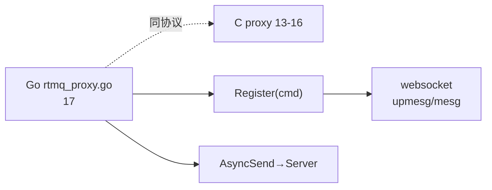

# 17 · Go 封装对照 rtmq_proxy.go

> **源文件**：`src/golang/lib/rtmq/rtmq_proxy.go`  
> **模块**：Go 封装对照 rtmq_proxy.go  
> **说明**：Go 版 Proxy：与 C 同协议，websocket/usrsvr/msgsvr 实际用的这层。  
> **阅读建议**：先看文首「函数索引」，再按函数块阅读；`/* ===== 阅读注释 ===== */` 为导读补充。


## 你在这里（总地图定位）

> **层级**：Go 对照  
> **在 RTMQ 中的位置**：websocket/usrsvr/msgsvr 实际链接层，与 13-16 同角色  
> **总地图**：[00-总地图.md](00-总地图.md) · 上一篇 `16-rtmq_proxy_worker` · 下一篇 `00-总地图 回放`




## 源码（带阅读注释）

```c
// 文件: src/golang/lib/rtmq/rtmq_proxy.go
// 片段: 行 [(1, 400)]
package rtmq

import (
	"bytes"
	"encoding/binary"
	"errors"
	"io"
	"math/rand"
	"net"
	"strings"
	"sync"
	"sync/atomic"
	"time"

	"github.com/astaxie/beego/logs"
)

var (
	RTMQ_HEAD_SIZE uint32 = uint32(binary.Size(RtmqHeader{})) /* RTMQ协议头长度 */
)

/* 错误类型 */
var (
	TCP_ERR_CONN_CLOSING   = errors.New("Use of closed network connection")
	TCP_ERR_WRITE_BLOCKING = errors.New("Write packet was blocking")
	TCP_ERR_READ_BLOCKING  = errors.New("Read packet was blocking")
)

/* 常量定义 */
const (
	RTMQ_MSGQ_NUM    = 10         /* 收发队列个数 */
	RTMQ_CHKSUM_VAL  = 0x1FE23DC4 /* 校验值 */
	RTMQ_USR_MAX_LEN = 32         /* 用户名长度 */
	RTMQ_PWD_MAX_LEN = 16         /* 登录密码长度 */
	RTMQ_SYS_DATA    = 0          /* 系统数据 */
	RTMQ_USR_DATA    = 1          /* 业务数据 */
)

/* 保活状态 */
const (
	RTMQ_KPALIVE_STAT_UNKNOWN = 0 /* 未知 */
	RTMQ_KPALIVE_STAT_SENT    = 1 /* 已发送 */
	RTMQ_KPALIVE_STAT_SUCC    = 2 /* 成功 */
	RTMQ_KPALIVE_STAT_FAIL    = 3 /* 失败 */
)

/* 命令类型 */
const (
	RTMQ_CMD_UNKNOWN             = 0      /* 未知命令 */
	RTMQ_CMD_AUTH_REQ            = 0x0001 /* 链路鉴权请求 */
	RTMQ_CMD_AUTH_ACK            = 0x0002 /* 链路鉴权应答 */
	RTMQ_CMD_KPALIVE_REQ         = 0x0003 /* 链路保活请求 */
	RTMQ_CMD_KPALIVE_ACK         = 0x0004 /* 链路保活应答 */
	RTMQ_CMD_SUB_REQ             = 0x0005 /* 订阅请求: 将消息只发送给一个用户 */
	RTMQ_CMD_SUB_ACK             = 0x0006 /* 订阅应答 */
	RTMQ_CMD_ADD_SCK             = 0x0009 /* 接收客户端数据-请求 */
	RTMQ_CMD_DIST_REQ            = 0x000A /* 分发任务请求 */
	RTMQ_CMD_PROC_REQ            = 0x000B /* 处理客户端数据-请求 */
	RTMQ_CMD_SEND                = 0x000C /* 发送数据-请求 */
	RTMQ_CMD_SEND_ALL            = 0x000D /* 发送所有数据-请求 */
	RTMQ_CMD_QUERY_CONF_REQ      = 0x1001 /* "查询"配置信息-请求 */
	RTMQ_CMD_QUERY_CONF_ACK      = 0x1002 /* "查询"配置信息-应答 */
	RTMQ_CMD_QUERY_RECV_STAT_REQ = 0x1003 /* "查询"接收状态-请求 */
	RTMQ_CMD_QUERY_RECV_STAT_ACK = 0x1004 /* "查询"接收状态-应答 */
	RTMQ_CMD_QUERY_PROC_STAT_REQ = 0x1005 /* "查询"处理状态-请求 */
	RTMQ_CMD_QUERY_PROC_STAT_ACK = 0x1006 /* "查询"处理状态-应答 */
)

/* 配置信息 */
type ProxyConf struct {
	Id          uint32 /* 结点ID */
	Gid         uint32 /* 分组ID */
	Usr         string /* 用户名 */
	Passwd      string /* 登录密码 */
	RemoteAddr  string /* 对端IP地址 */
	WorkerNum   uint32 /* 工作协程数 */
	SendChanLen uint32 /* 发送队列长度 */
	RecvChanLen uint32 /* 接收队列长度 */
}
type RtmqPacket struct {
	head []byte /* 头部数据 */
	body []byte /* 报体数据 */
}
type RtmqRecvPacket struct {
	head []byte /* 头部数据 */
	body []byte /* 报体数据 */
}

/* 协议头 */
type RtmqHeader struct {
	cmd    uint32 /* 消息类型 */
	nid    uint32 /* 结点ID */
	flag   uint32 /* 消息标识(0:系统消息 1:业务消息) */
	length uint32 /* 报体长度 */
	chksum uint32 /* 校验值(固定为0x1FE23DE4) */
}

type RtmqRegCb func(cmd uint32, orig uint32, data []byte, length uint32, param interface{}) int

/* 回调注册项 */
type RtmqRegItem struct {
	cmd   uint32      /* 命令类型 */
	proc  RtmqRegCb   /* 回调函数 */
	param interface{} /* 附加参数 */
}

/* TCP连接对象 */
type ProxyConn struct {
	svr           *ProxyServer
	conn          *net.TCPConn         /* 原始TCP连接 */
	extra         interface{}          /* 扩展数据 */
	is_close      int32                /* 连接是否关闭 */
	sendq         chan *RtmqPacket     /* 普通消息发送队列 */
	mesgq         chan *RtmqPacket     /* 系统消息发送队列 */
	recvq         chan *RtmqRecvPacket /* 普通消息接收队列 */
	closeq        chan struct{}        /* 关闭通道 */
	close_once    sync.Once            /* 连接只允许被关闭一次 */
	is_auth       bool                 /* 鉴权是否成功 */
	kpalive_time  int64                /* 发送保活的时间 */
	kpalive_stat  int32                /* 保活状态 */
	kpalive_times int32                /* 保活尝试次数 */
}

/* 代理服务 */
type ProxyServer struct {
	ctx       *Proxy               /* 全局对象 */
	conf      *ProxyConf           /* 配置信息 */
	addr      string               /* 远程IP地址 */
	log       *logs.BeeLogger      /* 日志对象 */
	sendq     chan *RtmqPacket     /* 发送队列 */
	recvq     chan *RtmqRecvPacket /* 接收队列 */
	exitq     chan struct{}        /* 通知所有协程退出 */
	waitGroup *sync.WaitGroup      /* 用于等待所有协程 */
}

/* 上下文信息 */
type Proxy struct {
	conf      *ProxyConf                          /* 配置数据 */
	log       *logs.BeeLogger                     /* 日志对象 */
	reg       map[uint32]*RtmqRegItem             /* 回调注册 */
	server    []*ProxyServer                      /* 服务对象 */
	addr_list []string                            /* IP列表 */
	sendq     [RTMQ_MSGQ_NUM]chan *RtmqPacket     /* 发送队列 */
	recvq     [RTMQ_MSGQ_NUM]chan *RtmqRecvPacket /* 接收队列 */
}

/* 获取日志对象 */
func (pxy *Proxy) GetLog() *logs.BeeLogger {
	return pxy.log
}

/******************************************************************************
 **函数名称: dial
 **功    能: 连接远端服务
 **输入参数:
 **     addr: 远程IP地址(格式:${IP}:${PORT})
 **输出参数: NONE
 **返    回:
 **     conn: 连接对象
 **     err: 错误信息
 **实现描述:
 **注意事项:
 **作    者: # Qifeng.zou # 2016.10.30 20:56:41 #
 ******************************************************************************/
func dial(addr string) (conn *net.TCPConn, err error) {
	tcp_addr, err := net.ResolveTCPAddr("tcp4", addr)
	if nil != err {
		return nil, err
	}

	conn, err = net.DialTCP("tcp", nil, tcp_addr)
	if nil != err {
		return nil, err
	}

	return conn, nil
}

/******************************************************************************
 **函数名称: OnConnect
 **功    能: 连接远端服务
 **输入参数:
 **     c: 连接对象
 **输出参数: NONE
 **返    回: true:成功 false:失败
 **实现描述:
 **注意事项:
 **作    者: # Qifeng.zou # 2016.10.30 20:56:41 #
 ******************************************************************************/
func (svr *ProxyServer) OnConnect(c *ProxyConn) bool {
	return true
}

/******************************************************************************
 **函数名称: OnMessage
 **功    能: 消息处理
 **输入参数:
 **     c: 连接对象
 **输出参数: NONE
 **返    回: true:成功 false:失败
 **实现描述:
 **     1. 如果是内部消息, 则调用mesg_handler()进行处理
 **     2. 如果是扩展消息, 则查找对应回调proc()进行处理
 **注意事项:
 **作    者: # Qifeng.zou # 2016.10.30 21:06:03 #
 ******************************************************************************/
func (svr *ProxyServer) OnMessage(c *ProxyConn, p *RtmqRecvPacket) bool {
	ctx := svr.ctx
	defer func() {
		if err := recover(); nil != err {
			ctx.log.Error("On message crashed! errmsg:%s", err)
		}
	}()

	header := rtmq_head_ntoh(p)

	/* 内部消息处理 */
	if RTMQ_SYS_DATA == header.flag {
		return c.mesg_handler(header.cmd, p)
	}

	/* 获取CMD对应的注册项 */
	item, ok := ctx.reg[header.cmd]
	if !ok {
		item, ok = ctx.reg[0] /* 0:表示默认处理 */
		if !ok {
			ctx.log.Error("Drop unknown data! cmd:%d", header.cmd)
			return false
		}
	}

	/* 调用注册处理函数 */
	item.proc(header.cmd, header.nid, p.body[:], header.length, item.param)

	return true
}

/******************************************************************************
 **函数名称: OnClose
 **功    能: 连接被关闭
 **输入参数:
 **     c: 连接对象
 **输出参数: NONE
 **返    回: VOID
 **实现描述:
 **注意事项:
 **作    者: # Qifeng.zou # 2016.10.30 21:06:03 #
 ******************************************************************************/
func (svr *ProxyServer) OnClose(c *ProxyConn) {
	svr.log.Error("Connection was closed! ip:%svr", c.GetRawConn().RemoteAddr())
}

/******************************************************************************
 **函数名称: ProxyInit
 **功    能: 初始化PROXY服务
 **输入参数:
 **     conf: 配置数据
 **     log: 日志对象
 **输出参数: NONE
 **返    回: 上下文对象
 **实现描述:
 **注意事项:
 **作    者: # Qifeng.zou # 2016.10.30 21:09:33 #
 ******************************************************************************/
func ProxyInit(conf *ProxyConf, log *logs.BeeLogger) *Proxy {
	ctx := &Proxy{}

	ctx.log = log
	ctx.conf = conf

	/* > 校验${IP}:${PORT}格式的准确性 */
	addr_list := strings.Split(conf.RemoteAddr, ",")

	for _, addr := range addr_list {
		addr = string(bytes.TrimSpace([]byte(addr)))
		if 0 == len(addr) {
			continue
		}

		_, err := net.ResolveTCPAddr("tcp4", addr)
		if nil != err {
			return nil /* 格式非法 */
		}

		ctx.addr_list = append(ctx.addr_list, addr)
	}

	/* > 生成收发队列 */
	for idx := 0; idx < RTMQ_MSGQ_NUM; idx += 1 {
		ctx.sendq[idx] = make(chan *RtmqPacket, conf.SendChanLen)
		ctx.recvq[idx] = make(chan *RtmqRecvPacket, conf.RecvChanLen)
	}

	/* > 生成服务对象列表 */
	for n := 0; n < len(ctx.addr_list); n += 1 {
		for m := 0; m < RTMQ_MSGQ_NUM; m += 1 {
			server := ctx.server_new(ctx.addr_list[n],
				ctx.sendq[m%RTMQ_MSGQ_NUM], ctx.recvq[m%RTMQ_MSGQ_NUM])
			ctx.server = append(ctx.server, server)
		}
	}

	ctx.reg = make(map[uint32]*RtmqRegItem, 0)

	return ctx
}

/******************************************************************************
 **函数名称: Register
 **功    能: 回调注册函数
 **输入参数:
 **     cmd: 消息类型
 **     proc: 消息处理回调
 **     param: 附加参数
 **输出参数: NONE
 **返    回: true:成功 false:失败
 **实现描述:
 **注意事项:
 **作    者: # Qifeng.zou # 2016.10.30 21:17:46 #
 ******************************************************************************/
func (ctx *Proxy) Register(cmd uint32, proc RtmqRegCb, param interface{}) bool {
	item := &RtmqRegItem{}

	if _, ok := ctx.reg[cmd]; ok {
		return false
	}

	item.cmd = cmd
	item.proc = proc
	item.param = param

	ctx.reg[cmd] = item
	return true
}

/******************************************************************************
 **函数名称: Launch
 **功    能: 启动PROXY服务
 **输入参数: NONE
 **输出参数: NONE
 **返    回: VOID
 **实现描述:
 **注意事项:
 **作    者: # Qifeng.zou # 2016.10.30 21:24:34 #
 ******************************************************************************/
func (ctx *Proxy) Launch() {
	for idx := 0; idx < len(ctx.server); idx += 1 {
		go ctx.server[idx].StartConnector(3)
	}
}

/******************************************************************************
 **函数名称: AsyncSend
 **功    能: 发送数据
 **输入参数:
 **     cmd: 数据类型
 **     data: 数据内容
 **     length: 数据长度
 **输出参数: NONE
 **返    回: 0:成功 !0:失败
 **实现描述: 将数据放入发送队列
 **注意事项:
 **作    者: # Qifeng.zou # 2016.11.01 09:36:10 #
 ******************************************************************************/
func (ctx *Proxy) AsyncSend(cmd uint32, data []byte, length uint32) int {
	/* > 设置协议头 */
	head := &RtmqHeader{}

	head.cmd = cmd
	head.nid = ctx.conf.Id
	head.length = length
	head.flag = RTMQ_USR_DATA
	head.chksum = RTMQ_CHKSUM_VAL

	/* > 字节序转换 */
	p := &RtmqPacket{}
	p.head = make([]byte, RTMQ_HEAD_SIZE)
	p.body = make([]byte, length)

	rtmq_head_hton(head, p)
	copy(p.body, data)

	/* > 放入发送队列 */
	idx := rand.Intn(len(ctx.server))

	select {
	case ctx.server[idx].sendq <- p:
		ctx.log.Debug("Send data success! cmd:0x%04x len:%d", cmd, length)
		return 0
	case <-time.After(1 * time.Second): /* 超时则丢弃 */
		ctx.log.Error("Send data timeout! cmd:0x%04x len:%d", cmd, length)
		return -1
	}

	return 0
}

/******************************************************************************
 **函数名称: server_new
 **功    能: 新建PROXY服务对象

```

---

## 本篇流程图

（与文首「你在这里」相同，便于从目录跳转）


**回到总地图**：[00-总地图.md](00-总地图.md#2-十七篇文档在代码里的位置总组件图)
