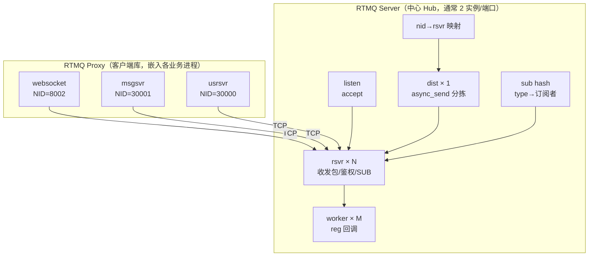
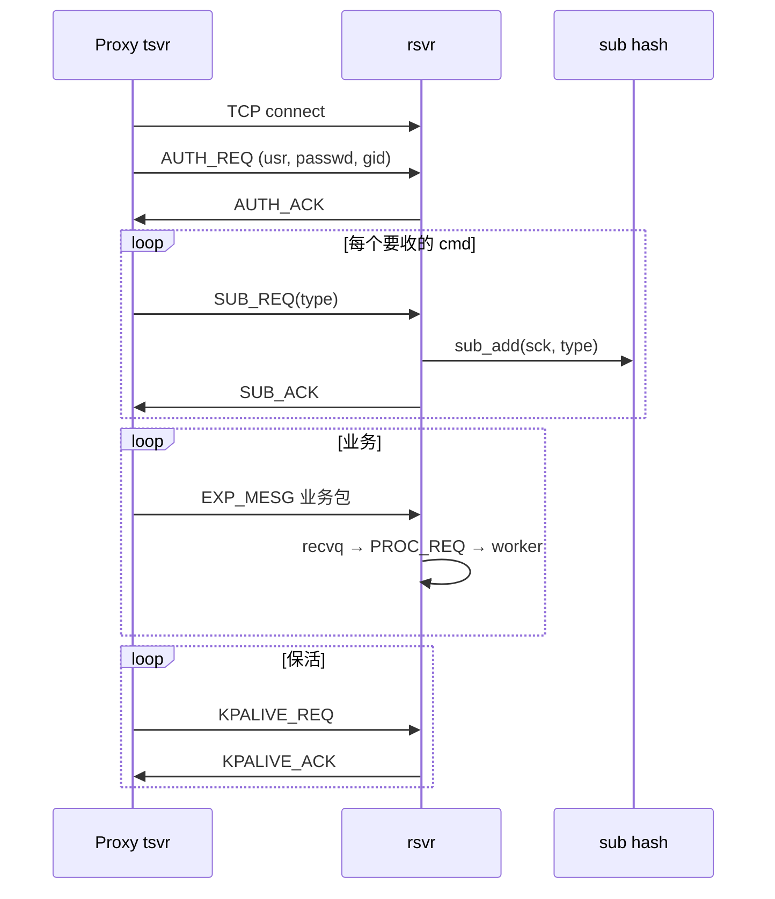

# RTMQ 技术设计文档

> **文档性质**：依据现有 C/Go 源码（`src/clang/lib/rtmq/`、`src/golang/lib/rtmq/`）反推整理，相当于「设计之初应有、但当时未单独成文」的架构说明。  
> **读者**：IM 后端开发、网关/中间件方向面试准备。  
> **配套**：[00-总地图](00-总地图.md)（阅读地图）· [群聊Demo视角解读](群聊Demo视角解读RTMQ.md)（业务对照）· [02～17 模块导读](README.md)（源码逐函数注释）

| 项 | 内容 |
|----|------|
| 组件名 | RTMQ（Real-Time Message Queue，实时消息队列） |
| 首版作者 | Qifeng.zou，2014.12～2017 |
| 语言 | Server/Proxy 核心 C；必嗨 Go 业务栈使用 Go Proxy |
| 状态 | 生产使用（与 frwder 同栈部署） |

---

## 1. 背景与要解决的问题

### 1.1 业务背景

必嗨 IM 由多个 **独立进程** 组成：接入（websocket/listend）、用户（usrsvr）、消息（msgsvr）、任务（tasker）等。它们需要：

- 在 **毫秒级** 延迟下交换 IM 业务帧（非日志、非批处理）；
- **水平扩展** 接入层（多个 websocket NID）与业务层（多个 msgsvr 实例）；
- 接入与业务 **解耦**：新增业务进程不应让接入层维护 N×M 条 TCP 连接。

### 1.2 不采用通用 MQ 的原因

| 维度 | Kafka / RabbitMQ 等 | RTMQ 设计取向 |
|------|---------------------|---------------|
| 持久化 | 默认持久化、可回溯 | **不持久化**，内存队列，丢包即丢 |
| 延迟 | ms～s 级，偏吞吐 | **亚毫秒～毫秒**，偏在线 IM |
| 路由语义 | Topic / Queue / Exchange | **cmd 订阅广播 + nid 单播** |
| 部署 | 独立集群 | **与 frwder 同机轻量进程**，单中心 Hub |
| 协议 | 各自私有 | **固定 20 字节头 + 业务 payload** |

RTMQ 的定位是 **进程间消息总线（Message Bus）**，不是数据平台意义上的「消息队列产品」。

### 1.3 设计边界（Non-Goals）

- 不理解 IM 语义（群、好友、会话）；只认 **cmd/type** 与 **nid**。
- 不提供跨机房多活、消息持久化、消费位点、事务消息。
- 不替代 Redis/Mongo 做状态存储；路由表（订阅、nid→连接）仅在 **Server 内存** 中。
- 不承担客户端长连接；长连接由 listend/websocket 负责，RTMQ 只服务 **进程间** TCP。

---

## 2. 设计目标

| 目标 | 实现手段 |
|------|----------|
| **低延迟转发** | 内存 ring/queue、writev 批量发送、无磁盘 IO |
| **接入/业务解耦** | 各进程仅维护 **一条** 到 RTMQ Server 的 TCP（Proxy） |
| **两种路由** | `publish(type)` 广播给所有 SUB 者；`async_send(type, nid)` 单播 |
| **水平扩展接入** | 每个接入进程唯一 **NID**；下行按 NID 选连接 |
| **线程安全 API** | 业务线程只调 `publish`/`async_send`/`proxy_async_send`；内部队列 + pipe 唤醒 |
| **可观测** | 系统 cmd 查询 conf/recv_stat/proc_stat |
| **双栈** | C Server + C Proxy 为权威实现；Go Proxy 供 Go 业务进程使用 |

---

## 3. 总体架构

### 3.1 逻辑角色



- **Server**：中心节点，维护所有 Proxy 的 TCP 连接、订阅表、路由表。
- **Proxy**：进程内库，负责连 Server、发队列、收下行、调本地 `reg` 回调。

### 3.2 必嗨 IM 中的部署：frwder 双端口

frwder 进程内运行 **两个** RTMQ Server 实例，形成「接入平面 / 业务平面」：

| 端口 | 名称 | 谁连上来 | 典型数据流 |
|------|------|----------|------------|
| **28888** | FORWARD | websocket、listend（接入 Proxy） | 上行入口、下行出口 |
| **28889** | BACKEND | usrsvr、msgsvr、tasker（业务 Proxy） | 上行出口、下行入口 |

frwder 在两个 Server 上各注册 **默认转发 handler**（`frwd_mesg.c`）：

```text
FORWARD 收到接入上行  →  rtmq_publish(BACKEND, type, data)     // 广播给订阅该 cmd 的业务进程
BACKEND 收到业务下行  →  rtmq_async_send(FORWARD, type, nid, data) // nid 取自 IM 帧头 MesgHeader.nid
```

因此 **一条群聊消息** 在进程间路径为：

```text
浏览器 → websocket:8002 → [28888 FORWARD] → publish → msgsvr:30001
msgsvr fan-out → [28889 BACKEND] → async_send(nid=8003) → [28888 FORWARD] → websocket:8003
```

Go 群聊 Demo 走 **Go Proxy + C frwder**，语义与上表一致。

### 3.3 与业务层的分工

| 层 | 职责 | 群聊示例 |
|----|------|----------|
| **RTMQ** | cmd 订阅路由、nid 单播、TCP 传输 | 把 `GROUP-CHAT` 送到 msgsvr；把下行送到 NID=8002 |
| **frwder** | 双平面 publish/async_send 桥接 | 28888↔28889 默认转发 |
| **业务 Go/C** | 群成员、Redis gid→nid、ImGroup fan-out | msgsvr 查 Redis 后对每个 nid 发一包 |
| **接入** | WebSocket 会话、cid 映射 | TravImGroupSession 第二段 fan-out |

---

## 4. 核心概念

### 4.1 结点标识

| 字段 | 含义 | 约束 |
|------|------|------|
| **NID** | Node ID，进程实例唯一标识 | Proxy 配置 `conf.nid`；鉴权后绑定到 TCP 连接 |
| **GID** | Group ID，分组（运营商/机房） | 订阅表按 GID 分组，publish 时可按组 fan-out |
| **SID** | Session ID，连接会话 | accept 时递增，用于 SUB 表去重 |

### 4.2 消息类型：系统 cmd vs 业务 cmd

RTMQ 报头 `flag` 区分：

| flag | 含义 | type 取值 |
|------|------|-----------|
| `RTMQ_SYS_MESG (0)` | 系统命令 | `rtmq_mesg_e`：AUTH、SUB、DIST_REQ… |
| `RTMQ_EXP_MESG (1)` | 业务消息 | 与 `comm/mesg.go` 中 `CMD_*` 一致，如 `0x030B GROUP-CHAT` |

业务 payload 通常是 **IM MesgHeader + body**（protobuf），RTMQ 将其视为 opaque bytes。

### 4.3 两种路由语义（设计核心）

| API | 调用方 | 路由键 | 语义 | 典型场景 |
|-----|--------|--------|------|----------|
| **publish(ctx, type, data, len)** | Server 端（frwder backend worker） | **type/cmd** | 查 **sub hash**，向所有 SUB 了该 type 的连接推送 | 接入上行 → 所有 msgsvr/usrsvr |
| **async_send(ctx, type, dest_nid, data, len)** | Server 端 | **dest_nid** | 查 **nid→rsvr 映射**，经 dist 线程送到对应 Proxy | 业务下行 → 指定 websocket NID |

Proxy 侧对外只有 **async_send**（C: `rtmq_proxy_async_send`；Go: `Proxy.AsyncSend`）：把业务帧送入 Server，由 Server 侧 worker + frwder 决定 publish 还是再 async_send。

**设计约定**：

- Proxy 发出时，RTMQ 头 `nid = 本进程 NID`（**源**）。
- Server 侧 `async_send` 时，RTMQ 头 `nid = 目的 NID`（**宿**）。
- frwder 下行从 **IM MesgHeader.nid** 读取目的接入 NID，写入 Server `async_send`。

### 4.4 订阅（SUB）

Proxy 建连鉴权成功后，对需要 **接收** 的每个业务 cmd 发送 `RTMQ_CMD_SUB_REQ`（可多次）。Server 在 **sub hash** 中记录：

```text
type (cmd) → groups (按 gid) → nodes (sid, nid)
```

- **publish** 时遍历该 type 下所有 node，对每个 node 调用 `async_send(..., node.nid, ...)`（见 `rtmq_pub_group_trav_cb`）。
- 同一 type 可被多个进程 SUB（如多个 msgsvr 实例做竞争消费需业务层自行去重——RTMQ **默认广播给所有 SUB 者**）。

---

## 5. 协议设计

### 5.1 RTMQ 报文格式

```text
┌──────────────────────────────────────────────────────────┐
│ rtmq_header_t (20 bytes, packed, network byte order)     │
├──────────┬──────────┬──────────┬──────────┬──────────────┤
│ type     │ nid      │ flag     │ length   │ chksum       │
│ uint32   │ uint32   │ uint32   │ uint32   │ uint32       │
├──────────┴──────────┴──────────┴──────────┴──────────────┤
│ payload (length bytes)                                     │
└──────────────────────────────────────────────────────────┘
```

- **chksum** 固定魔数 `0x1FE23DC4`，用于帧边界校验（非加密）。
- TCP 流式传输：rsvr 用 **snap 缓冲区** 拼帧，完整一帧后入 recvq。

### 5.2 系统命令（节选）

| cmd | 方向 | 作用 |
|-----|------|------|
| AUTH_REQ / AUTH_ACK | Proxy→Server | 用户名密码 + gid，绑定 nid |
| KPALIVE_REQ / ACK | 双向 | 默认 30s 间隔保活 |
| SUB_REQ / SUB_ACK | Proxy→Server | 声明接收某业务 type |
| ADD_SCK | listen→rsvr | 新连接 fd 交给 rsvr 线程 |
| DIST_REQ | dist→rsvr | dist 队列有数据，唤醒 rsvr 发送 |
| PROC_REQ | rsvr→worker | recvq 有完整业务包待处理 |
| SEND / SEND_ALL | rsvr | 写 socket / writev 刷出 |

### 5.3 与 IM 业务帧的关系

```text
[ RTMQ header | IM MesgHeader | protobuf body ]
     ↑ RTMQ 层              ↑ 业务层（RTMQ 不解析）
```

- 上行：websocket 在 IM 头里填 **源 NID**；RTMQ 头 nid = 接入进程 NID。
- 下行：msgsvr 在 IM 头里填 **目的 NID**（接入实例）；frwder 读 IM 头后 Server async_send。

---

## 6. Server 详细设计

### 6.1 全局上下文 `rtmq_cntx_t`

关键成员（见 `rtmq_recv.h`）：

| 成员 | 用途 |
|------|------|
| `connq[]` | listen accept 的新连接，按 idx 分给 rsvr |
| `recvq[]` | rsvr 拼好帧后，供 worker 消费 |
| `sendq[]` | rsvr 待发数据（含 dist 投递） |
| `distq[]` | **async_send 入口队列**（外部 API 只写这里） |
| `sub` | hash：type → 订阅者列表 |
| `node_to_svr_map` | AVL：nid → 哪个 rsvr 线程持有该连接 |
| `reg` | AVL：type → Server 侧业务回调（frwder 注册） |
| `recvtp` / `worktp` | rsvr / worker 线程池 |

### 6.2 线程模型

```text
┌─────────────┐
│ listen × 1  │  accept → connq[i] → pipe(ADD_SCK) → rsvr[i]
└─────────────┘

┌─────────────┐     recvq        ┌─────────────┐
│ rsvr × N    │ ───────────────► │ worker × M  │ → reg(type) 业务/frwder
│ select 读写 │ ◄── sendq        └─────────────┘
└─────────────┘

┌─────────────┐     distq        nid 映射
│ dist × 1    │ ──pop──► sendq[rsvr_idx] ──► pipe(DIST_REQ)
└─────────────┘
```

**设计要点**：

1. **listen 与 rsvr 分离**：accept 不阻塞收包；连接通过 connq + pipe 移交。
2. **rsvr 按连接 stick**：同一 TCP 始终在同一 rsvr 线程，减少锁竞争。
3. **worker 与 recvq 绑定**：`recvq_num = WORKER_HDL_QNUM × work_thd_num`（默认每 worker 2 队列）。
4. **dist 单线程**：统一从 distq 取出 async_send 包，查 nid→rsvr，push 到对应 sendq；避免多线程写 sendq 竞态。
5. **pipe 唤醒**：队列生产者写 pipe，消费者 select 立即处理，避免忙等。

### 6.3 publish 算法

```text
publish(type, data):
  1. hash_tab_query(sub, type)           // 无订阅者则失败
  2. avl_trav(groups, pub_group_trav_cb)
  3. 对每个 (gid, sid, nid):
       async_send(type, nid, data)        // 复用单播路径
```

publish 本质是 **「按 type 展开成多次 async_send」**。

### 6.4 async_send 算法

```text
async_send(type, dest_nid, data):
  1. mref_alloc(header + data)
  2. head.nid = dest_nid; head.flag = EXP_MESG
  3. ring_push(distq[random % distq_num])
  4. pipe(dist_cmd_fd) 唤醒 dist 线程

dist 线程:
  5. ring_mpop(distq)
  6. idx = node_to_svr_map_rand(dest_nid)
  7. ring_push(sendq[idx])
  8. pipe(recv_cmd_fd[idx]) → rsvr 写 TCP
```

### 6.5 连接生命周期



连接断开：rsvr 清理 `sub` 条目与 `node_to_svr_map`。

---

## 7. Proxy 详细设计

### 7.1 全局上下文 `rtmq_proxy_t`

| 成员 | 用途 |
|------|------|
| `sendq[]` / `recvq[]` | 与 sendtp 数量对齐的 ring |
| `sendtp` | **tsvr 线程**：TCP connect、writev 发送、收包拼帧 |
| `worktp` | **proxy worker**：recvq → reg(cmd) |
| `reg` | AVL/map：cmd → 本地回调 |
| `iplist` | Server 地址列表，支持多地址 failover |

### 7.2 对外 API

| API | 说明 |
|-----|------|
| `rtmq_proxy_init` / `launch` | 创建线程池、启动 tsvr 连 Server |
| `rtmq_proxy_reg_add(type, cb, args)` | 注册下行/上行到达后的本地 handler |
| `rtmq_proxy_async_send(type, data, size)` | 业务线程发消息；nid 自动填 **本进程 conf.nid** |

Go 封装（`rtmq_proxy.go`）：

- `Proxy.Init` / `Launch` / `Register` / `AsyncSend`
- 使用 channel 替代 C ring；逻辑等价。
- 每个 `ProxyServer` 独立 goroutine 维护 TCP + 重连（间隔 2s）。

### 7.3 数据流

**发送**：

```text
AsyncSend → sendq[i] → pipe(SEND) → tsvr → TCP → Server rsvr
```

**接收**：

```text
tsvr 拼帧 → recvq → pipe(PROC_REQ) → proxy worker → reg(cmd)(orig_nid, data)
```

---

## 8. frwder：双 Server 桥接模式

frwder 是 RTMQ 的 **标准用法示范**，而非 RTMQ 内部模块：

```c
// frwd_mesg.c — 接入 → 业务
frwd_mesg_from_fw_def_hdl(...) {
    return rtmq_publish(ctx->backend, type, data, len);
}

// 业务 → 接入（nid 来自 IM 帧）
frwd_mesg_from_bc_def_hdl(...) {
    MESG_HEAD_NTOH(head, &hhead);
    return rtmq_async_send(ctx->forward, type, hhead.nid, data, len);
}
```

**设计意图**：

- 接入进程 **只连 FORWARD**，无需知道有哪些 msgsvr。
- 业务进程 **只连 BACKEND**，下行只需在 IM 头写 **目的接入 NID**。
- frwder 成为 **固定拓扑的星型枢纽**，业务代码零感知双端口。

---

## 9. 队列、内存与背压

| 机制 | 说明 |
|------|------|
| **ring / queue** | 有界队列；满则 `publish`/`async_send` 返回错误，**无阻塞等待** |
| **mref** | Server dist/async 路径引用计数，发送完 dec |
| **snap + wiov** | rsvr 接收/发送缓冲，支持 writev 批量 |
| **配置** | `RECVQ/DISTQ/SENDQ` 的 NUM、MAX、SIZE（见 `frwder.xml`） |

**背压策略**：队列满 → 丢包 + 日志；由上层监控 `drop_total` 或 Go channel 阻塞策略（Go sendq 满时行为以实现为准）。IM 场景要求 **宁可丢 signaling 也不可无限堆积拖垮进程**。

---

## 10. 配置参考

### 10.1 Server（frwder.xml）

```xml
<FORWARD PORT="28888">
  <THREAD-POOL RECV_THD_NUM="4" WORK_THD_NUM="4" />
  <RECVQ NUM="4" MAX="8192" SIZE="4KB" />
  <DISTQ NUM="4" MAX="8192" SIZE="4KB" />
</FORWARD>
<BACKEND PORT="28889"> ... </BACKEND>
```

### 10.2 Proxy（各进程 xml 中 FRWDER 段）

```xml
<FRWDER ADDR="127.0.0.1:28888">  <!-- 接入连 FORWARD；业务连 28889 -->
  <AUTH USR="qifeng" PASSWD="111111" />
  <WORKER-NUM>10</WORKER-NUM>
  <SEND-CHAN-LEN>20000</SEND-CHAN-LEN>
  <RECV-CHAN-LEN>20000</RECV-CHAN-LEN>
</FRWDER>
```

| 参数 | 含义 |
|------|------|
| `nid` / `ID` | 进程结点 ID，全局唯一 |
| `AUTH` | 与 Server auth 表匹配 |
| `WORKER-NUM` | Proxy worker（Go）或 send/work 线程（C） |
| `RECVQ/DISTQ` | Server 侧队列深度，影响突发吞吐 |

---

## 11. 可靠性、限制与故障行为

| 场景 | 行为 |
|------|------|
| Proxy TCP 断 | tsvr 重连（2s）；断线期间 sub 失效，消息丢失 |
| 目的 nid 不在线 | async_send 在 dist 查映射失败，drop + 日志 |
| 无 SUB 者 | publish 返回错误「No node sub」 |
| Server 单点 | 无内置 HA；依赖进程监控重启 |
| 消息顺序 | 同一连接内有序；跨 nid 无全局序 |
| 重复投递 | 不保证 exactly-once；业务需幂等 |

---

## 12. 与替代方案对比

| 方案 | 相对 RTMQ |
|------|-----------|
| **进程直连 TCP** | 连接数 O(N²)；RTMQ 降为 O(N) |
| **Redis Pub/Sub** | 跨机方便但有 RTT、无 nid 级 stick；RTMQ 本机极低延迟 |
| **gRPC stream mesh** | 现代但 2014 年栈选型 C + 自研更可控 |
| **Kafka** | 持久、高吞吐，不适合在线 fan-out 毫秒级 |

---

## 13. 源码模块与 17 篇阅读文档映射

设计分层与阅读文档一一对应：

| 设计层 | 源文件 | 文档 | 职责 |
|--------|--------|------|------|
| 协议 | `rtmq_mesg.h` | 02 | 报头、系统 cmd |
| 公共类型 | `rtmq_comm.h` | 03 | 错误码、snap、reg 回调 |
| Server 上下文 | `rtmq_recv.h`, `rtmq_sub.h` | 04 | 全局 struct、sub 模型 |
| Proxy 上下文 | `rtmq_proxy.h` | 05 | Proxy struct |
| Server API | `rtmq_recv.c` | 06 | init/publish/async_send |
| 接入 | `rtmq_lsn.c` | 07 | listen/accept |
| 分拣 | `rtmq_dist.c` | 08 | dist 线程 |
| 路由表 | `rtmq_comm.c` | 09 | sub、auth、nid 映射 |
| 收发 | `rtmq_rsvr.c` | 10-11 | 拼帧、AUTH、SUB、writev |
| Server 业务 | `rtmq_worker.c` | 12 | reg 回调 |
| Proxy API | `rtmq_proxy.c` | 13 | proxy_async_send |
| Proxy 网络 | `rtmq_proxy_tsvr.c` | 14-15 | TCP、重连 |
| Proxy 业务 | `rtmq_proxy_worker.c` | 16 | 本地 reg |
| Go 实现 | `rtmq_proxy.go` | 17 | 生产环境常用 |

---

## 14. 典型业务序列（设计验证用例）

### 14.1 上行：群聊发送

```text
1. 用户 A 经 WebSocket 发 GROUP-CHAT
2. websocket Proxy.AsyncSend → FORWARD:28888
3. frwder: publish → BACKEND
4. msgsvr Proxy reg(GROUP-CHAT) 被调用
5. msgsvr 查 Redis 成员 → 对每个成员 nid 构造下行 IM 帧
```

### 14.2 下行：fan-out 到另一接入

```text
1. msgsvr send_data(..., nid=8003, ...) → AsyncSend → BACKEND:28889
2. frwder: async_send(FORWARD, type, nid=8003, ...)
3. dist: nid 8003 → rsvr[k] → TCP → websocket:8003 Proxy
4. websocket reg → ImGroup → 用户 B WebSocket
```

---

## 15. 演进与已知技术债

| 项 | 说明 |
|----|------|
| C / Go 双实现 | 协议一致；Go 为业务栈主路径，C Server 为权威 |
| Server worker reg | frwder 使用 C Server reg；Go 进程 **不** 直连 reg Server worker，而是 SUB + Proxy reg |
| 订阅注释 | `SUB_REQ` 注释写「只发送给一个用户」与实现（广播所有 SUB）不一致，以 **publish 行为** 为准 |
| 无 TLS | 依赖内网隔离 |
| dist nice(-20) | 提高优先级，嵌入式实时风格 |

---

## 16. 阅读顺序建议

若目标是 **理解设计** 而非逐行调试：

1. **本文** → 建立问题、边界、双 API  
2. [00-总地图](00-总地图.md) → 线程与队列全景  
3. [群聊Demo视角解读](群聊Demo视角解读RTMQ.md) → 与业务对照  
4. 源码：**06 API → 08 dist → 09 sub → frwd_mesg.c → 17 Go Proxy**

---

## 附录 A：Server 对外 API 签名

```c
rtmq_cntx_t *rtmq_init(const rtmq_conf_t *conf, log_cycle_t *log);
int rtmq_launch(rtmq_cntx_t *ctx);
int rtmq_register(rtmq_cntx_t *ctx, int type, rtmq_reg_cb_t proc, void *args);
int rtmq_publish(rtmq_cntx_t *ctx, int type, void *data, size_t len);
int rtmq_async_send(rtmq_cntx_t *ctx, int type, int dest, void *data, size_t len);
```

## 附录 B：Proxy 对外 API 签名

```c
rtmq_proxy_t *rtmq_proxy_init(const rtmq_proxy_conf_t *conf, log_cycle_t *log);
int rtmq_proxy_launch(rtmq_proxy_t *pxy);
int rtmq_proxy_reg_add(rtmq_proxy_t *pxy, int type, rtmq_reg_cb_t proc, void *args);
int rtmq_proxy_async_send(rtmq_proxy_t *pxy, int type, const void *data, size_t size);
```

## 附录 C：reg 回调约定

```c
typedef int (*rtmq_reg_cb_t)(int type, int orig, char *data, size_t len, void *param);
```

- **type**：业务 cmd  
- **orig**：对端 Proxy 的 NID（源结点）  
- **data/len**：通常为完整 IM 帧（含 MesgHeader）

---

*文档版本：2026-06，依据 beehive-im 仓库当前源码整理。*
