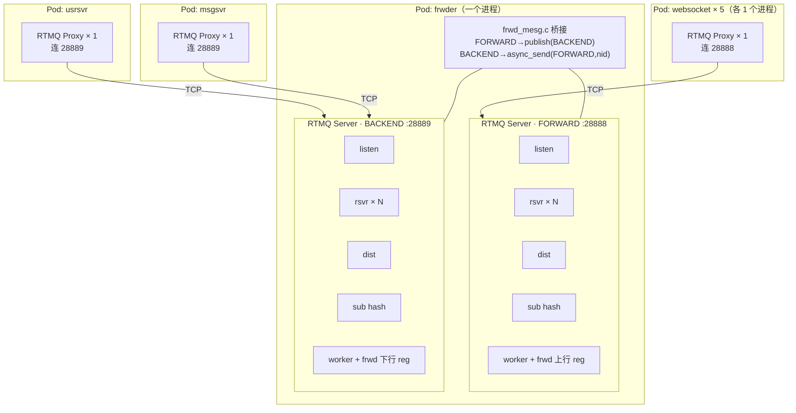
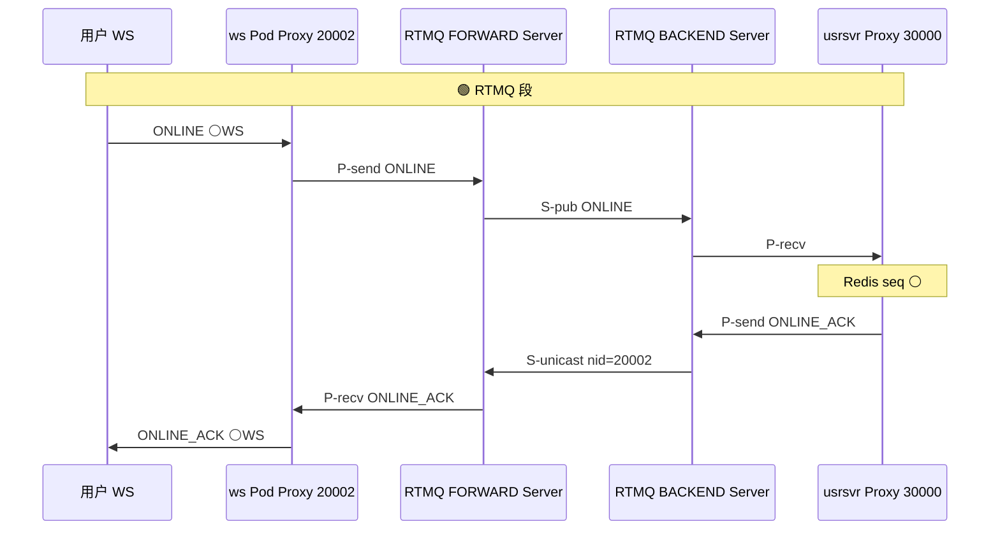
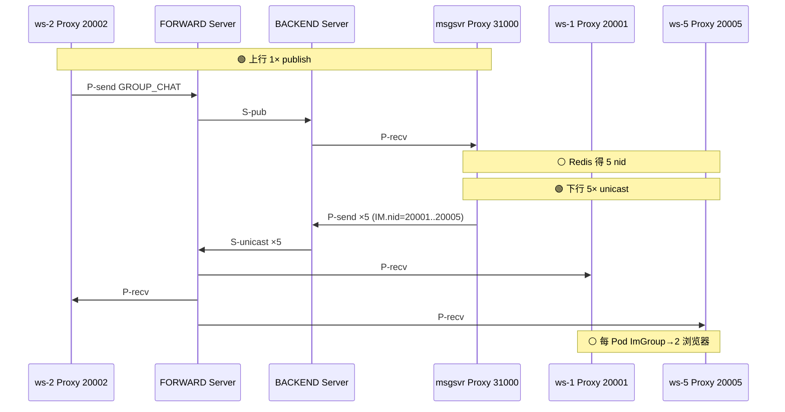
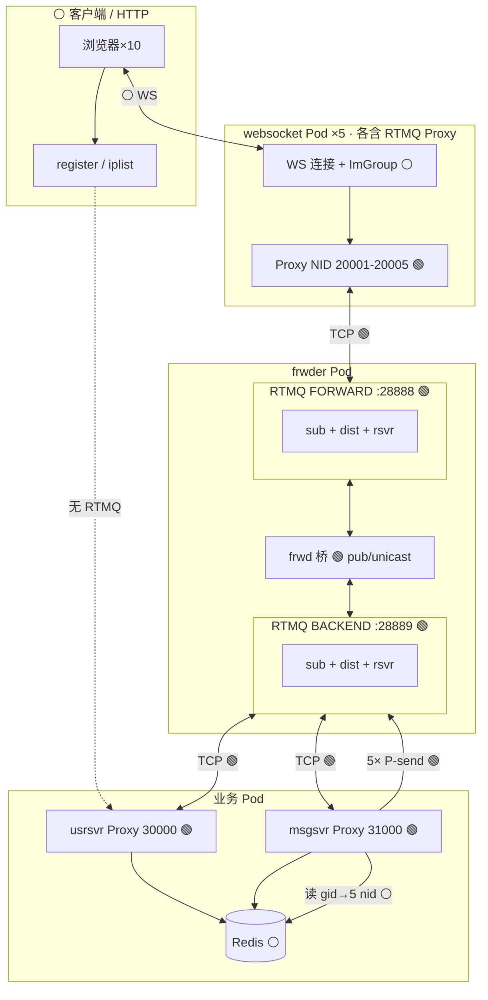

# 群聊 10 人 × 5 接入：RTMQ 逐步标注手册

> **你要解决的问题**：用 **10 用户进同一群、各发一句话** 的场景，**每一步** 都看清 **有没有 RTMQ、用了 RTMQ 的哪一层 API**；并为 **拆 Pod** 做准备。  
> **本文规则**：表格里 **RTMQ 列** 只写四种结果之一：`无` | `Proxy` | `Server` | `Proxy+Server`（跨平面时两者都有）。  
> **图例**：🟢 = 本步涉及 RTMQ　⚪ = 本步不涉及 RTMQ

---

## 0. 阅读约定（先看这个）

### 0.1 层次包含关系（frwder ≠ 替代 RTMQ）



**结论**：

- **RTMQ** = C 库实现的 **Server（中心）+ Proxy（进程内客户端）**。
- **frwder** = **一个进程里跑 2 个 RTMQ Server + 桥接逻辑**；不是 RTMQ 的替代品。
- 每个 **websocket / usrsvr / msgsvr** 进程里各有 **1 个 RTMQ Proxy**（Go：`ctx.frwder`）。

### 0.2 RTMQ 会出现的「动作」清单

| 代号 | 含义 | 谁发起 |
|------|------|--------|
| **P-conn** | Proxy TCP 连接 Server | 各业务/接入进程 Launch |
| **P-auth** | `RTMQ_CMD_AUTH_REQ/ACK` | Proxy → Server |
| **P-sub** | `RTMQ_CMD_SUB_REQ`（对每个 `Register` 的 cmd） | Proxy → Server |
| **P-send** | `Proxy.AsyncSend(cmd, im帧)` | 业务线程 |
| **P-recv** | Proxy worker 调本地 `Register` 回调 | Server 推下来后 |
| **S-pub** | `rtmq_publish(type)`（Server 内） | frwder 桥 / 极少直连 |
| **S-unicast** | `rtmq_async_send(type, nid, …)` + **dist** | frwder 桥 / Server API |
| **S-sub表** | Server `sub hash` 增删 | P-sub / 断线 |

**不会出现 RTMQ 的**：HTTP、MySQL、浏览器 WebSocket 帧、Redis 读写、ImGroup 进程内遍历、**IM CMD_SUB(0x0107)**。

---

## 1. 场景常量（10 人 · 5 接入 · 拆 Pod 前映射）

### 1.1 用户与接入分布

| uid | sid | 连哪个 websocket Pod | WS 端口 | **Proxy NID** |
|-----|-----|----------------------|---------|---------------|
| 100001 | s1 | ws-1 | 8002 | **20001** |
| 100002 | s2 | ws-1 | 8002 | **20001** |
| 100003 | s3 | ws-2 | 8003 | **20002** |
| 100004 | s4 | ws-2 | 8003 | **20002** |
| 100005 | s5 | ws-3 | 8004 | **20003** |
| 100006 | s6 | ws-3 | 8004 | **20003** |
| 100007 | s7 | ws-4 | 8005 | **20004** |
| 100008 | s8 | ws-4 | 8005 | **20004** |
| 100009 | s9 | ws-5 | 8006 | **20005** |
| 100010 | s10 | ws-5 | 8006 | **20005** |

群 **gid** 由 100001 `GROUP-CREAT` 产生；100002～100010 `GROUP-JOIN`。

### 1.2 业务进程 NID（BACKEND 侧 Proxy）

| Pod / 进程 | NID | 连 RTMQ | 群聊是否必须 |
|------------|-----|---------|--------------|
| usrsvr | **30000** | **28889** BACKEND | 建群/加群/退群 |
| msgsvr | **31000** | **28889** BACKEND | **GROUP-CHAT** |
| monitor / tasker / chatroom | 33xxx / 32xxx / 34xxx | 28889 | 本场景可不开 |

### 1.3 拆 Pod 后 RTMQ 不变性

```text
每个 Pod 内：1 进程 = 1 RTMQ Proxy = 1 NID = 1 条 TCP 到 frwder
拆 Pod 只改变「进程 IP」，不改变：
  · 接入连 28888，业务连 28889
  · publish / async_send(nid) 语义
  · Redis gid→nid 决定第一段 fan-out 打几个 NID
```

---

## 2. 阶段 A：服务按依赖启动（每步 RTMQ 标注）

### 2.1 总序

| 顺序 | 组件 | RTMQ | 说明 |
|------|------|------|------|
| A1 | redis / mysql / mongo | **无** | 存储 |
| A2 | **frwder Pod** | **Server 启动** | 28888 FORWARD + 28889 BACKEND 两个 RTMQ Server listen |
| A3 | seqsvr | **无** | Thrift，ONLINE 查 seq |
| A4 | msgsvr | **见 A4 详表** | |
| A5 | usrsvr | **见 A5 详表** | |
| A6 | websocket × 5 | **见 A6 详表** | |
| A7 | demo-web | **无** | 静态页 + HTTP 反代 |

### 2.2 A2 — frwder Pod 内 RTMQ 发生了什么

| 子步 | 组件 | RTMQ | 动作 |
|------|------|------|------|
| A2.1 | FORWARD Server | **Server** | `rtmq_init` → listen **:28888** → rsvr/dist/worker 线程就绪 |
| A2.2 | BACKEND Server | **Server** | 同上，listen **:28889** |
| A2.3 | frwd 桥 | **Server reg** | FORWARD worker 注册：收到包 → **S-pub** 到 BACKEND |
| A2.4 | frwd 桥 | **Server reg** | BACKEND worker 注册：收到包 → **S-unicast** 到 FORWARD（nid 取自 IM 头） |
| A2.5 | sub hash | **Server** | 此时 **空**，尚无 Proxy 连接 |

⚪ 此阶段 **没有** Proxy，**没有** P-sub。

### 2.3 A4 — msgsvr Launch（BACKEND Proxy）

| 子步 | RTMQ | 动作 |
|------|------|------|
| A4.1 | **Proxy** | `Register(GROUP_CHAT, …)` 等（进程内 map，**尚未** SUB） |
| A4.2 | **Proxy** | `Launch()` → **P-conn** 到 **28889** |
| A4.3 | **Proxy+Server** | **P-auth**（nid=**31000**） |
| A4.4 | **Proxy+Server** | **P-sub**：`SUB_REQ type=0x030B GROUP_CHAT` → **S-sub表** 写入 (31000, sid) |
| A4.5 | **Proxy+Server** | 同理 SUB：`CHAT`, `P2P`, `BC`, `SYNC`…（见 `msgsvr Register()`） |

⚪ **无** 用户、**无** Redis。

### 2.4 A5 — usrsvr Launch（BACKEND Proxy）

| 子步 | RTMQ | 动作 |
|------|------|------|
| A5.1 | **Proxy** | `Register(ONLINE, GROUP_CREAT, GROUP_JOIN, …)` |
| A5.2～A5.4 | 同 A4 | **P-conn / P-auth** nid=**30000** / **P-sub** 上述 cmd |
| 注意 | **无** | usrsvr **不** SUB `GROUP_CHAT`（群消息归 msgsvr） |

### 2.5 A6 — websocket × 5 Launch（FORWARD Proxy）

每个 ws Pod **相同模式**，NID 不同（20001～20005）：

| 子步 | RTMQ | 动作 |
|------|------|------|
| A6.1 | **Proxy** | `UpMesgRegister()`：`Register(GROUP_CHAT, ONLINE_ACK, GROUP_JOIN_ACK, …)` **下行** |
| A6.2 | **Proxy** | `Launch()` → **P-conn** 到 **28888** |
| A6.3 | **Proxy+Server** | **P-auth** nid=2000x |
| A6.4 | **Proxy+Server** | **P-sub** 所有已 Register 的 **下行 cmd**（含 `0x030B GROUP_CHAT`） |

⚪ **MesgRegister** 里对 **上行** cmd 的 Register 是 **WebSocket 本地回调**，**不是** RTMQ SUB；上行走 **P-send** 时才进 RTMQ。

### 2.6 启动完成 — FORWARD / BACKEND sub 表示意

**BACKEND sub hash（节选）**

```text
0x0101 ONLINE          → [30000 usrsvr]
0x0301 GROUP_CREAT     → [30000]
0x0305 GROUP_JOIN      → [30000]
0x030B GROUP_CHAT      → [31000 msgsvr]
```

**FORWARD sub hash（节选）**

```text
0x0102 ONLINE_ACK      → [20001, 20002, 20003, 20004, 20005]  （5 条 Proxy 连接）
0x0302 GROUP_CREAT_ACK → [20001..20005]
0x0306 GROUP_JOIN_ACK  → [20001..20005]
0x030B GROUP_CHAT      → [20001..20005]   （下行群消息）
0x030C GROUP_CHAT_ACK  → [20001..20005]
```

---

## 3. 阶段 B：10 用户注册 + 上线（逐步）

### 3.1 HTTP 注册 + iplist（每个用户 2 步）

| 步 | 动作 | RTMQ | 路径 |
|----|------|------|------|
| B1 | `GET /im/register` | **无** | 浏览器 → usrsvr HTTP → MySQL |
| B2 | `GET /im/iplist` | **无** | 浏览器 → usrsvr HTTP → 返回 ws 地址 + token |

⚪ 全程 **不经过** frwder / RTMQ。

### 3.2 WebSocket 连接

| 步 | 动作 | RTMQ |
|----|------|------|
| B3 | 浏览器 TCP+WS 握手 `/im` | **无**（websocket **进程内** LWS，非 RTMQ） |

### 3.3 单用户 ONLINE（以 uid=100003 @ ws-2 NID=20002 为例）

| 步 | 动作 | RTMQ | 细节 |
|----|------|------|------|
| B4 | 浏览器发 `CMD_ONLINE 0x0101` | **无** | WS 二进制帧 |
| B5 | websocket **本地** `LsndMesgOnlineHandler` | **无** | 补 cid、nid=20002 |
| B6 | **P-send** `AsyncSend(ONLINE, …)` | **Proxy** | ws-2 Proxy → TCP **28888** |
| B7 | FORWARD Server 收包 | **Server** | rsvr → worker |
| B8 | frwder **S-pub** `publish(ONLINE)` | **Server** | 查 BACKEND **S-sub表** |
| B9 | 推到 usrsvr Proxy | **Proxy+Server** | BACKEND TCP → **P-recv** → `UsrSvrOnlineHandler` |
| B10 | usrsvr 写 Redis、查 seqsvr | **无** | seqsvr Thrift |
| B11 | usrsvr **P-send** `AsyncSend(ONLINE_ACK, …)` | **Proxy** | BACKEND **28889** |
| B12 | BACKEND frwder **S-unicast** | **Server** | `async_send(FORWARD, nid=20002)` dist→FORWARD |
| B13 | ws-2 **P-recv** `ONLINE_ACK` | **Proxy** | → 浏览器 WS |

**10 用户各做一遍 B4～B13**：RTMQ 包约 **10×2=20**（10 上行 publish + 10 下行 unicast）。



---

## 4. 阶段 C：建群 + 9 人加群

### 4.1 uid=100001 GROUP-CREAT

| 步 | 动作 | RTMQ |
|----|------|------|
| C1 | 浏览器 → WS 发 `GROUP_CREAT` | **无** |
| C2 | WS **P-send** | **Proxy** → 28888 |
| C3 | FORWARD **S-pub** | **Server** → usrsvr（SUB 了 0x0301） |
| C4 | usrsvr Redis 建群、`GroupJoinOnline` | **无** |
| C5 | usrsvr **P-send** `GROUP_CREAT_ACK` | **Proxy** → 28889 |
| C6 | BACKEND **S-unicast** nid=20001 | **Server** |
| C7 | ws-1 **P-recv** → ImGroupJoin + 推浏览器 | **Proxy** + ⚪ ImGroup |

⚪ **IM CMD_SUB**：**无**。

### 4.2 uid=100002～100010 GROUP-JOIN（各 1 次）

与 C 相同模式，**P-send → S-pub → usrsvr → P-send ACK → S-unicast(nid)**。

| 统计 | RTMQ 次数（10 人各 1 次 join/ creat） |
|------|----------------------------------------|
| 上行 publish | **10** |
| 下行 unicast ACK | **10** |
| JOIN_NTF broadcast | 见下 |

### 4.3 GROUP-JOIN_NTF（可选 fan-out）

usrsvr `groupBroadcast`：读 Redis `gid→nid` → 对每个 nid **P-send**（BACKEND）→ **S-unicast** × **5 个 NID**。

| 步 | RTMQ |
|----|------|
| 每人 join 发 1 次 NTF 广播 | **5 × unicast** / 次（5 个 ws Pod 各 1 包） |

⚪ NTF 到 ws 后 **ImGroup** 推连接：**无 RTMQ**。

### 4.4 加群完成后 Redis vs RTMQ

| 存储 | 内容 | 用途 |
|------|------|------|
| Redis `gid→nid` zset | **{20001,20002,20003,20004,20005}** | msgsvr **第一段 fan-out** 打几个 NID |
| Redis 成员表 | 10 个 uid | 权限 |
| ImGroup 每 ws | 本 Pod 2 个 (gid,sid,cid) | **第二段 fan-out** |
| RTMQ sub 表 | **不变**（进程级，不随加群变） | 仍按 **cmd** 路由 |

---

## 5. 阶段 D：单条 GROUP-CHAT 全拆解（100003 发言）

**前提**：gid 已有，10 人在群；发言者 NID=**20002**。

### 5.1 逐步表（每一行回答「有没有 RTMQ」）

| # | 位置 | 动作 | RTMQ | API/备注 |
|---|------|------|------|----------|
| D1 | 浏览器 | 发 `GROUP_CHAT 0x030B` | **无** | WS |
| D2 | ws-2 进程 | `LsndMesgCommHandler` 补 cid,nid | **无** | |
| D3 | ws-2 **Proxy** | **P-send** GROUP_CHAT | **Proxy** | → **28888** |
| D4 | FORWARD **Server** | rsvr 收包 | **Server** | |
| D5 | frwder | **S-pub** GROUP_CHAT | **Server** | publish |
| D6 | BACKEND | 投递 msgsvr Proxy | **Proxy+Server** | **P-recv** |
| D7 | msgsvr | 校验成员、写 Mongo 队列 | **无** | |
| D8 | msgsvr | `GroupGetGidToNidSet` → **5 个 nid** | **无** | Redis |
| D9 | msgsvr | 循环 **5 次 P-send**（IM 头 nid=20001..20005） | **Proxy×5** | BACKEND |
| D10 | BACKEND | **5 次 S-unicast** | **Server×5** | dist 按 nid |
| D11 | FORWARD | **5 次** 推到 5 个 ws Proxy | **Server** | |
| D12 | ws-1..5 | **P-recv** GROUP_CHAT | **Proxy×5** | |
| D13 | 各 ws | `TravImGroupSession(gid)` → 各 **2** 连接 | **无** | 进程内 |
| D14 | 浏览器 | **10** 客户端收到（含发送者） | **无** | WS |
| D15 | msgsvr | **P-send** GROUP_CHAT_ACK → 20002 | **Proxy+Server** | 1 publish + 1 unicast |

### 5.2 单条消息 RTMQ 包计数

| 类型 | 次数 |
|------|------|
| **S-pub**（上行） | **1** |
| **S-unicast**（fan-out + ACK） | **5 + 1 = 6** |
| **合计穿越 frwder/Server** | **7** 个 RTMQ 业务包 |
| 到达浏览器 GROUP_CHAT | **10**（⚪ ImGroup，非 RTMQ） |

### 5.3 序列图（只画 RTMQ 段，标注 Server/Proxy）



---

## 6. 阶段 E：10 人各说 1 句 — RTMQ 总账

| 指标 | 计算 | 结果 |
|------|------|------|
| 上行 **S-pub** | 10 条 CHAT | **10** |
| 下行 **S-unicast** fan-out | 10 × **5 nid** | **50** |
| 下行 ACK **S-unicast** | 10 × 1 | **10** |
| **RTMQ 业务包合计** | | **70** |
| 浏览器收到 GROUP_CHAT | 10×10 | **100**（⚪ ImGroup） |

**若无 RTMQ（假想直连）**：msgsvr 需维护 **到 5 个 ws 进程** 的 TCP；加 ws Pod 则 **msgsvr 全量重配**。  
**有 RTMQ**：msgsvr 只 **P-send + IM.nid**，**S-unicast** 由 Server+frwder 完成 —— **拆 Pod 时 msgsvr 不用改连接表**。

---

## 7. 阶段 F：退群 / 解散（「解除 sub」澄清）

### 7.1 没有「RTMQ 退订」操作

| 用户操作 | RTMQ | 实际发生 |
|----------|------|----------|
| GROUP-QUIT | **P-send→S-pub→usrsvr→P-send ACK→S-unicast** | 同建群 |
| GROUP-QUIT_NTF | **可选 5× unicast** | 同 JOIN_NTF |
| **RTMQ SUB 取消** | **无单独 API** | 仅 **Proxy 断线** 时 Server **S-sub表** 删条目 |
| **IM CMD_UNSUB** | **本场景无** | |
| Redis 退群 | **无** | `GroupQuit` |
| ImGroupQuit | **无** | ws 进程内 |

### 7.2 10 人退群 + 解散 RTMQ 粗算

| 动作 | RTMQ 包（量级） |
|------|-----------------|
| 10× QUIT 上行+ACK | ~20 |
| 10× QUIT_NTF × 5 nid | ~50 |
| DISMISS 1× + ACK | ~2 |
| **合计** | ~72（与业务实现是否 broadcast 有关） |

---

## 8. 阶段 G：按依赖下线（每个 Proxy 的 RTMQ 行为）

| 顺序 | 停谁 | RTMQ 效果 |
|------|------|-----------|
| G1 | demo-web | **无** |
| G2 | websocket-5 … websocket-1 | 每个：**TCP 断** → FORWARD **S-sub表** 删该 Proxy 全部 cmd；**async_send(2000x)**  thereafter **失败** |
| G3 | msgsvr | BACKEND 删 31000；**publish(GROUP_CHAT)** 无订阅者 |
| G4 | usrsvr | BACKEND 删 30000 |
| G5 | frwder Pod | **两个 Server 全停**；所有 Proxy **P-conn** 断 |

⚪ 停 redis：**无 RTMQ**；业务先坏。

### 8.1 拆 Pod 部署时下线顺序建议

```text
Ingress / demo-web
  → websocket Pods（5）
  → msgsvr Pod
  → usrsvr Pod
  → frwder Pod（或 RTMQ 独立 Pod，内仍含 28888+28889）
  → redis / mysql / mongo
```

---

## 9. 主流程一图（10 人 · 5 接入 · 只标 RTMQ 边界）



---

## 10. 自检：10 个步骤 RTMQ 有没有？

| # | 步骤 | RTMQ？ |
|---|------|--------|
| 1 | HTTP register | **无** |
| 2 | HTTP iplist | **无** |
| 3 | WebSocket 握手 | **无** |
| 4 | ONLINE | **有** publish + unicast |
| 5 | GROUP-CREAT / JOIN | **有** 同上 |
| 6 | Redis 写 gid→nid | **无** |
| 7 | ImGroupJoin | **无** |
| 8 | GROUP-CHAT 上行 | **有** publish |
| 9 | GROUP-CHAT 下行 | **有** 5× unicast + ImGroup **无** |
| 10 | GROUP-QUIT | **有** 同生命周期；**无** RTMQ unsub |

---

## 11. 配套文档与代码

| 用途 | 路径 |
|------|------|
| RTMQ 设计 | [RTMQ-技术设计文档.md](RTMQ-技术设计文档.md) |
| frwder 桥 | `src/clang/exec/frwder/frwd_mesg.c` |
| Go Proxy SUB | `src/golang/lib/rtmq/rtmq_proxy.go` → `subscribe()` |
| 群 fan-out | `src/golang/exec/msgsvr/controllers/gmesg.go` |
| ImGroup | `src/golang/exec/websocket/controllers/upmesg.go` |
| 压测 | `scripts/rtmq-bench.sh` |

---

## 12. 与旧版文档关系

- [群聊全链路演练-10用户.md](群聊全链路演练-10用户.md)：2 接入版，步骤较粗。  
- **本文**：**5 接入 · 每步 RTMQ 显式标注**，为拆 Pod 主文档。

*文档版本：2026-06 · 场景 10 uid × 5 websocket NID 20001–20005。*
