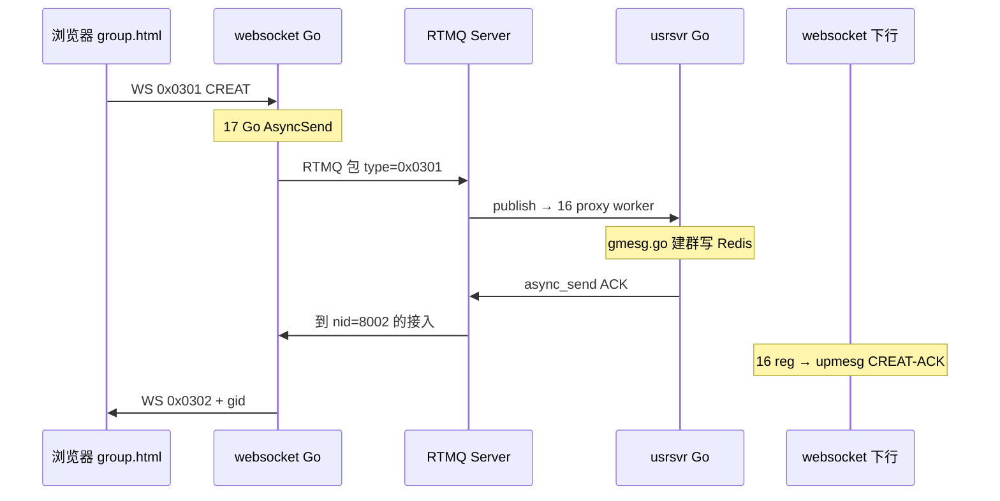
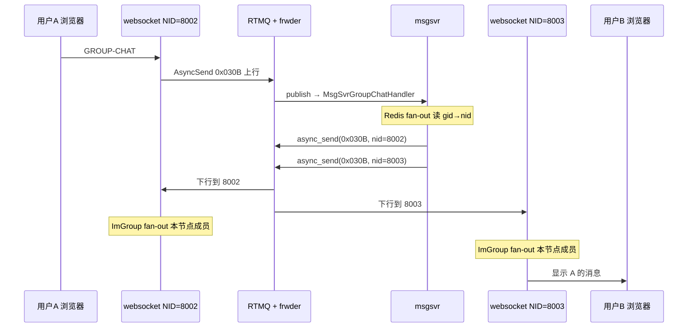

# 群聊 Demo 视角：RTMQ 是干什么的？17 篇各扮演什么角色？

> **一句话**：RTMQ 是必嗨各进程之间的 **「邮局」**——websocket、usrsvr、msgsvr、frwder **不互相直连 TCP**，只连 RTMQ 中心，用 **cmd（类型）+ nid（节点号）** 寄信。  
> **技术设计**：[RTMQ-技术设计文档.md](RTMQ-技术设计文档.md) · **总地图**：[00-总地图.md](00-总地图.md) · **群聊业务**：[群聊Demo源码导读.md](../群聊Demo源码导读.md)

---

## 1. 没有 RTMQ 会怎样？有了又怎样？

### 没有 RTMQ（假想）

```text
websocket ──TCP──> usrsvr
websocket ──TCP──> msgsvr
msgsvr    ──TCP──> websocket:8002
msgsvr    ──TCP──> websocket:8003
… 每加一个进程，连接数爆炸
```

### 有 RTMQ（群聊 Demo 实际）

```text
                    ┌─────────────────────────┐
                    │  RTMQ Server（在 frwder 进程里） │
                    │  · 谁订阅了哪个 cmd？      │
                    │  · 按 nid 送到哪个接入？   │
                    └───────────┬─────────────┘
        TCP 一次连接              │              TCP 一次连接
    ┌───────────┐    publish/     │    async_send   ┌───────────┐
    │ websocket │◄───async_send───┼────────────────►│  msgsvr   │
    │  Go Proxy │                 │                 │ Go Proxy  │
    └───────────┘                 │                 └───────────┘
    ┌───────────┐                 │                 ┌───────────┐
    │  usrsvr   │◄────────────────┴────────────────►│  frwder   │
    │ Go Proxy  │                                   │ C Proxy×2 │
    └───────────┘                                   └───────────┘
```

**RTMQ 的整体作用（结合群聊）**：

| 作用 | 群聊 Demo 里的例子 |
|------|-------------------|
| **解耦进程** | 改 msgsvr 不用改 websocket 的 IP 配置 |
| **按 cmd 订阅** | msgsvr 只收 `0x030B GROUP-CHAT`；usrsvr 只收 `0x0301` 建群等 |
| **按 nid 单播** | A 在 8002、B 在 8003，msgsvr fan-out 时 **两次 async_send(不同 nid)** |
| **统一传输** | 浏览器只懂 WebSocket；进程间统一走 RTMQ 二进制包 |

**frwder 和 RTMQ 的关系**：frwder **不是** RTMQ 的替代品，而是 RTMQ 上的一个 **「特殊客户」**——它连 **两路** Proxy（FORWARD 28888 / BACKEND 28889），收到上行就 `publish` 给业务，收到下行就 `async_send(nid)` 给接入。群聊 Demo 里 **每一包** 几乎都要经过 **RTMQ + frwder**。

---

## 2. 群聊 Demo 三条操作，RTMQ 各干什么？

### 2.1 建群 `GROUP-CREAT`（0x0301）



**RTMQ 在这里**：把 **「接入层消息」** 送到 **usrsvr**；再把 **ACK** 送回 **发请求的 websocket 节点**。

---

### 2.2 加群 `GROUP-JOIN`（0x0305）

与建群同套路：**cmd 换成 JOIN**，usrsvr 写 Redis + 可能 `groupBroadcast` 发 **JOIN-NTF（0x0350）** 给多个 nid → RTMQ 多次 **async_send**。

---

### 2.3 发群消息 `GROUP-CHAT`（0x030B）——最重要



**RTMQ 在这里**：

1. **上行**：把 A 的群消息从 websocket **投到 msgsvr**（不是 usrsvr！）  
2. **下行第一段**：msgsvr 按 **nid** 把同一条消息 **复制多份** 发给各接入节点（Demo 里 8002、8003 各一份）  
3. **下行第二段**（不在 RTMQ 里）：websocket 内部 `TravImGroupSession` 发给本机各成员 WS 连接  

**记忆**：Redis fan-out 决定 **几个 nid**；RTMQ async_send 负责 **送到每个 nid 的进程**；ImGroup 负责 **进程内多个连接**。

---

## 3. 十七篇文档 × 群聊 Demo 角色对照表

图例：

- **●** = 这条操作必经  
- **○** = 启动/连接时用，或偶尔参与  
- **—** = 群聊 Demo 几乎不直接感知（但要理解架构）

| 编号 | 文档 | 在群聊 Demo 里扮演什么 | 典型 cmd / 时机 |
|------|------|------------------------|-----------------|
| **00** | 总地图 | 读任何一篇前的 **GPS** | — |
| **01** | 架构 | 和本文相同，偏抽象 | — |
| **02** | mesg 协议 | **每一包** RTMQ 外的壳：`rtmq_header` + IM 帧 | flag=EXP, type=0x030B |
| **03** | comm | 回调函数长什么样、错误码 | Register 的 proc 签名 |
| **04** | recv.h / Server ctx | **邮局后台**：连接表、sub 表、dist 队列 | 整个 Demo 运行期间 |
| **05** | proxy.h | **每个进程里的邮箱**：websocket/usrsvr/msgsvr 各一份 | 各进程启动 init |
| **06** | recv API | **邮局规则**：`publish` / `async_send` 的实现 | JOIN 后 msgsvr async_send nid |
| **07** | lsn | **开门**：Demo 启动时 websocket/usrsvr **TCP 连上** RTMQ | `docker compose up` 后 |
| **08** | dist | **● 下行分拣**：msgsvr `async_send(nid)` → 投到对应 websocket 的 rsvr | **每条 GROUP-CHAT** |
| **09** | comm/sub | **● 通讯录**：谁订阅了 0x0301/0x0305/0x030B；publish 查表 | 进程启动 Register+SUB |
| **10** | rsvr 上 | **● 收发室收包**：TCP 拼出完整 RTMQ 帧 | 所有上下行 |
| **11** | rsvr 下 | **● AUTH/SUB/发出**：连接鉴权、登记订阅、writev 发给 Proxy | 进程启动 + 每包下行 |
| **12** | Server worker | **—** Server 侧 reg（必嗨 **Go 业务在 Proxy worker**） | 了解即可 |
| **13** | proxy API | **● 寄信入口**：`AsyncSend(0x030B, buf)` 入 sendq | A 点发送 |
| **14** | tsvr 上 | **● 邮递员连邮局**：TCP、鉴权、SUB 已 Register 的 cmd | 进程启动 |
| **15** | tsvr 下 | **● writev 发出 / 收下行** | 每包上下行 |
| **16** | proxy worker | **●★ 收信并拆封**：调 `Register` 的 handler → `gmesg.go` / `upmesg.go` | **业务真正入口** |
| **17** | Go proxy | **● Demo 实际用的库**；对应 C 的 13～16 | 你看的 Go 代码 |

---

## 4. 按「群聊一次发送」串 17 篇（只看 ● 的）

```text
[用户点发送]
  17 Go AsyncSend          ← websocket/mesg.go
  13 入 sendq
  15 tsvr writev ──TCP──>
  02 报头 type=0x030B
  10 rsvr 收包拼帧
  09 publish 查谁订阅了 0x030B → msgsvr
  16 msgsvr proxy worker → MsgSvrGroupChatHandler
       … Redis 业务 fan-out …
  06 async_send(nid=8002)
  06 async_send(nid=8003)
  08 dist 按 nid 分拣
  11/15 发到各 websocket 的 TCP
  16 websocket proxy worker → LsndUpMesgGroupChatHandler
       … ImGroup 第二段 fan-out（非 RTMQ）…
  [B 浏览器收到]
```

**启动阶段（第一次建群前，○ 的）**：

```text
  07 lsn accept 各进程 TCP
  11 AUTH + 09 SUB（0x0101, 0x0301, 0x030B…）
  05/04 各进程 proxy/server 结构就绪
  06 init/launch
```

---

## 5. 和「群聊业务」边界：RTMQ 管什么、不管什么

| RTMQ **管** | RTMQ **不管** |
|-------------|---------------|
| 进程间把 **cmd 包** 送到谁 | gid 是什么、群成员有哪些（**Redis / usrsvr**） |
| 按 **nid** 送到哪个 **websocket 进程** | 进程内多个 WS 连接（**ImGroup / chat_tab**） |
| 订阅关系 SUB / publish | 消息落 Mongo（**msgsvr 异步**） |
| TCP 连接、拼帧、保活 | 浏览器 WebSocket 协议（**Go lws**） |

**面试一句话**：

> 群聊 Demo 里 RTMQ 负责 **「进程间邮递」**：上行把 GROUP-CHAT 从 websocket **送到 msgsvr**；下行 msgsvr 按 **nid** 把消息 **送到各 websocket 节点**。群语义、成员表、第二段 fan-out 都在 **Go 业务 + Redis**，不在 RTMQ 里。

---

## 6. 和 frwder 再对一下（避免混）

| 组件 | 群聊 Demo 角色 |
|------|----------------|
| **RTMQ** | 所有进程的 **TCP 枢纽 + 订阅表 + nid 路由** |
| **frwder（C）** | 挂在 RTMQ 上的 **二传手**：FORWARD↔BACKEND，`publish` / `async_send(nid)` 默认实现 |
| **usrsvr** | 建群/加群 **业务**；经 RTMQ 收 0x03xx 生命周期 |
| **msgsvr** | 群消息 **业务 + 第一段 nid fan-out** |
| **websocket** | 浏览器 + **第二段 cid fan-out** |

代码位置（Go 侧你调试看到的）：

```text
ctx.frwder.AsyncSend(...)   // 实际是 17 Go rtmq Proxy
ctx.frwder.Register(...)    // 16 proxy worker 收到后回调
```

C 侧 `frwd_mesg.c` 只有 **~20 行有效逻辑**，因为 **路由都在 RTMQ** 里做完了。

---

## 7. 建议阅读顺序（只为搞懂群聊 Demo）

1. **本文** + [00-总地图.md](00-总地图.md) §3.3（GROUP-CHAT 序列图）  
2. [17-rtmq_proxy_go.md](17-rtmq_proxy_go.md) — Demo 里真正调用的 API  
3. [06-rtmq_recv_api.md](06-rtmq_recv_api.md) — publish / async_send 语义  
4. [16-rtmq_proxy_worker.md](16-rtmq_proxy_worker.md) — 消息如何进 `gmesg.go` / `upmesg.go`  
5. [08-rtmq_dist.md](08-rtmq_dist.md) — 为何 msgsvr 下行必须带 **nid**  
6. 再读 10/11/14/15 理解 TCP 细节  

**12 Server worker** 可最后看或跳过——必嗨 Go 栈的主战场在 **16 + 17**。

---

## 8. 自测：用群聊 Demo 答 5 题

1. A 发群消息，RTMQ 第一次把包送给谁？→ **msgsvr**（不是 usrsvr）  
2. B 在另一个接入节点，RTMQ 靠啥找到 B 的进程？→ **async_send 里的 nid**  
3. 同一 nid 上两个群成员连接，RTMQ 送几份？→ **1 份到进程**；进程内 **ImGroup 再 fan-out**  
4. 建群 ACK 谁处理业务？→ **usrsvr gmesg.go**；经 RTMQ 回到 **websocket upmesg**  
5. frwder 懂 gid 吗？→ **不懂**，只认 cmd + nid  

---

**上一站**：[00-总地图.md](00-总地图.md) · **下一站**：打开 [17-rtmq_proxy_go.md](17-rtmq_proxy_go.md)，对照 `websocket/controllers/mesg.go` 里 `AsyncSend` 读一遍。
