# 群聊全链路演练：10 用户 × 启动 → 发言 → 下线

> **⚠️ 若需「每一步是否用 RTMQ、5 个 websocket 接入、frwder⊃RTMQ 层次图」→ 请读主文档：[群聊10人5接入-RTMQ逐步标注手册.md](群聊10人5接入-RTMQ逐步标注手册.md)**  
> 本文档为 **2 接入简版**，步骤未逐步标注 RTMQ。

> **场景**：Docker 群聊 Demo 栈按依赖启动；10 个用户（uid 100001～100010）在同一群；每人发一条 `GROUP-CHAT`；再退群/解散并按依赖逆序关闭进程。  
> **分层**：**RTMQ 层**（Proxy↔Server 的 SUB/publish/async_send）与 **业务 IM 层**（HTTP 注册、ONLINE、群成员、ImGroup fan-out）分开叙述。  
> **配套**：[RTMQ-技术设计文档.md](RTMQ-技术设计文档.md) · [群聊Demo视角解读RTMQ.md](群聊Demo视角解读RTMQ.md) · [群聊Demo源码导读.md](../群聊Demo源码导读.md)

---

## 0. 场景与常量速查

### 0.1 演示假设

| 项 | 值 |
|----|-----|
| 用户 | uid **100001～100010**，各 1 个 WebSocket 连接 |
| 群 | 100001 建群得 `gid`（Redis INCR） |
| 加群 | 100002～100010 依次 `GROUP-JOIN` |
| 接入分布 | iplist 调度：约 5 人在 **websocket:8002**（NID **20001**），5 人在 **:8003**（NID **20002**） |
| 每人发言 | 10 次 `GROUP-CHAT`，文本 `"hello from {uid}"` |

### 0.2 进程 NID 与 RTMQ 端口

| 进程 | NID | 监听 | 连 RTMQ |
|------|-----|------|---------|
| frwder（内嵌 2×Server） | — | **28888** FORWARD / **28889** BACKEND | — |
| websocket | **20001** | WS :8002 | **28888** |
| websocket-2 | **20002** | WS :8003 | **28888** |
| usrsvr | **30000** | HTTP :8000 | **28889** |
| msgsvr | **31000** | — | **28889** |
| monitor | 33000 | — | 28889 |
| tasker | 32000 | — | 28889 |
| chatroom | 34000 | HTTP :8004 | 28889 |
| listend×2 | 10001/10002 | TCP :9002/:9003 | 28888（C 栈，群 Demo 主路径走 Go WS） |

**口诀**：**接入连 28888，业务连 28889**；frwder 负责两平面之间的 `publish` / `async_send(nid)`。

### 0.3 两套「订阅」对照（必读）

| 名称 | 层级 | 谁发起 | 作用 | 群 Demo 是否用到 |
|------|------|--------|------|------------------|
| **RTMQ SUB**（`RTMQ_CMD_SUB_REQ`） | Proxy↔Server | 各进程 Proxy **TCP 鉴权成功后**自动发 | Server 记录「哪个 **进程 NID** 要收哪个 **cmd**」；`publish(type)` 时用 | **用到**（进程启动时） |
| **IM CMD_SUB**（`0x0107`） | 用户↔业务 | 客户端 WebSocket（可选） | usrsvr 处理「业务频道订阅」，回 `SUB_ACK` | **群 Demo 未用**（ smoke / group.html 不发此 cmd） |
| **群成员** | 业务 Redis | `GROUP-JOIN` / 建群 | `chat:gid:{gid}:nid` 等路由表 | **用到** |
| **ImGroup 会话** | websocket 进程内 | 收到 `JOIN_ACK` 后 | `TravImGroupSession` 第二段 fan-out | **用到** |

下文 **SUB** 若无特别说明，指 **RTMQ SUB**；业务 IM 命令写全称 **CMD_SUB**。

---

## 1. 服务启动全链路

### 1.1 Docker 与中间件

```bash
docker compose --profile build run --rm --build builder   # 首次
docker compose --profile run --profile demo up -d
```

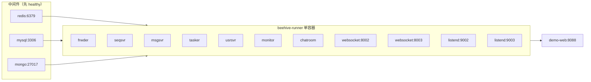

`scripts/run-in-linux.sh` **启动顺序**（后启动者依赖先启动者已 listen / 已连 RTMQ）：

| 顺序 | 进程 | 等待条件 | 为何在此顺序 |
|------|------|----------|--------------|
| 0 | redis / mysql / mongo | healthcheck | 业务读写依赖 |
| 1 | **frwder** | :28889 ready | **RTMQ 双 Server 必须先起来** |
| 2 | **seqsvr** | :50000 | ONLINE 时 usrsvr 查消息 seq |
| 3 | **msgsvr** | sleep 3 | 依赖 frwder BACKEND |
| 4 | **tasker** | sleep 3 | 异步任务 |
| 5 | **usrsvr** | sleep 5 | HTTP 注册 / 群生命周期 |
| 6 | **monitor** | sleep 2 | 在线统计 / iplist 链 |
| 7 | **chatroom** | sleep 3 | 聊天室（与群并行栈） |
| 8 | **websocket** | — | 接入，连 FORWARD |
| 9 | **listend-2 + websocket-2** | multinode | 第二接入节点 |
| 10 | **listend**（前台 exec） | — | 保持容器存活；C 长连接接入 |

### 1.2 frwder 启动：RTMQ Server 双实例

frwder 进程内初始化 **两个** `rtmq_cntx_t`：

```text
FORWARD  :28888  ← 接入 Proxy（websocket NID 20001/20002）
BACKEND  :28889  ← 业务 Proxy（usrsvr 30000, msgsvr 31000, …）
```

每个 Server 启动：**listen → rsvr 线程池 → worker 线程池 → dist 线程**，并注册 frwder 默认 handler：

```text
FORWARD  reg(CMD_UNKNOWN) → 收到接入上行 → rtmq_publish(BACKEND, …)
BACKEND  reg(CMD_UNKNOWN) → 收到业务下行 → rtmq_async_send(FORWARD, type, IM头.nid, …)
```

此时 **sub hash 为空**，尚无 Proxy 连接。

### 1.3 业务进程启动：Register → Launch → RTMQ 三连

以 **msgsvr** 为例（usrsvr / websocket 同模式）：

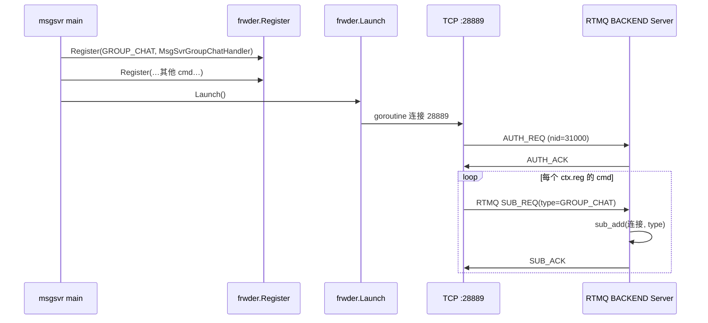

**msgsvr 在 BACKEND 上 SUB 的典型 cmd**（见 `msgsvr/controllers/msgsvr.go` `Register()`）：

- `CMD_GROUP_CHAT`（0x030B）— 群消息 **必 SUB**
- `CMD_CHAT`、`CMD_P2P`、`CMD_BC`、`CMD_SYNC` 等

**usrsvr 在 BACKEND 上 SUB**（见 `usrsvr.go`）：

- `CMD_ONLINE`、`CMD_OFFLINE`、`CMD_GROUP_CREAT/JOIN/QUIT/…` 等  
- **不含** `CMD_GROUP_CHAT`（群消息归 msgsvr）

**websocket 在 FORWARD 上 SUB**（见 `upmesg.go` `UpMesgRegister()`）：

- 所有 **下行** ACK/NTF/CHAT：`ONLINE_ACK`、`GROUP_CHAT`、`GROUP_JOIN_NTF` 等

Server 侧 **sub hash** 在全部业务进程 Launch 完成后大致为：

```text
type=0x0101 ONLINE        → [usrsvr:30000]
type=0x0301 GROUP_CREAT   → [usrsvr:30000]
type=0x0305 GROUP_JOIN    → [usrsvr:30000]
type=0x030B GROUP_CHAT    → [msgsvr:31000]
type=0x0102 ONLINE_ACK    → [websocket:20001, websocket:20002]  （各连接各 SUB）
…
```

### 1.4 启动完成态（逻辑图）

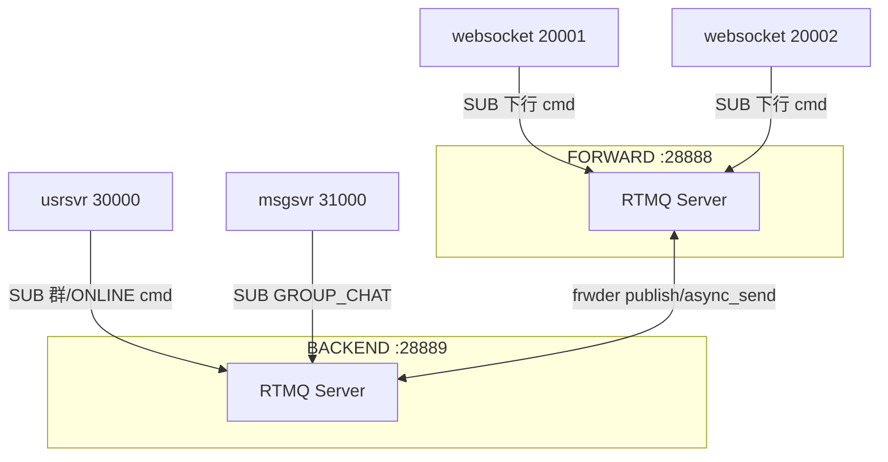

---

## 2. 十个用户：注册 → 上线（业务层 + RTMQ 上行）

### 2.1 阶段总览

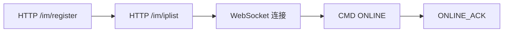

对每个 uid **100001～100010** 重复；**不经过 RTMQ** 的步骤：HTTP register、iplist。

### 2.2 HTTP 注册（无 RTMQ）

| 步骤 | 请求 | 处理 | 持久化 |
|------|------|------|--------|
| register | `GET /im/register?uid=10000x&nation=1&city=1&town=1` | `usrsvr/register.go` | MySQL 用户表；分配 **sid** |
| iplist | `GET /im/iplist?type=2&uid=&sid=&clientip=` | `iplist.go` + monitor 链 | 返回 **token** + WS 地址 `127.0.0.1:8002/im` 或 `:8003/im` |

代码：`tools/smoke-group/main.go` `setupClient()`；前端 `demo-common.js`。

### 2.3 WebSocket 连接（无 RTMQ）

浏览器/`smoke-group` → `ws://127.0.0.1:8002/im` 或 `:8003/im` → **websocket 进程** accept，分配 **cid**（连接 id），状态 `READY`。

### 2.4 ONLINE：第一条 RTMQ 上行

用户发 `CMD_ONLINE`（0x0101）+ protobuf（uid, sid, token, …）。

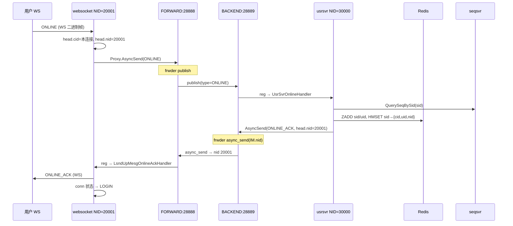

**Redis（online_handler）** 关键键：

| 键 | 含义 |
|----|------|
| `im:sid:zset` | 在线 sid 集合 |
| `im:uid:zset` | 在线 uid 集合 |
| `im:sid:{sid}:attr` | hash：`CID`, `UID`, `NID` |
| `im:uid:{uid}:sid:set` | uid 下多 sid |

**RTMQ 本步**：1 次 Proxy AsyncSend + 1 次 publish + 1 次 async_send(nid=接入 NID)。

### 2.5 十用户上线后的状态

- **10 条** sid→nid 映射（约 5 个 nid=20001，5 个 nid=20002）。
- RTMQ sub 表 **不变**（进程级 SUB 启动时已建好）。
- **未** 发 IM `CMD_SUB`；**未** 建群。

---

## 3. 建群与加群（业务 + 部分 RTMQ）

### 3.1 100001 建群 GROUP-CREAT

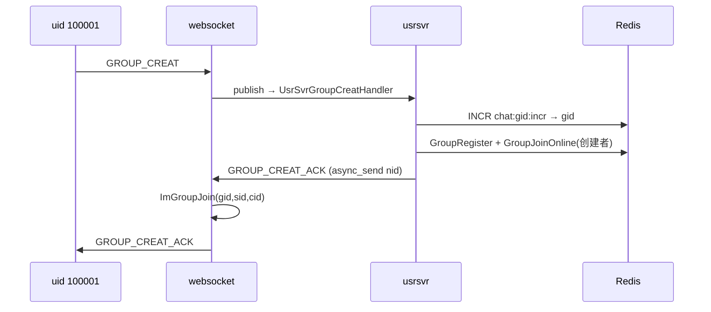

**Redis 群相关**（`lib/chat/group_ops.go`）：

| 键 | 写入 |
|----|------|
| `chat:gid:zset` | 群 id 存活 |
| `chat:group:{gid}:role` | 100001 = owner |
| `chat:gid:{gid}:nid` zset | **20001**（创建者接入 NID） |
| `chat:gid:{gid}:sid/uid` zset | 创建者在线路由 |

### 3.2 100002～100010 GROUP-JOIN

每条 join 路径与建群类似：`publish` → usrsvr → `GroupJoinOnline` → 更新 **gid→nid** zset（若新 NID 出现则 ZADD）→ `GROUP_JOIN_ACK` → websocket `ImGroupJoin` → 可选 `GROUP_JOIN_NTF` **groupBroadcast** 到所有相关 nid。

**groupBroadcast**（`gmesg_send.go`）：读 `GroupGetGidToNidSet(gid)`，对每个 nid 一次 `frwder.AsyncSend` → frwder `async_send(FORWARD)`。

十人全进同一群后 **Redis** 示意：

```text
chat:gid:{gid}:nid  →  {20001, 20002}     # 至少 2 个接入 NID（双节点时）
chat:gid:{gid}:role →  100001..100010      # 成员角色
ImGroup(20001)      →  本地 ~5 个 (gid,sid,cid)
ImGroup(20002)      →  本地 ~5 个 (gid,sid,cid)
```

### 3.3 群成员 vs RTMQ SUB vs ImGroup

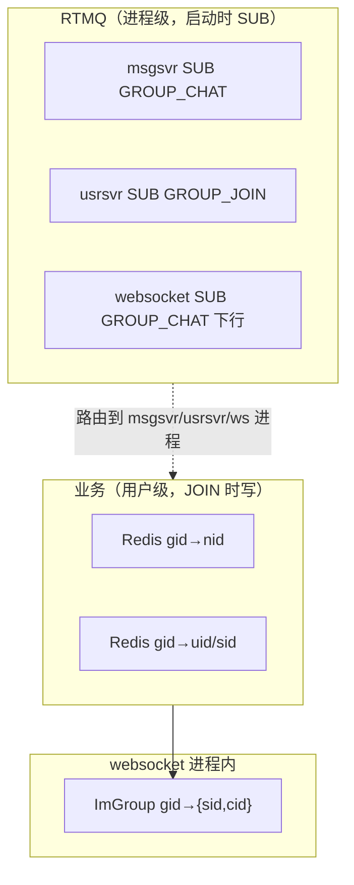

---

## 4. 单条 GROUP-CHAT 端到端（精读一条）

**100003** 在 NID **20002** 上发：`"hello from 100003"`。

### 4.1 上行

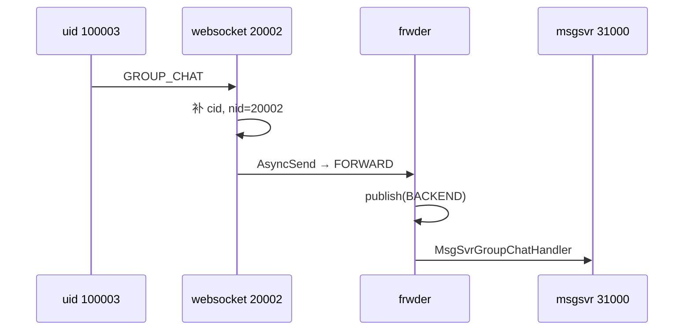

msgsvr：校验成员/禁言 → `group_chat_handler` → 异步写 Mongo 队列 + **fan-out 准备**。

### 4.2 第一段 fan-out（跨进程，RTMQ async_send）

```text
nid_list = GroupGetGidToNidSet(gid)   // 例：[20001, 20002]

for nid in nid_list:
    send_data(GROUP_CHAT, sid, cid=0, nid=nid, body=protobuf)
    → frwder.AsyncSend → BACKEND → frwder async_send(FORWARD, IM.nid)
```

对 **2 个接入 NID** 发 **2 包** RTMQ（不是 10 包——按 **接入节点** 聚合，不是按用户）。

### 4.3 第二段 fan-out（进程内 ImGroup）

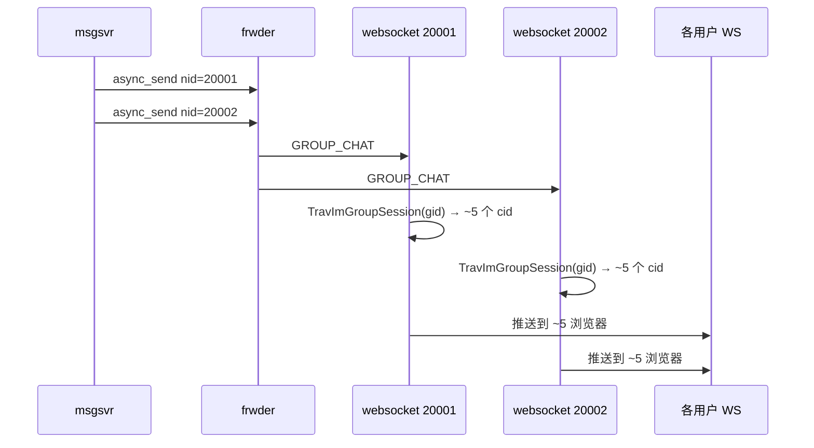

`LsndUpMesgGroupChatHandler`（`upmesg.go`）：解析 gid → `TravImGroupSession` → 每个在本机 ImGroup 里的连接收 **同一条** 群消息（含发送者自己）。

### 4.4 发送者 ACK

msgsvr → `GROUP_CHAT_ACK` → async_send → **仅发送者所在 nid** 的 websocket → 回给 100003。

### 4.5 单条消息 RTMQ 计数（双节点、10 人群）

| 方向 | API | 次数 |
|------|-----|------|
| 上行 1 条 CHAT | publish | **1** |
| 下行 fan-out | async_send | **2**（20001 + 20002） |
| 下行 ACK | async_send | **1**（发送者 nid） |
| **合计** | | **4** 次 RTMQ 业务穿越 frwder |

---

## 5. 十用户各说一句话：批量视角

### 5.1 操作序列

```text
for uid in 100001..100010:
    发 GROUP-CHAT(gid, "hello from {uid}")
    等待 GROUP_CHAT_ACK
```

### 5.2 RTMQ 流量估算（双节点、全员在线）

| 指标 | 计算 | 结果 |
|------|------|------|
| publish（上行 CHAT） | 10 条 × 1 | **10** |
| async_send（fan-out） | 10 × 2 nid | **20** |
| async_send（CHAT_ACK） | 10 × 1 | **10** |
| **RTMQ 业务包合计** | | **40** |
| 到达浏览器的 GROUP_CHAT 条数 | 10 发送 × 10 成员 | **100**（含发送者自身） |

### 5.3 时序（简化）

```mermaid
gantt
  title 10 用户轮流发言（逻辑并行）
  dateFormat X
  axisFormat %s

  section 用户100001
  CHAT uplink publish     :a1, 0, 1
  fan-out 2 nid           :a2, 1, 2

  section 用户100002
  CHAT uplink publish     :b1, 2, 3
  fan-out 2 nid           :b2, 3, 4

  section …
  100003-100010 同模式     :c1, 4, 20
```

### 5.4 数据流总图（10 人 × 1 句）

```mermaid
flowchart TB
  subgraph users["10 浏览器"]
    U1[100001@20001]
    U2[100002@20002]
    Udots[…]
  end

  subgraph access["接入 Proxy FORWARD"]
    W1[20001]
    W2[20002]
  end

  subgraph hub["frwder"]
    PUB[publish]
    ASYNC[async_send by nid]
  end

  subgraph biz["BACKEND Proxy"]
    USR[usrsvr]
    MSG[msgsvr]
  end

  subgraph store["Redis"]
    GN[gid→nid zset]
  end

  U1 & U2 & Udots --> W1 & W2
  W1 & W2 -->|10× CHAT AsyncSend| PUB
  PUB --> MSG
  MSG --> GN
  MSG -->|10×2 async_send| ASYNC
  ASYNC --> W1 & W2
  W1 & W2 -->|TravImGroupSession| users
```

---

## 6. IM CMD_SUB 说明（避免与 RTMQ SUB 混淆）

| 问题 | 答案 |
|------|------|
| group.html / smoke-group 会发 CMD_SUB 吗？ | **不会** |
| CMD_SUB 设计用途？ | 客户端向 usrsvr 订阅 **业务频道**（如好友动态类）；handler 在 `UsrSvrSubHandler` |
| 退群/解散会发 CMD_UNSUB 吗？ | **不会**；退群用 `GROUP_QUIT` |
| 取消 RTMQ SUB？ | Proxy **断线**时 Server 自动 `sub_del`；无单独「退订 API」 |

若产品要做「订阅某类推送」，才在 ONLINE 之后发 **IM CMD_SUB**；与群成员 **GROUP-JOIN** 无关。

---

## 7. 演示结束：退群 → 解散 → 下线

### 7.1 GROUP-QUIT（单用户退群）

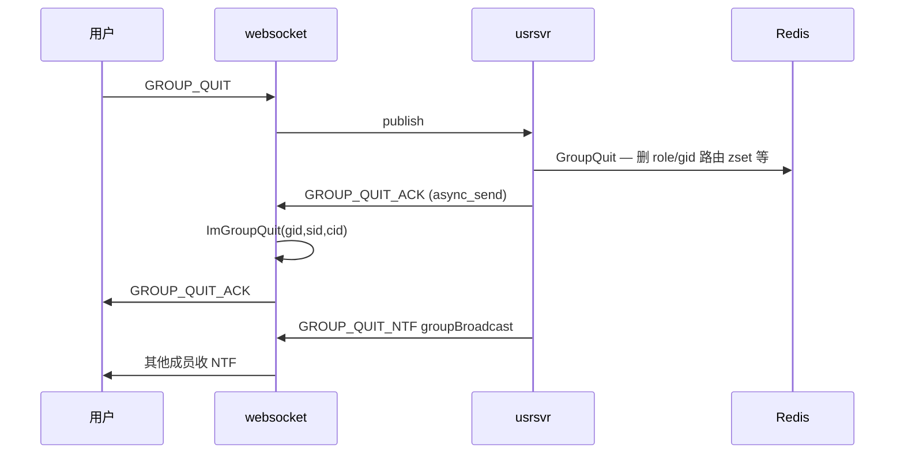

**不是** RTMQ unsub；**是** Redis 删成员 + ImGroup 删本地会话。

十人依次退群：10 次上行 publish + 10 ACK async_send + 若干 NTF broadcast（每个 nid 1～2 包）。

### 7.2 GROUP-DISMISS（群主解散）

100001 发 `GROUP_DISMISS` → usrsvr `GroupDismiss` → **DEL** 群相关 Redis 键 → ACK → 可选通知。

### 7.3 用户 OFFLINE / 断 WS

| 事件 | 路径 |
|------|------|
| 主动 OFFLINE | WS → publish → usrsvr 清 Redis 会话 |
| 直接关浏览器 | websocket 检测断连 → 清理 Session / 可选 OFFLINE 上报 |

用户级下线 **不改变** msgsvr 的 RTMQ SUB；只清 **sid/nid** 与群 zset 中的过期 score。

### 7.4 进程按依赖 **逆序** 下线

与 `run-in-linux.sh` 相反；原则：**先断客户端与接入，再断业务，最后 frwder**。

| 顺序 | 停止 | 影响 |
|------|------|------|
| 1 | **demo-web** | 仅静态页 |
| 2 | **listend / listend-2** | C 接入（Go WS 仍可独立） |
| 3 | **websocket-2** | NID 20002 Proxy TCP 断 → Server **sub_del(该连接所有 type)** |
| 4 | **websocket** | NID 20001 同上 |
| 5 | **chatroom** | 聊天室业务 |
| 6 | **monitor** | iplist 辅助 |
| 7 | **usrsvr** | HTTP + 群/ONLINE 不可用 |
| 8 | **tasker** | 后台任务 |
| 9 | **msgsvr** | 群消息不可用 |
| 10 | **seqsvr** | 新 ONLINE 无法分配 seq |
| 11 | **frwder** | **RTMQ 双 Server 全停**；所有 Proxy 断连 |

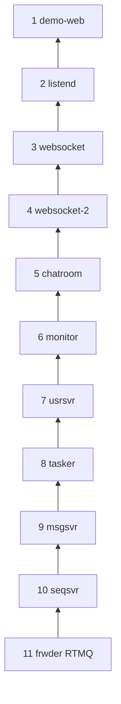

### 7.5 Proxy 断线时 RTMQ Server 做什么

```text
TCP 断开
  → rsvr 清理连接
  → 对该 sid 所有 RTMQ SUB 项 sub_del(type, sck)
  → node_to_svr_map 删除 nid 映射
  → 此后 async_send(该 nid) 失败 / drop
  → publish 不再包含已下线 Proxy
```

**无需** 业务代码发「RTMQ 退订」。

### 7.6 一键停止（Docker）

```bash
docker compose --profile run --profile demo down
```

runner 容器退出 → **所有 9 进程同时 SIGTERM**；等价于乱序杀进程，生产应 **按 §7.4 优雅关闭**。

---

## 8. 分层对照表（面试速记）

| 阶段 | 用户可见 | 业务 cmd | RTMQ publish | RTMQ async_send | Redis / 本地 |
|------|----------|----------|--------------|-----------------|--------------|
| 进程启动 | — | — | — | — | — |
| Proxy Launch | — | — | — | — | Server **SUB 表** 写入 |
| HTTP register | 得 sid | — | — | — | MySQL |
| ONLINE | ONLINE_ACK | 0x0101 | 1× | 1× ACK | sid→nid |
| 建群 | CREAT_ACK | 0x0301 | 1× | 1× ACK | gid 元数据 |
| 加群 | JOIN_ACK/NTF | 0x0305 | 1× | ACK+NTF×nid | gid→nid |
| 发群消息 | CHAT + ACK | 0x030B | 1× | 2× fan-out + 1× ACK | 读 gid→nid |
| 收群消息 | CHAT 推送 | — | — | 到本 nid | **ImGroup** fan-out |
| 退群 | QUIT_ACK/NTF | 0x0307 | 1× | ACK+NTF | 删成员 |
| 停 websocket | WS 断 | — | — | — | **sub_del** 该 Proxy |

---

## 9. 建议验证命令

```bash
# 启动
docker compose --profile run --profile demo up -d

# 自动化 2 用户冒烟（建群/聊天/退群/解散）
./scripts/smoke-group.sh

# 看 RTMQ 相关日志
docker exec beehive-runner tail -f /workspace/log/frwder.log
docker exec beehive-runner tail -f /workspace/log/msgsvr.log
docker exec beehive-runner tail -f /workspace/log/usrsvr.log

# Redis：群 nid 集合
docker exec beehive-redis redis-cli -a 111111 ZRANGE chat:gid:1:nid 0 -1 WITHSCORES
# （gid 以 INCR 实际值为准）
```

---

## 10. 相关源码索引

| 主题 | 文件 |
|------|------|
| 启动顺序 | `scripts/run-in-linux.sh` |
| frwder 桥接 | `src/clang/exec/frwder/frwd_mesg.c` |
| RTMQ Go Proxy SUB | `src/golang/lib/rtmq/rtmq_proxy.go` `subscribe()` |
| WS 上行转发 | `src/golang/exec/websocket/controllers/mesg.go` |
| WS 下行 fan-out | `src/golang/exec/websocket/controllers/upmesg.go` |
| ONLINE | `src/golang/exec/usrsvr/controllers/mesg.go` |
| 群生命周期 | `src/golang/exec/usrsvr/controllers/gmesg.go` |
| 群消息 fan-out | `src/golang/exec/msgsvr/controllers/gmesg.go` |
| Redis 群操作 | `src/golang/lib/chat/group_ops.go` |
| ImGroup | `src/golang/lib/chat_tab/chat.go` |

---

*文档版本：2026-06 · 与 beehive-im 群聊 Demo 栈一致。*
