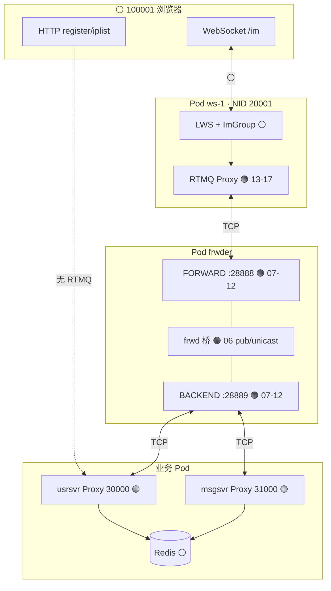
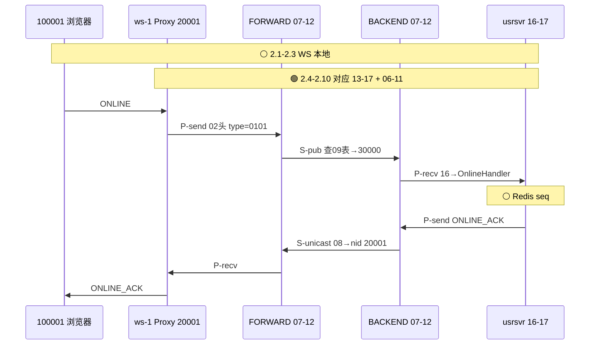
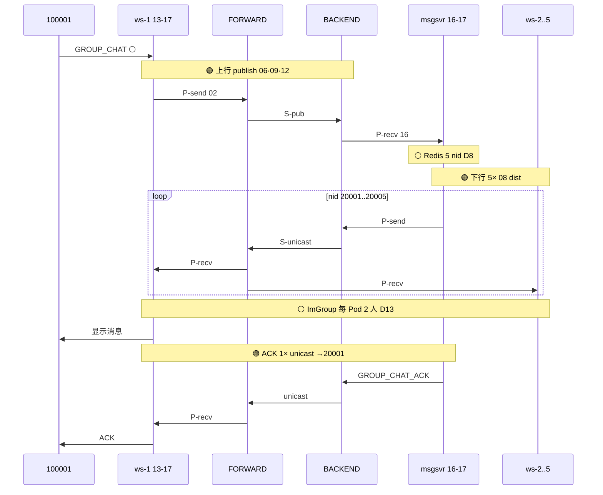
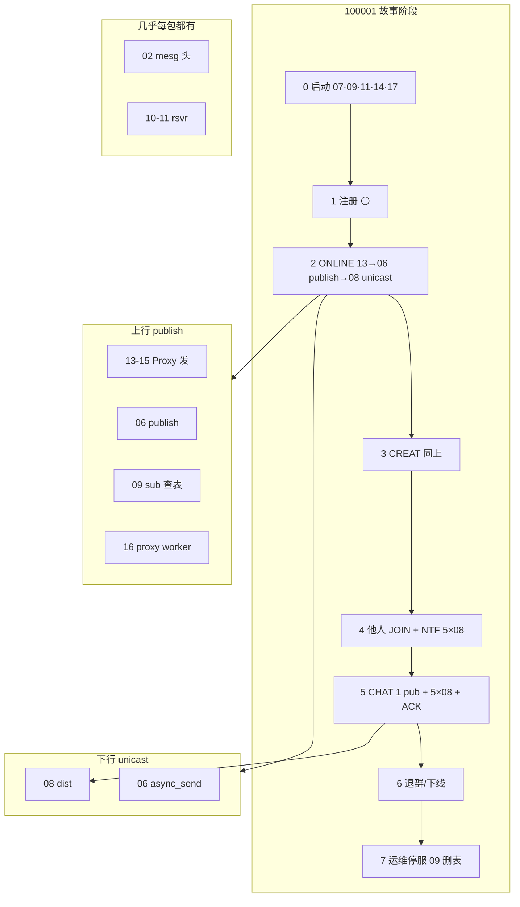

# 群聊故事线：一个用户走通 RTMQ 17 篇

> **主角**：uid **100001**（群主），连 **ws-1:8002**，该 Pod 的 RTMQ Proxy **NID=20001**。  
> **场景**：10 人同群、5 个 websocket 接入（NID 20001～20005）；其余 9 人按手册分布，本故事只在「加群 / fan-out」处点名他们。  
> **依据**：[群聊10人5接入-RTMQ逐步标注手册.md](群聊10人5接入-RTMQ逐步标注手册.md) · [00-总地图.md](00-总地图.md)  
> **读法**：先通读本文一遍建立「有血有肉」的画面；再按文末 **§8 对照表** 打开对应编号文档，每篇都能在故事里找到锚点。

---

## 0. 先回答：这条链路能否覆盖 17 篇？

**能覆盖绝大部分；少数篇是「基础设施层」，故事线里只出现 1～2 次，但不可缺少。**

| 编号 | 文档 | 本故事线是否出现 | 出现在哪一步 |
|------|------|------------------|--------------|
| 00 | 总地图 | ✅ | 读本文前的 GPS |
| 01 | 架构 | ○ | 概念层，与故事等价，无单独「事件」 |
| **02** | mesg 协议 | **●** | **每一个** RTMQ 包的 `rtmq_header` |
| **03** | comm | **○** | Register 回调签名；错误码（失败分支另说） |
| **04** | recv.h / Server ctx | **●** | 启动后 Server 侧连接表、recvq、distq 全程在跑 |
| **05** | proxy.h | **●** | 每个进程的 Proxy ctx；100001 相关的是 ws-1 / usrsvr / msgsvr |
| **06** | recv API | **●** | 每次 **S-pub** / **S-unicast** 都走 publish / async_send |
| **07** | lsn | **●** | 阶段 0：frwder 28888/28889 **listen accept** |
| **08** | dist | **●** | 阶段 5～6：每条下行 **async_send(nid)** 必经 dist |
| **09** | sub hash | **●** | 阶段 0 SUB；阶段 2～5 每次 **publish 查表** |
| **10** | rsvr 上 | **●** | 所有 TCP 收包、拼帧 |
| **11** | rsvr 下 | **●** | AUTH/SUB/writev 发出 |
| **12** | Server worker | **●** | **frwder 桥**在 FORWARD/BACKEND worker 里 reg；Go 业务在 **16** |
| **13** | proxy API | **●** | 每次 **P-send** 入 sendq |
| **14** | tsvr 上 | **●** | Proxy 连 Server、鉴权 |
| **15** | tsvr 下 | **●** | writev 发 / 收下行 |
| **16** | proxy worker | **●** | **业务入口**：ONLINE / CREAT / CHAT 的 Go handler |
| **17** | Go proxy | **●** | 你调试的 `ctx.frwder` = C 的 13～16 |

**图例**：● = 本故事必经　○ = 启动或类型定义，不单独成「用户动作」

**本故事故意不走的 RTMQ 能力**（所以读 17 篇时别期待在这里出现）：

- **IM CMD_SUB (0x0107)**：群聊不用；与 RTMQ **P-sub** 无关。
- **RTMQ 退订 API**：没有；只有 Proxy **断线** 才删 **S-sub表**。
- **03 comm** 里的部分错误分支、重连细节：Happy path 不展开。

---

## 1. 角色与层次（读故事前先钉死）



**100001 一生只连 ws-1**，但他的群消息会被 **msgsvr** 按 Redis 打到 **5 个 NID**，再在各 Pod 内 **ImGroup** 推给 10 个浏览器。

---

## 2. 阶段 0：服务启动（100001 还没打开网页）

> **RTMQ**：● 全程　**业务**：⚪ 尚无用户

这是 **07→11→09** 和 **13→17** 的「空载彩排」。100001 后来每一次 ONLINE/CREAT/CHAT，都复用这里建好的 **sub 表** 和 **TCP 连接**。

### 0.1 frwder Pod 先起来

| 子步 | 发生了什么 | 17 篇 |
|------|------------|-------|
| 0.1.1 | FORWARD **listen :28888** | **07** lsn |
| 0.1.2 | BACKEND **listen :28889** | **07** lsn |
| 0.1.3 | Server **04** ctx：rsvr×N、recvq、distq、**09 sub hash 空** | **04** **09** |
| 0.1.4 | frwd 在 **12** worker reg：FORWARD 收包→**06 publish**；BACKEND 收包→**06 async_send(nid)** | **06** **12** |

⚪ 此时没有 Proxy，没有 **P-sub**。

### 0.2 msgsvr / usrsvr Launch

以 **usrsvr NID=30000** 为例（msgsvr 31000 同理）：

| 子步 | RTMQ 动作 | 17 篇 |
|------|-----------|-------|
| Launch 前 | Go `Register(ONLINE, GROUP_CREAT, …)` — 进程内 map | **17** **05** |
| P-conn | TCP 连 **28889** | **14** **07** accept |
| P-auth | `RTMQ_CMD_AUTH` nid=30000 | **02** **11** |
| P-sub | 对每个 Register 的 cmd 发 SUB_REQ | **02** **09** **11** |
| 结果 | BACKEND sub 表：`0x0301→[30000]`，`0x0101→[30000]`… | **09** |

⚪ **不** SUB `GROUP_CHAT`（归 msgsvr **31000**）。

### 0.3 websocket-1 Launch（NID=20001，100001 将来连这个）

| 子步 | RTMQ 动作 | 17 篇 |
|------|-----------|-------|
| Register 下行 cmd | `GROUP_CHAT_ACK`, `ONLINE_ACK`, `GROUP_CREAT_ACK`… | **17** |
| P-conn / auth / sub | 连 **28888** FORWARD | **14** **11** |
| 结果 | FORWARD sub：`0x030B GROUP_CHAT→[20001,…20005]` | **09** |

⚪ **MesgRegister** 里上行 handler 是 **WebSocket 本地回调**，不是 RTMQ SUB；上行走 **P-send** 才进 RTMQ。

### 0.4 启动完成时，和 100001 相关的 sub 表快照

**BACKEND（28889）**

```text
0x0101 ONLINE       → [30000 usrsvr]
0x0301 GROUP_CREAT  → [30000]
0x0305 GROUP_JOIN   → [30000]
0x030B GROUP_CHAT   → [31000 msgsvr]
```

**FORWARD（28888）**

```text
0x0102 ONLINE_ACK      → [20001 … 20005]
0x0302 GROUP_CREAT_ACK → [20001 … 20005]
0x0306 GROUP_JOIN_ACK  → [20001 … 20005]
0x030B GROUP_CHAT      → [20001 … 20005]   ← 下行群消息
0x030C GROUP_CHAT_ACK  → [20001 … 20005]
```

**此后直到 ws Pod 下线，这张表不因「加群」而变** —— 加群改的是 **Redis**，不是 RTMQ sub。

---

## 3. 阶段 1：100001 注册（⚪ 无 RTMQ）

| 步 | 100001 在做什么 | RTMQ | 17 篇 |
|----|-----------------|------|-------|
| 1.1 | 浏览器 `GET /im/register` → usrsvr HTTP → MySQL 写 uid | **无** | — |
| 1.2 | `GET /im/iplist` → 拿到 ws 地址 **8002** + token | **无** | — |

**有血有肉的一句**：100001 拿到账号时，**邮局还没 his 事**；信还没寄，只是 HTTP 办了身份证。

---

## 4. 阶段 2：100001 上线 ONLINE

| 步 | 位置 | 动作 | RTMQ | 17 篇 |
|----|------|------|------|-------|
| 2.1 | 浏览器 | WS 握手 `/im` | **无** | — |
| 2.2 | 浏览器 | 发 `CMD_ONLINE 0x0101` | **无** | — |
| 2.3 | ws-1 | `LsndMesgOnlineHandler` 补 cid、**nid=20001** | **无** | — |
| 2.4 | ws-1 Proxy | **P-send** ONLINE | **Proxy** | **13→15→02** |
| 2.5 | FORWARD | **10** 收包 → frwd **S-pub** | **Server** | **10→12→06→09** |
| 2.6 | BACKEND | 投递 usrsvr | **Proxy+Server** | **11→16** |
| 2.7 | usrsvr | 写 Redis online、查 seqsvr | **无** | — |
| 2.8 | usrsvr Proxy | **P-send** `ONLINE_ACK` | **Proxy** | **13→15** |
| 2.9 | BACKEND | **S-unicast** nid=**20001** | **Server** | **06→08→10→11** |
| 2.10 | ws-1 | **P-recv** ONLINE_ACK → 浏览器 | **Proxy** | **16→17** |



**对照 17 篇的一句话**：

> 上行 = **13→15→10→(12 frwd)→06 publish→09 查表→16**；  
> 下行 = **13→06 async_send→08 dist→11→16**。

其余 9 人各连自己的 ws Pod，各做一遍；每人 **2 个 RTMQ 业务包**（1 publish + 1 unicast）。

---

## 5. 阶段 3：100001 创建群 GROUP-CREAT

| 步 | 动作 | RTMQ | 17 篇 |
|----|------|------|-------|
| 3.1 | 浏览器发 `GROUP_CREAT 0x0301` | **无** | — |
| 3.2 | ws-1 **P-send** | **Proxy** | **13-15** **02** |
| 3.3 | FORWARD **S-pub** → usrsvr | **Server** | **10-12** **06** **09** |
| 3.4 | usrsvr `GroupCreat`、Redis 建 **gid**、群主入群 | **无** | — |
| 3.5 | usrsvr **P-send** `GROUP_CREAT_ACK` | **Proxy** | **13-15** |
| 3.6 | **S-unicast** nid=**20001** | **Server** | **06** **08** **11** |
| 3.7 | ws-1 **P-recv** → **ImGroupJoin** → 浏览器拿 gid | **Proxy** + ⚪ ImGroup | **16-17** |

⚪ **IM CMD_SUB**：无。  
⚪ RTMQ **P-sub** 表：不变（进程启动时已 SUB `0x0301`）。

**100001 此时 Redis 里**：gid 存在，成员只有他；`gid→nid` 里会有 **20001**（他 online 的接入）。

---

## 6. 阶段 4：100002～100010 加群（100001 旁观）

每人 `GROUP-JOIN 0x0305`，RTMQ 模式与阶段 3 **完全相同**，只是 **09** 查表 cmd 换成 `0x0305`，**unicast** 打各自 NID：

| uid | ws Pod | unicast nid |
|-----|--------|-------------|
| 100002 | ws-1 | 20001 |
| 100003 | ws-2 | 20002 |
| … | … | … |
| 100010 | ws-5 | 20005 |

### 6.1 JOIN_NTF 广播（可选但 Demo 常见）

usrsvr `groupBroadcast`：读 Redis **`gid→nid`** → 对 **5 个 NID 各 P-send 一次** → **5× S-unicast**。

| 步 | RTMQ | 17 篇 |
|----|------|-------|
| 每人 join 一次 NTF | **5× unicast** / 次 | **06** **08** **11→16** |
| 到 ws 后 ImGroup 推连接 | **无** | — |

### 6.2 加群完成后（和 100001 发消息强相关）

| 存储 | 内容 | 谁读 |
|------|------|------|
| Redis `gid→nid` | **{20001,20002,20003,20004,20005}** | msgsvr **第一段 fan-out** |
| Redis 成员 | 10 uid | msgsvr 校验 |
| 各 ws **ImGroup** | 每 Pod 2 个 (gid,sid,cid) | **第二段 fan-out** |
| RTMQ sub 表 | **与阶段 0 相同** | 仍按 **cmd** 路由 |

**有血有肉的一句**：9 个人加群，对 100001 来说 **RTMQ 多了一堆「unicast 到各 Pod」的 NTF**；但 **邮局订阅目录没改** —— 改的是 **Redis 里的群成员和 nid 集合**。

---

## 7. 阶段 5：100001 发一条群消息 GROUP-CHAT

这是 **08 dist** 和 **两段 fan-out** 的高光时刻。

### 7.1 逐步表（每步标注 RTMQ + 17 篇）

| # | 位置 | 动作 | RTMQ | 17 篇 |
|---|------|------|------|-------|
| D1 | 100001 浏览器 | 发 `GROUP_CHAT 0x030B` | **无** | — |
| D2 | ws-1 | 补 cid, nid=20001 | **无** | — |
| D3 | ws-1 Proxy | **P-send** GROUP_CHAT | **Proxy** | **13-15** **02** |
| D4 | FORWARD | rsvr 收包 | **Server** | **10** |
| D5 | frwd | **S-pub** GROUP_CHAT | **Server** | **12→06→09→31000** |
| D6 | msgsvr | **P-recv** → `MsgSvrGroupChatHandler` | **Proxy+Server** | **16-17** |
| D7 | msgsvr | 校验成员、Mongo 异步入队 | **无** | — |
| D8 | msgsvr | Redis **`GroupGetGidToNidSet` → 5 nid** | **无** | — |
| D9 | msgsvr | **5× P-send**（IM 头 nid=20001..20005） | **Proxy×5** | **13-15** ×5 |
| D10 | BACKEND | **5× S-unicast** | **Server×5** | **06→08→11** ×5 |
| D11 | FORWARD | 推到 5 个 ws Proxy | **Server** | **10-11** |
| D12 | ws-1..5 | **P-recv** GROUP_CHAT | **Proxy×5** | **16** ×5 |
| D13 | 各 ws | `TravImGroupSession(gid)` 每 Pod **2** 连接 | **无** | — |
| D14 | 10 浏览器 | 含 100001 自己，共 **10** 份 | **无** | — |
| D15 | msgsvr | **P-send** GROUP_CHAT_ACK → **20001** | **Proxy+Server** | **13→06→08→16** |

### 7.2 本条消息 RTMQ 包计数

| 类型 | 次数 |
|------|------|
| **S-pub** 上行 | **1** |
| **S-unicast** fan-out | **5** |
| **S-unicast** ACK | **1** |
| **合计** | **7** 个 RTMQ 业务包 |
| 浏览器收到 CHAT | **10**（⚪ ImGroup，非 RTMQ） |

### 7.3 序列图（100001 视角 + 17 篇标注）



### 7.4 两段 fan-out（必背，面试也考这个）

```text
第一段（🟢 RTMQ · msgsvr → 5 个 ws Pod）
  Redis gid→nid 有几个 NID，msgsvr 就几次 async_send
  本场景：5 次 · 文档 06 + 08

第二段（⚪ 无 RTMQ · 每个 ws Pod 内部）
  TravImGroupSession(gid) 遍历本 Pod 上该群的 WS 连接
  本场景：每 Pod 2 人 × 5 Pod = 10 个浏览器
```

**100001 的消息路径**：

1. 浏览器 → ws-1（⚪）  
2. ws-1 → msgsvr（🟢 publish，**17→…→16**）  
3. msgsvr → **5 个 Pod 各 1 包**（🟢 **08** 按 nid 分拣）  
4. ws-1 收到后 → **100001 + 100002** 两个 WS（⚪ ImGroup）  
5. ws-2 收到后 → 100003、100004 … 依此类推  

**若没有 RTMQ**：msgsvr 要维护到 5 个 ws 进程的 TCP；每加一个 Pod 就要改 msgsvr 连接表。  
**有 RTMQ**：msgsvr 只 **P-send + IM.nid**，拆 Pod 时 **msgsvr 不用改**。

---

## 8. 阶段 6：100001 退群与下线（简版）

| 动作 | RTMQ | 17 篇 | 备注 |
|------|------|-------|------|
| GROUP-QUIT | 同 CREAT：publish + unicast | **06-16** | **无** RTMQ unsub |
| QUIT_NTF | 可选 5× unicast | **08** | |
| Redis / ImGroupQuit | **无** | — | |
| 100001 关浏览器 | ws 连接断 | **无** RTMQ | ImGroup 清 session |
| **停 ws-1 Pod** | FORWARD **S-sub表** 删 20001 全部 cmd | **09** **11** 断线 | 之后 async_send(20001) **失败** |

---

## 9. 阶段 7：各组件依次下线（运维视角）

顺序与 [手册 §8](群聊10人5接入-RTMQ逐步标注手册.md#8-阶段-g按依赖下线每个-proxy-的-rtmq-行为) 一致：

| 顺序 | 停谁 | RTMQ 效果 | 17 篇 |
|------|------|-----------|-------|
| G1 | demo-web | **无** | — |
| G2 | websocket-5 … 1 | 每 Pod TCP 断 → FORWARD 删该 NID 的 **09 sub** | **11** **09** |
| G3 | msgsvr | BACKEND 删 31000；**publish(GROUP_CHAT)** 无订阅者 | **09** |
| G4 | usrsvr | BACKEND 删 30000 | **09** |
| G5 | frwder | **两个 Server 全停**；07 listen 结束；所有 Proxy **P-conn** 断 | **07** **04** |

⚪ 停 Redis/MySQL：**无 RTMQ**；业务先不可用。


---

## 10. 一张总图：100001 一生与 17 篇



---

## 11. 17 篇 × 故事锚点速查（复习用）

读某一篇时，直接跳到对应锚点：

| 篇 | 在 100001 故事里的「那一幕」 |
|----|------------------------------|
| **02** | 每次 P-send 的 `RTMQ_EXP_MESG` + `type=0x0101/0x0301/0x030B` |
| **03** | `Register(func(ctx, cmd, buf))` 就是 **16** 调你的 handler 的类型 |
| **04** | frwder 里两个 Server 的 recvq / distq；想象成邮局后台 |
| **05** | ws-1 / usrsvr / msgsvr 进程里各一份 `rtmq_proxy_ctx` |
| **06** | frwd **publish**(上行) / **async_send**(下行 nid=20001) |
| **07** | 阶段 0：28888/28889 开始 accept |
| **08** | 阶段 2.9、3.6、5 D10/D15：**每条 ACK 和 5 路 fan-out** |
| **09** | 阶段 0 SUB 写入；阶段 5 D5 publish 查 `0x030B→31000` |
| **10** | 所有 TCP 字节流拼成帧 |
| **11** | AUTH nid=20001/30000/31000；SUB；writev 下行 |
| **12** | **frwder** 的 reg 回调（Go 业务在 **16** 不在 12） |
| **13** | `AsyncSend` 入队 — 100001 点发送的第一行 Go |
| **14** | ws-1 Launch 连 28888 |
| **15** | 实际 writev / 收包 |
| **16** | `UsrSvrOnlineHandler` / `MsgSvrGroupChatHandler` / `LsndUpMesg…` |
| **17** | `src/golang/lib/rtmq/rtmq_proxy.go` — 你打断点的地方 |

---

## 12. 建议阅读顺序（故事 + 17 篇交替）

```text
1. 本文通读（建立 100001 画面）
2. 00 总地图 §2 组件图
3. 跟着 100001 的 ONLINE 读：17 → 13 → 14/15 → 02 → 10/11 → 09 → 16
4. 跟着 GROUP-CHAT 下行读：06 async_send → 08 → 11 → 16
5. 阶段 0 补读：07、04、12（frwder 桥）
6. 03、01 当附录；12 分清「frwder C reg」vs「Go 16 reg」
```

---

## 13. 10 秒自检（故事版）

1. **100001 注册用 RTMQ 吗？** → **无**  
2. **ONLINE 几包 RTMQ？** → **2**（1 pub + 1 unicast 到 20001）  
3. **建群改 sub 表吗？** → **不改**；改 Redis  
4. **100001 发 1 条 CHAT 几包 RTMQ？** → **7**  
5. **10 个浏览器谁推的？** → **5 包 RTMQ 到 5 Pod + ImGroup 推 10 连接**  
6. **08 在哪出现？** → **每次 async_send 下行**（ACK、fan-out、NTF）  
7. **12 和 16 区别？** → **12**=frwder Server 桥；**16**=Go 业务 handler  

---

*文档版本：2026-06 · 主角 uid=100001 · 5 接入 NID 20001–20005 · 配套 [群聊10人5接入-RTMQ逐步标注手册.md](群聊10人5接入-RTMQ逐步标注手册.md)*
