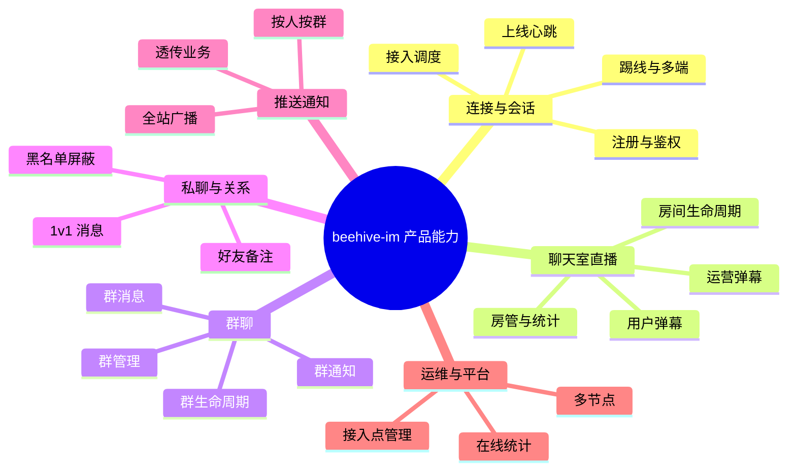

# beehive-im 产品功能全览地图

> **用途**：按产品维度罗列本系统可做的全部功能，便于后续逐项完善（Demo UI、Smoke、文档、生产化）。  
> **范围**：基于当前仓库 **协议 + 后端实现 + HTTP 接口**；不含 K8s、敏感词、音视频等明确未做项。  
> **相关文档**：[DEMO_SCOPE.md](DEMO_SCOPE.md) · [COMMAND.md](COMMAND.md) · [HTTPSVR.md](HTTPSVR.md) · [INTERVIEW_DEMO.md](INTERVIEW_DEMO.md)

---

## 0. 状态图例

| 标记 | 含义 | 完善方向 |
|------|------|----------|
| ✅ | 后端已实现，且有 smoke 或 demo/web 可演示 | 打磨体验、补文档 |
| 🟡 | 后端已实现，无产品级 UI / smoke 覆盖不全 | **优先补 demo 或脚本** |
| 🟠 | 协议或 HTTP 有定义，实现不完整或待验证 | 联调 + 补测试 |
| ⬜ | 协议预留，后端未实现 | 按产品优先级排期 |
| ❌ | 明确不做或架构未覆盖 | 不纳入近期计划 |

**服务缩写**：`USR`=usrsvr · `ROOM`=chatroom · `MSG`=msgsvr · `ACC`=websocket/listend · `GW`=frwder

---

## 1. 产品全景（四种会话 + 底座）

---

## 2. 连接与会话（所有产品的公共底座）

用户必须先完成：**注册 → 拉接入点 → 长连接上线**，才能使用聊天室 / 群 / 私聊 / 收推送。

| ID | 产品功能 | 用户价值 | 协议 / HTTP | 服务 | 后端 | Demo/Smoke | 完善建议 |
|----|----------|----------|-------------|------|------|------------|----------|
| S-01 | 设备/用户注册 | 分配 uid、sid | `GET /im/register` | USR | ✅ | demo/web | 参数校验文档、错误 JSON 用例 |
| S-02 | 接入点调度 iplist | 按网络/运营商选 WS 或 TCP | `GET /im/iplist?type=1\|2` | USR | ✅ | demo/web | 多节点时展示 list 多条 |
| S-03 | WebSocket 上线 | 建立 IM 会话 | `ONLINE` 0x0101 | USR + ACC | ✅ | demo/web | — |
| S-04 | 下线 | 主动断开 | `OFFLINE` 0x0103 | USR | ✅ | smoke-test | — |
| S-05 | 心跳保活 | 长连接不断 | `PING/PONG` 0x0105 | ACC | ✅ | 隐式 | 可展示「最后心跳时间」 |
| S-06 | 鉴权 token | 防伪造 sid | iplist 返回 token，ONLINE 携带 | USR | ✅ | smoke-fail | 坏 token 场景已测 |
| S-07 | 重复登录踢线 | 同 uid 多端互踢 | `KICK` 0x0110 | USR | ✅ | 🟡 | **demo：双端同 uid 登录** |
| S-08 | TCP 接入 | CLI / 压测 / 非浏览器 | iplist type=1，listend :9002 | ACC | ✅ | 🟡 | loadtest / 原生客户端 demo |
| S-09 | 消息同步 | 离线后拉增量 | `SYNC` 0x010D | USR | 🟡 | ⬜ | 定义产品策略 + demo |
| S-10 | 订阅频道 | topic 类消息 | `SUB/UNSUB` 0x0107 | USR | 🟡 | ⬜ | 需产品定义「订阅什么」 |
| S-11 | 通用 ERROR 帧 | 统一错误下行 | `ERROR` 0x010B | — | ⬜ | ⬜ | 可选，当前各业务 ACK 已带 code |
| S-12 | 好友上下线通知 | 好友列表在线态 | `ONLINE-NTF` / `OFFLINE-NTF` | — | ⬜ | ⬜ | 依赖好友关系 |

---

## 3. 聊天室 / 直播弹幕（ROOM 0x04xx）

**典型产品**：直播间公屏、开放频道、活动房。  
**你已 demo**：双人同房互发 `ROOM-CHAT`（`demo/web`）。

### 3.1 核心互动

| ID | 产品功能 | 用户价值 | 协议 / HTTP | 服务 | 后端 | Demo/Smoke | 完善建议 |
|----|----------|----------|-------------|------|------|------------|----------|
| R-01 | 进入聊天室 | 进房看弹幕 | `ROOM-JOIN` 0x0405 | ROOM | ✅ | demo/web | — |
| R-02 | 发送弹幕 | 用户发言 | `ROOM-CHAT` 0x040B | ROOM | ✅ | demo/web | 超长/空消息边界 UI 提示 |
| R-03 | 退出聊天室 | 离开房间 | `ROOM-QUIT` 0x0407 | ROOM | ✅ | smoke-test | — |
| R-04 | 错误进房 | 非法 rid / 未上线 / 重复 join | `ROOM-JOIN-ACK` code | ROOM | ✅ | smoke-fail | demo 展示错误码文案 |
| R-05 | 未进房发言 | 防刷 / 逻辑正确 | `ROOM-CHAT-ACK` code | ROOM | ✅ | smoke-fail | demo 拦截 |

### 3.2 房间生命周期

| ID | 产品功能 | 用户价值 | 协议 / HTTP | 服务 | 后端 | Demo/Smoke | 完善建议 |
|----|----------|----------|-------------|------|------|------------|----------|
| R-10 | 创建房间 | 每场直播一个房 | `ROOM-CREAT` 0x0401 | ROOM | ✅ | smoke-room | **demo：主播一键建房** |
| R-11 | 解散房间 | 下播关房 | `ROOM-DISMISS` 0x0403 | ROOM | ✅ | smoke-room | 与 R-10 联动 |
| R-12 | HTTP 关闭房间 | 运营后台关房 | `GET :8004/room/config?action=close&option=room` | ROOM | ✅ | 🟡 | 管理后台或 curl 脚本 |
| R-13 | HTTP 打开房间 | 重新开放 | `action=open&option=room` | ROOM | ✅ | 🟡 | 同上 |
| R-14 | 种子/bootstrap 房间 | 回归测试 rid=10001 | MySQL 种子 | ROOM | ✅ | smoke-test | 文档说明 vs 动态建房 |

### 3.3 运营与系统弹幕

| ID | 产品功能 | 用户价值 | 协议 / HTTP | 服务 | 后端 | Demo/Smoke | 完善建议 |
|----|----------|----------|-------------|------|------|------------|----------|
| R-20 | 运营弹幕（房间内） | 公告、活动、系统提示 | `ROOM-BC` 0x040D | ROOM | ✅ | 🟡 | **demo：与用户弹幕不同样式** |
| R-21 | HTTP 推送房间广播 | 后台不发 WS 也能推 | `POST :8004/room/push?dim=room&rid=` | ROOM | ✅ | 🟡 | 与 R-20 二选一演示 |
| R-22 | 礼物/付费弹幕（业务层） | 高亮展示 | ROOM-CHAT level 字段 / BC data | ROOM | 🟡 | ⬜ | 协议有 level，UI 自定 |

### 3.4 房管与秩序

| ID | 产品功能 | 用户价值 | 协议 / HTTP | 服务 | 后端 | Demo/Smoke | 完善建议 |
|----|----------|----------|-------------|------|------|------------|----------|
| R-30 | 踢出房间 | 房管踢人 | `ROOM-KICK` 0x0409 | ROOM | ✅ | 🟡 | demo 房管按钮 |
| R-31 | 被踢通知 | 被踢用户感知 | `ROOM-KICK-NTF` 0x0454 | ROOM | ✅ | 🟡 | 客户端弹窗 |
| R-32 | 房间禁言 | 单人禁言 | HTTP `room/config gag add/del` | ROOM | ✅ | 🟡 | 运营脚本 |
| R-33 | 房间黑名单 | 禁止进房 | HTTP `room/config blacklist` | ROOM | ✅ | 🟡 | 与 JOIN 失败联动 |
| R-34 | 房主/管理员 | 权限控制 | Redis role 表 | ROOM | 🟡 | 🟡 | DISMISS/KICK 权限演示 |

### 3.5  presence 与统计

| ID | 产品功能 | 用户价值 | 协议 / HTTP | 服务 | 后端 | Demo/Smoke | 完善建议 |
|----|----------|----------|-------------|------|------|------------|----------|
| R-40 | 房间在线人数 | 「当前 N 人在线」 | `ROOM-USR-NUM` / HTTP `room/query?option=room-num` | ROOM | ✅ | 🟡 | **demo 页面展示 N** |
| R-41 | 进房通知 | 谁进来了 | `ROOM-JOIN-NTF` 0x0450 | ROOM | ✅ | 🟡 | 可选公屏系统消息 |
| R-42 | 退房通知 | 谁走了 | `ROOM-QUIT-NTF` 0x0452 | ROOM | ✅ | 🟡 | 同上 |
| R-43 | 热门房间榜 | 运营榜单 | HTTP `room/query?option=top-list` | ROOM | ✅ | 🟡 | 后台页 |
| R-44 | 房间内分组统计 | 大房分片可见 | HTTP `room/query?option=group-list` | ROOM | ✅ | 🟡 | 架构讲解用 |
| R-45 | 接入层维度统计 | 各节点人数 | `ROOM-LSN-STAT` 0x0412 | ROOM | ✅ | ⬜ | 运维视图 |
| R-46 | 房间分组容量 | 超大房分片上限 | HTTP `room/config cap` | ROOM | ✅ | ⬜ | 压测/扩容文档 |

### 3.6 明确不做（聊天室相关）

| ID | 产品功能 | 说明 |
|----|----------|------|
| R-99 | 敏感词过滤 | ❌ 见 [DEMO_SCOPE.md](DEMO_SCOPE.md)，上线前必补 |
| R-98 | 弹幕轨道/礼物动画协议 | ❌ 需客户端渲染，服务端仅文本/透传 |

---

## 4. 群聊（GROUP 0x03xx）

**典型产品**：工作群、兴趣群、临时讨论组（类似微信群）。  
**与聊天室区别**：有成员关系、管理员、禁言；消息走 `GROUP-CHAT` fan-out。

### 4.1 群生命周期

| ID | 产品功能 | 用户价值 | 协议 | 服务 | 后端 | Demo/Smoke | 完善建议 |
|----|----------|----------|------|------|------|------------|----------|
| G-01 | 创建群 | 建群 | `GROUP-CREAT` 0x0301 | USR | ✅ | smoke-group | **demo/web 群聊页** |
| G-02 | 解散群 | 群主删群 | `GROUP-DISMISS` 0x0303 | USR | ✅ | smoke-group | — |
| G-03 | 加入群 | 主动加群 | `GROUP-JOIN` 0x0305 | USR | ✅ | smoke-group | — |
| G-04 | 邀请入群 | 拉人 | `GROUP-INVITE` 0x0309 | USR | ✅ | 🟡 | demo + smoke 用例 |
| G-05 | 退群 | 成员离开 | `GROUP-QUIT` 0x0307 | USR | ✅ | smoke-group | — |
| G-06 | 群成员列表 | 查看成员 | `GROUP-USR-LIST` 0x031C | USR | ✅ | 🟡 | 群资料页 |

### 4.2 群消息

| ID | 产品功能 | 用户价值 | 协议 | 服务 | 后端 | Demo/Smoke | 完善建议 |
|----|----------|----------|------|------|------|------------|----------|
| G-10 | 群聊消息 | 群内互发 | `GROUP-CHAT` 0x030B | MSG | ✅ | smoke-group | demo 双窗口 |
| G-11 | 群消息落库 | 历史记录 | Mongo | MSG | ✅ | ⬜ | 历史消息 API / UI |
| G-12 | @某人 / 引用 | 互动 | 业务扩展 GROUP-CHAT body | MSG | ⬜ | ⬜ | 客户端协议扩展 |

### 4.3 群管理

| ID | 产品功能 | 用户价值 | 协议 / HTTP | 服务 | 后端 | Demo/Smoke | 完善建议 |
|----|----------|----------|-------------|------|------|------------|----------|
| G-20 | 踢人 | 移出群 | `GROUP-KICK` 0x030D | USR | ✅ | 🟡 | smoke 补一条 |
| G-21 | 禁言 / 解除 | 单人禁言 | `GROUP-GAG-ADD/DEL` | USR | ✅ | 🟡 | 管理 demo |
| G-22 | 群黑名单 | 禁止加群/发言 | `GROUP-BL-ADD/DEL` | USR | ✅ | 🟡 | — |
| G-23 | 设/撤管理员 | 分级管理 | `GROUP-MGR-ADD/DEL` | USR | ✅ | 🟡 | — |
| G-24 | HTTP 群配置 | 后台管群 | `/im/group/config`（见 HTTPSVR） | USR | 🟠 | ⬜ | 与协议能力对齐验证 |

### 4.4 群实时通知（NTF）

| ID | 产品功能 | 用户价值 | 协议 | 服务 | 后端 | Demo/Smoke | 完善建议 |
|----|----------|----------|------|------|------|------------|----------|
| G-30 | 入群通知 | 系统提示「A 加入了群」 | `GROUP-JOIN-NTF` 0x0350 | USR | ✅ | 🟡 | 群聊 UI 系统行 |
| G-31 | 退群通知 | 系统提示 | `GROUP-QUIT-NTF` 0x0352 | USR | ✅ | 🟡 | — |
| G-32 | 踢人通知 | 被踢感知 | `GROUP-KICK-NTF` 0x0354 | USR | ✅ | 🟡 | — |
| G-33 | 禁言/黑名单/管理员变更通知 | 群动态 | 0x0356～0x0367 | USR | ✅ | 🟡 | 可选 |

---

## 5. 私聊与社交关系（0x02xx）

**典型产品**：单聊、客服、陌生人私信。

| ID | 产品功能 | 用户价值 | 协议 | 服务 | 后端 | Demo/Smoke | 完善建议 |
|----|----------|----------|------|------|------|------------|----------|
| P-01 | 1v1 私聊 | 点对点文字 | `CHAT` 0x0201 | MSG | ✅ | 🟡 | **demo 双 uid 私聊页** |
| P-02 | 私聊 ACK | 发送状态 | `CHAT-ACK` 0x0202 | MSG | ✅ | 🟡 | 已读/未读 UI 自定 |
| P-03 | 离线消息 | 对方不在线仍可达 | Mongo 离线队列 | MSG | ✅ | ⬜ | 上线 SYNC 拉取 |
| P-04 | 用户黑名单 | 拉黑不可聊 | `BLACKLIST-ADD/DEL` | USR | ✅ | ⬜ | 设置页 |
| P-05 | 屏蔽/Gag | 不看某人 | `GAG-ADD/DEL` | USR | ✅ | ⬜ | — |
| P-06 | 添加好友 | 好友关系 | `FRIEND-ADD` 0x0203 | USR | 🟠 | ⬜ | COMMAND 标未实现，代码待核 |
| P-07 | 删除好友 | 解除关系 | `FRIEND-DEL` 0x0205 | USR | 🟠 | ⬜ | 同上 |
| P-08 | 好友备注 | 备注名 | `MARK-ADD/DEL` 0x0210 | — | ⬜ | ⬜ | 未实现 |

---

## 6. 推送与通知（0x05xx + HTTP Push）

**典型产品**：系统通知、活动弹窗、订单状态、@提醒（body 自定 JSON）。

| ID | 产品功能 | 用户价值 | 协议 / HTTP | 服务 | 后端 | Demo/Smoke | 完善建议 |
|----|----------|----------|-------------|------|------|------------|----------|
| N-01 | 按用户推送 | 订单/提醒 | `POST /im/push?dim=uid&kind=p2p\|bc` | USR | ✅ | smoke-push | demo 通知中心 |
| N-02 | 按会话推送 | 指定 sid | `dim=sid` | USR | ✅ | 🟡 | — |
| N-03 | 全站广播 | 全体在线用户 | `dim=broadcast` | USR | ✅ | 🟡 | 活动公告 demo |
| N-04 | 按群推送 | 群维度运营 | `dim=group&gid=` | USR | ✅ | 🟡 | — |
| N-05 | 按 App 推送 | 分版本 | `dim=appid` | USR | ⬜ | ⬜ | stub，低优 |
| N-06 | 协议 BC | 客户端收 0x0501 | `CMD_BC` | MSG | ✅ | smoke-push | 与 HTTP 互通 |
| N-07 | 协议 P2P | 客户端收 0x0503 | `CMD_P2P` | MSG | ✅ | smoke-push | 业务解析 body |
| N-08 | 聊天室运营推送 | 仅房间内 | 见 R-20/R-21 ROOM-BC | ROOM | ✅ | 🟡 | 与 N-01 职责分清 |

**职责边界**（面试常问）：

- **ROOM-BC**：只在某个 **rid** 内、带 msgid 的「公屏系统消息」  
- **0x05xx BC/P2P**：全站或按 **uid** 的「通知通道」，内容透传

---

## 7. 运维 / 平台 / 多节点（面向 Demo 与生产）

| ID | 产品功能 | 用户价值 | 入口 | 服务 | 后端 | Demo/Smoke | 完善建议 |
|----|----------|----------|------|------|------|------------|----------|
| O-01 | 多 WebSocket 接入 | 水平扩展接入 | websocket + websocket-2 | ACC | ✅ | smoke-multinode | 面试讲 nid 路由 |
| O-02 | 多 TCP listend | 压测/原生客户端 | listend + listend-2 | ACC | ✅ | 🟡 | loadtest |
| O-03 | 接入点自动注册 | iplist 有地址 | monitor + LSND-INFO | MON | ✅ | status.sh | — |
| O-04 | 查询侦听层列表 | 运维看清节点 | `/im/config?action=list&option=listend` | USR | 🟠 | ⬜ | 运维页 |
| O-05 | 查询/管理 frwder | 网关拓扑 | `/im/config frwder` | USR | 🟠 | ⬜ | — |
| O-06 | 在线人数统计序列 | 平台级在线曲线 | `/im/config user-statis` | USR | 🟠 | ⬜ | 监控大盘 |
| O-07 | 查询用户 SID 列表 | 多端/排查 | `/im/query?option=sid-list` | USR | 🟠 | ⬜ | 客服工具 |
| O-08 | 一键 Docker 演示栈 | 本地/面试 | `./scripts/up-demo.sh` | — | ✅ | INTERVIEW_DEMO | — |
| O-09 | 自动化验收 | 回归 | `smoke-*.sh` | — | ✅ | 6 套脚本 | CI 接入 |

---

## 8. 按「产品形态」速查：该用哪条能力

| 你想做的产品 | 主能力 | 辅助能力 |
|--------------|--------|----------|
| 直播公屏弹幕 | R-01～R-03 ROOM-CHAT | R-40 人数、R-20 运营弹幕 |
| 活动临时房间 | R-10/R-11 建房解散 | R-43 热门榜 |
| 微信群 | G-01～G-10 群全套 | G-20～G-33 管理+NTF |
| 私聊 / 客服 | P-01 CHAT | P-03 离线、P-04 黑名单 |
| App 系统通知 | N-01 P2P/BC | 与聊天 UI 分离 |
| 直播禁言踢人 | R-30～R-33 | HTTP room/config |
| 全站活动弹窗 | N-03 broadcast | — |
| 双端互踢 | S-07 KICK | S-03 ONLINE |

---

## 9. 建议完善路线图（按产品 ROI）

### Phase A — 补 Demo UI（不动后端）

| 优先级 | 功能 ID | 产出 |
|--------|---------|------|
| P0 | R-01～R-03 | 已有 demo/web |
| P1 | G-01～G-10 | 群聊双窗口页 |
| P1 | P-01 | 私聊双窗口页 |
| P1 | N-01, R-20 | 通知栏 + 运营弹幕样式 |
| P2 | R-40, R-41 | 在线人数 + 进房提示 |
| P2 | R-30, G-20 | 房管/群主踢人按钮 |

### Phase B — 补 Smoke / 文档

| 优先级 | 功能 ID | 产出 |
|--------|---------|------|
| P1 | G-20～G-23 | smoke-group 扩展踢人/禁言 |
| P1 | P-01 | smoke-p2p.sh |
| P2 | O-04～O-07 | HTTP 运维接口验证清单 |

### Phase C — 生产化（后续）

| 优先级 | 功能 ID | 产出 |
|--------|---------|------|
| P0 | R-99 | 敏感词 |
| P1 | P-06～P-08 | 好友体系 |
| P1 | S-09 | 离线 SYNC 产品化 |
| P2 | task_04 | 压测 baseline |

---

## 10. Smoke / Demo 覆盖矩阵

| 脚本 | 覆盖功能 ID |
|------|-------------|
| `smoke-test.sh` + `smoke-fail.sh` | S-03～S-06, R-01～R-05 |
| `smoke-room.sh` | R-10～R-11, R-01～R-03 |
| `smoke-group.sh` | G-01～G-05, G-10 |
| `smoke-push.sh` | N-01, N-06, N-07 |
| `smoke-multinode.sh` | O-01, R-01～R-03 跨节点 |
| `demo/web` | S-01～S-03, R-01～R-03 |

---

## 11. 附录：协议索引

| 域 | 命令范围 | 详情 |
|----|----------|------|
| 通用 | 0x01xx | [COMMAND.md](COMMAND.md) §通用 |
| 私聊/关系 | 0x02xx | [COMMAND.md](COMMAND.md) §私聊 |
| 群聊 | 0x03xx | [COMMAND.md](COMMAND.md) §群聊 · [GROUP_DESIGN.md](GROUP_DESIGN.md) |
| 聊天室 | 0x04xx | [COMMAND.md](COMMAND.md) §聊天室 |
| 推送 | 0x05xx | [COMMAND.md](COMMAND.md) §推送 |
| HTTP | — | [HTTPSVR.md](HTTPSVR.md)（usrsvr :8000，chatroom :8004） |

---

*文档版本：与 feature_spec_task_02/03 实现对齐；完善某项后请更新本表「Demo/Smoke」列并勾选路线图。*
