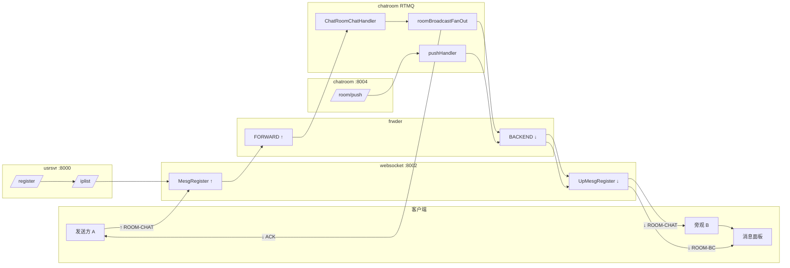

# 弹幕核心接口手册

> **用途**：按「接口 → 代码入口」快速熟悉必嗨 IM **聊天室/弹幕**主链路（覆盖 demo 与压测 90%+ 路径）。  
> **弹幕在本项目** = `ROOM-CHAT`（用户公屏）+ `ROOM-BC`（运营/系统公告 push）。  
> **配套流程图**：[assets/PUSH_TO_PANEL_FLOW.md](assets/PUSH_TO_PANEL_FLOW.md) · [FLOWS_AND_GLOSSARY.md](FLOWS_AND_GLOSSARY.md)

---

## 0. 图例（方向 + 服务，全文统一）

### 0.0 方向

| 标记 | 名称 | 含义 | 典型路径 |
|------|------|------|----------|
| **↑ 上行** | Client → 服务端 | 客户端经 WS/TCP 发出的业务帧 | Client → websocket → frwder **FORWARD** → chatroom |
| **↓ 下行** | 服务端 → Client | 推到用户面板的消息（含 fan-out） | chatroom → frwder **BACKEND** → websocket → Client |
| **⇅ ACK** | 应答 | 对上行请求的响应，算 **下行** 子类 | ROOM-CHAT-ACK、JOIN-ACK |
| **⇄ HTTP** | REST | 短连接，非 RTMQ | register / iplist / `/room/push` |
| **⚙ 内部** | 服务间 | 不直达客户端 | Redis 写、Mongo 落库、monitor 注册 |

### 0.0.1 服务（demo 默认进程）

| 服务 | 端口 | 语言 | 弹幕链路职责 |
|------|------|------|--------------|
| **usrsvr** | 8000 HTTP | Go | `/im/register`、`/im/iplist`；**ONLINE** 会话（部分） |
| **websocket** | 8002 WS | Go | 长连接接入；**↑** `MesgRegister` 转发；**↓** `UpMesgRegister` + **TravRoomSession** 推面板 |
| **listend** | 9002 TCP | C | TCP 接入（与 websocket 对称，demo 少用） |
| **frwder** | 28888↑ / 28889↓ | C | **只做 nid/cmd 路由**，不做房间 fan-out |
| **chatroom** | 8004 HTTP + RTMQ | Go | **ROOM-JOIN/CHAT/BC** 业务；`/room/push`；fan-out 决策 |
| **monitor** | — | Go | 收 **LSND-INFO**，写 `im:lsnd:nid:zset` |
| **seqsvr** | 50000 | — | msgid 等（push 时用） |
| **Redis / MySQL / Mongo** | — | — | 拓扑、房间元数据、历史（⚙ 内部） |

**读表约定**：「服务链路」用 `→` 表示经过顺序；**加粗**为业务决策点。

**frwder 视角**（记一次即可）：

```text
↑ 上行：websocket/listend ──FORWARD:28888──► chatroom / usrsvr / msgsvr
↓ 下行：chatroom / usrsvr / msgsvr ──BACKEND:28889──► websocket/listend ──► Client
```

**接入层注册约定**（读代码时）：

| 服务 | 文件 | 注册函数 | RTMQ 方向 |
|------|------|----------|-----------|
| **websocket** | `websocket/mesg.go` | `MesgRegister()` | **↑ 上行** |
| **websocket** | `websocket/upmesg.go` | `UpMesgRegister()` | **↓ 下行** |
| **listend** | `listend/listend.c` | `LSND_ACC_REG_CB` | **↑ 上行** |
| **listend** | `listend/listend.c` | `LSND_RTQ_REG_CB` | **↓ 下行** |
| **chatroom** | `chatroom/chatroom.go` | `Register()` | **↑ 收 cmd** / **↓ sendData 发** |

---

## 0.1 弹幕相关接口总表（方向 + 服务）

| 接口 | 类型 | 方向 | 服务链路 | 谁发起 | 用户面板 |
|------|------|------|----------|--------|----------|
| `/im/register` | HTTP | ⇄ | **usrsvr** | 客户端 | — |
| `/im/iplist` | HTTP | ⇄ | **usrsvr** | 客户端 | — |
| `ONLINE` 0x0101 | WS | **↑** | **websocket** → frwder → **usrsvr** + **chatroom** | 客户端 | — |
| `ONLINE-ACK` 0x0102 | WS | **↓** | **usrsvr** / **chatroom** → frwder → **websocket** | 服务端 | — |
| `ROOM-JOIN` 0x0405 | WS | **↑** | **websocket** → frwder → **chatroom** | 客户端 | — |
| `ROOM-JOIN-ACK` 0x0406 | WS | **↓** | **chatroom** → frwder → **websocket** | chatroom | 解锁输入框 |
| **`ROOM-CHAT` 0x040B** | WS | **↑** | **websocket** → frwder → **chatroom** | 发送方 A | — |
| **`ROOM-CHAT` 0x040B** | WS | **↓** | **chatroom** → frwder → **websocket** | chatroom fan-out | **面板多一行** |
| **`ROOM-CHAT-ACK` 0x040C** | WS | **↓** | **chatroom** → frwder → **websocket** | chatroom | 可选「已发送」 |
| **`/room/push`** | HTTP | ⇄ | **chatroom**（HTTP 入口） | 运营/curl | — |
| **`ROOM-BC` 0x040D** | WS | **↓** | **chatroom** → frwder → **websocket** | chatroom push | **面板公告** |
| `ROOM-BC-ACK` 0x040E | WS | **↑** | **websocket** → frwder → chatroom（demo 忽略） | 客户端 | — |
| `PING` 0x0105 | WS | **↑** | **websocket**（接入层本地） | 客户端 | — |
| `PONG` 0x0106 | WS | **↓** | **websocket** | 接入层 | — |

一条用户弹幕 = **1×↑**（**websocket→chatroom**）+ **N×↓**（**chatroom→websocket**）+ **1×↓ ACK**（**chatroom→websocket** 给发送方）。

---

## 1. 建议阅读顺序（按接口走代码）

```text
① HTTP 建连     /im/register  /im/iplist          usrsvr ⇄
② 长连接上线    ONLINE 0x0101                     websocket → chatroom/usrsvr  ↑ → ↓ ACK
③ 进房          ROOM-JOIN 0x0405                  websocket → chatroom  ↑ → ↓ JOIN-ACK
④ 发弹幕        ROOM-CHAT 0x040B                  websocket → chatroom  ↑（核心）
⑤ 收弹幕        ROOM-CHAT 0x040B                  chatroom → websocket  ↓ → 面板
                ROOM-CHAT-ACK 0x040C              chatroom → websocket  ↓ → 发送方
⑥ 运营 push     POST /room/push                   chatroom ⇄ HTTP → ↓ ROOM-BC 0x040D
```

每步对应下表 **「优先读的文件」** 一列。

---

## 2. 链路分层（接口落在哪一层）

| 层 | 进程 | 弹幕相关职责 | 上行 ↑ | 下行 ↓ |
|----|------|--------------|--------|--------|
| 客户端 | demo/web、`smokeclient` | 组 PB、发 WS、渲染面板 | 发 ROOM-CHAT 等 | 收 ROOM-CHAT/BC/ACK |
| 接入 | **websocket** / **listend** | 转发 ↑；**TravRoomSession** 推 ↓ | `MesgRegister` / `LSND_ACC_REG_CB` | `UpMesgRegister` / `LSND_RTQ_REG_CB` |
| 网关 | **frwder** | 按 cmd/nid 路由 | FORWARD → 业务 | BACKEND → 接入 |
| 业务 | **chatroom** | JOIN 拓扑、fan-out、HTTP push | 收 ROOM-CHAT/JOIN | 发 ROOM-CHAT/BC/ACK |
| 辅助 | usrsvr / monitor / seqsvr | 注册、拓扑、ID | ONLINE 等 | ONLINE-ACK、iplist 响应 |
| 存储 | Redis / MySQL / Mongo | 拓扑与历史 | — | —（⚙ 内部，不经 WS） |

---

## 3. 前置接口（不发弹幕也必须）

### 3.1 HTTP：注册与接入调度

| 接口 | 方向 | 服务 | 方法 | 端口 | 参数 | 返回要点 | 代码入口 |
|------|------|------|------|------|------|----------|----------|
| `/im/register` | ⇄ | **usrsvr** | GET | **8000** | `uid,nation,city,town` | `sid`, `code` | `exec/usrsvr/controllers/register.go` |
| `/im/iplist` | ⇄ | **usrsvr** | GET | **8000** | `type=1\|2`, `uid`, `sid`, `clientip` | `list[]`, **token** | `exec/usrsvr/controllers/iplist.go` |

- `type=1` → TCP **listend** `:9002`  
- `type=2` → **WebSocket** `:8002/im`（demo 用这个）

客户端封装：`lib/smokeclient/client.go` → `Register()`、`FillIplist()`

---

### 3.2 长连接：上线

| 命令 | ID | 方向 | 服务链路 | Protobuf | 接入 ↑ handler | 接入 ↓ handler | 业务 handler |
|------|-----|------|----------|----------|----------------|----------------|--------------|
| **ONLINE** | `0x0101` | **↑** | **websocket** → frwder → **usrsvr** + **chatroom** | `MesgOnlineReq` | `LsndMesgOnlineHandler` | — | `ChatRoomOnlineHandler` |
| **ONLINE-ACK** | `0x0102` | **↓** | **usrsvr** / **chatroom** → frwder → **websocket** | `MesgOnlineAck` | — | `LsndUpMesgOnlineAckHandler` | |

| 文件 | 说明 |
|------|------|
| `exec/websocket/controllers/mesg.go` | 上行 `LsndMesgOnlineHandler` |
| `exec/chatroom/controllers/mesg.go` | `ChatRoomOnlineHandler`（写 Redis 会话） |
| `demo/web/app.js` | `CMD.ONLINE` + `encodeOnline` |
| `doc/PROTOCOL.md` | §ONLINE 字段定义 |

**ONLINE 成功后** 客户端才允许 `ROOM-JOIN`。

---

### 3.3 进房（弹幕前置）

| 命令 | ID | 方向 | 服务链路 | Protobuf | 业务 handler | 接入 ↓ handler | 说明 |
|------|-----|------|----------|----------|--------------|----------------|------|
| **ROOM-JOIN** | `0x0405` | **↑** | **websocket** → frwder → **chatroom** | `MesgRoomJoin` | `ChatRoomJoinHandler` | — | 写 rid↔sid↔nid |
| **ROOM-JOIN-ACK** | `0x0406` | **↓** | **chatroom** → frwder → **websocket** | `MesgRoomJoinAck` | `roomJoinAck` | `LsndUpMesgRoomJoinAckHandler` | 返回 **gid** |
| **ROOM-QUIT** | `0x0407` | **↑** | **websocket** → frwder → **chatroom** | `MesgRoomQuit` | `ChatRoomQuitHandler` | — | 退房 |
| **ROOM-QUIT-ACK** | `0x0408` | **↓** | **chatroom** → frwder → **websocket** | — | `roomQuitAck` | 透传 | |

| 文件 | 说明 |
|------|------|
| `exec/chatroom/controllers/mesg.go` | `ChatRoomJoinHandler`（~1165 行） |
| `exec/chatroom/controllers/room_lifecycle.go` | `validateRoomJoin`、房间 status |
| `exec/chatroom/models/redis.go` | JOIN 写 `room:rid:*` 等键 |
| `exec/websocket/controllers/upmesg.go` | `LsndUpMesgRoomJoinAckHandler`（ACK 后更新 **ChatTab**） |
| `lib/smokeclient/client.go` | `RoomJoin(rid)` |
| `lib/chat_tab/chat.go` | 内存 `(sid,cid)↔rid/gid`，下行 fan-out 遍历用 |

**常见坑**：MySQL `CHAT_ROOM_INFO_TAB.status=0` → JOIN 报 `Room closed`（见 [TROUBLESHOOT.md](TROUBLESHOOT.md)）。

---

## 4. 核心：用户弹幕 ROOM-CHAT

### 4.1 协议接口

| 命令 | ID | 方向 | 服务链路 | Protobuf body | 含义 | 面板 |
|------|-----|------|----------|---------------|------|------|
| **ROOM-CHAT** | **`0x040B`** | **↑** | **websocket** → frwder → **chatroom** | `MesgRoomChat` | 用户**发送**弹幕 | — |
| **ROOM-CHAT** | **`0x040B`** | **↓** | **chatroom** → frwder → **websocket** | 同上（fan-out 副本） | **旁观收**弹幕 | **#log 多一行** |
| **ROOM-CHAT-ACK** | **`0x040C`** | **↓** | **chatroom** → frwder → **websocket** | `MesgRoomChatAck` | 发送方「受理/同步 fan-out 完成」 | 可选提示 |

**MesgRoomChat 字段**（`doc/PROTOCOL.md` / `lib/mesg/mesg.proto`）：

| 字段 | 类型 | 必填 | 说明 |
|------|------|------|------|
| uid | uint64 | M | 发送者 |
| rid | uint64 | M | 聊天室 |
| gid | uint32 | M | JOIN-ACK 返回的分组 |
| level | uint32 | M | 消息级别 |
| time | uint64 | M | 发送时间 |
| text | string | M | **弹幕文本** |
| data | bytes | O | 透传 |

报头：固定 **48 字节** `MesgHeader`（`lib/comm/mesg.go`），含 `cmd,sid,cid,nid,seq,length`。

---

### 4.2 全链路 handler 对照表（方向 + 服务）

| 步骤 | 方向 | 服务 | 函数 | 文件 |
|------|------|------|------|------|
| 1 客户端组包 | **↑** | 客户端 | `sendChat()` → `CMD.ROOM_CHAT` | `demo/web/app.js` |
| 2 客户端组包 | **↑** | 压测 | `RoomChat()` / `RoomChatTimed()` | `lib/smokeclient/client.go` |
| 3 WS 读帧 | **↑** | **websocket** | `LsndMesgCommHandler` | `exec/websocket/controllers/mesg.go` |
| 4 转 frwder | **↑** | **websocket** | `ctx.frwder.AsyncSend(...)` | 同上 |
| 5 frwder 路由 | **↑** | **frwder** | `frwd_mesg_from_fw_def_hdl` → `rtmq_publish` | `frwder/frwd_mesg.c` |
| 6 业务入口 | **↑** | **chatroom** | **`ChatRoomChatHandler`** | `mesg.go` ~2235 |
| 7 解析校验 | **↑** | **chatroom** | `parseRoomChatReq` · **`validateRoomChat`** | `mesg.go` · `room_lifecycle.go` |
| 8 落库入队 | **⚙** | **chatroom** | `room_mesg_chan <-` → `taskRoomMesgChanPop` | `mesg.go` · `task.go` |
| 9 fan-out 决策 | **↓ 起点** | **chatroom** | **`roomBroadcastFanOut`** / `roomChatEnqueueAsync` | `mesg.go` · `broadcast_async.go` |
| 10 按 nid 发包 | **↓** | **chatroom** | **`sendData`** → `frwder.AsyncSend` | `controllers/comm.go` |
| 11 frwder 路由 | **↓** | **frwder** | `frwd_mesg_from_bc_def_hdl` → `rtmq_async_send(nid)` | `frwder/frwd_mesg.c` |
| 12 接入收包 | **↓** | **websocket** | **`LsndUpMesgRoomChatHandler`** | `upmesg.go` ~557 |
| 13 推到连接 | **↓** | **websocket** | **`TravRoomSession`** → **`LsndRoomSendDataCb`** | `upmesg.go` · `lib/lws/` |
| 14 写 WS 帧 | **↓** | **websocket** | `send_routine` → `WriteMessage` | `lib/lws/comm.go` |
| 15 面板渲染 | **↓** | 客户端 | `case CMD.ROOM_CHAT` → `#log` | `demo/web/app.js` |
| 16 ACK 回发送方 | **↓** | **chatroom** → **websocket** | **`roomChatAck`** → frwder → A | `mesg.go` ~2160 |

**TCP 路径**：步骤 3～13 中 **websocket** 换 **listend**，下行 handler 为 `lsnd_upmesg_room_chat_handler` → `chat_room_trav_session`（`src/clang/exec/listend/lsnd_mesg.c`）。

---

### 4.3 chatroom 内部核心函数（方向 + 服务）

| 函数 | 方向 | 服务 | 文件 | 作用 |
|------|------|------|------|------|
| `ChatRoomChatHandler` | **↑ 入口** | **chatroom** | `mesg.go` | RTMQ 收 ROOM-CHAT |
| `roomChatHandler` | ↑→**↓** | **chatroom** | `mesg.go` | 同步：校验后 fan-out 再 ACK |
| `roomChatEnqueueAsync` | ↑→**↓** | **chatroom** | `broadcast_async.go` | 异步：入队后立即 ACK，后台 fan-out |
| `roomBroadcastFanOut` | **↓** | **chatroom** | `broadcast_async.go` | 按 nid 循环 `sendData` |
| `roomChatAck` / `roomChatFailed` | **↓** | **chatroom** | `mesg.go` | 给发送方的 ACK |
| `validateRoomChat` | **↑** | **chatroom** | `room_lifecycle.go` | 进房/禁言校验 |
| `sendData` | **↓** | **chatroom** | `comm.go` | 拼头 + `frwder.AsyncSend` |
| `taskRoomMesgChanPop` | **⚙** | **chatroom** | `mesg.go` | Mongo/Redis 历史 |
| `taskRoomBroadcastPop` | **↓** | **chatroom** | `broadcast_async.go` | 异步 fan-out worker |

**环境变量**：`BEEHIVE_CHATROOM_ASYNC_BROADCAST=1` 启用异步 ACK（见 [PHASE3_PERFORMANCE_EVOLUTION.md](PHASE3_PERFORMANCE_EVOLUTION.md)）。

---

### 4.4 接入层下行核心（↓ 最后一百米 · websocket）

| 函数 | 方向 | 服务 | 文件 | 作用 |
|------|------|------|------|------|
| `LsndUpMesgRoomChatHandler` | **↓** | **websocket** | `upmesg.go` | RTMQ 下行 ROOM-CHAT 入口 |
| `ChatTab.TravRoomSession` | **↓** | **websocket** | `lib/chat_tab/chat.go` | 遍历同房 `(sid,cid)` |
| `LsndRoomSendDataCb` | **↓** | **websocket** | `upmesg.go` | 每 cid `lws.AsyncSend` |
| `LwsCntx.AsyncSend` | **↓** | **websocket** | `lib/lws/websocket.go` | 入 sendq |
| `Client.send_routine` | **↓** | **websocket** | `lib/lws/comm.go` | `WriteMessage` → fd |

---

### 4.5 RTMQ 注册表（按服务）

**chatroom** — `exec/chatroom/controllers/chatroom.go` → `Register()`：

```text
方向   命令                    Handler                    服务
↑     CMD_ROOM_JOIN            ChatRoomJoinHandler        chatroom
↑     CMD_ROOM_CHAT            ChatRoomChatHandler        chatroom ★ 收上行弹幕
↑     CMD_ROOM_QUIT            ChatRoomQuitHandler        chatroom
↑     CMD_ONLINE/OFFLINE/PING  会话                        chatroom
↓     sendData 发出            ROOM-CHAT / BC / ACK 等     chatroom → frwder
↑     CMD_ROOM_CHAT_ACK        ChatRoomChatAckHandler     chatroom（客户端 ACK，忽略）
↑     CMD_ROOM_BC              ChatRoomBcHandler          chatroom（少见）
```

**websocket** — `MesgRegister()` 上行 · `UpMesgRegister()` 下行（`mesg.go` / `upmesg.go`）。

**frwder** — 不注册业务 handler，只按 cmd/nid 转发（`frwd_mesg.c`）。

---

## 5. 核心：运营弹幕 / 系统 push（ROOM-BC）

### 5.1 HTTP 接口（触达/公告入口）

| 接口 | 方向 | 服务 | 方法 | 端口 | 参数 | Body | 代码入口 |
|------|------|------|------|------|------|------|----------|
| **`/room/push`** | ⇄→**↓** | **chatroom** | POST | **8004** | `dim=room`, `rid`, `expire` | PB bytes | `push.go` → **`pushHandler`** |
| `/room/query` | ⇄ | **chatroom** | GET | 8004 | `option=room-num` 等 | — | `query.go` |
| `/room/config` | ⇄ | **chatroom** | GET | 8004 | `action=open/close` 等 | — | `config.go` |

> **/room/push**：HTTP 是 **⇄ 请求**；触发后在服务端产生 **↓ ROOM-BC** 下行风暴，无客户端上行帧。

**示例**（demo 房间）：

```bash
curl -X POST 'http://127.0.0.1:8004/room/push?dim=room&rid=10001&expire=3600' \
  --data-binary @payload.bin
```

> **注意**：文档 [HTTPSVR.md](HTTPSVR.md) 还写了 `POST /im/push?dim=room`（usrsvr :8000），但 **`usrsvr/controllers/push.go` 的 switch 未实现 `dim=room`**。demo 实际走 **chatroom :8004 `/room/push`**。

---

### 5.2 协议接口

| 命令 | ID | 方向 | 服务链路 | Protobuf | 说明 | 面板 |
|------|-----|------|----------|----------|------|------|
| **ROOM-BC** | **`0x040D`** | **↓** | **chatroom** → frwder → **websocket** | `MesgRoomBc` | 系统/运营广播 | **公告行** |
| **ROOM-BC-ACK** | `0x040E` | **↑** | **websocket** → frwder → chatroom | `MesgRoomBcAck` | 客户端回执（demo 未用） | — |

**pushHandler 逻辑**（**chatroom** `push.go`，**全程产生 ↓ 流量**）：

1. ⚙ **chatroom** + Redis `INCR` msgid；`HSET/ZADD` broadcast 键  
2. ⚙ **chatroom** 组 `MesgRoomBc` PB  
3. ⚙ **chatroom** 读 Redis `im:lsnd:nid:zset` 取 NID 列表  
4. **↓** **chatroom** 对每个 nid：`frwder.AsyncSend(CMD_ROOM_BC, ...)`  

下行最后一百米：**websocket** `LsndUpMesgRoomBcHandler` → `TravRoomSession` → 面板 `case CMD.ROOM_BC`。

| 函数 | 方向 | 服务 | 文件 |
|------|------|------|------|
| `pushHandler` | ⇄→**↓** | **chatroom** | `push.go` |
| `LsndUpMesgRoomBcHandler` | **↓** | **websocket** | `upmesg.go` |
| `lsnd_upmesg_room_bc_handler` | **↓** | **listend** | `listend/lsnd_mesg.c` |

---

## 6. 拓扑与 fan-out 依赖接口

弹幕 **跨节点 fan-out** 不查 K8s Service，查 **Redis + 内存 ChatTab**。

| 机制 | 命令/接口 | 方向 | 服务 | Redis / 内存 |
|------|-----------|------|------|--------------|
| 接入点注册 | **LSND-INFO** | **↑** | **websocket** → **monitor** | `im:lsnd:nid:zset` |
| 帧听层统计 | **ROOM-LSN-STAT** | **↑** | **websocket** → **chatroom** | `room:rid:*:nid:to:num` |
| JOIN 写拓扑 | **ROOM-JOIN** | **↑** | **chatroom** | `room:rid:{rid}:to:nid:zset` |
| 内存同房表 | — | **⚙** | **websocket** ChatTab | `TravRoomSession` 用 |

| 文件 | 说明 |
|------|------|
| `exec/websocket/controllers/task.go` | 定时 `CMD_LSND_INFO` |
| `exec/monitor/` | 处理 LSND-INFO，写 Redis |
| `exec/chatroom/models/key.go` | 全部 `room:rid:*` 键名 |
| `doc/REDIS.md` | 聊天室 Redis 键说明 |

---

## 7. 命令 ID 速查（0x04xx · 方向 + 服务）

| ID | 名称 | 方向 | 业务服务 | 弹幕链路 |
|----|------|------|----------|----------|
| 0x0401/02 | ROOM-CREAT / ACK | ↑ / ↓ | **chatroom** | 建房 |
| 0x0405/06 | **ROOM-JOIN / ACK** | **↑ / ↓** | **chatroom** | **进房必走** |
| 0x0407/08 | ROOM-QUIT / ACK | ↑ / ↓ | **chatroom** | 退房 |
| **0x040B** | **ROOM-CHAT** | **↑ 发 / ↓ 收** | **chatroom** ↑ · **websocket** ↓ | **用户弹幕 ★** |
| **0x040C** | **ROOM-CHAT-ACK** | **↓** | **chatroom** → **websocket** | 发送方回执 |
| **0x040D** | **ROOM-BC** | **↓** | **chatroom** → **websocket** | **系统 push ★** |
| 0x040E | ROOM-BC-ACK | ↑ | chatroom（忽略） | 客户端回执 |
| 0x0410/11 | ROOM-USR-NUM | ↑ / ↓ | **chatroom** | 人数 |
| 0x0450+ | ROOM-*-NTF | ↓ | **chatroom** → **websocket** | 进退房通知 |

完整表：[COMMAND.md](COMMAND.md) · 协议详情：[PROTOCOL.md](PROTOCOL.md)

---

## 8. 客户端 / 压测封装（对着接口调试）

| 工具 | 路径 | 覆盖接口 | 上行 ↑ | 下行 ↓ |
|------|------|----------|--------|--------|
| **demo/web** | `demo/web/app.js` | 全流程 | send ONLINE/JOIN/CHAT | onmessage CHAT/BC/ACK |
| **smokeclient** | `lib/smokeclient/client.go` | 压测/smoke | `RoomChat` 等 | `WaitCmd(ACK)` |
| **loadtest** | `tools/loadtest/` | 批量 CHAT | 主测 **↑** QPS | 可选统计延迟 |
| **smoke-test** | `scripts/smoke-test.sh` | 双用户互发 | ↑ CHAT | ↓ CHAT 到对端 |
| **C client** | `src/clang/exec/client/client.c` | TCP 路径 | ↑ ROOM-CHAT | ↓ 收广播 |

---

## 9. 共享库（跨服务）

| 包 | 路径 | 弹幕相关 |
|----|------|----------|
| **comm** | `lib/comm/mesg.go` | 所有 `CMD_*` 常量、48B 头 |
| **mesg** | `lib/mesg/mesg.pb.go` | Protobuf 结构体 |
| **chat_tab** | `lib/chat_tab/chat.go` | 接入层 **rid→(sid,cid)**，**TravRoomSession** |
| **lws** | `lib/lws/` | WS 连接池、sendq、AsyncSend |
| **rtmq** | `lib/rtmq/rtmq_proxy.go` | Go 侧连 frwder 的 Proxy |
| **rdb** | `lib/rdb/` | Redis 连接 |

---

## 10. 一张图：接口在链路中的位置（方向 + 服务）



---

## 11. 熟悉代码 Checklist（可打印）

### 第一天：能发一条弹幕

- [ ] 读 `demo/web/app.js`：`goOnline` → `sendChat`
- [ ] 读 `LsndMesgCommHandler`（上行转发）
- [ ] 读 **`ChatRoomChatHandler`** + **`roomBroadcastFanOut`**
- [ ] 读 **`LsndUpMesgRoomChatHandler`** + **`LsndRoomSendDataCb`**

### 第二天：理解 fan-out 与存储

- [ ] 读 **`ChatRoomJoinHandler`** + `models/redis.go` JOIN 写键
- [ ] 读 **`lib/chat_tab/chat.go`** `TravRoomSession`
- [ ] 读 **`taskRoomMesgChanPop`**（Mongo 历史）
- [ ] 读 [PUSH_TO_PANEL_FLOW.md](assets/PUSH_TO_PANEL_FLOW.md)

### 第三天：运营 push + 优化

- [ ] 读 **`push.go`** `pushHandler`
- [ ] 读 **`broadcast_async.go`**（异步 ACK）
- [ ] 跑 `./scripts/loadtest.sh` 对照 JSON
- [ ] 读 `frwd_mesg.c` 理解 frwder **只做 nid 路由**

---

## 12. 相关文档

| 文档 | 内容 |
|------|------|
| [PUSH_TO_PANEL_FLOW.md](assets/PUSH_TO_PANEL_FLOW.md) | 上行→面板详细时序图 |
| [ROOM_CHAT_SEQUENCE.md](assets/ROOM_CHAT_SEQUENCE.md) | 同步/异步逐步标注 |
| [HTTPSVR.md](HTTPSVR.md) | HTTP 接口全文 |
| [TROUBLESHOOT.md](TROUBLESHOOT.md) | JOIN 失败、frwder 挂等 |
| [LOADTEST.md](LOADTEST.md) | 压测命令 |

---

*速记：**↑ 发弹幕** = websocket→frwder→**chatroom**；**↓ 收弹幕** = **chatroom**→frwder→**websocket** × N + 1 ACK；**↓ 公告** = **chatroom** `/room/push` → 0x040D；**frwder** 只路由 nid，不做 fan-out。*
