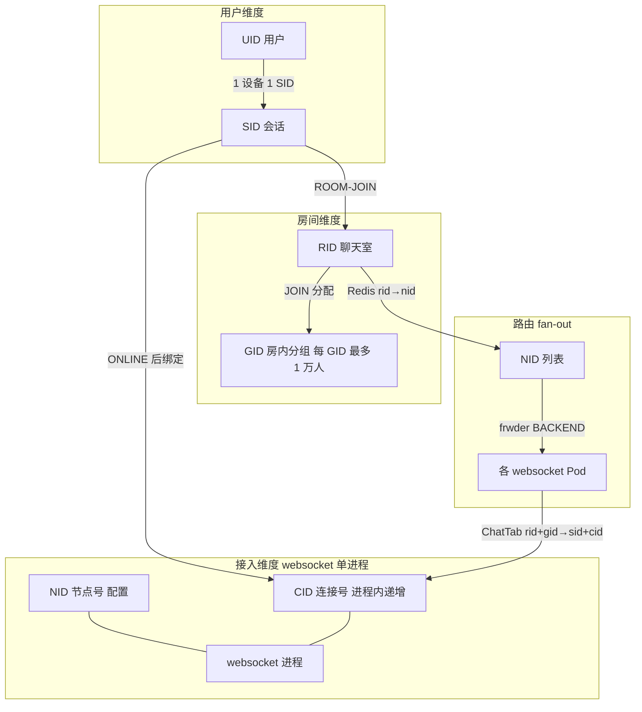
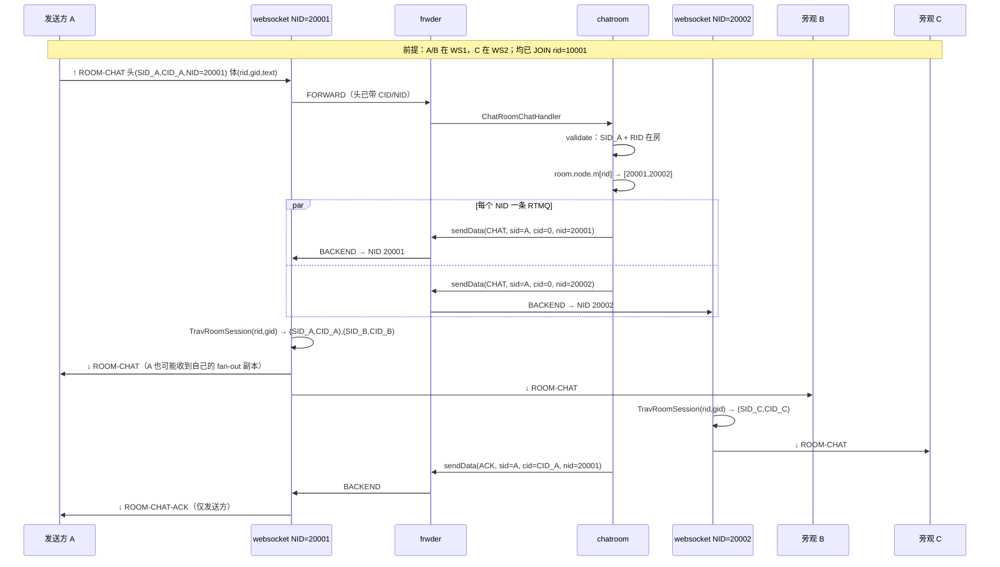

# 弹幕系统名词解释：NID / RID / SID / CID / GID

> **用途**：按 **弹幕主链路** 串讲 NID/RID/SID/CID/GID 的绑定与存储；**§4** 上行/下行对各 ID 的影响；**§5** **分层 Fan-out 寻址**（RID→NID→CID）全过程。  
> **配套**：[弹幕核心接口.md](弹幕核心接口.md) · [FLOWS_AND_GLOSSARY.md](FLOWS_AND_GLOSSARY.md) · [REDIS.md](REDIS.md)

---

## 1. 一句话定义

| ID | 全称 | 是什么 | 生命周期 |
|----|------|--------|----------|
| **SID** | Session ID | **一台设备/终端** 在 IM 里的会话身份 | `/im/register` 分配，长期有效；换设备 = 新 SID |
| **CID** | Connection ID | **某 websocket 进程内** 一条 WS 连接的本地编号 | WS 握手成功时进程内原子递增；**断线重连必变** |
| **NID** | Node ID | **接入进程**（websocket / listend）在集群里的节点号 | 配置文件固定；**扩 websocket 副本 = 新 NID** |
| **RID** | Room ID | **聊天室** ID（demo 常用 `10001`） | MySQL 建房时确定；进房/弹幕都带 RID |
| **GID** | Group ID（房内分组） | **大房分片** 用的组号（**不是**群聊 0x03xx 的 GID） | **ROOM-JOIN 时** chatroom 分配；JOIN-ACK 返回给客户端 |

**协议头**：所有 WS/RTMQ 业务帧的 48 字节 `MesgHeader` 里带 **SID、CID、NID**（见 `lib/comm/mesg.go`）。**RID、GID** 在 Protobuf 报体里（如 `MesgRoomJoin`、`MesgRoomChat`）。

---

## 2. 总关系（先记这张图）



> 下行从 **RID/GID → NID → CID** 的完整机制，本文称为 **「分层 Fan-out 寻址」**（§5.0）。

**核心关系式**（面试白板可写）：

```text
UID  :  SID        = 1 : N     （多端多 SID）
SID  :  CID        = 1 : 1     （同一时刻，一个 SID 只对应一个活跃 CID）
NID  :  websocket  = 1 : 1     （一个接入进程一个 NID）
SID  :  RID        = N : M     （一个 SID 可进多个 RID；一个 RID 很多人）
RID  :  GID        = 1 : N     （大房按 GID 分片，每组 ≤ CHAT_ROOM_GROUP_MAX_NUM=10000）
RID  :  NID        = N : M     （同房在线用户分布在多个接入 NID 上）
```

---

## 3. 按弹幕流程：何时产生、谁绑定、存哪儿

### 3.0 流程总览

```text
① GET /im/register          → 分配 SID（seqsvr）
② GET /im/iplist              → 返回 websocket 入口 + token
③ WS 连接                     → websocket 分配 CID（内存）
④ ONLINE 0x0101               → 绑定 SID↔CID↔NID，写 Redis
⑤ ROOM-JOIN 0x0405            → 绑定 SID↔RID↔GID，写 Redis + 接入 ChatTab
⑥ ROOM-CHAT 0x040B ↑          → 头里 SID/NID；体里 UID/RID/GID
⑦ fan-out ↓                   → chatroom 查 rid→nid → frwder → websocket TravRoomSession(rid,gid)
```

---

### 3.1 注册：SID 诞生

| 步骤 | 服务 | 产生/绑定 | 存储 |
|------|------|-----------|------|
| `GET /im/register?uid=…` | **usrsvr** | **seqsvr** 分配 **SID** | 仅 HTTP 响应 JSON；**此时还不写 Redis 会话表** |
| | **seqsvr** | `AllocSid()` 全局递增 | Thrift / DB（SID 发号器） |

客户端（`demo/web/app.js`）把返回的 **SID** 存本地，后续 WS 帧头、ONLINE 报体都用它。

---

### 3.2 WebSocket 连接：CID 诞生

| 步骤 | 服务 | 产生/绑定 | 存储 |
|------|------|-----------|------|
| 浏览器 `new WebSocket(url)` | **websocket** | `lib/lws` 内 `atomic.AddUint64(&ctx.cid, 1)` → **CID** | **仅进程内存**：`LwsCntx.pool[cid]` |
| | **websocket** | **NID** 来自 `conf.GetNid()`（配置，非运行时分配） | 配置文件；上报 monitor 时也带此 NID |

此时 **SID 尚未与 CID 绑定**（连接状态 `CONN_STATUS_READY`）。

---

### 3.3 ONLINE：SID ↔ CID ↔ NID ↔ UID

**路径**：Client → **websocket**（补全 head.Cid、head.Nid）→ **frwder** → **usrsvr**（主处理）+ **chatroom**（镜像写 room 域）

| 节点 | 动作 | 绑定关系 | 存储位置 |
|------|------|----------|----------|
| **websocket** ↑ | `LsndMesgOnlineHandler`：`conn.SetSid(head.Sid)`；`head.SetCid/Nid` 后转发 | 内存：**SessionKey{sid,cid}** → 连接对象 | `ChatTab.sessions`（尚未 RoomJoin） |
| **usrsvr** | `online_handler`：校验冲突、写 **权威会话表** | **SID → {UID, CID, NID}** | Redis **`im:sid:%d:attr`**（HASH：CID/UID/NID） |
| | | SID、UID 活跃索引 | `im:sid:zset`、`im:uid:zset` |
| | | UID → 多端 SID | `im:uid:%d:to:sid:set` |
| **chatroom** | `onlineHandler` + `UpdateOnlineData`（与 usrsvr 并行消费 ONLINE） | 同上，**chatroom 域副本** | Redis **`room:sid:%d:attr`** 等（`room:` 前缀，见 `models/key.go`） |
| **usrsvr** ↓ | 发 **ONLINE-ACK**（带 SEQ） | — | — |
| **websocket** ↓ | `LsndUpMesgOnlineAckHandler`：`SessionSetCid(sid,cid)`；状态 → `LOGIN` | 内存：**sid2cid[sid]=cid** | `ChatTab.sid2cids` |

**注意**：JOIN/CHAT 鉴权读的是 **`im:sid:%d:attr`**（`lib/im.GetSidAttr`），以 **usrsvr ONLINE 写入** 为准；chatroom 的 `room:sid:*` 是聊天室子系统自己的副本。

---

### 3.4 monitor：NID ↔ 外网地址（fan-out 前置）

| 步骤 | 服务 | 绑定 | 存储 |
|------|------|------|------|
| websocket 定时任务 | **websocket** → **monitor** | **LSND-INFO**：本进程 **NID** + IP/端口/连接数 | Redis **`im:lsnd:nid:zset`**、**`im:lsnd:nid:%d:attr`** |
| iplist 调度 | **usrsvr** | 按地区/运营商从上述 zset 选 **NID** 对应地址 | 返回给客户端 WS URL（**不是 Pod IP**） |

**K8s 扩 websocket**：每 Pod 一个 **NID**，必须先注册到 monitor，chatroom 才知道往哪些 NID 发下行。

---

### 3.5 ROOM-JOIN：SID ↔ RID ↔ GID

**路径**：Client → **websocket** → **frwder** → **chatroom** → JOIN-ACK ↓ → **websocket** 写 **ChatTab**

| 节点 | 动作 | 绑定关系 | 存储 |
|------|------|----------|------|
| **chatroom** ↑ | `validateRoomJoin`：查 `im:sid:%d:attr` 校验 UID/NID | 确认 **SID 已 ONLINE** | 读 Redis |
| | `alloc_room_gid(rid)`：优先 GID=0，满则扩新 GID（每组上限 **10000**） | **RID → GID**（分配结果） | — |
| | `roomJoinHandler` 写 Redis | **RID ↔ SID ↔ NID ↔ UID** | 见下表 |
| **chatroom** ↓ | `roomJoinAck`：ACK 体带 **rid, gid** | — | — |
| **websocket** ↓ | `LsndUpMesgRoomJoinAckHandler`：`RoomJoin(rid,gid,sid,cid)` | 内存：**session.room[rid]=gid**；**group[gid]** 含 `{sid,cid}` | **`ChatTab`**（fan-out 最后一百米靠它） |

**chatroom JOIN 写入的主要 Redis 键**（`roomJoinHandler`）：

| Redis 键 | 成员 | 含义 |
|----------|------|------|
| `room:rid:{rid}:to:sid:zset` | SID | 该房在线 SID |
| `room:rid:{rid}:to:uid:sid:zset` | `{uid}:{sid}` | 该房用户列表 |
| `room:rid:{rid}:to:nid:zset` | **NID** | **该房有哪些接入节点**（fan-out 第一步） |
| `room:rid:{rid}:to:gid:num:zset` | GID | 各 GID 人数 |
| `room:sid:{sid}:to:rid:zset` | RID（分值=**GID**） | 某 SID 进了哪些房、各房 GID |

JOIN 成功后 `updateRidToNidMap()`，chatroom 内存 **`room.node.m[rid]=[]nid`** 每 5s 从 Redis 刷新（`task.go`）。

---

### 3.6 ROOM-CHAT ↑：发弹幕

| 字段 | 在哪 | 作用 |
|------|------|------|
| **MesgHeader.Sid / Nid / Cid** | 48B 头 | websocket 上行时填入 **Cid、Nid**；**Sid** 客户端/register 已有 |
| **MesgRoomChat.uid / rid / gid** | PB 体 | 客户端 JOIN-ACK 拿到 **gid** 后，发弹幕必须带上；chatroom 校验 **SID 在 rid 内** |

| 节点 | 校验/使用 |
|------|-----------|
| **websocket** | 转发，不改 rid/gid |
| **chatroom** | `validateRoomChat`：`im:sid:%d:attr` + `RoomSidInRoom(rid,sid)`；通过后 fan-out |

---

### 3.7 ROOM-CHAT ↓：fan-out 到面板（关系串起来的关键）

分两跳：**chatroom 按 NID 广播** → **各 websocket 按 rid+gid 找 sid+cid 写 WS**。

```text
chatroom.roomBroadcastFanOut
  读内存 room.node.m[rid] → [nid1, nid2, …]     ← 来自 Redis room:rid:{rid}:to:nid:zset
  对每个 nid: sendData(..., nid) → frwder BACKEND

websocket.LsndUpMesgRoomChatHandler
  解析 MesgRoomChat.rid / .gid
  TravRoomSession(rid, gid, callback)              ← 只遍历本 Pod ChatTab 里同房同组连接
  对每个 (sid,cid): lws.AsyncSend(cid, frame)     ← CID 定位具体 WS 连接
```

| ID | 在 fan-out 中的角色 |
|----|---------------------|
| **RID** | 决定「哪个房间」；chatroom 查 **rid→nid 列表** |
| **NID** | 决定「发到哪几个接入 Pod」；**frwder 只认 NID，不认 K8s Service** |
| **GID** | 决定「接入 Pod 内遍历哪一组会话」；`gid=0` 表示遍历 rid 下所有组 |
| **SID + CID** | 接入 Pod 内定位 **唯一 WS 连接** 并写入 sendq |

**下行条数** ≈ 同房在线人数（跨 NID 汇总）；**不是** chatroom 直接持有 CID。

---

### 3.8 ROOM-BC（运营 push，补充）

| 节点 | NID / RID 用法 |
|------|----------------|
| **chatroom** `pushHandler` | HTTP 带 **rid**；当前实现扫 **`im:lsnd:nid:zset` 全集群 NID**（各 NID 发 ROOM-BC） |
| **websocket** | 同 ROOM-CHAT，`TravRoomSession(rid, gid, …)` 推面板 |

> **ROOM-CHAT 上行/下行对五个 ID 的分工**，以及 **fan-out 如何 RID→CID**，见 **§4、§5**（本文核心增补）。

---

## 4. ROOM-CHAT 弹幕：上行 vs 下行，五个 ID 各「影响」什么

说明：「影响」分三档——**携带**（报文里出现）、**读取/校验**（业务逻辑用到）、**产生/变更**（写 Redis 或内存绑定）。  
**一条 ROOM-CHAT 不会新分配 SID/NID/RID/GID**；CID 只在 WS 建连时产生，上行只是把它写进头。

### 4.1 总对照表

| ID | 上行 ↑ ROOM-CHAT | 下行 ↓ ROOM-CHAT（fan-out 旁观） | 下行 ↓ ROOM-CHAT-ACK（仅发送方） |
|----|------------------|----------------------------------|----------------------------------|
| **SID** | **携带**（头）· chatroom **校验**发送方 SID 在房 | 头里带**发送方 SID**（标识来源）；**接收方 SID** 由 websocket **ChatTab 遍历**得到，不在 chatroom 逐条指定 | **携带**发送方 SID（头） |
| **CID** | **携带**（头，websocket 填入 `conn.GetCid()`） | chatroom 发包 **`cid=0`**；接收方 **CID 由 ChatTab 遍历**得到 | **携带**发送方 **CID**（头，来自上行） |
| **NID** | **携带**（头，来源接入 `conf.GetNid()`）· 校验与 `im:sid:*` 一致 | chatroom 按 **RID 查 nid 列表**，每条 RTMQ **指定目标 NID**；frwder 路由到对应 websocket | **携带**发送方来源 **NID** |
| **RID** | **携带**（PB 体）· 校验在房、open | **携带**（PB 体）· websocket 用 **RID 查 ChatTab 房间** | **携带**（ACK 体） |
| **GID** | **携带**（PB 体，JOIN-ACK 所得） | **携带**（PB 体）· `TravRoomSession(rid, gid)`；**gid=0 遍历 rid 下全部组** | **携带**（ACK 体） |

### 4.2 上行 ↑：五个 ID 怎么走

```text
客户端
  头: SID（register 已有）
  体: uid, rid, gid, text, …
       │
       ▼
websocket  LsndMesgCommHandler
  写入头: CID = 本连接号, NID = 本进程配置
  （不解析、不修改 rid/gid）
       │
       ▼ frwder FORWARD（按 cmd 到 chatroom，头里 NID 供溯源）
       ▼
chatroom  ChatRoomChatHandler / validateRoomChat
  读头: SID, NID, CID
  读体: RID, GID, UID
  校验: im:sid:{SID} 在线、RoomSidInRoom(RID,SID)、房间 open
  通过 → 入队 fan-out（不改五个 ID 的绑定关系）
```

| 节点 | 对五个 ID 的操作 |
|------|------------------|
| **客户端** | 提供 SID、RID、GID；不知 NID/CID |
| **websocket** | **注入** CID、NID 到头；转发 |
| **frwder** | 透传头中 SID/CID/NID；**不读 RID/GID**（在 body） |
| **chatroom** | **只读**五个 ID 做鉴权；**不写** JOIN 时那套 Redis 绑定 |

### 4.3 下行 ↓：两类下行，对 ID 用法不同

| 类型 | 条数 | 谁定 NID | 谁定 CID | RID/GID 从哪来 |
|------|------|----------|----------|----------------|
| **fan-out 旁观收弹幕** | ≈ 同房人数（跨 NID 汇总） | chatroom 查 **rid→nid[]** | **websocket ChatTab** 遍历 | PB 体 **rid、gid** |
| **ACK 回发送方** | 1 | 发送方上行头里的 **NID** | 发送方上行头里的 **CID** | ACK 体 rid、gid |

关键代码差异：

```go
// fan-out：每个目标 NID 一条 RTMQ，CID 故意为 0
sendData(CMD_ROOM_CHAT, head.Sid, 0, targetNid, ...)

// ACK：单播回发送方，带齐 SID/CID/NID
sendData(CMD_ROOM_CHAT_ACK, head.Sid, head.Cid, head.Nid, ...)
```

**结论**：chatroom **从不知道接收者的 CID 列表**；它只负责 **RID → 哪些 NID**；**NID 上的 websocket** 才负责 **RID+GID → 哪些 (SID,CID)**。

---

## 5. 分层 Fan-out 寻址：从 RID 到 CID

> **推荐名词**：**分层 Fan-out 寻址**（*Hierarchical Fan-out Addressing*）。  
> **简称**：**Fan-out 寻址链**。  
> 「路由寻址」也能用，但偏泛——这里特指 **业务层按拓扑选节点、接入层按内存选连接** 的两段式 fan-out，下文统一用 **分层 Fan-out 寻址**。

### 5.0 名词定义：三段式寻址链

整条下行链路可写成：

```text
(RID, GID)  ──①拓扑路由──►  [NID₁, NID₂, …]
              ──②会话展开──►  [(SID,CID), …]   （每个 NID 进程内各做一遍）
              ──③连接投递──►  WebSocket fd
```

| 段 | 推荐叫法 | 英文（口述用） | 谁做 | 输入 → 输出 | 依据 |
|----|----------|----------------|------|-------------|------|
| **①** | **拓扑路由** | Topology routing | **chatroom** + frwder | **RID** → **[NID…]** | Redis `room:rid:{rid}:to:nid:zset` |
| **②** | **会话展开** | Session fan-out | **websocket** ChatTab | **(RID, GID)** → **[(SID,CID)…]** | 内存 `TravRoomSession`（JOIN 时写入） |
| **③** | **连接投递** | Connection delivery | **websocket** lws | **CID** → **fd** | `LwsCntx.pool[cid]` → sendq |

**GID 的位置**：① 不直接参与选 NID（NID 列表只跟 RID 走）；② 用来在 **同一 NID 进程内** 缩小要遍历的会话集合（`gid=0` 表示 rid 下全部组）。

**为何这样设计（面试可讲）**：

| 点 | 说明 |
|----|------|
| **职责分离** | chatroom 管 **业务 + 跨节点拓扑**，不必持有百万 **CID**；接入层管 **连接态**，不必查全集群 Redis |
| **RTMQ 条数可控** | chatroom 层发包数 ≈ **该 rid 涉及的 NID 个数**（常远小于在线人数），不是「每人一条 RTMQ」 |
| **多 rid 同节点不乱** | 「按 NID 投」只把包送到 **进程**；**RID 过滤在 ② 会话展开**，同房才收 |
| **水平扩展** | 加 websocket = 加 **NID**；JOIN 把 NID 登记进 rid 拓扑，fan-out 自动覆盖新节点 |
| **代价** | 可能向「已无该 rid 用户」的 NID 空投一条 RTMQ；用 TTL 清理 + 接入层 0 人遍历消化 |

---

### 5.1 两跳模型（必记）

```text
第一跳 ①拓扑路由（chatroom → 接入集群）   RID → 每个 NID 一条 RTMQ
第二跳 ②会话展开 + ③连接投递（websocket）  (RID,GID) → 每个 (sid,cid) 一条 WS 帧
```

chatroom **不做**「按 SID 列表逐条 send」；websocket **不做**「查 Redis rid→nid」。各管一段——这就是 **分层 Fan-out 寻址**。

### 5.2 逐步寻址（12 步）

以：**用户 A** 在 **RID=10001** 发一条弹幕；同房 **B、C** 在线；B 与 A 同 **NID=20001**，C 在 **NID=20002**。

| 步 | 所在节点 | 输入 | 动作 | 输出 |
|----|----------|------|------|------|
| ① | **chatroom** | PB 体 **RID=10001**, **GID** | `roomBroadcastFanOut` 入口 | 确定要广播哪间房 |
| ② | **chatroom** 内存 | **RID** | 读 `room.node.m[10001]` | **NID 列表** `[20001, 20002]`（源自 Redis `room:rid:10001:to:nid:zset`，JOIN 时写入，5s 刷新） |
| ③ | **chatroom** | 每个 **targetNid** | `sendData(CHAT, sid=A, cid=0, nid=targetNid, body含 rid/gid/…)` | 2 条 RTMQ 包 |
| ④ | **frwder** | 头中 **NID=targetNid** | `BACKEND` 按 NID 投递 | 分别到 websocket@20001、websocket@20002 |
| ⑤ | **websocket@20001** | RTMQ 下行帧 | `LsndUpMesgRoomChatHandler` 解析 PB | **RID=10001**, **GID**（如 demo 的 `state.gid`，常为 0） |
| ⑥ | **websocket@20001** | **RID + GID** | `TravRoomSession(10001, gid, callback)` | 遍历本 Pod **ChatTab** 中该房该组（gid=0 → 全部组） |
| ⑦ | **ChatTab** | `rooms[rid].groups[gid].sid_list` | 每个成员是 `ChatSessionKey{sid,cid}` | 例如 **(sidB,cidB)**, **(sidA,cidA)** |
| ⑧ | **websocket@20001** | 每个 **CID** | `LsndRoomSendDataCb` → `lws.AsyncSend(cid, frame)` | 本 Pod 上若干条 WS 写出 |
| ⑨ | **websocket@20002** | 同 ⑤～⑧ | 仅本 Pod 上的会话 | 例如 **(sidC,cidC)** 一条 WS |
| ⑩ | **lws** | **CID** | `pool[cid]` 找 `Client` → `sendq` → `WriteMessage` | 推到浏览器 fd |
| ⑪ | **客户端 B/C** | WS 帧 PB 体 | 解析 `ROOM-CHAT`，渲染面板 | 用户看到弹幕 |
| ⑫ | **chatroom** | 发送方 **SID/CID/NID**（原上行头） | `roomChatAck` 单独 **单播 ACK** | 仅 A 收到 `ROOM-CHAT-ACK` |

### 5.3 寻址链（公式）

```text
① 拓扑路由：
   RID  ──►  room.node.m[RID] / Redis room:rid:{RID}:to:nid:zset
            └──► [ NID₁, NID₂, … ]

② 会话展开（在每个 NIDₖ 的 websocket 进程内独立执行）：
   (RID, GID)@NIDₖ  ──►  ChatTab.TravRoomSession
            └──►  { (SID₁,CID₁), (SID₂,CID₂), … }

③ 连接投递：
   CID  ──►  LwsCntx.pool[CID]  ──►  sendq  ──►  WebSocket fd  ──►  用户面板
```

**Redis 不参与第二跳**：第二跳只用 **接入进程内存 ChatTab**（JOIN-ACK 时 `RoomJoin(rid,gid,sid,cid)` 写入）。

### 5.4 时序图（fan-out + ACK）



### 5.5 为何 fan-out 时 chatroom 传 `cid=0`

| 设计 | 原因 |
|------|------|
| chatroom 只按 **NID** 发 | 一个 NID 上有多条连接；若在 chatroom 层按 SID 逐条发，需跨进程维护 **NID 内 SID→CID**，耦合高 |
| **cid=0** 表示「交给接入层广播」 | websocket 收到后走 `TravRoomSession`，由 **JOIN 时写入的 ChatTab** 展开 |
| 发送方 ACK 例外 | 明确知道 **一条连接**，故带 **CID_A** 单播 |

websocket 下行若头里 `cid=0` 且需单播（非 Trav 场景），会 `GetCidBySid(sid)` 补全（`LsndUpMesgCommHandler`）；**ROOM-CHAT fan-out 不走这条**，走 TravRoomSession。

### 5.6 GID 在 fan-out 里的作用

| 报文 `gid` | `TravRoomSession(rid, gid, …)` 行为 |
|------------|-------------------------------------|
| **0** | `group_all_trav`：**rid 下所有组**的 `(sid,cid)` 都收（demo 常用，同房互刷） |
| **非 0** | 只遍历 **该 gid 组**内成员（大房分片：同 gid 最多约 1 万人） |

JOIN 时 chatroom 分配 GID 并写入 `room:sid:{sid}:to:rid:zset`（分值=GID）；websocket **ChatTab** 同步 `session.room[rid]=gid`。

### 5.7 与「下行条数」的关系

```text
chatroom 发出的 RTMQ 条数  =  len(rid 对应的 NID 列表)     // 通常 << 在线人数

websocket 发出的 WS 条数   =  本 Pod 上 TravRoomSession 遍历到的 (sid,cid) 个数

全集群 WS 总条数           ≈  同房在线人数（每人 1 条 ROOM-CHAT 副本）
                              + 1 条 ROOM-CHAT-ACK（发送方）
```

### 5.8 常见疑问：按 NID 广播会不会把同房无关连接也推了？

**不会乱套。** 容易误解的是把「按 NID 广播」理解成「把该节点上**所有 WS 连接**都发一遍」——实际是分 **两层**：

| 层级 | 谁做 | 实际含义 | 是否按 RID 过滤 |
|------|------|----------|-----------------|
| **层 1：进程间** | chatroom → frwder | 向 **NID 对应的 websocket 进程** 投递 **1 条** RTMQ（`cid=0`） | 否（只选「哪些接入 Pod 可能有同房用户」） |
| **层 2：进程内** | websocket `TravRoomSession` | 只遍历 **ChatTab 里 rid（+gid）** 下的 `(sid,cid)` | **是** |

**一个 NID 上完全可以同时有多间房的连接**，例如：

```text
websocket@NID=20001 内存 ChatTab：
  rid=10001 → gid=0 → { (sidA,cid10), (sidB,cid11) }
  rid=10002 → gid=0 → { (sidC,cid12), (sidD,cid13) }
  rid=20001 → …
```

当 **rid=10001** 有人发弹幕时：

1. chatroom 查 `room:rid:10001:to:nid:zset` → 假设得到 `[20001, 20002]`（只有进过 10001 的接入节点才会出现在这里）
2. 向 **20001** 发 **1 条** RTMQ（包里 PB 体带 **rid=10001, gid, text…**）
3. websocket@20001 收到后执行：

```go
// upmesg.go — 不是遍历全节点连接，而是只查 rid=10001
ctx.chat.TravRoomSession(req.GetRid(), req.GetGid(), LsndRoomSendDataCb, p)
```

4. 只会回调 **rid=10001** 组里的 `(sidA,cid10)`、`(sidB,cid11)`；**sidC/sidD（在 rid=10002）不会被遍历到**

**类比**：

```text
按 NID 广播  ≈  把「10001 房间的包裹」送到「20001 号快递站」（整站只收 1 个包裹）
TravRoomSession ≈  快递站按收件地址 rid，只派给在本站、且登记在 10001 下的住户 (sid,cid)
```

**为何 rid→nid 可能包含「当前已无该房用户」的 NID？**  
JOIN 时把 NID 写入 zset（TTL）；用户退房/断线后 TTL 过期才清。chatroom 可能向某个 NID 多发一条 RTMQ，但该 Pod 上 `TravRoomSession(10001,…)` 遍历结果为 **0 人**，相当于空跑，**不会误推其他 rid 的连接**。

**小结**：chatroom 的「按 NID 广播」= **选接入进程**；**RID 过滤在 websocket 的 ChatTab** 完成。两者分工不同，不冲突。

---

| 节点/组件 | SID | CID | NID | RID | GID | 说明 |
|-----------|:---:|:---:|:---:|:---:|:---:|------|
| **客户端** | 持有 | — | — | 选择进房 | JOIN-ACK 后持有 | 头里带 Sid；体里带 Rid/Gid |
| **seqsvr** | **分配** | — | — | — | — | 仅 SID 发号 |
| **usrsvr** | 读写 | 读写 | 读写 | — | — | **`im:sid:*` 权威会话**；iplist 查 NID 地址 |
| **websocket** | 读写 | **分配+映射** | **配置** | 内存 | 内存 | **ChatTab** 存 rid↔gid↔(sid,cid)；**不存全集群 rid→nid** |
| **frwder** | 透传头 | 透传头 | **路由键** | — | — | FORWARD/BACKEND 按 **NID** 投递，不解析 RID |
| **chatroom** | 读写 | 读写 | 读写 | 读写 | **分配+读写** | Redis **room:*** + 内存 **rid→[]nid** |
| **monitor** | — | — | **注册** | — | — | NID↔地址写入 `im:lsnd:*` |
| **Redis** | ✓ | ✓ | ✓ | ✓ | ✓ | 跨节点共享真相源（除 CID 仅部分镜像） |
| **MySQL** | — | — | — | **元数据** | — | 房间是否 open、建房信息 |

**CID 特殊**：权威在 **websocket 进程内存**；Redis 的 `im:sid:%d:attr` / `room:sid:%d:attr` 存的是 **最近一次 ONLINE 的 CID 镜像**，供踢人、冲突检测；**下行若 head.Cid=0**，websocket 用 `GetCidBySid(sid)` 补全。

---

## 7. Redis 键与 ID 对照（弹幕常用）

| Redis 键 | 涉及 ID | 谁写 | 谁读 |
|----------|---------|------|------|
| `im:sid:%d:attr` | SID→UID,CID,NID | usrsvr ONLINE | JOIN/CHAT 鉴权 |
| `room:sid:%d:attr` | 同上（room 域） | chatroom ONLINE | chatroom 内部 |
| `room:rid:%d:to:nid:zset` | **RID→NID** | ROOM-JOIN | chatroom fan-out |
| `room:rid:%d:to:sid:zset` | RID→SID | ROOM-JOIN | 在房校验 |
| `room:sid:%d:to:rid:zset` | SID→RID（分值=GID） | ROOM-JOIN | 多房查询 |
| `room:rid:%d:to:gid:num:zset` | RID→各 GID 人数 | ROOM-JOIN | `alloc_room_gid` |
| `im:lsnd:nid:zset` | 集群在线 **NID** | monitor | iplist、push（BC） |

完整键表：[REDIS.md](REDIS.md) · [chatroom/models/key.go](../src/golang/exec/chatroom/models/key.go)

---

## 8. 接入层内存 ChatTab（仅 websocket）

**为什么要有 ChatTab**：Redis 知道「这个 rid 有哪些 NID」，但 **不知道某个 NID 上具体哪条 WS 连接**；最后一百米必须 **(sid,cid) → fd**。

| 结构 | 键 | 值 | 何时写入 |
|------|----|----|----------|
| `sid2cids` | SID | CID | ONLINE-ACK |
| `sessions` | `{sid,cid}` | `room[rid]=gid` | ROOM-JOIN-ACK |
| `rooms[rid].groups[gid]` | `{sid,cid}` | 成员集合 | ROOM-JOIN-ACK |
| `TravRoomSession(rid,gid)` | — | 回调每个 sid,cid | ROOM-CHAT/BC 下行 |

代码：`lib/chat_tab/chat.go`

---

## 9. 易混点

| 问题 | 答案 |
|------|------|
| **GID 是群聊 GID 吗？** | **不是**。弹幕里的 GID 是 **聊天室大房分片**（0x04xx）；群聊 0x03xx 另有 `chat:gid:*` 键空间。 |
| **fan-out 用 K8s Service 吗？** | **不用**。chatroom → **NID** → frwder → 指定 websocket 进程。 |
| **同一 UID 两个浏览器？** | 两个 **SID**（两次 register），两个 **CID**，可能在同一或不同 **NID**。 |
| **断线重连 SID 变吗？** | **SID 不变**（除非重新 register）；**CID 必变**；需重新 **ONLINE**，进房需 **ROOM-JOIN**。 |
| **MesgHeader 里 rid 有吗？** | **没有**。RID 只在 PB 体（JOIN/CHAT/BC）。 |
| **push 和弹幕 fan-out 一样吗？** | 下行最后一百米一样（`TravRoomSession`）；chatroom 选 NID 逻辑不同（BC 当前扫全集群 NID，见 [弹幕核心接口.md §5](弹幕核心接口.md)）。 |
| **按 NID 广播会推全节点连接吗？** | **不会**。NID 只用于 RTMQ 找到 **websocket 进程**；进程内必须 `TravRoomSession(rid,gid)` 才推连接。见 **§5.8**。 |
| **一个 NID 多个 RID 会乱吗？** | **不会**。ChatTab 按 **rid 分桶**；下行包 PB 里带 rid，只遍历该 rid 下的 `(sid,cid)`。 |

---

## 10. 代码索引（按 ID）

| ID | 关键代码 |
|----|----------|
| SID | `usrsvr/controllers/register.go` · `seqsvr` · `usrsvr/controllers/mesg.go` `online_handler` |
| CID | `lib/lws/comm.go` 连接建立 · `websocket/controllers/upmesg.go` `SessionSetCid` |
| NID | `websocket` 配置 · `websocket/controllers/task.go` LSND-INFO · `frwder/frwd_mesg.c` |
| RID | `chatroom/controllers/mesg.go` `roomJoinHandler` · MySQL 房间表 |
| GID | `chatroom/controllers/mesg.go` `alloc_room_gid` · JOIN-ACK · `ChatTab.RoomJoin` |

| fan-out | `broadcast_async.go` `roomBroadcastFanOut` · `comm.go` `sendData` · `upmesg.go` `LsndUpMesgRoomChatHandler` · `chat_tab` `TravRoomSession` |

---

## 11. 速记（面试 30 秒）

```text
分层 Fan-out 寻址 = ①拓扑路由(RID→NID) + ②会话展开(RID,GID→SID,CID) + ③连接投递(CID→fd)

上行 ↑：客户端带 SID,RID,GID → websocket 注入 CID,NID → chatroom 只校验

下行 ↓：① chatroom 每 NID 一条 RTMQ(cid=0)
        ②③ websocket TravRoomSession → AsyncSend(CID) → 面板

chatroom 不知接收者 CID；Redis 只帮 ①；②③ 全靠接入内存 ChatTab。
```

---

---

## 12. 文档索引（分层 Fan-out 寻址）

本概念在仓库中的 **canonical 详述** 为本文 **§5**；其它文档引用如下：

| 文档 | 位置 |
|------|------|
| [ARCHITECTURE.md](ARCHITECTURE.md) | §3.3 架构定义 · §4.3 流程 · §6 水平扩展 |
| [FLOWS_AND_GLOSSARY.md](FLOWS_AND_GLOSSARY.md) | §1.2.1 速览 · §4.2 术语表 |
| [弹幕核心接口.md](弹幕核心接口.md) | §6 拓扑 · §12 相关文档 |
| [assets/ARCHITECTURE_DIAGRAM.md](assets/ARCHITECTURE_DIAGRAM.md) | 数据流四步 |
| [assets/ROOM_CHAT_SEQUENCE.md](assets/ROOM_CHAT_SEQUENCE.md) | 步骤 9～14 标注 ①②③ |
| [assets/PUSH_TO_PANEL_FLOW.md](assets/PUSH_TO_PANEL_FLOW.md) | 图例 + 面板路径 |
| [SCALE.md](SCALE.md) · [K8S_DEMO_ROADMAP.md](K8S_DEMO_ROADMAP.md) | 扩缩容与 NID |
| [REDIS.md](REDIS.md) | rid→nid 键与 ① 拓扑路由 |
| [MILLION_DEMO_PLAN.md](MILLION_DEMO_PLAN.md) · [INTERVIEW_CAPACITY_DEMO.md](INTERVIEW_CAPACITY_DEMO.md) | 容量外推话术 |

---

*与 [FLOWS §4.1](FLOWS_AND_GLOSSARY.md#41-身份与连接) 术语一致。§3 讲生命周期绑定；§4 讲上行/下行对各 ID 的影响；§5 定义并展开 **分层 Fan-out 寻址**（拓扑路由 → 会话展开 → 连接投递）。*
