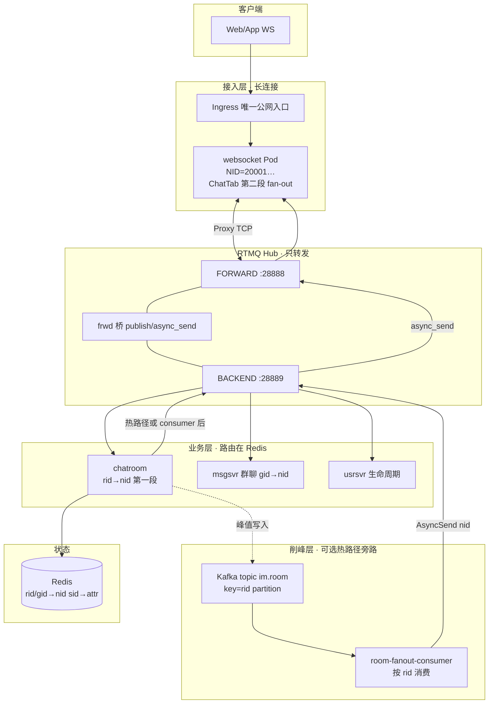

# 方向二落地手册：RTMQ 保留 Hub + Kafka 前置削峰 + K8s 管路由

> **定位**：不替换 RTMQ；**剥离客户端 iplist 感知**；**房间/网关路由留在 Redis**；**Kafka 接在 chatroom 受理之后**；**最后一跳仍用 RTMQ async_send(nid)**。  
> **对照**：[PHASE3_PERFORMANCE_EVOLUTION.md](PHASE3_PERFORMANCE_EVOLUTION.md) · [必嗨弹幕与K8s改造-校准版四周规划.md](必嗨弹幕与K8s改造-校准版四周规划.md) · [deploy/k8s/README.md](../deploy/k8s/README.md) · **[RTMQ 水平扩展专章](方向二-RTMQ水平扩展专章.md)**（Hub 分片 / msgsvr SUB / 企业能否用）

---

## 1. 目标架构（方向二终态）



### 1.1 各层职责（面试白板）

| 层 | 做什么 | **不**做什么 |
|----|--------|--------------|
| **Ingress + iplist 方案 A** | 客户端固定 `wss://域名/im` | 返回 Pod IP |
| **websocket** | WS 连接、第二段 TravRoomSession/ImGroup | 不替代 RTMQ |
| **RTMQ** | publish 上行、async_send(nid) 下行、SUB cmd | 不持久化、不 room 路由、不 iplist |
| **Redis** | rid/gid→nid、sid→attr、限流计数 | — |
| **chatroom** | 校验、写历史队列、**受理** 弹幕 | 峰值时可不同步 fan-out |
| **Kafka** | 同房有序削峰、持久、lag 可观测 | 不替代 RTMQ 到 websocket 的最后一跳 |
| **consumer** | 读 Kafka → 查 Redis nid → **RTMQ 下发** | 不持有 WS 连接 |

---

## 2. 与 PDF「百万弹幕方案」的关系

| PDF 组件 | 方向二对应 | 说明 |
|----------|------------|------|
| Gateway 长连接 | **Go websocket**（保留） | 不必为方向二重写 C++ Gateway |
| Dispatcher + 分片 | **chatroom + Redis rid→nid** | 已有 |
| Kafka 削峰 | **新增** `im.room` topic | 方向二核心增量 |
| gRPC 推网关 | **RTMQ async_send(nid)** | 最后一跳仍走 Hub |
| Consul 发现 | **K8s Service + preStop 清 Redis** | 替代 iplist 探活 |

**结论**：方向二 = **PDF 的 Kafka 削峰 + 必嗨现有 RTMQ 双段 fan-out**，不是全盘重写 PDF。

---

## 3. 分三期实施（建议顺序）

### Phase 0 · 已完成 / 进行中（不动 RTMQ 核心）

| 项 | 状态 | 位置 |
|----|------|------|
| iplist 方案 A | ✅ | `BEEHIVE_WS_IPLIST`、usrsvr/iplist.go |
| K8s 骨架 | ✅ | `deploy/k8s/` |
| 群聊 RTMQ 文档 | ✅ | `doc/rtmq/` |
| chatroom 异步 ACK + 内存队列 | ✅ 开关 | `BEEHIVE_CHATROOM_ASYNC_BROADCAST=1` → `broadcast_async.go` |

**Compose 仍可用**：未设 `BEEHIVE_WS_IPLIST` → 老 iplist 链。

---

### Phase 1 · RTMQ 纯 Hub + K8s 路由（2～3 周）

**目标**：RTMQ **零业务感知**；Pod 生命周期由 K8s + Redis 管。

| # | 任务 | 改动 |
|---|------|------|
| 1.1 | Ingress + 静态 iplist | 已做；改域名即可 |
| 1.2 | websocket **StatefulSet**，每 Pod **唯一 NID** | `deploy/k8s/apps/websocket-sts.yaml`（待建） |
| 1.3 | Pod **preStop**：从 Redis 删 `room:rid:*:to:nid` / `chat:gid:*:to:nid` | 新 hook 脚本或 Go 信号处理 |
| 1.4 | **默认开启** chatroom 异步广播 | compose/k8s env `BEEHIVE_CHATROOM_ASYNC_BROADCAST=1` |
| 1.5 | Prometheus 基础指标 | 见 §6 |
| 1.6 | **不**改 frwd_mesg.c 路由语义 | 只调 frwder.xml 队列/线程 |

**验收**：delete ws Pod → 重连 → 同房弹幕仍通；iplist 返回 Ingress URL；RTMQ sub 表无「业务节点发现」代码。

---

### Phase 2 · Kafka 前置削峰（3～5 周，方向二核心）

**目标**：chatroom **受理后写 Kafka**；fan-out 由 **consumer → RTMQ** 完成。

#### 2.1 热路径 vs 削峰路径

```text
模式 env：BEEHIVE_ROOM_FANOUT_MODE=sync|async|kafka

sync   （默认 legacy）：roomChatHandler 内 roomBroadcastFanOut → RTMQ
async  （Phase 1）：room_broadcast_chan → roomBroadcastFanOut → RTMQ
kafka  （Phase 2）：校验通过 → Kafka Produce → 立即 ACK
                    consumer → Redis rid→nid → sendData × N → RTMQ
```

#### 2.2 Kafka 约定

| 项 | 值 |
|----|-----|
| Topic | `im.room.chat`（可配置） |
| Key | `strconv.FormatUint(rid, 10)` → **同房进同 partition** |
| Value | 完整 IM 帧 bytes（MesgHeader + MesgRoomChat pb）或 JSON 包 envelope |
| Consumer Group | `im-room-fanout` |
| 分区数 | ≥ chatroom 实例数；初始 **12～24** |

#### 2.3 语义（面试必说）

| 阶段 | 含义 |
|------|------|
| **ROOM-CHAT_ACK** | 消息 **已受理**（已入 Kafka 或已入 broadcast_chan） |
| **全员收到** | 异步；看 consumer lag + 下行 metrics |
| **重复消费** | consumer 用 **rid+seq** 或 msg id 去重（Redis SET 短 TTL） |
| **Kafka 挂** | 降级 `async` 或 `sync`（env 开关） |

---

## 4. 改动文件清单

### 4.1 Phase 1（K8s + 异步广播）

| 文件 | 改动 |
|------|------|
| `deploy/k8s/apps/websocket-sts.yaml` | **新增** StatefulSet + headless，NID 20001+ordinal |
| `deploy/k8s/apps/usrsvr.yaml` | 已有 `BEEHIVE_WS_IPLIST` |
| `src/golang/exec/websocket/controllers/lifecycle.go` | **新增** preStop：删 Redis 本 NID 相关 zset |
| `docker-compose.yml` / `run-in-linux.sh` | 可选 `BEEHIVE_CHATROOM_ASYNC_BROADCAST=1` |
| `src/golang/exec/chatroom/controllers/broadcast_async.go` | 已有；补 metrics |
| `src/golang/lib/comm/metrics.go` | **新增** 可选 Prometheus counter |

**不改**：

- `src/clang/lib/rtmq/*`（除 frwder.xml 调参）
- `frwd_mesg.c` 桥接逻辑
- `iplist.go` Redis 字典（保留 fallback）

---

### 4.2 Phase 2（Kafka）

| 文件 | 改动 |
|------|------|
| `src/golang/lib/kafka/producer.go` | **新增** 薄封装（sarama 或 kafka-go） |
| `src/golang/lib/kafka/config.go` | `BEEHIVE_KAFKA_BROKERS`、`TOPIC_ROOM_CHAT` |
| `src/golang/exec/chatroom/controllers/kafka_publish.go` | **新增** `roomChatPublishKafka(head, raw)` |
| `src/golang/exec/chatroom/controllers/mesg.go` | `ChatRoomChatHandler` 三分支：sync/async/kafka |
| `src/golang/exec/chatroom/controllers/chatroom.go` | 读 fanout mode env |
| `src/golang/exec/roomfanout/main.go` | **新增** 独立 consumer 进程（推荐） |
| `src/golang/exec/roomfanout/consumer.go` | 消费 → `GroupGetRidToNidSet` 或内存 rid→nid → `sendData` |
| `conf/templates/roomfanout.xml` | **新增** NID、FRWDER BACKEND、Kafka |
| `deploy/k8s/middleware/kafka.yaml` | **新增** 或 Strimzi/Helm 单 broker |
| `deploy/k8s/apps/roomfanout.yaml` | **新增** Deployment，replicas = partition 数或 HPA |
| `docker-compose.yml` | 可选 `kafka` + `roomfanout` service |
| `doc/PHASE3_PERFORMANCE_EVOLUTION.md` | 勾选已完成项 |

**consumer 为何独立进程**：

- chatroom **只 SUB 一次** ROOM-CHAT 上行；consumer **不 SUB**，只 **AsyncSend 下行**。
- 避免「多 chatroom 副本重复 SUB 同一 cmd」问题。
- consumer 无状态，可 HPA（按 Kafka lag）。

---

### 4.3 群聊（0x03xx）是否走 Kafka？

| 路径 | Phase 2 建议 |
|------|--------------|
| **ROOM-CHAT 弹幕** | ✅ 先上 Kafka |
| **GROUP-CHAT 群聊** | ❌ 暂不上；msgsvr 保持 RTMQ 直 fan-out |
| **ROOM-BC 广播** | 可选 Phase 3；QPS 更高时同样 Kafka |

群聊 10 人场景继续用于 **RTMQ 学习**；弹幕 Kafka 用于 **性能/削峰故事**。

---

## 5. 数据流逐步（Kafka 模式 · 入参出参）

### 5.1 上行

| 步 | 组件 | 入参 | 出参 |
|----|------|------|------|
| 1 | WS | MesgRoomChat + head | — |
| 2 | RTMQ | publish ROOM-CHAT | chatroom P-recv |
| 3 | chatroom | 校验 rid/gid/uid | — |
| 4 | chatroom | IM 帧 bytes | **Kafka Record** key=rid |
| 5 | chatroom | — | **ROOM-CHAT_ACK**（立即） |

### 5.2 下行（consumer）

| 步 | 组件 | 入参 | 出参 |
|----|------|------|------|
| 6 | consumer | Kafka value = IM 帧 | — |
| 7 | Redis | rid | **nid[]** |
| 8 | roomfanout | `sendData(CHAT, sid, 0, nid, …)` × N | RTMQ × N |
| 9 | RTMQ | async_send | websocket P-recv |
| 10 | WS | TravRoomSession(rid,gid) | 各连接 WS 帧 |

**RTMQ 包数**：与现网相同，**N 个 nid = N 次 async_send**；Kafka 替换的是 **chatroom 内同步 fan-out 线程占用**，不是替换 RTMQ。

---

## 6. Prometheus 指标（Phase 1 起）

| 指标 | 类型 | 来源 |
|------|------|------|
| `beehive_ws_connections` | Gauge | websocket |
| `beehive_chatroom_room_chat_ack_total` | Counter | chatroom |
| `beehive_chatroom_broadcast_queue_depth` | Gauge | len(room_broadcast_chan) |
| `beehive_chatroom_kafka_produce_total` | Counter | Phase 2 |
| `beehive_chatroom_kafka_produce_errors` | Counter | Phase 2 |
| `beehive_roomfanout_consume_lag` | Gauge | consumer（Kafka lag） |
| `beehive_rtmq_async_send_total` | Counter | Proxy 包装 |
| `beehive_iplist_static_total` | Counter | usrsvr 静态 iplist 命中 |

---

## 7. K8s 部署拓扑（Phase 1+2）

```text
Ingress (beehive.local)
  ├─ /im/register, /im/iplist → usrsvr
  └─ /im                      → websocket Service → Pod(NID via STS)

frwder Deployment (1 Hub，Phase 1 单副本)

chatroom Deployment (1 副本 SUB ROOM-CHAT；或固定 1 实例)

roomfanout Deployment (N 副本，消费 Kafka，只 AsyncSend 不下行 SUB)

kafka StatefulSet 或 Helm

redis / mysql / mongo
```

**环境变量示例（usrsvr）**：

```yaml
BEEHIVE_WS_IPLIST: "wss://beehive.local/im"
```

**环境变量示例（chatroom）**：

```yaml
BEEHIVE_CHATROOM_ASYNC_BROADCAST: "1"
BEEHIVE_ROOM_FANOUT_MODE: "kafka"   # Phase 2
BEEHIVE_KAFKA_BROKERS: "kafka:9092"
```

**环境变量示例（roomfanout）**：

```yaml
BEEHIVE_KAFKA_BROKERS: "kafka:9092"
BEEHIVE_KAFKA_GROUP: "im-room-fanout"
# FRWDER 连 BACKEND，NID 33xxx
```

---

## 8. RTMQ 明确「不改」清单

| 保留 | 原因 |
|------|------|
| publish / async_send 语义 | 全链路 cmd 路由 |
| SUB 表（进程级） | websocket/chatroom/msgsvr 分工 |
| frwd 双平面 28888/28889 | 接入/业务隔离 |
| dist 按 nid | 下行最后一跳 |
| **不**加 Dledger/PVC | 与源码设计一致 |
| **不**让 RTMQ 读 iplist/K8s DNS 做 fan-out | 那是 Redis 的事 |

---

## 9. 实施排期（建议 6～8 周）

| 周 | 交付 |
|----|------|
| W1～2 | RTMQ + 群聊 10 人（已有文档） |
| W3 | K8s 跑通 + `BEEHIVE_WS_IPLIST` + 默认 async broadcast |
| W4 | websocket STS + preStop Redis + 故障演练 |
| W5 | `lib/kafka` + chatroom produce + compose 单 broker |
| W6 | `roomfanout` consumer + E2E 弹幕 |
| W7 | 压测：sync vs async vs kafka（ingress QPS、lag、P99） |
| W8 | Grafana + 面试 demo 录屏 |

---

## 10. 验收标准

### Phase 1 完成

- [ ] iplist 返回 `wss://…/im`，无 LSND_INFO 等待
- [ ] `BEEHIVE_CHATROOM_ASYNC_BROADCAST=1` 下 ACK 先于 fan-out 完成
- [ ] delete websocket Pod 后用户重连可发弹幕
- [ ] frwder 重启后 Proxy 重连，短窗口丢信令可解释

### Phase 2 完成

- [ ] `BEEHIVE_ROOM_FANOUT_MODE=kafka` 下 chatroom **不写** sync fan-out
- [ ] consumer lag 可观测；峰值时 chatroom CPU 不随 QPS 线性爆
- [ ] 同房消息 Kafka partition 有序（同 rid）
- [ ] 降级开关：Kafka 不可用 → async 模式

---

## 11. 面试 60 秒（方向二）

> 必嗨里 RTMQ 是 **进程间 cmd/nid 交换机**，不负责房间路由和客户端发现。方向二 **保留 RTMQ 做最后一跳 async_send**，**Redis 管 rid→nid**，**Ingress 替代 iplist**。峰值弹幕在 **chatroom 受理后写 Kafka**，**独立 roomfanout consumer** 读 Redis 再 **RTMQ 推到各 websocket NID**，第二段仍 **TravRoomSession**。Kafka 管 **削峰和持久**；RTMQ 管 **低延迟路由**——和 PDF 百万方案同思路，但 **复用现有 Go websocket 和 Hub**，不是推倒重来。

---

## 12. 下一步（建议立刻做）

1. **Compose 默认打开** `BEEHIVE_CHATROOM_ASYNC_BROADCAST=1`，跑 `./scripts/loadtest` 对比 ACK QPS。  
2. **K8s** 补 `websocket StatefulSet` + preStop。  
3. **新建** `src/golang/lib/kafka/` 与 `exec/roomfanout/` 骨架（Phase 2 第一周）。

需要我 **直接提交 Phase 1 的 compose env + websocket STS yaml**，或 **Phase 2 的 kafka/roomfanout 代码骨架**，说一声优先哪块。

*文档版本：2026-06 · 方向二：RTMQ Hub + Kafka 削峰 + K8s 路由*
