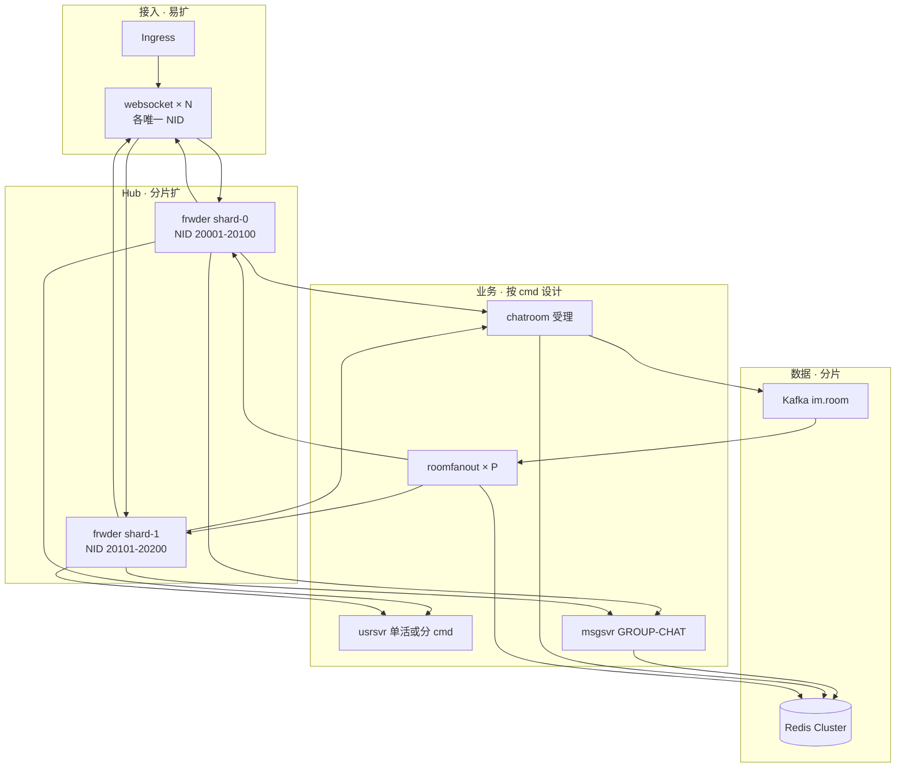

# 方向二 · RTMQ 水平扩展专章

> **定位**：回答「大企业能不能用必嗨 / RTMQ」——**Hub 如何分片、Proxy 谁能无脑扩、msgsvr SUB 怎么设计、Kafka 接在哪**。  
> **前提**：已理解 [RTMQ-技术设计文档](rtmq/RTMQ-技术设计文档.md) 的 publish / async_send / SUB；已读过 [方向二落地手册](方向二-RTMQ保留与Kafka削峰落地手册.md) §1。  
> **原则**：**只写架构与演进路线，不要求立刻改代码**；RTMQ 玩熟后再按阶段实施。

---

## 1. 三种「状态」别混为一谈

方向二剥离的是 **业务拓扑感知**，不是 Hub 的 **连接投递表**。

| 状态类型 | 存哪 | 方向二 | 能否放 Redis |
|----------|------|--------|--------------|
| **客户端连哪个 WS** | iplist / LSND | → Ingress 固定 URL | 可以（legacy） |
| **同房/同群 fan-out 目标 NID** | Redis rid/gid→nid | **仍在 Redis** | 本来就在 |
| **谁 SUB 了哪个 cmd** | Hub 内存 SUB hash | **仍在 Hub** | 理论可以，RTMQ 未做 |
| **NID 对应哪条 Proxy TCP** | Hub 内存 nid→rsvr | **仍在 Hub** | **不能**（socket 在进程里） |
| **WS 连接 rid/gid→cid** | websocket 内存 ChatTab | 仍在接入进程 | 不能 |

**面试一句话**：

> 方向二让 RTMQ **不再承担 room/iplist 业务路由**；但 as **交换机**，它仍必须知道 **哪条 TCP 是哪个 NID、谁 SUB 了 GROUP-CHAT**——否则 async_send 无法投递。

---

## 2. 角色对照：谁 Server、谁 Proxy

```text
浏览器  ←WebSocket→  websocket 进程          （不是 RTMQ）
websocket  ←TCP RTMQ Proxy→  frwder:28888   （Proxy → Hub FORWARD）
msgsvr     ←TCP RTMQ Proxy→  frwder:28889   （Proxy → Hub BACKEND）
frwder     = 2× RTMQ Server + frwd_mesg 桥   （Hub，不是「客户端」）
```

| 组件 | RTMQ 角色 | 典型扩缩容 |
|------|-----------|------------|
| **websocket / listend** | Proxy，连 FORWARD | ✅ **无脑水平扩**（每副本唯一 NID） |
| **msgsvr / usrsvr / chatroom** | Proxy，连 BACKEND | ⚠️ 进程能扩，**SUB 语义要设计** |
| **roomfanout**（方向二 Phase 2） | 只 AsyncSend，**不 SUB 上行** | ✅ 跟 Kafka partition 扩 |
| **frwder** | Hub（Server） | ⚠️ **分片扩**，不能 Deployment 盲 replicas |

---

## 3. 各层横向扩展能力（诚实表）

| 层 | 现网能否 `replicas++` | 瓶颈 | 企业级做法 |
|----|----------------------|------|------------|
| **websocket** | ✅ 可以 | 单 Hub 连接数、队列深度 | N 副本 + Ingress；preStop 清 Redis |
| **listend** | ✅ 可以 | 同 websocket | 多 NID + 静态 iplist / DNS |
| **frwder Hub** | ❌ 不能盲扩 | SUB/nid 映射在单进程内存 | **Hub × M 分片**（§4） |
| **msgsvr 群聊上行** | ❌ 多副本会重复消费 | publish **广播**所有 SUB 者 | 单 SUB + 垂直扩，或 Kafka 分片（§5） |
| **chatroom ROOM-CHAT** | ❌ 多副本重复 SUB | 同上 | **1 实例 SUB** 或 Kafka + roomfanout |
| **usrsvr ONLINE 等** | ⚠️ 多副本重复 | 同上 | 按 cmd 单活或分片 |
| **Redis** | Cluster | 热 key、跨 slot | rid/gid 分片键设计 |
| **Kafka**（Phase 2） | ✅ partition 扩 | 消费 lag | roomfanout replicas ≈ partition |

详见 [SCALE.md](SCALE.md) 演进表步骤 1～9。

---

## 4. Hub（frwder）分片：为什么必须分片、怎么分

### 4.1 为什么不能 `frwder Deployment replicas: 3` + Service 负载均衡

```text
websocket(NID=20001) ──TCP──► frwder-pod-0  FORWARD  （20001 注册在这）
msgsvr               ──TCP──► frwder-pod-1  BACKEND   （随机打到另一 Pod）
msgsvr AsyncSend(nid=20001) → frwder-pod-1 查 nid 表 → 无此连接 → 丢包
```

Hub 的 **nid→TCP** 和 **SUB 表** 不跨 Pod 共享。无协调的多副本 = **Broken**。

### 4.2 分片模型 A：按接入 NID 范围（推荐先实现）

```text
Hub-0：FORWARD/BACKEND 一套，负责 NID ∈ [20001, 20100]
Hub-1：负责 NID ∈ [20101, 20200]
…
```

| 规则 | 说明 |
|------|------|
| websocket NID=20055 | **只连** Hub-0 的 28888 |
| msgsvr / roomfanout AsyncSend(20055) | 必须进 **Hub-0** 的 28889 |
| 业务查 Redis rid→nid | 得到 20055 → 客户端/配置知道走 Hub-0 |

**实现要点（未来代码/配置，非现网）**：

- 配置：`BEEHIVE_HUB_SHARD=id` + NID 范围表（ConfigMap / Redis）
- roomfanout / msgsvr：async_send 前根据 **目的 NID** 选 Hub 地址（或 sidecar 代理）
- **同一 Hub 内** FORWARD↔BACKEND 桥不变，**不**改 frwd_mesg.c 语义

### 4.3 分片模型 B：业务 BACKEND 统一入口 + Hub 内转发

适合 Hub 数量少、运维希望 msgsvr 只配一个 BACKEND 地址：

```text
msgsvr → BACKEND-LB → 某 Hub 的 BACKEND
Hub 收到 async_send(nid) 时，若 nid 不在本 shard，**转发**到 owner Hub（需扩展 RTMQ 或 frwder 桥）
```

改动大于模型 A，属于 Phase 3+。

### 4.4 单 Hub 先撑多久

| 手段 | 说明 |
|------|------|
| 垂直扩 CPU / 队列 | `frwder.xml` RECVQ/DISTQ/WORKER |
| 接入层先水平扩 | 百万连接主要加 websocket，不是加 Hub |
| 压测 baseline | [LOADTEST.md](LOADTEST.md) 标定单 Hub QPS/连接上限 |

**结论**：企业路径 = **先 websocket×N + 单 Hub 压测** → **Hub×M 分片**，不是放弃 RTMQ。

---

## 5. 业务 Proxy（msgsvr / chatroom / usrsvr）与 SUB 策略

### 5.1 RTMQ publish 的真实语义

```text
接入上行 ROOM-CHAT / GROUP-CHAT
  → FORWARD → publish(cmd)
  → BACKEND 上 **所有** SUB 了该 cmd 的 Proxy 各收一份
```

文档 [RTMQ-技术设计文档 §4.4](rtmq/RTMQ-技术设计文档.md)：

> 同一 type 可被多个进程 SUB；**默认广播给所有 SUB 者**；竞争消费需业务层去重。

因此 **msgsvr replicas: 3 且都 SUB GROUP-CHAT** = 同一条群消息 **处理 3 次**。

### 5.2 按场景的 SUB 策略

| 场景 | cmd | 建议 SUB 者数量 | 水平扩展方式 |
|------|-----|-----------------|--------------|
| **群聊上行** | GROUP-CHAT | **1× msgsvr**（或 gid 分片，见下） | Redis fan-out + 多 nid AsyncSend；msgsvr 垂直扩 |
| **群聊 gid 分片** | GROUP-CHAT | msgsvr-0..k 各 SUB，但 **只应收到本分片 gid** | 需 Hub 前 **Kafka / 自定义路由**（非现网 publish） |
| **弹幕 ROOM-CHAT** | ROOM-CHAT | **1× chatroom SUB** 受理 | fan-out 走 **Kafka → roomfanout×P**（方向二 Phase 2） |
| **上下线** | ONLINE/OFFLINE | **1× usrsvr** 或 幂等设计 | usrsvr 多副本做 **HTTP**；RTMQ handler 单活 |
| **下行到接入** | 各 ACK/NTF | **每个 websocket NID** 各 SUB | 随 websocket 副本线性增 |

### 5.3 roomfanout 为什么能扩

方向二 Phase 2 的 **roomfanout**：

- **不 SUB** ROOM-CHAT 上行（避免与 chatroom 抢 publish）
- 只消费 Kafka → 查 Redis rid→nid → **AsyncSend 下行**
- Consumer Group **竞争消费** partition → **replicas 可扩**

这是 **把「可并行的 fan-out 计算」从 RTMQ publish 广播** 挪到 **Kafka 消费模型**。

### 5.4 msgsvr 还是不是 RTMQ Proxy？

**是。** 连 28889、Register/SUB、AsyncSend 下行，语义不变。  
「横向扩展 msgsvr」要分清：

| 扩什么 | 做法 |
|--------|------|
| HTTP / Mongo 异步 / 查询 | Deployment 多副本 ✅ |
| GROUP-CHAT RTMQ handler | 受 SUB 广播约束 ⚠️（§5.2） |

---

## 6. 目标拓扑：百万在线 + RTMQ 仍居中



**RTMQ 保留的三件事（企业仍需要）**：

1. **接入 ↔ 业务** 统一 cmd 总线（websocket 不直连 msgsvr）  
2. **async_send(nid)** 下行第一段（到接入进程）  
3. **进程级** 多 nid fan-out（msgsvr/roomfanout 对 Redis 列表逐个 AsyncSend）

**不靠单 Hub 硬扛的部分**：

| 诉求 | 组件 |
|------|------|
| 百万长连接 | websocket × N |
| Hub 吞吐上限 | frwder × M 分片 |
| 弹幕/chatroom CPU | Kafka + roomfanout |
| 群聊算力 | msgsvr 单 SUB + 优化 / gid 分片（后期） |

与 [方向二落地手册](方向二-RTMQ保留与Kafka削峰落地手册.md) 一致：**Kafka 不替代 RTMQ 最后一跳**。

---

## 7. 分阶段演进（与 RTMQ 学习顺序对齐）

| 阶段 | 你做什么 | 证明 |
|------|----------|------|
| **L0 现在** | 10 人 5 NID 群聊 + RTMQ 故事线 | publish / async_send / 70 包 |
| **L1** | websocket 多副本 + 单 frwder + Ingress iplist | **接入线性扩** |
| **L2** | loadtest baseline 单 Hub 上限 | 有数字，不吹百万 |
| **L3** | frwder **2 分片** + NID 路由表 | **Hub 可水平扩** |
| **L4** | ROOM-CHAT Kafka + roomfanout | **弹幕路径可扩** |
| **L5** | Redis Cluster + msgsvr 群聊策略定稿 | 企业完整故事 |

**不必 L0 做完就 L3**；面试可讲 L1→L5 路线图，demo 做到 L1～L2 即可。

---

## 8. 常见问题（FAQ）

### Q1：Hub 路由表能放 Redis 吗？

- **rid/gid→nid（fan-out 名单）**：已在 Redis ✅  
- **SUB / nid→TCP（投递表）**：socket 绑进程，**不能**用 Redis 替代写包；外置 SUB 需 **重写 Hub** ❌（非方向二范围）

### Q2：去掉 iplist 后 Hub 是不是无状态了？

**业务拓扑无状态；连接投递有状态。** Hub 重启 → Proxy 重连、重新 SUB → 短窗口丢信令。无 Dledger，与源码设计一致。

### Q3：和「放弃必嗨换 Kafka/gRPC 直推网关」比？

| 方案 | 优点 | 代价 |
|------|------|------|
| **保留 RTMQ + 分片 + Kafka** | 复用 cmd/nid 全链路、学习资产、渐进演进 | 要做 Hub 分片、SUB 策略 |
| **推倒 RTMQ，网关 gRPC** | Hub 层更简单 | 重写进程间协议、丢现有 17 篇 RTMQ 文档与 demo |

方向二选前者：**不是 RTMQ 不能扩，是扩法要分层**。

### Q4：双端口 28888/28889 还要吗？

要。**接入/业务 SUB 命名空间隔离**（见 [RTMQ-技术设计文档 §3.2](rtmq/RTMQ-技术设计文档.md)）。分片后 **每个 shard 仍是一对端口**；K8s 可命名为 `rtmq-edge` / `rtmq-biz`。

---

## 9. 面试 90 秒（扩展版）

> 必嗨里 RTMQ 是 **进程间 cmd/nid 交换机**：websocket、msgsvr 都是 **Proxy**，frwder 是 **Hub**。方向二把 **iplist 和 rid→nid 业务路由** 挪到 Ingress 和 Redis，但 Hub 仍要维护 **SUB 和 nid→TCP**，否则 async_send 无法投递。  
>  
> **百万在线**主要靠 **websocket 水平扩**；**Hub 不能无脑多副本**，要 **按 NID 分片** 多个 frwder。msgsvr 仍是 Proxy，但 publish 是 **广播**，群聊上行不能简单 replicas++，要么 **单 msgsvr SUB**，要么 **Kafka 分片 + roomfanout 只负责下行 AsyncSend**。  
>  
> 所以不是放弃 RTMQ，而是 **RTMQ 管低延迟最后一跳，Redis 管拓扑，Kafka 管削峰，Hub 分片管规模**——和大型 IM 演进路径一致。

---

## 10. 相关文档

| 文档 | 关系 |
|------|------|
| [40k向-必嗨方向二叙事与压测对比模板.md](40k向-必嗨方向二叙事与压测对比模板.md) | 简历 / 压测 v0 vs v3 / 面试追问 |
| [六周作战计划-孙超.md](六周作战计划-孙超.md) | **W1～W6 个人执行清单** |
| [方向二-RTMQ保留与Kafka削峰落地手册.md](方向二-RTMQ保留与Kafka削峰落地手册.md) | 总路线 Phase 0～2 |
| [SCALE.md](SCALE.md) | Demo vs 生产、演进步骤 1～9 |
| [rtmq/RTMQ-技术设计文档.md](rtmq/RTMQ-技术设计文档.md) | publish / async_send / SUB 源码级 |
| [K8S_DEMO_ROADMAP.md](K8S_DEMO_ROADMAP.md) | websocket 水平扩演示 |
| [PHASE3_PERFORMANCE_EVOLUTION.md](PHASE3_PERFORMANCE_EVOLUTION.md) | 异步 ACK / Kafka |

---

*文档版本：2026-06 · 方向二扩展专章 · 仅架构，不要求即时改代码*
