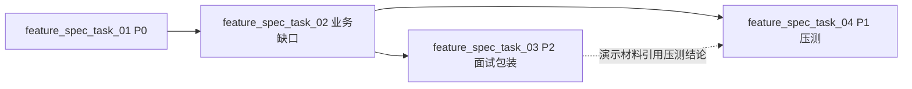

# beehive-im Docker 演示与压测任务清单（Task 2）

> **总目标**：基于 Docker（不上 K8s），达到 **面试官可演示** + **本地可压测**；架构设计目标仍为百万在线弹幕，本清单聚焦「单栈跑通 → 功能补齐 → 演示包装 → 压测数据」。  
> **原则**：`feature_spec_task_01` 完成前不进入演示包装；业务缺口在 demo 跑通后、面试话术前单独收口；压测放在最后。  
> **前置**：Task 1 已具备 docker-compose 中间件、Linux 编译链、go mod、容器内 9 进程启动能力（见 `todo_task1_list.md`）。

---

## 0. 四任务总览

```
feature_spec_task_01  P0   Docker 全栈 + 配置修通 + E2E smoke + demo/web
        ↓
feature_spec_task_02  业务/功能缺口  协议/HTTP/错误路径 + 群聊/推送/建房间/多节点（敏感词除外）
        ↓
feature_spec_task_03  P2   面试演示包装（话术、架构图、错误场景、运维脚本）
        ↓
feature_spec_task_04  P1   本地压测工具 + 指标 + 调优 + 压测报告
```

| 任务 ID | 名称 | 交付标准 | 预估 |
|---------|------|----------|------|
| `feature_spec_task_01` | P0：Docker 演示底座 | 一键起全栈；浏览器双用户同房互发弹幕 | 1～2 周 |
| `feature_spec_task_02` | 业务/功能缺口 + 扩展实现 | 聊天室/群聊/推送/多节点实现（**敏感词除外**）；错误路径与 HTTP 补齐 | 2～3 周 |
| `feature_spec_task_03` | P2：面试演示包装 | 15 分钟可复现；3 个错误场景；架构讲解材料齐全 | 3～5 天 |
| `feature_spec_task_04` | P1：本地压测 | 压测脚本 + QPS/延迟/资源报告；单机 realistic 数据 | 3～5 天 |

**演示用约定数据**（全任务共用）：

| 项 | 值 |
|----|-----|
| 测试用户 | `uid=100001`、`uid=100002` |
| 种子房间 | `rid=10001`，名 `demo-room`（MySQL `CHAT_ROOM_INFO_TAB`） |
| 中间件 | Redis `111111` / MySQL `root/111111` testdb / Mongo `beehive/111111` chat |

---

## feature_spec_task_01 — P0：Docker 演示底座

> **目标**：`docker compose up` 后，宿主机浏览器能完成 **注册 → iplist → WS 上线 → 进房 → 发弹幕**。

### 1.1 Docker 全栈 compose

- [ ] **T01-01** 扩展 `docker-compose.yml`：中间件 + 应用（`runner` 或拆为多 service，二选一需文档说明）
- [ ] **T01-02** 宿主机端口映射  
  - `8000` usrsvr HTTP  
  - `8002` websocket WS  
  - `8004` chatroom HTTP（若 demo 需要 HTTP 推弹幕）  
  - `9002` listend TCP（CLI 压测/可选）
- [ ] **T01-03** 应用容器环境变量  
  - `BEEHIVE_REDIS_HOST` / `BEEHIVE_MYSQL_HOST` / `BEEHIVE_MONGO_HOST`  
  - `BEEHIVE_ACCESS_IP` / `BEEHIVE_WS_IP`（iplist 返回给客户端的外网/宿主机 IP，默认 `host.docker.internal` 或 compose 注入）
- [ ] **T01-04** 运行时依赖：`LD_LIBRARY_PATH=/workspace/3rd/install/lib`（或镜像内 baked）
- [ ] **T01-05** 一键脚本 `scripts/up-demo.sh`：`compose up -d` + 等待 health + 打印访问 URL

**DoD**：本机执行 `./scripts/up-demo.sh` 后，curl `http://127.0.0.1:8000/im/register?uid=100001&nation=1&city=1&town=1` 返回 JSON 含 `sid`。

---

### 1.2 配置与模板修通

- [ ] **T01-06** 统一 `conf/*.xml` 中 MySQL/Mongo 端口（消除 `7379`/`8379` 错端口；与 compose 一致）
- [ ] **T01-07** 修复 `conf/chatroom.xml` 根节点（`<USRSVR>` → 正确根标签，与 `ChatRoomConfXmlData` 一致）
- [ ] **T01-08** 将 `scripts/run-in-linux.sh` 的 sed 逻辑沉淀为 **`conf/templates/` + 渲染脚本**（或 `docker/gen-conf.sh`），避免手工 patch
- [ ] **T01-09** listend / websocket 对外 IP：容器内配置为 `BEEHIVE_ACCESS_IP`，保证 **iplist type=2** 返回 `host:8002` 可连
- [ ] **T01-10** frwder 双端口 `28888/28889` 在 compose 网络内可达；Go 服务 `FRWDER ADDR` 指向 `frwder:28889`（非 127.0.0.1）
- [ ] **T01-11** seqsvr Thrift `50000` 在 compose 内通过服务名访问

**DoD**：容器内 `monitor.log` 出现 listend/websocket 注册；`usrsvr` `/im/iplist?type=2&clientip=127.0.0.1&uid=100001` 返回非空 `list`。

---

### 1.3 启动与运维脚本（P0 最小集）

- [ ] **T01-12** 完善 `scripts/start-linux.sh` / `scripts/stop-linux.sh`（对应 compose profile `run`）
- [ ] **T01-13** 新增 `scripts/status.sh`：9 进程 + 4 业务端口 + 3 中间件 health
- [ ] **T01-14** 启动顺序与等待：frwder 就绪后再起 Go 服务（替代固定 sleep，可用 TCP 探活 28889/50000）
- [ ] **T01-15** listend **前台进程**保持容器存活（不用 `-d` daemon 导致 PID1 退出）

**DoD**：`status.sh` 全绿；连续运行 ≥10 分钟无进程 exit。

---

### 1.4 端到端 smoke test

- [ ] **T01-16** 新增 `scripts/smoke-test.sh`（或 `tools/smoke/` Go 小工具），自动化：

  ```
  1. GET /im/register  uid=100001, 100002
  2. GET /im/iplist   type=2
  3. WS connect → ONLINE → 等 ONLINE-ACK
  4. ROOM-JOIN rid=10001 → ROOM-JOIN-ACK
  5. A 发 ROOM-CHAT，B 收到（或断言 Mongo/Redis 侧效）
  6. ROOM-QUIT / OFFLINE 无 panic
  ```

- [ ] **T01-17** smoke 失败时打印排查提示（frwder 未起、iplist 空、Redis 键缺失等）

**DoD**：`./scripts/smoke-test.sh` exit 0；CI 可本地重复跑（可选）。

---

### 1.5 Demo Web 客户端

- [ ] **T01-18** 新增 `demo/web/`（无外链 CDN 依赖，protobuf 可 vendoring 或静态拷贝）
- [ ] **T01-19** 页面能力：uid 输入、注册、拉 iplist、WS 连接状态、rid、消息输入、弹幕列表（双标签页场景说明）
- [ ] **T01-20** 协议实现：48 字节头 + `doc/mesg/mesg.proto` 中 ONLINE / ROOM-JOIN / ROOM-CHAT
- [ ] **T01-21** `demo/web/README.md`：3 步启动 + 2 浏览器窗口操作截图位

**DoD**：Chrome 开两个窗口，同房互发弹幕，延迟肉眼 <1s（本机）。

---

### feature_spec_task_01 完成标准（DoD）

- [ ] `./scripts/up-demo.sh` + `./scripts/smoke-test.sh` 通过
- [ ] `demo/web` 双用户弹幕可演示
- [ ] `doc/DEMO.md`（或 `demo/README.md`）记录端口、测试 uid/rid、常见失败

---

## feature_spec_task_02 — 业务/功能缺口与扩展实现

> **目标**：demo 关键路径真实可用；并按 §2.4 **补齐原架构规划中的主要业务模块**（群聊、推送、建/解散房间、多接入节点）。  
> **范围**：§2.1～2.3 为演示链路加固；§2.4 为扩展实现。**唯一明确不做：敏感词过滤**。  
> **不在本任务**：gin/mongo 迁移、K8s、敏感词（见 §2.4.5）。

### 2.1 聊天室生命周期

- [ ] **T02-01** 种子房间 `rid=10001` 保留为 **bootstrap/回归用例**（`docker/mysql/init.sql`），不作为唯一建房间方式
- [ ] **T02-02** 校验种子数据完整性：`IM_SID_GEN_TAB`、`IM_SEQ_GEN_TAB`、`IM_RID_GEN_TAB`、`CHAT_ROOM_INFO_TAB` 与 `seqsvr`/`chatroom` 读取一致
- [ ] **T02-03** 实现 **ROOM-CREAT / ROOM-DISMISS（0x0401/0x0403）** 详见 **§2.4.2**（完成后 demo 可动态建房，不仅依赖种子）

**DoD**：新环境可 JOIN 种子房间；亦可通过协议或 HTTP 创建新房间并 JOIN（与 §2.4.2 联调通过）。

---

### 2.2 核心协议路径加固

- [ ] **T02-04** `ROOM-JOIN`：未上线 / 重复进房 / 房间不存在 → 明确 `ROOM-JOIN-ACK` 错误码（对照 `doc/ERRNO.md`）
- [ ] **T02-05** `ROOM-CHAT`：未进房发送 → `ERROR` 或 ACK 失败；空消息、超长消息边界
- [ ] **T02-06** `ROOM-BC`（0x040D）：若 demo 需要「系统弹幕」，验证 chatroom HTTP `/room/push` 或协议 BC 任一路径可用
- [ ] **T02-07** `ONLINE/OFFLINE`：token 错误、sid 不存在 → 明确 ACK；离线后 Redis `im:sid:*` 清理（对照 `doc/REDIS.md`）
- [ ] **T02-08** `ROOM-QUIT` / 被踢 `ROOM-KICK`：演示可选，至少 QUIT 不 leak 连接状态

**DoD**：`smoke-test.sh` 增加 3 条 **预期失败** case（非法 join、未进房 chat、错误 token）且断言错误码。

---

### 2.3 HTTP 接口（演示最小集）

- [ ] **T02-09** `GET /im/register` — 参数校验与错误 JSON（已有则补测试用例文档）
- [ ] **T02-10** `GET /im/iplist` — type=1(TCP)/type=2(WS) 均返回可用地址；默认运营商 fallback（`conf/ipdict.txt` + listend 注册）
- [ ] **T02-11** 房间查询：实现或确认 **`GET /room/query`**（或等价）返回 `rid=10001` 在线人数；若 HTTP 未完成，补 **最小 read-only** 接口读 MySQL/Redis
- [ ] **T02-12** chatroom HTTP 端口 `8004` 与 usrsvr `8000` 在 demo 文档中职责分离（注册/iplist vs 房间/推送）

**DoD**：演示时可口头报「当前房间 N 人」，数据来自真实 Redis/MySQL，非 mock。

---

### 2.4 扩展业务功能实现（§2.4 原规划项，敏感词除外）

> **原则**：下列模块在 `doc/ARCHITECTURE.md` §9 原标注为「未实现」，现纳入 **必须实现**；实现后同步更新 `doc/COMMAND.md` 状态列与 smoke/ demo 用例。  
> **唯一排除**：**敏感词过滤** — 不实现代码，仅在 `doc/DEMO_SCOPE.md` 标注为后续项。

#### 2.4.1 实现范围总表

| 模块 | 协议/能力 | 本任务 | 负责服务（参考） |
|------|-----------|--------|------------------|
| 群聊 | `0x03xx` 全套 | ✅ 实现 | 新增 `groupsvr` 或扩展 `msgsvr`（实现前在 T02-19 选型） |
| 推送 | `0x05xx` BC（`0x0501/0x0502`） | ✅ 实现 | 扩展 `msgsvr` 或独立 `pushsvr` |
| 推送 | P2P（`0x0503/0x0504`） | ✅ 实现 | 同上（可与 BC 同服务） |
| 聊天室 | ROOM-CREAT/DISMISS（`0x0401/0x0403`） | ✅ 实现 | `chatroom` |
| 多节点 | 多 `frwder` + 多 `listend`/`websocket` | ✅ 验证 | compose 多实例 + `monitor` 注册 |
| 敏感词 | 文本过滤 | ❌ **不做** | — |

- [ ] **T02-13** 新建/更新 `doc/DEMO_SCOPE.md`：**实现边界表**（上表）+ 敏感词单独列为「明确不做」

---

#### 2.4.2 聊天室 ROOM-CREAT / ROOM-DISMISS（0x0401～0x0404）

- [ ] **T02-14** `chatroom` 注册 RTMQ 处理 `CMD_ROOM_CREAT` / `CMD_ROOM_DISMISS`（对照 `doc/mesg/mesg.proto`）
- [ ] **T02-15** 创建房间：`seqsvr` 分配 `rid` → 写 MySQL `CHAT_ROOM_INFO_TAB` → 初始化 Redis 房间拓扑（对照 `doc/REDIS.md`）
- [ ] **T02-16** 解散房间：校验 owner/权限 → 清 Redis 房间键 → 更新 MySQL 状态 → 可选 `ROOM-DISMISS` 广播通知在房用户
- [ ] **T02-17** HTTP 对齐：实现或补全 `doc/HTTPSVR.md` 中房间 create/dismiss 相关接口（与协议二选一或双通道）
- [ ] **T02-18** smoke：`ROOM-CREAT` → `ROOM-JOIN` → `ROOM-CHAT` → `ROOM-DISMISS` 全链路；种子 `rid=10001` 回归用例保留

**DoD**：不依赖手工 SQL 即可创建房间并完成弹幕演示。

---

#### 2.4.3 群聊全套 0x03xx

> 参照 `doc/COMMAND.md` 群聊命令表；实现顺序建议 **核心 → 管理 → 通知**。

**A. 基础设施**

- [ ] **T02-19** 服务选型文档：新增 `src/golang/exec/groupsvr` **或** 在 `msgsvr` 扩展群聊模块（路由、表结构、Redis 键命名）
- [ ] **T02-20** MySQL 群表 + Mongo 群消息集合（若尚无）：迁移脚本放 `docker/mysql/`、`docker/mongo/`
- [ ] **T02-21** Redis 群成员/在线/禁言/黑名单键（对照 `doc/REDIS.md` 或补全文档）
- [ ] **T02-22** `groupsvr`（或 msgsvr）接入 frwder BACKEND；`websocket`/`listend` 上行转发 `0x03xx`

**B. 核心命令（必须）**

- [ ] **T02-23** `GROUP-CREAT` / `ACK`（0x0301/0x0302）
- [ ] **T02-24** `GROUP-DISMISS` / `ACK`（0x0303/0x0304）
- [ ] **T02-25** `GROUP-JOIN` / `ACK`（0x0305/0x0306）
- [ ] **T02-26** `GROUP-QUIT` / `ACK`（0x0307/0x0308）
- [ ] **T02-27** `GROUP-CHAT` / `ACK`（0x030B/0x030C）— 群消息 fan-out
- [ ] **T02-28** `GROUP-KICK` / `ACK`（0x030D/0x030E）

**C. 管理与扩展（必须）**

- [ ] **T02-29** `GROUP-INVITE` / `ACK`（0x0309/0x030A）
- [ ] **T02-30** 禁言：`GROUP-GAG-ADD/DEL` + ACK（0x0310～0x0313）
- [ ] **T02-31** 黑名单：`GROUP-BL-ADD/DEL` + ACK（0x0314～0x0317）
- [ ] **T02-32** 管理员：`GROUP-MGR-ADD/DEL` + ACK（0x0318～0x031B）
- [ ] **T02-33** `GROUP-USR-LIST` / `ACK`（0x031C/0x031D）

**D. 实时通知（必须）**

- [ ] **T02-34** `GROUP-*-NTF` 及对应 ACK（0x0350～0x0367）：入群/退群/踢人/禁言/黑名单/管理员变更
- [ ] **T02-35** 群聊 smoke：两用户建群 → 加群 → 群聊互发 → 踢人/禁言/退群各 1 用例

**DoD**：`doc/COMMAND.md` 群聊相关行状态改为「已实现」；`smoke-test.sh` 含群聊子套件或 `scripts/smoke-group.sh`。

---

#### 2.4.4 推送 0x05xx

- [ ] **T02-36** `CMD_BC` / `CMD_BC_ACK`（0x0501/0x0502）：按 uid/sid/房间/全站等 scope 实现一种以上（对照 `doc/PROTOCOL.md`）
- [ ] **T02-37** `CMD_P2P` / `CMD_P2P_ACK`（0x0503/0x0504）：点到点推送（在线用户）
- [ ] **T02-38** HTTP 推送对齐：`doc/HTTPSVR.md` 中 push/broadcast 相关接口与协议互通
- [ ] **T02-39** 与聊天室 `ROOM-BC`（0x040D）职责边界文档化：运营弹幕走 BC 还是 ROOM-BC
- [ ] **T02-40** smoke：HTTP 或协议发 BC → 指定 WS 客户端收到；P2P 两用户互推

**DoD**：演示时可展示「系统广播弹幕」与「点对点通知」两种能力。

---

#### 2.4.5 多 frwder / 多 listend（水平扩展验证）

- [ ] **T02-41** compose 支持 **2× listend**（不同 `GID/ID/NID`）+ **2× websocket**，共享 1× frwder 或 2× frwder（文档说明拓扑）
- [ ] **T02-42** 配置模板：`conf/templates/listend-*.xml`、`websocket-*.xml` 按实例注入 NID 与 ACCESS IP
- [ ] **T02-43** `monitor` + `usrsvr` iplist：多接入点注册与按运营商/随机返回
- [ ] **T02-44** 跨节点路由：用户 A 在 listend-1、用户 B 在 listend-2，同房/同群消息互通（依赖 Redis nid 路由，对照 `chatroom` fan-out）
- [ ] **T02-45** `scripts/smoke-multinode.sh`：自动化双接入点互通用例

**DoD**：Docker 内双 listend 场景 smoke 通过；`doc/ARCHITECTURE.md` 补充「多接入拓扑图」。

---

#### 2.4.6 敏感词（明确不做）

- [ ] **T02-46** **不实现** 敏感词过滤代码（`chatroom`/`groupsvr` 内 TODO 保持或移除调用点，但不新增 filter 模块）
- [ ] **T02-47** 在 `doc/DEMO_SCOPE.md` 单列：**敏感词 = 后续里程碑**；面试话术说明「百万在线前必做，当前 sprint 刻意不做」

**DoD**：代码库无半成品敏感词逻辑引入新 bug；文档有清晰排除说明。

---

### feature_spec_task_02 完成标准（DoD）

- [ ] §2.1～2.3：smoke 成功路径 + 3 条失败路径均通过
- [ ] §2.4.2～2.4.4：ROOM-CREAT、群聊 0x03xx、推送 0x05xx 均有 smoke 覆盖
- [ ] §2.4.5：双 listend 互通 smoke 通过
- [ ] §2.4.6：敏感词仅文档标注，无实现任务
- [ ] `doc/COMMAND.md` / `doc/DEMO_SCOPE.md` 与实现状态一致

---

## feature_spec_task_03 — P2：面试演示包装

> **目标**：技术深度用 **15 分钟现场** 讲清楚；材料可带走（架构图、命令、数字）。

### 3.1 演示脚本与话术

- [ ] **T03-01** 编写 `doc/INTERVIEW_DEMO.md`（15 分钟时间轴）  
  - 0～3min：架构图（接入层 / frwder / RTMQ / Go 业务 / 存储）  
  - 3～8min：终端启动 compose + status 全绿  
  - 8～13min：双浏览器弹幕 + 可选演示群聊/系统 BC + 讲 Redis 房间分片 / nid 路由  
  - 13～15min：Q&A 备用（seqsvr 单点、多 listend 扩展、敏感词为何未做）
- [ ] **T03-02** 准备 **1 页架构图**（可 Mermaid 或 draw.io 导出 PNG 放 `doc/assets/`）
- [ ] **T03-03** 演示命令 cheat sheet（复制即用，无 typo）

---

### 3.2 错误场景演示（体现「真系统」）

- [ ] **T03-04** 场景 A：frwder 未启动 → iplist/上线失败，日志定位 30 秒内
- [ ] **T03-05** 场景 B：未 JOIN 发 ROOM-CHAT → 客户端展示错误 ACK
- [ ] **T03-06** 场景 C：重复 JOIN 或错误 rid → 明确错误码（配合 task_02）
- [ ] **T03-07** `demo/web` 可选「故障注入」按钮（停 frwder 仅文档说明亦可）

**DoD**：演示录像或 rehearse 一遍 ≤15min，无手工改 conf 步骤。

---

### 3.3 运维与排障材料

- [ ] **T03-08** `doc/TROUBLESHOOT.md`：Top 10 失败（端口占用、iplist 空、Mongo 用户、38889 refused、chatroom.xml 等）
- [ ] **T03-09** 日志地图：`log/*.log` 各服务对应关系 + 关键 grep 模式
- [ ] **T03-10** 「百万在线」讲解页：单机 demo vs 生产拓扑对比（**不声称本机压百万**）

---

### 3.4 仓库卫生（演示观感）

- [ ] **T03-11** 根目录 `README.md` 增加 **Quick Start（Docker Demo）** 链到 `doc/INTERVIEW_DEMO.md`
- [ ] **T03-12** 清理或标注过时 demo（`src/clang/demo/websocket/websocket-protobuf.html` 内网 IP）→ 指向 `demo/web`
- [ ] **T03-13** 版本号与二进制：`bin/*.v.1.1` 与 `Makefile VERSION` 在演示文档中一致

---

### feature_spec_task_03 完成标准（DoD）

- [ ] 新人按 `doc/INTERVIEW_DEMO.md` 可在 30 分钟内完成首次 rehearse
- [ ] 架构图 + 故障排查文档齐全
- [ ] 3 个错误场景可稳定复现

---

## feature_spec_task_04 — P1：本地压测

> **目标**：产出 **可写入简历/面试** 的单机压测数据（realistic：数百～数千连接、同房 QPS），并说明与百万在线的差距。  
> **依赖**：task_01 smoke 通过、task_02 进房/chat 路径稳定。

### 4.1 压测工具

- [ ] **T04-01** 新增 `tools/loadtest/`（Go 推荐）：  
  - 参数：`-uid-base`、`-conns`、`-rid`、`-rate`（条/秒/连接）、`-duration`、`-ws-addr`
  - 流程：register → iplist → WS ONLINE → ROOM-JOIN → 循环 ROOM-CHAT
- [ ] **T04-02** 支持 **仅连接保活** 模式（只 ONLINE + PING，不发 chat）测连接数上限
- [ ] **T04-03** 输出：成功/失败计数、延迟 histogram（P50/P95/P99）、QPS 汇总 JSON/CSV
- [ ] **T04-04**（可选）基于 `src/clang/exec/client` 的 TCP 9002 压测分支，与 WS 路径对比

**DoD**：`go run ./tools/loadtest/... -conns 200 -rate 5 -duration 60s` 无 panic，输出报告文件。

---

### 4.2 压测环境与调优

- [ ] **T04-05** 文档 `doc/LOADTEST.md`：Docker 下 `ulimit -n`、内核 `somaxconn`、容器 memory/cpu limit 建议
- [ ] **T04-06** 核对并记录可调参数：  
  - listend `CONNECTIONS MAX`  
  - frwder `RECVQ/DISTQ`  
  - Go `FRWDER` worker / chan len  
  - Redis/MySQL 连接池
- [ ] **T04-07** compose 压测 profile：单独 `docker-compose.load.yml` 或 profile，避免与 demo 端口冲突
- [ ] **T04-08** 压测前 `scripts/status.sh` 自检 gate

---

### 4.3 指标与报告

- [ ] **T04-09** 压测时采集：容器 CPU/内存（`docker stats` 或 prometheus 后续）、Go/C 进程 RSS
- [ ] **T04-10** Redis 侧：`im:sid:zset` 数量、房间在线 key（对照 `doc/REDIS.md`）
- [ ] **T04-11** 固定 **baseline 场景** 并写入报告模板：  
  - 场景 1：500 WS 连接，同房，1 msg/s/conn  
  - 场景 2：2000 连接，仅保活  
  - 场景 3：100 连接，burst 50 msg/s
- [ ] **T04-12** `doc/LOADTEST_REPORT.md` 模板：填一次真实数据，注明 **单机上限 ≠ 百万在线** 及扩展路径（多 listend、frwder 分片）

**DoD**：仓库内有一份填好的示例压测报告（本机数据），面试可指着讲瓶颈在 frwder 还是 listend。

---

### 4.4 压测发现的问题回流

- [ ] **T04-13** 压测 issue 清单：连接泄漏、goroutine 涨、Mongo 写阻塞 broadcast 等，记入 `doc/LOADTEST.md` §Known Issues
- [ ] **T04-14** 若发现 P0 稳定性 bug，回流修复后再跑 baseline

---

### feature_spec_task_04 完成标准（DoD）

- [ ] 工具可重复跑，结果可对比（两次差异 <10% 或解释原因）
- [ ] 至少 2 个 baseline 场景有完整数字
- [ ] 文档说明：**本机压测边界** vs **百万在线架构演进**（敏感词为后续项；群聊/推送/多节点见 task_02 §2.4）

---

## 附录 A：任务依赖关系



- `task_03` 可与 `task_04` 并行启动，但 **demo 话术中的性能数字** 建议等 `task_04` baseline 完成后填入。
- Task 1（`todo_task1_list.md`）中的 gin/mongo/K8s **不在 Task 2 范围**。

---

## 附录 B：与 Task 1 的衔接

| Task 1 已完成/进行中 | Task 2 承接 |
|---------------------|-------------|
| docker-compose 中间件 | task_01 扩展为全栈 + 端口 |
| `scripts/build-linux.sh` | task_01 镜像/runtime 固化 |
| `scripts/run-in-linux.sh` | task_01 改为模板化 conf |
| go mod | task_04 压测工具直接用 module |
| 种子 SQL | task_02 校验 + 文档 |

---

## 附录 C：阻塞项速查

| 现象 | 优先查 | 所属任务 |
|------|--------|----------|
| iplist 空 | listend 是否注册 monitor；ACCESS IP | task_01 |
| 38889 refused | frwder 启动顺序 / BACKEND 端口 | task_01 |
| JOIN 失败 | MySQL 种子 rid；Redis 房间键；ROOM-CREAT 是否执行 | task_02 |
| 群聊/推送无响应 | groupsvr/msgsvr 是否注册 frwder；命令 ID 路由 | task_02 §2.4 |
| 跨 listend 收不到消息 | nid 路由；monitor 注册；Redis rid→nid | task_02 §2.4.5 |
| chatroom 无日志 | chatroom.xml 根标签 | task_01 |
| 压测连接满 | ulimit；listend MAX | task_04 |

---

*文档版本：与当前仓库 Docker/go mod 状态对齐；更新时请同步勾选 Task 1 已完成项。*
